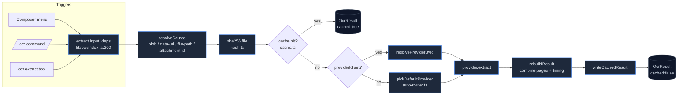

# OCR 子系统

<Status variant="beta">Beta · ocrResults schema v36（DB v70）</Status>

<TLDR>
  OCR 子系统通过单一入口 —— `extract(input, deps)`（`lib/ocr/index.ts:200`）—— 把一张图片或 PDF 转成
  Markdown / 纯文本 / 结构化块。每个调用方（composer 菜单、`/ocr` 命令、`ocr.extract` 插件工具）都汇聚于此，
  因此 **SHA-256 读穿缓存**、**纯函数 auto-router** 和 **keyring 凭据查找** 都集中在一处。20 个 provider 注册进共享
  registry（`lib/ocr/runtime.ts:51`），横跨四个家族 —— 云端文档 OCR、LLM 视觉、端侧引擎，以及一个自托管 HTTP 适配器。
  PDF 走 **文本层快速通道**（`lib/ocr/pdf-router.ts:79`），对数字页完全跳过 OCR；五个原生后端搭载
  `src-tauri/src/ocr/` 中按需启用的 Cargo feature。
</TLDR>

<StatGrid>
  <Stat label="源文件" value="60+" hint="lib/ocr (27) + lib/db/ocr-results + components/settings/ocr (17) + plugins/ocr + hooks/use-ocr + src-tauri/src/ocr (6 Rust)" />
  <Stat label="Provider" value="20" hint="ALL_PROVIDERS — lib/ocr/runtime.ts:51" />
  <Stat label="Provider 分类" value="5" hint="document-cloud · llm-vision · specialist · lark · local" />
  <Stat label="Dexie 表" value="1" hint="ocrResults — schema v36 引入，此后未变" />
  <Stat label="原生 Tauri 命令" value="5" hint="extract · list_backends · model_status · download_model · msix_status" />
  <Stat label="详情面板 tab" value="5 + 3" hint="每 provider：Config · Capabilities · Try It · Models · Advanced —— 外加 Auto-Router：Defaults · Platform · Cache" />
</StatGrid>

OCR 子系统为每个 shell —— 浏览器（静态导出）、Tauri 2.9 桌面端、Capacitor 7 移动端 —— 提供了一种一等的方式，
在 **不** 把图片和 PDF 转发给多模态模型的前提下提取其中的文本。设计原由见
[ADR-0024](../../adr/0024-ocr-subsystem)。本节逐模块记录 **当前实现** —— 包括少数几处代码已偏离 ADR 的地方。

## 代码位置

```
lib/ocr/
  index.ts            # 公开的 extract() 入口 + 分发
  types.ts            # 完整类型模型（OcrInput, OcrResult, OcrProvider, UserOcrSettings）
  registry.ts         # OcrRegistry —— id → provider，shell 门控
  runtime.ts          # installOcrRuntime() —— 注册 20 个 provider + 接线原生 invoker
  auto-router.ts      # pickDefaultProvider —— 纯函数 4 步选择
  provider-recommendations.ts  # use-case → 起步预设（setup wizard）
  probe.ts            # 连接健康检查（1×1 PNG）
  pdf-router.ts       # 两遍：文本层快速通道 → OCR 回退
  image-prep.ts       # 归一化 / 页范围 / 语言 / 页分隔符 / 降采样
  blob-utils.ts       # 跨运行时 Blob → ArrayBuffer
  hash.ts             # SHA-256（WebCrypto）—— 缓存键身份
  cache.ts            # 在 Dexie 行上的读穿 / 写回
  capabilities.ts     # 每 provider 静态能力矩阵（UI 元数据）
  ocr-parameter-schemas.ts     # 每 provider 配置表单 schema
  providers/          # 20 个 provider + 3 个共享 helper（_http / _llm-vision / _sigv4）

lib/db/ocr-results.ts          # ocrResults Dexie 表 + CRUD + purge
lib/slash-commands/actions/ocr.ts   # /ocr 命令解析器 + 分发器
plugins/ocr/src/index.ts            # ocr.extract agent 工具 + /ocr 注册
hooks/use-ocr.ts                    # 封装 extract() 并带 abort 的 React hook
components/settings/ocr/            # 侧边栏 + 详情面板 + 8 个 tab + setup wizard
app/me/ocr/page.tsx                 # 移动端设置路由
src-tauri/src/ocr/                  # 原生命令表面 + NativeBackend trait + ocrs/paddle/msix
```

## 全生命周期一览



每个方框都是本节的一章。请先读 [类型与分发](./types-and-dispatch) —— 其它每个模块都以
`OcrInput` / `OcrResult` / `OcrProvider` 来描述。

## Provider 矩阵

20 个 provider 注册在 `ALL_PROVIDERS`（`lib/ocr/runtime.ts:51`）中。五个 `OcrProviderCategory` 标签
（`types.ts:12`）驱动设置侧边栏的分组：

| 分类 | `category` 标签 | Provider |
| --- | --- | --- |
| 文档 OCR（云端） | `document-cloud` | `mistral-ocr` · `google-vision` · `aws-textract` · `azure-document-intelligence` |
| LLM 视觉（云端） | `llm-vision` | `anthropic-vision` · `openai-vision` · `gemini-vision` |
| 专项（云端） | `specialist` | `mathpix` · `ocr-space` · `abbyy-cloud` · `nanonets` |
| 飞书 / Lark（云端） | `lark` | `lark-basic` |
| 端侧 + 自托管 | `local` | `tesseract-wasm` · `tesseract-native` · `windows-media-ocr` · `apple-vision` · `mlkit-android` · `ocrs` · `paddle-ocr` · `local-http` |

<Callout type="info" title="local-http 是 local 分类的成员，而非第六个分类">
  ADR-0024 把"自托管 HTTP"列为单独的一桶，但在代码中 `OcrProviderCategory` 恰好只有 **五** 个值。
  `local-http` 带的是 `category: "local"`（`providers/local-http.ts:76`）；其"永不被自动选中"的状态由
  **auto-router** 将其从 `DEFAULT_LOCAL_PREFERENCE` 中排除来强制执行（`auto-router.ts:64`），而非靠一个独立的分类标签。
</Callout>

## 隐私与成本姿态

| 关注点 | 处理方式 |
| --- | --- |
| 凭据 | 云端 provider 声明 `credentialKeys`（`types.ts:175`）；按调用经 `deps.credentialsResolver` 解析（`index.ts:130`）。LLM 视觉 provider 设置 `reusesMainProviderKey`，复用主 Claude/GPT/Gemini 密钥而非第二份机密。 |
| LAN 端点机密 | 按设计，`local-http` 的可选 bearer token 存于设置 blob 中，**而非** keyring（`ocr-parameter-schemas.ts:140`）。 |
| 成本守卫 | LLM 视觉图片在上传前会被降采样到 `maxImageDimension`（默认长边 2000px）（`providers/_llm-vision.ts:32`）。设置 UI 为每个 provider 显示 `$`/`$$`/`$$$` 成本档（`capabilities.ts`）。 |
| 重复工作 | Dexie 缓存（`cache.ts`）以 `sha256(file)` + `providerId` + `sortedLangs` 为键 —— 相同的图片 + provider + 语言组合绝不重复花费两次。 |
| 离线底线 | `tesseract-wasm`（`public/ocr/` 中约 2 MB WASM）在既无云端凭据又无原生绑定时，为每个 shell 提供一个离线引擎。 |

## 实现状态（实况 vs ADR）

提取核心、provider、router、PDF 流水线、缓存与设置 UI 全部 **完整构建并经单元测试**。少数几处集成缝已存在但尚未接通 ——
此处如实记录，让文档与现实一致：

<Callout type="warn" title="已构建并测试，但尚未接入生产">
  - **运行时引导** —— `installOcrRuntime()`（`runtime.ts:94`）注册全部 20 个 provider，但 **没有生产调用点**
    （其引用的 `app/(setup)/ocr-bootstrap.tsx` 并不存在）。见 [触发器](./triggers)。
  - **凭据解析器** —— 树中每个 `credentialsResolver` 都是空机密占位
    `async () => ({ secrets: {} })`；keyring 支撑的解析器在 `ExtractDeps` 上声明了但未组装。
  - **Composer 菜单** —— `ocr-menu.tsx` / `ocr-result-bubble.tsx` / `useOcr` 已构建并测试，但
    `components/chat/composer.tsx` 渲染 `<AttachmentPreview />` 时未带 `onOcrSelect` prop，因此该菜单处于休眠状态。
  - **原生绑定** —— 只有 `ocr-ocrs` 和 `ocr-paddle` 这两个 Cargo feature 链接了真实 crate；`ocr-tesseract`
    / `ocr-windows` / `ocr-apple` 是解析为 `PlaceholderBackend` 的空 feature flag。见
    [原生后端](./native-backends)。
</Callout>

## 模块导航

<Cards>
  <Card title="类型与分发" href="./types-and-dispatch" description="类型模型、extract() 流程、registry，以及注册全部 20 个 provider 的运行时引导。" />
  <Card title="Provider" href="./providers" description="按家族划分的 20 个 provider、3 个共享 helper（_http / _llm-vision / _sigv4）、凭据模型，以及能力矩阵。" />
  <Card title="Auto-router" href="./auto-router" description="pickDefaultProvider 的纯函数 4 步决策、按 OS 的偏好表、就绪/凭据门控、probe，以及推荐。" />
  <Card title="PDF 与图片" href="./pdf-and-image" description="两遍 PDF router、图片归一化、页范围解析、页分隔符、SHA-256 哈希，以及配置参数 schema。" />
  <Card title="缓存" href="./cache" description="ocrResults Dexie 表、缓存键公式、读穿 / 写回、TTL purge，以及清缓存。" />
  <Card title="原生后端" href="./native-backends" description="Rust NativeBackend trait、ocrs 与 paddle 流水线、MSIX probe、模型下载 + 进度事件，以及 Cargo feature。" />
  <Card title="触发器" href="./triggers" description="/ocr 命令、ocr.extract 插件工具、useOcr hook、composer 表面，以及运行时接线。" />
  <Card title="设置 UI" href="./settings-ui" description="侧边栏 + 详情面板外壳、5 个每 provider tab、Auto-Router 面板、setup wizard，以及模型下载 UI。" />
</Cards>

## 相关

<Cards>
  <Card title="ADR-0024" href="../../adr/0024-ocr-subsystem" description="最初的设计原由，以及 provider/feature 的决策记录。" />
  <Card title="存储" href="../../data/storage" description="ocrResults 表所在的完整 Dexie schema。" />
</Cards>
