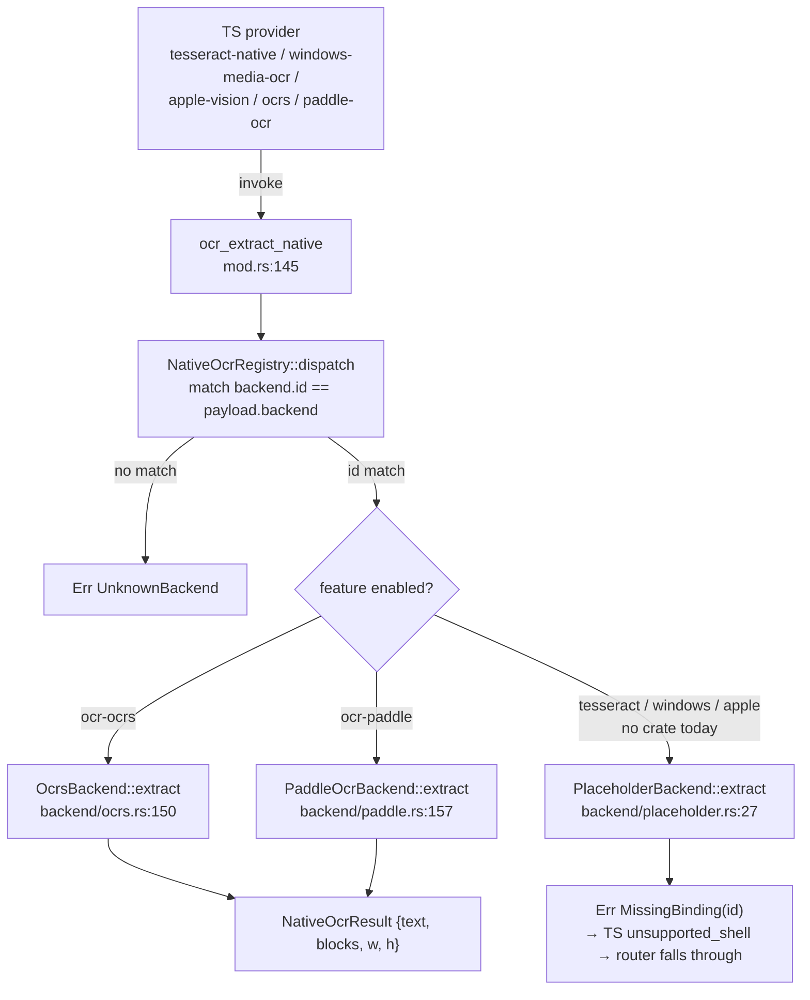

# 原生后端

<Status variant="beta">Rust — src-tauri/src/ocr/</Status>

<TLDR>
  五个原生引擎（`tesseract` / `windows-media-ocr` / `apple-vision` / `ocrs` / `paddle-ocr`）位于单个
  Tauri 命令 `ocr_extract_native`（`mod.rs:145`）之后，该命令通过 `NativeBackend` trait 按 `payload.backend`
  进行分派。Cargo feature 未开启的后端会解析为返回 `MissingBinding` 的 `PlaceholderBackend`，TS 层将其读作
  `unsupported_shell`。如今 **只有 `ocr-ocrs` 与 `ocr-paddle` 链接了真实 crate**——其余三个 feature 是空标志。
  五个 Tauri 命令中有两个负责管理可下载模型：`ocr_model_status` 报告每个文件的安装状态，`ocr_download_model`
  将权重流式写入 `<app_data>/cognia/ocr/<backend>/`，发出 `ocr://download-progress` 事件并写入 SHA-256 的
  `manifest.json`。
</TLDR>

## 命令表层

注册于 `src-tauri/src/lib.rs:753`（状态 `.manage(ocr::NativeOcrRegistry::new())` 位于 `lib.rs:224`；
后端在启动时通过 `install_default_backends`（`lib.rs:860`）异步填充）：

| 命令 | 签名 | file:line |
| --- | --- | --- |
| `ocr_extract_native` | `(state, payload: NativeOcrInvokePayload) -> Result<NativeOcrResult, String>` | `mod.rs:145` |
| `ocr_list_native_backends` | `(state) -> Result<Vec<String>, String>` | `mod.rs:154` |
| `ocr_model_status` | `(backend) -> Result<ModelStatus, String>` | `mod.rs:309` |
| `ocr_download_model` | `(app, backend) -> Result<DownloadResult, String>` | `mod.rs:358` |
| `ocr_msix_status` | `() -> Result<MsixStatus, String>` | `msix.rs:23` |

<Callout type="info" title="是五个命令，而非四个">
  ADR-0024 列出了四个命令。`ocr_list_native_backends`（`mod.rs:154`）是第五个，真实存在且已注册
  （`lib.rs:754`）——它返回每个已注册后端的 id（用于枚举本次构建链接了哪些后端）。
</Callout>

## trait 与注册表

```ts
// mod.rs:83 — every native engine implements this
pub trait NativeBackend: Send + Sync {
    fn id(&self) -> &'static str;
    fn extract(&self, payload: &NativeOcrInvokePayload) -> Result<NativeOcrResult, NativeOcrError>;
}
```

`NativeOcrError`（`mod.rs:88`）有三个变体——`MissingBinding(&'static str)`、`UnknownBackend(String)`、
`BackendFailure(String)`——并带有 `From<NativeOcrError> for String`，使命令返回一个扁平字符串，由 TS 侧
映射回 `OcrErrorCode`。注册表是一个 `Arc<Mutex<Vec<Box<dyn NativeBackend>>>>`（`mod.rs:106`）；
`dispatch()`（`mod.rs:131`）线性匹配 `backend.id() == payload.backend`，否则返回 `UnknownBackend`。



`install_platform_backends`（`backend/mod.rs:36`）注册每个槽位——真实后端置于其 feature 之下，否则使用
`PlaceholderBackend::new("<id>")`。一个测试断言始终恰好存在 **五个** 槽位，因此无论编译进了哪些 feature，
分派永远不会因 id 缺失而 panic。

## Cargo features

```toml
# src-tauri/Cargo.toml:396 — three are empty flags; only ocrs/paddle link crates
ocr-tesseract = []                                                  # :400
ocr-windows   = []                                                  # :403
ocr-apple     = []                                                  # :406
ocr-ocrs      = ["dep:ocrs", "dep:rten", "dep:rten-imageproc", "dep:image"]   # :410
ocr-paddle    = ["dep:oar-ocr", "dep:ort", "dep:image"]                       # :414
```

<Callout type="warn" title="tesseract-rs / winocr / Apple Vision 在当前代码树中仅停留在文档层面">
  ADR-0024 描述了五个真实绑定（tesseract-rs、winocr、一个 Swift sidecar、ocrs、oar-ocr）。在当前
  manifest 中，`tesseract-rs` 与 `winocr` **并未被声明为依赖**——`ocr-tesseract`、`ocr-windows` 与
  `ocr-apple` 是空 feature 标志，因此这三个后端会编译为 `PlaceholderBackend` 并返回
  `MissingBinding`。如今只有 **ocrs** 与 **paddle-ocr** 拥有真实的支撑 crate。`ort = "=2.0.0-rc.12"`
  这一钉定（`Cargo.toml:310`）是精确版本，与 ADR 一致。
</Callout>

`ort` 钉定到一个候选发布版本（`=2.0.0-rc.12`，`default-features = false`，features
`download-binaries` + `copy-dylibs`），以避免 RC 之间的 ABI 抖动。共享的 `image` crate 被 feature 门控为
png/jpeg/webp/bmp/tiff。

## 两个真实引擎

### `ocrs` — 经由 RTen 的纯 Rust ONNX（`backend/ocrs.rs`，307 行）

模型为 `text-detection.rten` + `text-recognition.rten`。`ensure_engine`（`ocrs.rs:102`）将它们惰性加载进一个
`OnceCell<OcrEngine>`，先检查 `missing_models`，缺失时返回 `BackendFailure("ocrs models missing — run
ocr_download_model …")`。`extract`（`ocrs.rs:150`）运行 detect → find-lines → recognize，并从旋转矩形的角点
得出每行的 AABB 包围盒；**置信度保持为 `None`**（ocrs 0.12 不暴露置信度）。

### `paddle-ocr` — 经由 oar-ocr + ort 的 PP-OCRv5（`backend/paddle.rs`，337 行）

模型为 `det.onnx` + `rec.onnx` + `dict.txt`（必需）外加一个可选的 `cls.onnx`。`build_pipeline`
（`paddle.rs:132`）组装一个 `OAROCR` builder，并将其缓存于 `Mutex<Option<OAROCR>>` 之后。`extract`
（`paddle.rs:157`）进行预测并遍历 `text_regions`，发出一个 polygon-AABB 包围盒 **以及** 每个区域的
`score` 置信度（与 ocrs 不同）。

两个引擎都不会自行下载或写入模型——那是 `mod.rs` 的工作。二者都遵从
`COGNIA_<ENGINE>_MODEL_DIR` 环境变量覆盖，默认值为 `<data_dir>/cognia/ocr/<engine>/`。

## 模型分发

`model_spec(backend)`（`mod.rs:198`）是一个静态注册表，记录每个后端的上游 URL（HuggingFace）——`ocrs`
（检测约 2.6 MB + 识别约 10.2 MB）与 `paddle-ocr`（det/rec ONNX + 字典）。`ocr_download_model`
（`mod.rs:358`）流式拉取每个文件，原子写入，并发出进度：

```mermaid
sequenceDiagram
  participant TS as Settings UI (Models tab)
  participant CMD as ocr_download_model (mod.rs:358)
  participant NET as reqwest bytes_stream
  participant FS as &lt;app_data&gt;/cognia/ocr/&lt;backend&gt;/
  TS->>CMD: invoke(backend)
  CMD->>CMD: model_spec(backend)
  loop each file
    CMD->>NET: GET url (stream)
    loop each chunk
      NET-->>CMD: chunk
      CMD->>CMD: Sha256.update + append to file.partial
      CMD-->>TS: emit ocr://download-progress<br/>{bytes_done, bytes_total, file_index, file_count}
    end
    CMD->>FS: rename file.partial → file (atomic)
  end
  CMD->>FS: write manifest.json {files:[{sha256}]}
  CMD-->>TS: DownloadResult
```

每个 chunk 都会更新一个 `Sha256` 哈希器并追加到 `<file>.partial`，完成时重命名（`mod.rs:431`）。
`ocr://download-progress` 事件（`DownloadProgressEvent`，`mod.rs:339`）携带 `backend`、`file_name`、
`bytes_done`、`bytes_total`、从 1 开始计数的 `file_index` 以及 `file_count`——事件发送是尽力而为，因此
一个脱离的监听器永远不会中断下载。完成时，一份 `manifest.json`（`mod.rs:445`）记录每个文件的字节数 +
SHA-256，用于后续启动时的篡改检测。重新下载一个摘要已匹配的文件是一个空操作。

## MSIX 探测

`windows-media-ocr` 需要 Windows 包标识（`Windows.Media.Ocr`）。`ocr_msix_status`（`msix.rs:23`）
报告它。cfg 级联：Windows + `ocr-windows` → `detect_msix_status_windows()`；未启用该 feature 的
Windows → `false` + 原因 "ocr-windows Cargo feature not enabled"；非 Windows → `false` + 原因 "not a
Windows build"。

<Callout type="warn" title="MSIX 检测目前是一个桩">
  `detect_msix_status_windows()`（`msix.rs:53`）返回 `MsixStatus::default()`——真正的探测（注释中
  指明的是 `ocr-windows` 之下来自 `windows` crate 的 `GetCurrentPackageFullName`）**尚未实现**。
  由于 `ocr-windows` 同样是一个空 feature 标志，`windows-media-ocr` 无论如何都会解析为占位符，
  因此在当前代码树中，MSIX 门控是无关紧要的。
</Callout>
