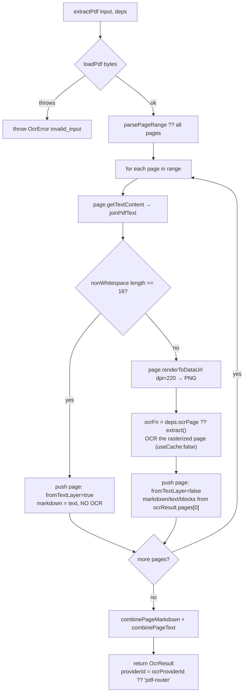

# PDF 与图像

<Status variant="beta">lib/ocr/ — pdf-router · image-prep · blob-utils · hash · ocr-parameter-schemas</Status>

<TLDR>
  PDF 会经过 `extractPdf`（`pdf-router.ts:79`）这个**两遍式**路由器：每页内嵌的文本层通过
  pdfjs-dist 读取，非空白字符 ≥16 的页面被原样接受（无 OCR 成本）；其余页面以 220 DPI
  栅格化后交给 OCR provider。图像归一化、页码范围解析、语言归一化、分页分隔符以及
  canvas 降采样都是 `image-prep.ts` 中的纯辅助函数。`hash.ts` 提供 SHA-256 文件身份标识
  （WebCrypto，而非 node crypto），它锚定了缓存 key。`ocr-parameter-schemas.ts`
  声明各 provider 的配置表单，复用主 LLM-provider 参数渲染器。
</TLDR>

## 两遍式 PDF 路由器

`extractPdf(input, deps)`（`pdf-router.ts:79`）让数字 PDF 免费、扫描 PDF 准确。pdfjs
加载器是一个 DI 接缝（`loadPdf`），因此测试可注入预设页面，而生产加载器是惰性导入的
（在首次使用前从静态导出中被 tree-shake 掉）。

```ts
// pdf-router.ts:28 + :81 — the two tunables (both ADR-confirmed)
export const MIN_TEXT_LAYER_CHARS = 16        // accept the text layer at ≥16 non-whitespace chars
const dpi = deps.dpi ?? 220                    // rasterize fallback pages at 220 DPI
```



逐页判定是其核心：

```ts
// pdf-router.ts:101 — fast-path vs OCR fallback
const text = joinPdfText(textContent)
if (text.replace(/\s+/g, "").length >= threshold) {
  pages.push({ pageNumber, markdown: synthesizeMarkdown(text), text, fromTextLayer: true })
  continue
}
const rasterized = await page.renderToDataUrl({ dpi })
const ocrResult = await ocrFn(
  { source: { kind: "data-url", dataUrl: rasterized.dataUrl, mimeType: "image/png" },
    providerId: ocrProviderId, languages, useCache: false },
  deps.extractDeps,
)
```

`defaultPdfLoader`（`pdf-router.ts:172`）动态导入 `pdfjs-dist`，优先使用 `OffscreenCanvas` →
`convertToBlob` 进行栅格化，回退到 DOM `<canvas>`，最终回退到 jsdom 安全的 base64 路径。

## 图像预处理辅助函数 —— `image-prep.ts`

`image-prep.ts`（304 行）是 provider、路由器与 `index.ts` 共享的值层。要点如下：

<TypeTable
  type={{
    normalizeLanguages: { description: "取 input → settings → [\"en\"] 中第一个非空者；裁剪、转小写、去重并保持顺序。", type: "(input?, settings?) => string[]" },
    parsePageRange: { description: "\"1,3-5,9\" → 排序、去重的 1-based number[]；undefined → null（全部页面）；丢弃 > total 的页码。", type: "(spec?, total?) => number[] | null" },
    combinePageMarkdown: { description: "用每页注释 + 分隔符连接各页。", type: "(pages) => string" },
    combinePageText: { description: "用空行连接各页文本（无注释标记）。", type: "(pages) => string" },
    downscaleImage: { description: "通过 canvas 将长边钳制到 maxLongEdge；无 canvas 运行时则不做处理。", type: "(bytes, mime, max) => Promise<…>" },
    normalizeImage: { description: "blob / data-url → 内联 bytes；file-path / attachment-id 抛出（需在上游解析）。", type: "(source) => Promise<…>" },
  }}
/>

分页分隔符是精确的（并与 ADR-0024 一致）：

```ts
// image-prep.ts:206 — combinePageMarkdown
return pages.map((p) => `<!-- page ${p.pageNumber} -->\n${p.markdown}`).join("\n\n---\n\n")
```

因此每页渲染为 `<!-- page N -->` 后接其 Markdown，并由 `\n\n---\n\n` 连接 —— 多页 PDF
得到清晰的水平分隔线边界。`combinePageText`（`image-prep.ts:209`）用空行连接且无标记。
`downscaleImage`（`image-prep.ts:224`）钳制**长边**，在没有 canvas 运行时（jsdom/node）、
解码失败、或图像已足够小的情况下原样返回输入。

## 跨运行时基础原语

### `blob-utils.ts` —— Blob → ArrayBuffer（42 行）

单一读取器：存在 `Blob.arrayBuffer()` 时用它，否则用 `FileReader.readAsArrayBuffer`，再否则
用最后兜底的 `text()` + `TextEncoder` 路径（仅限文本负载）。它是 `image-prep` 与 `hash` 底下
共享的原语；它**不**做 MIME 嗅探（那些判定函数位于 `image-prep`）。

### `hash.ts` —— SHA-256 文件身份标识（64 行）

缓存 key 中代表文件身份的那一半。其后端是 **WebCrypto `crypto.subtle`**（而非 node `crypto`），
因此它能在每个 webview 以及 Jest 下运行（Jest 中 webcrypto 被 polyfill 到 `globalThis.crypto`）。

```ts
// hash.ts — four entry points, all subtle.digest("SHA-256", …) + hex
sha256String(value)   // :32
sha256Blob(blob)      // :38 — via readBlobAsArrayBuffer
sha256Bytes(bytes)    // :44 — slices Uint8Array to a tight ArrayBuffer
sha256DataUrl(url)    // :56 — extracts base64 payload, null for non-data-URLs
```

`extract()` 在 bytes 已就绪时（data-url 来源）调用 `sha256Bytes`，否则调用 `sha256Blob` ——
所得摘要即缓存 key 的 `fileSha` 部分（见 [Cache](./cache)）。

## 配置参数 schema —— `ocr-parameter-schemas.ts`

`ocr-parameter-schemas.ts`（245 行）声明设置 **Advanced** 标签页中展示的**各 provider 配置表单**。
它们复用与主 LLM provider 设置相同的 `ProviderParameterSchema` / `ParameterDefinition` 结构，
因此现有的动态表单渲染器（`components/settings/provider/`）能直接用于 OCR 配置而无需改动。
取值持久化在 `UserOcrSettings.providerConfig[providerId]` 下；所有标签都是 `ocr.params.*` 下的
i18n key。

```ts
// ocr-parameter-schemas.ts:21 — COMMON_PARAMETERS, appended to every provider
languages (text, default "en") · format (select markdown/text/blocks)
pageRange (text) · maxImageDimension (number, default 2000, min 256 / max 8192 / step 64)
```

可复用的额外参数按 provider 叠加其上：`PROMPT_TEMPLATE_PARAM`（vision）、`MODEL_PARAM` / `REGION_PARAM` /
`ENDPOINT_PARAM`、`ENABLE_TABLES_PARAM` / `ENABLE_FORMS_PARAM`（Textract、Google）、`DIALECT_PARAM`
（`local-http` 的 `umi-ocr` / `paddleocr-server`）、`OPTIONAL_API_KEY_PARAM`（保存在设置而非
keyring 中的 LAN token），以及 `TIMEOUT_PARAM`。`OCR_PARAMETER_SCHEMAS`（`ocr-parameter-schemas.ts:175`）
涵盖 23 条 schema 条目；两个消费方辅助函数将其暴露出来：

- `getOcrParameterSchema(providerId)`（`:226`）—— 设置 UI 查找（未知 id 返回 null）。
- `applyOcrParameterDefaults(providerId, config)`（`:231`）—— 将 schema 默认值叠加到已保存的配置上，
  仅填充 `undefined` 的 key，用于在运行前补全 provider 配置。
