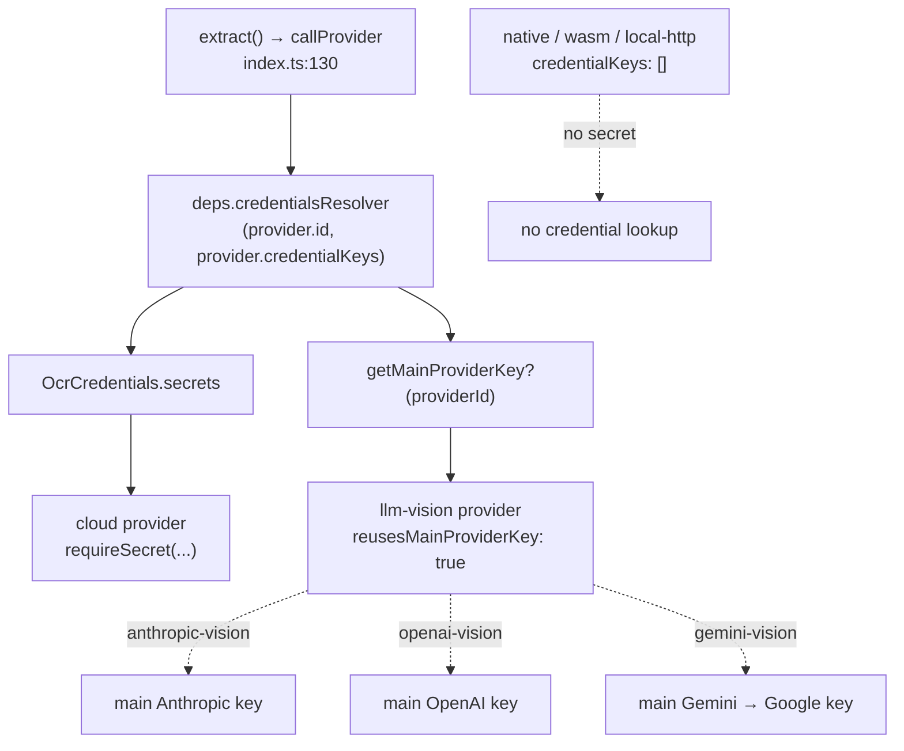

# Providers

<Status variant="beta">20 providers · lib/ocr/providers/*</Status>

<TLDR>
  二十个 provider 实现同一个接口 —— `OcrProvider.extract(input, ctx)`。它们共享三个辅助函数：
  `_http.cloudFetch`（每个云端 provider 的 fetch + 错误映射）、`_llm-vision`（为三个 `*-vision` provider 提供 prompt + 降采样 + 单页
  结果），以及 `_sigv4`（AWS Signature V4，仅 `aws-textract` 使用）。云端
  provider 声明 `credentialKeys`；LLM-vision provider 则改设 `reusesMainProviderKey` 并拉取主
  Claude/GPT/Gemini 密钥。五个原生引擎通过同一个 Tauri invoker 路由；`tesseract-wasm` 运行在 WASM
  worker 中；`local-http` 与用户提供的局域网端点通信。静态 UI 元数据存放在 `capabilities.ts`。
</TLDR>

## 完整矩阵

`shells` 列依次为 browser / tauri / capacitor。"blocks" = 该 provider 会以 bbox +
置信度填充 `pages[].blocks`。行号指向 provider 的 `id` 定义。

| Provider | 类别 | Shells | 凭据 | 传输 | 成本 | blocks | file:line |
| --- | --- | --- | --- | --- | --- | --- | --- |
| `mistral-ocr` | document-cloud | ✓/✓/✓ | `apiKey` | `POST api.mistral.ai/v1/ocr` | per-page | — | `mistral-ocr.ts:38` |
| `google-vision` | document-cloud | ✓/✓/✓ | `apiKey` | `images:annotate` (DOCUMENT_TEXT_DETECTION) | tier | paragraph | `google-vision.ts:75` |
| `aws-textract` | document-cloud | ✓/✓/✓ | `accessKeyId`,`secretAccessKey`,`sessionToken` | SigV4 `DetectDocumentText`/`AnalyzeDocument` | tier | line | `aws-textract.ts:57` |
| `azure-document-intelligence` | document-cloud | ✓/✓/✓ | `apiKey`,`endpoint` | 2-step analyze → poll `Operation-Location` | tier | paragraph | `azure-document-intelligence.ts:85` |
| `anthropic-vision` | llm-vision | ✓/✓/✓ | reuses main key | `POST api.anthropic.com/v1/messages` | per-token | — | `anthropic-vision.ts:50` |
| `openai-vision` | llm-vision | ✓/✓/✓ | reuses main key | `POST api.openai.com/v1/chat/completions` | per-token | — | `openai-vision.ts:51` |
| `gemini-vision` | llm-vision | ✓/✓/✓ | reuses main key | `generativelanguage…:generateContent` | per-token | — | `gemini-vision.ts:53` |
| `mathpix` | specialist | ✓/✓/✓ | `appId`,`appKey` | `POST api.mathpix.com/v3/text` | per-image | — | `mathpix.ts:39` |
| `ocr-space` | specialist | ✓/✓/✓ | `apiKey` | `POST api.ocr.space/parse/image` | tier | — | `ocr-space.ts:45` |
| `abbyy-cloud` | specialist | ✓/✓/✓ | `applicationId`,`password` | 3-step submit → poll → fetch result | tier | — | `abbyy-cloud.ts:43` |
| `nanonets` | specialist | ✓/✓/✓ | `apiKey` | `POST app.nanonets.com/api/v2/OCR/…` | tier | paragraph | `nanonets.ts:53` |
| `lark-basic` | lark | ✓/✓/✓ | `appId`,`appSecret` | tenant-token → `image/basic_recognize` | tier | — | `lark-basic.ts:61` |
| `tesseract-wasm` | local | ✓/✓/✓ | none | WASM worker (`tesseract.js`, assets in `public/ocr/`) | free | paragraph | `tesseract-wasm.ts:109` |
| `tesseract-native` | local | —/✓/— | none | Tauri `ocr_extract_native` backend=`tesseract` | free | paragraph | `tesseract-native.ts:57` |
| `windows-media-ocr` | local | —/✓/— | none | Tauri invoke backend=`windows-media-ocr` | free | paragraph | `windows-media-ocr.ts:51` |
| `apple-vision` | local | —/✓/✓ | none | Tauri (Swift sidecar) **or** Capacitor ML-Kit plugin | free | paragraph | `apple-vision.ts:75` |
| `mlkit-android` | local | —/—/✓ | none | Capacitor ML-Kit plugin | free | paragraph | `mlkit-android.ts:79` |
| `ocrs` | local | —/✓/— | none | Tauri invoke backend=`ocrs` | free | line | `ocrs.ts:58` |
| `paddle-ocr` | local | —/✓/— | none | Tauri invoke backend=`paddle-ocr` | free | line | `paddle-ocr.ts:49` |
| `local-http` | local | ✓/✓/✓ | none (optional LAN token in config) | direct fetch to user LAN endpoint | free | line | `local-http.ts:73` |

有五个 provider 是单 shell 的：`tesseract-native` / `windows-media-ocr` / `ocrs` / `paddle-ocr` 仅限 Tauri；
`mlkit-android` 仅限 Capacitor。`apple-vision` 根据 `ctx.platform` 分支，在桌面端使用 Swift sidecar，
在 iOS 上使用 ML-Kit 插件。

## 三个共享辅助函数

### `_http.ts` —— 云端 fetch 路径（132 行）

每个云端 provider（除原生引擎、WASM 引擎和 `local-http` 之外的所有 provider）都将其 HTTP
通过 `cloudFetch` 路由，后者集中处理 body 编码、abort 处理，以及 HTTP 状态码 → `OcrError` 映射。

```ts
// _http.ts:36 — the default status → error-code map
export function defaultErrorCodeFor(status: number): OcrErrorCode {
  if (status === 401 || status === 403) return "missing_credentials"
  if (status === 429) return "rate_limited"
  if (status >= 400 && status < 500) return "invalid_input"
  return "provider_failed"
}
```

`cloudFetch`（`_http.ts:55`）接受一个 per-provider 的 `errorCodeFor` 覆盖项（Textract 和 ocr-space 会映射各自
特有的状态码怪癖）。`requireSecret`（`_http.ts:118`）在某个已声明的密钥缺失时抛出 `missing_credentials`；
`parseJson`（`_http.ts:104`）将 `JSON.parse` 失败包装为 `provider_failed`。

### `_llm-vision.ts` —— vision prompt + 降采样（75 行）

三个 `*-vision` provider 共享 prompt 构建、图像降采样和单页结果逻辑。这正是
**LLM-vision provider 从不填充 `blocks`** 的原因 —— `buildVisionResult` 将模型的 Markdown 包装成一
页，并附带一个空的 blocks 数组。

```ts
// _llm-vision.ts:32 — normalize → downscale to maxImageDimension → resolve prompt
export async function preparePromptAndImage(input, ctx, config) {
  const normalized = await normalizeImage(input.source)
  const maxDim = config.maxImageDimension ?? DEFAULT_MAX_IMAGE_DIMENSION   // 2000
  const downscaled = await downscaleImage(normalized.bytes, normalized.mimeType, maxDim)
  return {
    prompt: (config.promptTemplate || DEFAULT_VISION_PROMPT).trim(),
    mimeType: downscaled.mimeType,
    bytes: downscaled.bytes,
  }
}
```

### `_sigv4.ts` —— AWS Signature V4（196 行）

仅 `aws-textract` 使用。唯一的公开导出 `signRequest`（`_sigv4.ts:39`）完全运行在
`crypto.subtle` 上，因此它在每种 shell 以及 Jest 下都能进行相同的签名。其余的一切（规范化、
HMAC 链、RFC-3986 编码）都是模块私有的。

## 凭据模型



`OcrCredentials`（`types.ts:142`）即 `{ secrets, getMainProviderKey? }`。`getMainProviderKey` 这个逃生舱口
让 vision provider 得以复用主 provider 系统，而无需索取第二个 API 密钥 ——
`gemini-vision` 在解析其密钥时甚至会回退 `gemini → google`。

<Callout type="warn" title="尚未组装任何生产环境凭据解析器">
  当前代码树中的每个 `credentialsResolver` 都是返回空 secrets 的桩 `async () => ({ secrets: {} })`
  （插件的 `defaultDepsBuilder`、所有测试）。设置 UI 将已输入的凭据保存在会话内存中，
  并明确将基于 keyring 的 `ocr_keyring_*` 解析器推迟到"上游工作"。因此在该解析器接入之前，云端 provider 会
  抛出 `missing_credentials`。本地引擎（无 `credentialKeys`）不受影响。
</Callout>

## 能力矩阵 —— `capabilities.ts`

`capabilities.ts`（380 行）是**静态 UI 元数据**，与 provider 模块分开存放，这样设置
侧栏、能力标签页和对比视图就永远不必 import 20 个 provider 文件。`OCR_PROVIDER_CAPABILITIES`
（`capabilities.ts:64`）对每个已注册的 provider id 恰好有一行（一个单元测试强制保证它与注册表
保持一致）。

<TypeTable
  type={{
    handwriting: { description: "处理手写文本。", type: "yes | no | partial" },
    tables: { description: "还原表格结构。", type: "yes | no | partial" },
    math: { description: "识别公式 / LaTeX。", type: "yes | no | partial" },
    cjk: { description: "中文 / 日文 / 韩文文字支持。", type: "yes | no | partial" },
    layout: { description: "保留阅读顺序 / 布局。", type: "yes | no | partial" },
    offline: { description: "无网络也能运行。", type: "yes | no | partial" },
    structuredOutput: { description: "输出 bbox/置信度 blocks。", type: "yes | no" },
    pdfNative: { description: "原生接受多页 PDF（而非逐页栅格化）。", type: "yes | no" },
    costTier: { description: "UI 中显示的定价区间。", type: "free | $ | $$ | $$$" },
    maxPagesPerCall: { description: "provider 单次请求的页数上限（无界时为 ∞）。", type: "number" },
  }}
/>

有两个辅助函数消费该表：`estimateOcrCost(providerId, pages)`（`capabilities.ts:357`）将页数乘以
对应 tier 的 per-page USD（free=0、$=0.005、$$=0.015、$$$=0.05）—— Try-It 和 Compare 标签页会在
运行前展示这一估算 —— 以及 `topSidebarCapabilities(providerId)`（`capabilities.ts:367`）为侧栏行挑选最多三个
具区分度的徽章。

## 各 provider 的显著怪癖

- **`mistral-ocr`** —— 唯一一个*不*填充 `blocks` 的 document-cloud provider；它返回原生 Markdown，
  其 `text` 字段是通过剥离 Markdown 装饰合成出来的。
- **`aws-textract`** —— 拒绝 PDF mime（同步 API 仅支持图像）；表格/表单通过
  `AnalyzeDocument` 的 `FeatureTypes` 得到。
- **`azure-document-intelligence`** / **`abbyy-cloud`** —— 异步：先提交，再轮询某个 operation/task URL
  （Azure 60×1s，ABBYY 40×1.5s），然后才取回结果。
- **`lark-basic`** —— 将 tenant-access-token 缓存在内存中，并在其 2 小时过期前留出 2 分钟安全边际。
- **`tesseract-wasm`** —— 惰性 `import("tesseract.js")`（被 webpack 忽略）并共享一个缓存的 worker；由于
  jsdom 无法运行 WASM，recognizer 工厂对测试是可注入的。
- **`local-http`** —— 方言感知（`umi-ocr` / `paddleocr-server`），运行自己的
  `AbortController` 超时而非 `cloudFetch`，且永不被自动选择（已从路由偏好表中排除）。

原生引擎的具体细节（模型加载、置信度、Tauri invoker）在
[Native backends](./native-backends) 中介绍；本地引擎的逐 OS 排名在
[Auto-router](./auto-router) 中。
