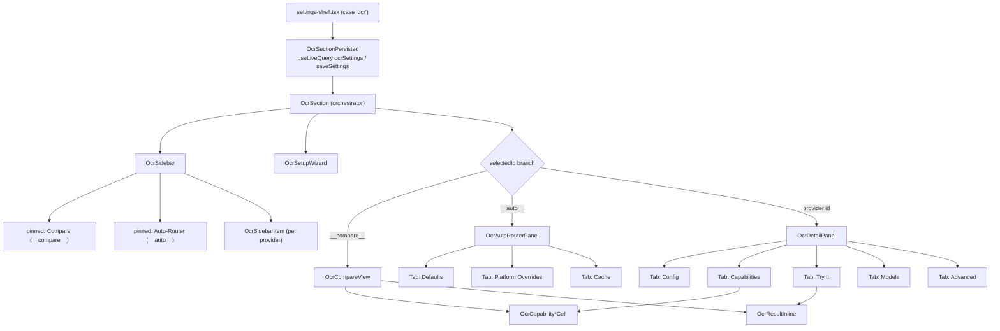

# 设置 UI

<Status variant="beta">17 files · components/settings/ocr/</Status>

<TLDR>
  OCR 设置区镜像了 model-provider 设置：一个 **侧栏**（可搜索的 provider 列表 + 两个固定的伪条目 —— Compare 与
  Auto-Router）和一个按选择分支的 **详情面板**。一个真实 provider 显示五个 tab（**Config · Capabilities · Try It ·
  Models · Advanced**）；Auto-Router 伪条目显示三个（**Defaults · Platform Overrides · Cache**）。首次访问的
  **初始化向导** 从一个用例预设播种起始配置。设置经 `useLiveQuery` / `saveSettings` 持久化在 `ocrSettings` key 下
  （`ocr-section-persisted.tsx`）。该区在设置外壳中注册于 `ai` 导航分组下。
</TLDR>

## 外壳

`ocr-section.tsx`（565 行）是编排者：它持有所有 in-session 状态，构建侧栏行和详情面板的 tab 槽，并接线向导。布局是一个
CSS 网格 `md:grid-cols-[360px_1fr]`（`ocr-section.tsx:439`）—— 左侧栏、右详情 —— 在移动端折叠为 `Sheet` 抽屉。详情
面板按 `selectedId` 分支（`ocr-section.tsx:332`）：



<Callout type="info" title="UI 比 ADR 更丰富">
  ADR-0024（schema v36）早于 Compare 固定条目、五-tab 的按-provider 面板，以及三-tab 的 Auto-Router 面板。此处记录的
  当前结构才是 source of truth。
</Callout>

## 持久化

`ocr-section-persisted.tsx`（70 行）是外壳实际渲染的 Dexie 接缝：

```ts
// ocr-section-persisted.tsx — load + persist under the ocrSettings key
const settings = useLiveQuery(async () => (await getSettings()).ocrSettings, [])   // :29
const handleChange = (next: UserOcrSettings) =>
  void saveSettings({ ocrSettings: next }).catch((err) => toast.error(...))         // :36
```

因此存储 key 是 `appSettings` 单例上的 `ocrSettings`，回退到 `DEFAULT_OCR_SETTINGS`。缓存辅助函数路由到
`clearOcrCache` / `clearOcrCacheForProvider`。已输入的 **凭据留在会话内存中** —— 文件头注明 keyring 支持的
`ocr_keyring_*` 界面仍待实现。

## 按 provider 的 tab

`OcrDetailPanel`（`ocr-detail-panel.tsx:77`）渲染头部（图标、名称、类别、状态药丸、启用开关）和一个 `Tabs` 组，
`defaultValue="config"`：

| Tab | 组件 | 作用 |
| --- | --- | --- |
| **Config** | `tabs/ocr-config-tab.tsx` (195) | 从 `provider.credentialKeys` 生成的凭据表单；面向 vision provider 的 "reuse main key" 提示；shell-support 药丸；**Probe** 按钮（`probeOcrProvider`）。 |
| **Capabilities** | `tabs/ocr-capabilities-tab.tsx` (138) | 来自 `OCR_PROVIDER_CAPABILITIES` 的单-provider 11 个能力字段矩阵，外加一个 "Compare" CTA。 |
| **Try It** | `tabs/ocr-try-it-tab.tsx` (252) | 拖入一张图片/PDF → cost-confirm 对话框 → `useOcr().run()` → 内联结果。 |
| **Models** | `tabs/ocr-models-tab.tsx` (276) | 针对 `ocrs` / `paddle-ocr` 的本地模型下载（Tauri 桥）。 |
| **Advanced** | `tabs/ocr-advanced-tab.tsx` (223) | 写入 `providerConfig[id]` 的按-provider 配置覆盖（format、langs、model variant、region、prompt）。 |

### Models tab —— 下载桥

`buildTauriModelBridge`（`ocr-models-tab.tsx:231`）调用 Rust 命令并订阅进度事件：

```ts
// ocr-models-tab.tsx:252
async download(backend) {
  const invoke = await getInvoke()
  await invoke("ocr_download_model", { backend })
  return invoke<ModelStatus>("ocr_model_status", { backend })
},
onProgress(handler) {                                    // :257
  return listen<DownloadProgressEvent>("ocr://download-progress", (e) => handler(e.payload))
}
```

事件按 backend 过滤以驱动一个按-文件的百分比条；在浏览器外壳中（`bridge === null`）该 tab 显示一条 "shell
unavailable" 消息。`BACKENDS_WITH_MANAGED_MODELS` 为 `{ ocrs, paddle-ocr }`。

## Auto-Router 面板

`OcrAutoRouterPanel`（`tabs/ocr-auto-router-panel.tsx`，302 行）是路由配置所在处 —— 注意 **Platform Overrides** 与
**Cache** 挂在此处，而非按-provider 面板。

- **Defaults**（`:124`）—— 默认 provider（`auto` + 全部）、默认 format、默认 languages、`maxImageDimension`、
  cloud-fallback 开关 + provider（仅 cloud/vision）、PDF text-layer 快速路径、`cacheTtlDays`，以及清空全部缓存。
  侧栏 Auto-Router 副标题反映实时路由（"auto with fallback X" 对 "fixed: provider"）。
- **Platform Overrides**（`tabs/ocr-platform-overrides-tab.tsx`，243）—— 经 dnd-kit 的按-OS 可重排本地引擎排名。
  有效顺序为 `settings.platformOverrides[os]`（若已设置），否则为 `DEFAULT_LOCAL_PREFERENCE[os]`。写入路径在
  default-equality 时收敛 —— 把某个桶还原为其默认排序会删除该 key：

  ```ts
  // ocr-platform-overrides-tab.tsx:113
  const isDefault = next.length === defaults.length && next.every((id, i) => id === defaults[i])
  if (isDefault) delete overrides[os]          // revert → no override stored
  else overrides[os] = [...next]
  onChange({ ...settings, platformOverrides: overrides })
  ```

- **Cache**（`tabs/ocr-cache-tab.tsx`，254）—— 一个浏览 Dexie `ocrResults` 表的浏览器，支持按-行、按-provider 和
  全局删除。

## 初始化向导

`ocr-setup-wizard.tsx`（261 行）是一个首次访问的三步流程：选一个用例 → 预览其预设 → 应用。预设来自
`RECOMMENDATION_MAP`（见 [Auto-router](./auto-router)）。应用会把 provider[0] 写为默认、provider[1] 写为 cloud
fallback、写入 languages/format，并设置 `ocrWizardDismissed: true`。

向导仅在 `!ocrWizardDismissed` **且** `hasNoCloudCredentials(...)`（`ocr-section.tsx:230`）时于首次访问自动打开；应用、
显式 Dismiss，或关闭对话框都会设置 `ocrWizardDismissed: true`。它可从 Auto-Router 面板头部的 "Run setup wizard"
按钮重新打开。

## 能力对比

`ocr-compare-view.tsx`（457 行）是全宽的 Compare 固定条目：选最多三个 provider，挑一个文件，并行
`Promise.allSettled(extract(...))` 进入按列结果，由一个汇总成本的 confirm 对话框把关。共享的单元格渲染器
（`ocr-capability-cell.tsx`）—— value（yes/no/partial）、cost（`$`/`$$`/`$$$`/free）和 count（number/∞）—— 被
Compare 矩阵和单-provider Capabilities tab 复用。`OcrResultInline`（`ocr-result-inline.tsx`，117）是 Try-It 与每个
Compare 列共享的非-Sheet 按-页渲染器。

## 注册与 i18n

- **渲染：** `settings-shell.tsx:36` 动态导入 `OcrSectionPersisted`（绑定为 `OcrSection`）；`case "ocr"`
  （`:359`）渲染它。
- **导航：** `settings-nav-config.ts:140` —— `id: "ocr"`、`group: "ai"`、`icon: ScrollTextIcon`、
  `labelKey`/`descriptionKey` → `settings.tabs.ocr` / `settings.descriptions.ocr`。
- **i18n：** 每个文件都对顶层 `ocr.*` 命名空间使用 `useTranslations()`（root scope）—— `ocr.providers.<id>.label`、
  `ocr.categories.*`、`ocr.status.*`、`ocr.autoRouter.*`、`ocr.wizard.*`、`ocr.modelStatus.*`、
  `ocr.platformOverrides.*`、`ocr.cache.*`、`ocr.capabilities.*`、`ocr.compare.*`、`ocr.tryIt.*`、`ocr.probe.*`、
  `ocr.credentials.*`、`ocr.advanced.*` —— 区标题来自 `settings.tabs.ocr`。
