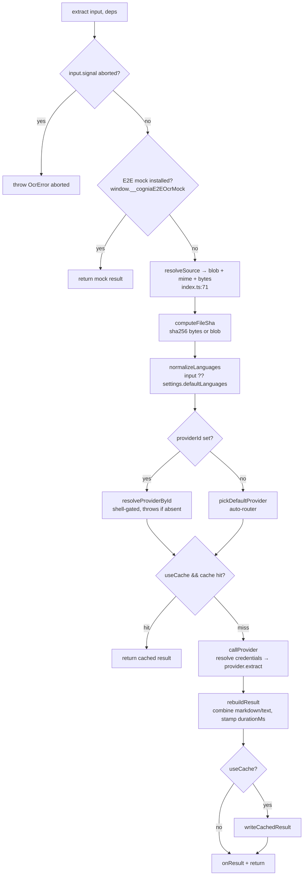

# 类型与分发

<Status variant="beta">核心面 — lib/ocr/ types · index · registry · runtime</Status>

<TLDR>
  本子系统的一切都以 `lib/ocr/types.ts` 中的四个类型来描述 —— `OcrInput`、
  `OcrResult`、`OcrProvider` 与 `UserOcrSettings`。唯一的公开函数 `extract(input, deps)`
  （`lib/ocr/index.ts:200`）是**完全依赖注入**的：registry、settings、platform、凭据
  解析器以及各源解析器都经由 `ExtractDeps` 传入，因此测试可以独立 stub 每一项，而生产环境
  只组装一次。provider 存活在以 `Map` 为底的 `OcrRegistry`（`registry.ts`）中；`installOcrRuntime()`
  （`runtime.ts:94`）是负责填充它的幂等引导函数。
</TLDR>

## 类型模型

所有公开类型都在 `lib/ocr/types.ts`（235 行）中。可辨识联合 `OcrSource` 正是让单个
provider 实现能从四种不同调用方上下文被触达的关键。

```ts
// types.ts:60 — four source kinds collapse to one provider call
export type OcrSource =
  | { kind: "data-url"; dataUrl: string; mimeType: string }
  | { kind: "file-path"; path: string }
  | { kind: "blob"; blob: Blob; mimeType: string }
  | { kind: "attachment-id"; attachmentId: string }
```

<TypeTable
  type={{
    source: { description: "待读取的图像 / PDF —— 四种 OcrSource 之一。", type: "OcrSource" },
    languages: { description: "BCP-47 代码或 Tesseract 三元组。内部归一化（小写、去重）。", type: "string[]", default: "settings.defaultLanguages" },
    format: { description: "调用方请求的输出形态。", type: "markdown | text | blocks", default: "markdown" },
    pageRange: { description: "\"1,3-5,7\" 语法，从 1 开始。仅限 PDF。", type: "string" },
    providerId: { description: "显式指定的 provider id。省略则交由自动路由选择。", type: "string" },
    signal: { description: "调用方的 AbortSignal —— provider 必须遵守它。", type: "AbortSignal" },
    useCache: { description: "读取命中 / 写入新条目。健康探测传入 false。", type: "boolean", default: "true" },
  }}
/>

`OcrResult`（`types.ts:90`）是每个 provider 的返回值。`pages[]` 携带每页的 `markdown` + `text`
（始终填充），加上可选的 `blocks[]`（bbox + 置信度），供能暴露结构化输出的 provider 使用。
`combinedMarkdown` / `combinedText` 是拼接后的视图；`durationMs`、`costEstimate` 与 `cached` 收尾
其余信息。

```ts
// types.ts:38 — a page; blocks present only for structured providers
export interface OcrPage {
  pageNumber: number          // 1-based
  markdown: string            // always populated
  text: string                // always populated
  blocks?: OcrBlock[]         // bbox + confidence, structured providers only
  width?: number; height?: number
  fromTextLayer?: boolean     // true when the PDF text-layer fast-path produced it
}
```

错误以 `OcrError`（`types.ts:121`）抛出，携带一个 `code` 判别字段 —— 测试与分发循环都依据
`code` 分支，绝不依据消息字符串：

```ts
// types.ts:112
export type OcrErrorCode =
  | "unsupported_shell" | "missing_credentials" | "rate_limited"
  | "provider_failed"   | "unsupported_language" | "invalid_input" | "aborted"
```

### provider 是什么

```ts
// types.ts:166 — the registry holds these
export interface OcrProvider {
  id: string
  label: string
  category: OcrProviderCategory           // document-cloud | llm-vision | specialist | lark | local
  shells: { browser: boolean; tauri: boolean; capacitor: boolean }
  credentialKeys: readonly string[]       // empty for local + key-reusing vision providers
  reusesMainProviderKey?: boolean         // pull Claude/GPT/Gemini key instead of a second secret
  extract(input: OcrInput, ctx: OcrProviderContext): Promise<OcrResult>
}
```

### 设置

`UserOcrSettings`（`types.ts:185`）是持久化存储，保存在 `appSettings` 单例上的 `ocrSettings`
键下。`DEFAULT_OCR_SETTINGS`（`types.ts:221`）为其播种：

<TypeTable
  type={{
    defaultProviderId: { description: "当 OcrInput.providerId 未定义时使用的 provider。\"auto\" 启用路由器。", type: "string | \"auto\"", default: "\"auto\"" },
    cloudFallbackEnabled: { description: "当本地引擎不可用时，路由器可回退到云端 provider。", type: "boolean", default: "true" },
    cloudFallbackProviderId: { description: "路由器优先选用的回退云端 provider。", type: "string | null", default: "\"mistral-ocr\"" },
    defaultFormat: { description: "调用方未指定时的输出格式。", type: "OcrOutputFormat", default: "\"markdown\"" },
    pdfTextLayerFastPath: { description: "在 OCR 之前先跑数字 PDF 快速通道。", type: "boolean", default: "true" },
    providerConfig: { description: "每 provider 的配置块（model、region、prompt、语言包）。", type: "Record<string, OcrProviderConfig>", default: "{}" },
    providerEnabled: { description: "每 provider 的启用标记 —— 被禁用的 provider 不会被自动选中。", type: "Record<string, boolean>", default: "{}" },
    maxImageDimension: { description: "降采样前的长边像素数（LLM-vision 成本护栏）。", type: "number", default: "2000" },
    platformOverrides: { description: "每操作系统的有序本地引擎偏好，叠加合并在默认表之上。", type: "Partial<Record<OcrPlatformOverrideKey, string[]>>", default: "{}" },
  }}
/>

## 分发流程

`extract()`（`index.ts:200`）就是整个控制面。它的签名接收输入加上一个完全注入的
`ExtractDeps` 包（`index.ts:55`）：

```ts
// index.ts:55 — every external dependency is injectable
export interface ExtractDeps {
  registry: OcrRegistry
  settings: UserOcrSettings
  platform: NativePlatform                 // "tauri" | "mobile" | "web"
  osTag?: "windows" | "macos" | "linux" | "ios" | "android" | "browser"
  credentialsResolver: CredentialsResolver // keyring (Tauri) / encrypted Dexie (web)
  attachmentResolver?: AttachmentResolver  // only for kind:"attachment-id"
  filePathResolver?: FilePathResolver      // only for kind:"file-path"
  onResult?: (result: OcrResult) => void   // tests / observability
}
```

函数体运行六个步骤：



两处值得强调的细节：

- **源预解析。** 在调用 provider 之前，`extract()` 会把任何 `file-path` /
  `attachment-id` 源解析为 `blob` 源（`index.ts:240`），因此 provider 永远不会重新拉取 —— 它们始终收到
  一个由 blob 支撑的输入。
- **错误归一化。** `callProvider`（`index.ts:124`）对抛出的错误做鸭子类型判断：真正的 `OcrError`（通过
  `instanceof` **或** `name === "OcrError"` + `code` + `providerId`）原样透传；其余一切
  都被包装为 `provider_failed`。该鸭子类型判断在 Jest 下能扛住跨模块 `require` 链。

## registry

`registry.ts`（90 行）是一个带 shell 门控的 `Map<string, OcrProvider>`。`shellAllows` 是
自动路由器所依赖的选择辅助函数：

```ts
// registry.ts:61 — NativePlatform → the provider's capability flags
export function shellAllows(provider: OcrProvider, platform: NativePlatform): boolean {
  switch (platform) {
    case "tauri":  return provider.shells.tauri
    case "mobile": return provider.shells.capacitor
    case "web":    return provider.shells.browser
  }
}
```

共享单例（`getSharedOcrRegistry`，`registry.ts:83`）即生产环境的 registry；`register` 在
重复 id 时抛错，而 `__resetSharedOcrRegistry`（`registry.ts:88`）为测试提供一块干净的起点。

## 运行时引导

`runtime.ts`（205 行）是 20 个 provider 真正进入 registry 的地方，也是单个 Tauri
调用器被扇出到全部五个原生后端的地方。`ALL_PROVIDERS`（`runtime.ts:51`）是规范的有序
列表。

```ts
// runtime.ts:94 — idempotent; one Tauri invoker feeds 5 native providers
export async function installOcrRuntime(opts: OcrRuntimeOptions = {}): Promise<void> {
  if (installed) return
  installed = true
  const registry = getSharedOcrRegistry()
  for (const provider of ALL_PROVIDERS) {
    if (!registry.has(provider.id)) registerOcrProvider(provider)
  }
  const invoker = opts.nativeInvoker ?? (await tryBuildTauriInvoker())
  if (invoker) {
    __setNativeOcrInvoker(invoker); __setWindowsMediaOcrInvoker(invoker)
    __setAppleVisionTauriInvoker(invoker); __setOcrsInvoker(invoker); __setPaddleOcrInvoker(invoker)
  }
  // + MSIX readiness probe (ocr_msix_status) wired into windows-media-ocr
  // + model-status probe (ocr_model_status) wired into ocrs / paddle-ocr
}
```

引导逻辑还注入了门控原生引擎的**就绪探测**：`tryBuildMsixProbe`
（`runtime.ts:159`）喂给 `__setWindowsMediaOcrReadiness`，`tryBuildModelStatusProbe`（`runtime.ts:186`）
喂给 `__setOcrsReadiness` / `__setPaddleOcrReadiness`。在 Tauri 之外，这两个探测都回退为 `null`（视为
就绪），因此当某个绑定确实缺失时，抛出 `unsupported_shell` 的是 provider 自己的 `extract()`。

<Callout type="warn" title="该引导逻辑尚未在生产中被调用">
  `installOcrRuntime()` 已被完整测试（`runtime.test.ts`），但**没有生产调用点** —— 其文档
  注释引用了 `app/(setup)/ocr-bootstrap.tsx`，而该文件并不存在。在调用方被加入之前，唯一
  触达共享 registry 的路径是插件的 `defaultDepsBuilder`
  （`plugins/ocr/src/index.ts:51`），而它在 registry 为空时自身返回 `null`。完整接线图见
  [Triggers](./triggers)。
</Callout>
