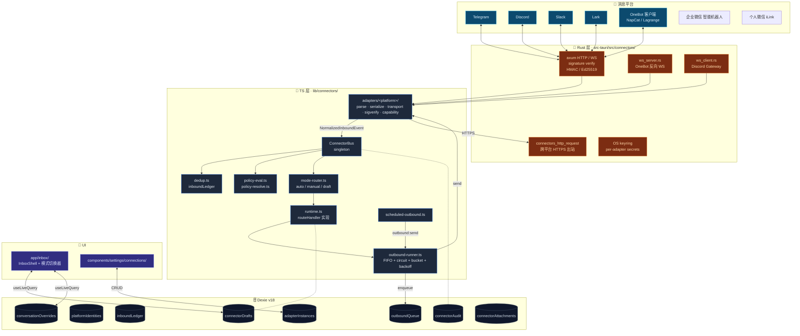
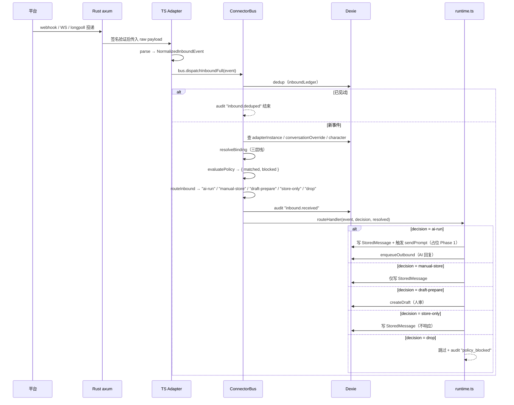
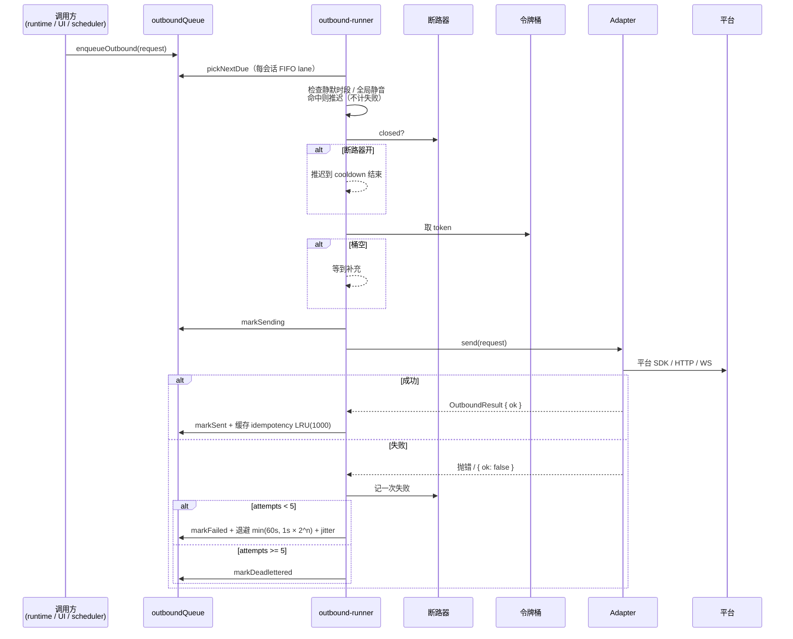

# 平台连接器

本页是**架构总览**。平台一键接入指南见兄弟文档（含企业微信、个人微信 —— 详见 [ADR-0036](../adr/0036-wechat-wecom-connectors)）：

<Cards>
  <Card title="Slack 接入" href="../connectors/slack-setup" />
  <Card title="Discord 接入" href="../connectors/discord-setup" />
  <Card title="Lark / 飞书接入" href="../connectors/lark-setup" />
  <Card title="OneBot v11 接入" href="../connectors/onebot-setup" />
  <Card title="QQ via OneBot FAQ" href="../connectors/qq-via-onebot-faq" />
  <Card title="用插件扩展连接器" href="../connectors/extending-with-plugins" />
</Cards>

## 适用场景

| 场景               | 推荐模式 + 模块                                                            |
| ------------------ | -------------------------------------------------------------------------- |
| 公司客服群自动回复 | `auto` + Slack / Lark 适配器 + 角色绑定 + TriggerPolicy 限定关键词         |
| 个人助理草稿审核   | `draft` + Telegram 私聊 + draft 审核走 Inbox UI                            |
| 手动机器人代发     | `manual` + 任意适配器 + Composer 手动输入                                  |
| 定时推送日报       | `connection:outbound:send` 调度任务直接入队 outbound（不过 AI）            |
| QQ 群机器人        | `onebot` + NapCat / Lagrange / LLOneBot 反向 WS 连接                       |
| 插件贡献新平台     | `PluginManifest.connectors[]` + `connectors-bridge.registerPluginAdapters` |

## 架构图



## 关键模块与文件路径

### 类型

| 文件                                | 用途                                                           |
| ----------------------------------- | -------------------------------------------------------------- |
| `types/connectors/index.ts`         | barrel —— 重导出全部类型                                       |
| `types/connectors/platform-kind.ts` | `PlatformKind` 联合：`"telegram" \| "discord" \| ...`          |
| `types/connectors/adapter.ts`       | `PlatformAdapter` 接口（每个适配器实现）                       |
| `types/connectors/event.ts`         | `NormalizedInboundEvent` —— 跨平台统一事件                     |
| `types/connectors/segment.ts`       | `MessageSegment[]` —— 文本 / markdown / 图片 / 文件 / @ / 引用 |
| `types/connectors/outbound.ts`      | `OutboundRequest` / `OutboundResult`                           |
| `types/connectors/policy.ts`        | `TriggerPolicy` + `ConnectorMode`                              |
| `types/connectors/binding.ts`       | 三层绑定栈（adapter default / 会话覆盖 / 事件覆盖）            |
| `types/connectors/capability.ts`    | 平台能力（max message size、是否支持引用 / 编辑 / 撤回……）     |
| `types/connectors/audit.ts`         | `ConnectorAuditEntry`                                          |

### ConnectorBus 与编排

| 文件                                 | 用途                                                                                     |
| ------------------------------------ | ---------------------------------------------------------------------------------------- |
| `lib/connectors/bus.ts`              | 单例；`registerAdapter` / `dispatchInboundFull`（10 步管线）                             |
| `lib/connectors/dedup.ts`            | `recordAndCheckInbound` —— `inboundLedger` 10 k 上限                                     |
| `lib/connectors/policy-eval.ts`      | `evaluatePolicy` —— TriggerPolicy 规则 + 黑名单 → `{ matched, blocked }`                 |
| `lib/connectors/policy-resolve.ts`   | `resolveBinding` —— 三层栈合并出最终 mode + characterId                                  |
| `lib/connectors/mode-router.ts`      | `routeInbound(mode, evalResult, storeUnmatchedInDraftMode)` → `RouteDecision`            |
| `lib/connectors/runtime.ts`          | `installRuntime` —— 把 `routeHandler` 接入聊天 send 管线 + 写 StoredMessage / 创建 draft |
| `lib/connectors/audit.ts`            | `appendAudit` —— `connectorAudit` 写入器（capped）                                       |
| `lib/connectors/adapter-registry.ts` | `buildAdapterFromRow(row)` —— 把 Dexie 行实例化成 `PlatformAdapter`                      |

### 出站

| 文件                                   | 用途                                                                                |
| -------------------------------------- | ----------------------------------------------------------------------------------- |
| `lib/connectors/outbound-runner.ts`    | 主泵 + 每会话 FIFO + 静默时段 + 全局静音；导出 `isInQuietHours` / `msUntilQuietEnd` |
| `lib/connectors/circuit-breaker.ts`    | 50% 失败率 / 10 事件窗口；trip 后 30 s cooldown                                     |
| `lib/connectors/rate-limit.ts`         | 令牌桶 —— 容量 20，5 token/s 补充                                                   |
| `lib/connectors/scheduled-outbound.ts` | 把 `connection:outbound:send` / `connection:scheduled:digest` 注册成 `TaskExecutor` |

### 五个内置适配器

每个适配器目录都遵循同样的分解：

```text
lib/connectors/adapters/&lt;platform&gt;/
  parse.ts        平台原始 payload → NormalizedInboundEvent
  serialize.ts    NormalizedOutboundRequest → 平台 payload
  transport-*.ts  长连接 / 长轮询 / webhook / 反向 WS / Gateway
  sigverify.ts    签名验证（HMAC / Ed25519 / Bearer）
  capability.ts   能力声明
  index.ts        createXxxAdapter(opts) 工厂
```

| 平台       | 传输                         | 签名验证                                         |
| ---------- | ---------------------------- | ------------------------------------------------ |
| Telegram   | longpoll 或 webhook          | `X-Telegram-Bot-Api-Secret-Token`（HMAC-SHA256） |
| Discord    | Gateway WS v10               | Ed25519（`X-Signature-Ed25519`，仅 HTTP 交互）   |
| Slack      | Socket Mode 或 Events API    | HMAC-SHA256 v0（`X-Slack-Signature`）            |
| Lark       | long-connection 或 webhook   | HMAC-SHA256（`X-Lark-Signature`）                |
| OneBot v11 | 反向 WebSocket（设备连进来） | Bearer token（可选）                             |

### Rust 层

| 文件                                           | 用途                                           |
| ---------------------------------------------- | ---------------------------------------------- |
| `src-tauri/src/connectors/mod.rs`              | 入口 + `ConnectorsState`                       |
| `src-tauri/src/connectors/axum_app.rs`         | 接收 webhook 的 axum app                       |
| `src-tauri/src/connectors/server_lifecycle.rs` | spawn / shutdown                               |
| `src-tauri/src/connectors/ws_server.rs`        | OneBot 反向 WS 服务端                          |
| `src-tauri/src/connectors/ws_client.rs`        | Discord Gateway 客户端                         |
| `src-tauri/src/connectors/sigverify/`          | HMAC / Ed25519 验签                            |
| `src-tauri/src/connectors/keyring.rs`          | per-adapter 密钥读写                           |
| `src-tauri/src/connectors/http_client.rs`      | `connectors_http_request` —— 跨平台 HTTPS 出站 |
| `src-tauri/src/connectors/attachments.rs`      | `connectorAttachments` 表的下载缓存            |
| `src-tauri/src/connectors/commands.rs`         | Tauri 命令暴露                                 |

### UI

| 文件                                                                     | 用途                                                                                     |
| ------------------------------------------------------------------------ | ---------------------------------------------------------------------------------------- |
| `app/inbox/page.tsx`、`app/inbox/[conversationKey]/page.tsx`             | Inbox 入口（静态导出兼容）                                                               |
| `components/inbox/inbox-shell.tsx`                                       | 左 + 右双栏壳                                                                            |
| `components/inbox/inbox-sidebar.tsx`                                     | 列出所有平台绑定的 `ChatSession`                                                         |
| `components/inbox/conversation-header.tsx`                               | 模式切换器（auto / manual / draft）                                                      |
| `components/inbox/draft-banner.tsx`、`components/inbox/draft-editor.tsx` | draft 模式审核 UI                                                                        |
| `components/inbox/outbound-status-pill.tsx`                              | 出站状态徽章                                                                             |
| `components/settings/connections/connections-section.tsx`                | tabbed shell；6 个 tab（Overview / Adapters / Conversations / Inbox / Outbound / Audit） |
| `components/settings/connections/forms/quiet-hours-and-mute.tsx`         | 静默时段 + 全局静音表单                                                                  |

## 数据流：入站



## 数据流：出站



## 数据库表（Dexie v18）

| 表                      | 主键 | 用途                                                                                          |
| ----------------------- | ---- | --------------------------------------------------------------------------------------------- |
| `adapterInstances`      | `id` | 每个已配置 bot 一行（platform、credentials、settings、defaultCharacterId、quietHours、muted） |
| `platformIdentities`    | `id` | 每个观察到的平台用户一行（username / display name / 自定义元数据）                            |
| `inboundLedger`         | `id` | 入站去重（`adapterId + messageId`），10 k 上限                                                |
| `outboundQueue`         | `id` | 出站交付 job；status = queued / sending / sent / failed / deadlettered                        |
| `conversationOverrides` | `id` | 每会话 mode / character 覆盖                                                                  |
| `connectorAudit`        | `id` | 审计日志，5 000 条 capped ring                                                                |
| `connectorDrafts`       | `id` | draft 模式待人审核的草稿                                                                      |
| `connectorAttachments`  | `id` | 平台附件下载缓存（schema-only at Phase 1）                                                    |

## 配置项与扩展点

### 三模式 + 三层栈

```text
adapter default mode (在 settings → adapter 详情设)
  ↓ 被 conversation override 覆盖
conversation override (Inbox UI 切换器)
  ↓ 被 event 级 override 覆盖
event override (TriggerPolicy 规则匹配时设置)
```

最终 mode 决定 `routeInbound` 的分支。

### TriggerPolicy

每个 `AdapterInstance.policy: TriggerPolicy` 配：

- `keywords[]` —— 字符串 / regex（关键词触发）
- `mentions[]` —— @ 触发
- `replyOnly` —— 仅回复机器人的消息时触发
- `block[]` —— 黑名单（用户 / 关键词）
- `cooldownMs` —— 同一会话 / 用户冷却
- `storeUnmatchedInDraftMode` —— mode=draft 时是否仍 store-only 未匹配的消息

`policy-eval.ts:evaluatePolicy` 输出 `{ matched, blocked, reason }`。

### 静默时段 + 全局静音

每个 `AdapterInstance.quietHours: { from: "HH:MM", to: "HH:MM", tz: IANA }` 与 `muted: boolean`。`outbound-runner.ts` 在出站前检查 —— 命中则推迟到窗口结束，不计失败。

### 插件扩展点

`PluginManifest.connectors[]` 声明工厂：

```ts
// types/plugin/plugin.ts
interface PluginConnectorDef {
  id: string
  displayName: string
  platformKind: string // 自定义
  factory: (row: AdapterInstanceRow) => Promise<PlatformAdapter>
}
```

`lib/plugin/bridge/connectors-bridge.ts:registerPluginAdapters(pluginId, manifest, exports)` 在插件启用时注册到 ConnectorBus；禁用时 `unregisterPluginAdapters` 清理。详见 [插件系统](./plugin-system) 与 `docs/content/docs/connectors/extending-with-plugins.md`。

### 调度器集成

`lib/connectors/scheduled-outbound.ts:installScheduledOutboundHandlers()` 注册两类执行器：

- `connection:outbound:send` —— 直接入队 outbound（不过 AI）
- `connection:scheduled:digest` —— 定期 digest（Phase 1 占位）

参见 [调度器](./scheduler)。

## 关联子系统

<Cards>
  <Card
    title="可视化工作流"
    href="./visual-workflows"
    description="trigger.connector.inbound + action.connector.send"
  />
  <Card title="移动端架构" href="../ui/mobile-architecture" description="手机也是连接器的接收端之一" />
  <Card title="调度器" href="./scheduler" description="定时出站 / 定期 digest 走调度器" />
  <Card title="插件系统" href="./plugin-system" description="贡献新平台连接器" />
  <Card title="Slack 接入" href="../connectors/slack-setup" />
  <Card title="Discord 接入" href="../connectors/discord-setup" />
  <Card title="Lark 接入" href="../connectors/lark-setup" />
  <Card title="OneBot 接入" href="../connectors/onebot-setup" />
</Cards>

## 关联 ADR

- [ADR 0009 — Platform Connectors](../adr/0009-platform-connectors)
- [ADR 0012 — Transport Abstraction](../adr/0012-transport-abstraction)
- [ADR 0011 — Visual Workflows](../adr/0011-workflows-subsystem)（trigger.connector.inbound 接入点）

## 已知限制

- **Auto 模式 AI loop 在 Phase 1 是占位**（audit + placeholder outbound job）—— 真正接入 `sendPrompt` → reply → outbound 是 Task 40+。
- **附件下载** `connectorAttachments` 表是 schema-only；fetch pipeline 排到 Phase 2。
- **OAuth** Slack / Lark 部分接通；生产 token 需要 Tauri keyring + 托管 redirect URL。
- **Web 模式降级**：所有适配器要求 Tauri 桌面运行时。Web 模式下 ConnectionsSection 顶部条幅说明限制；模式切换器 `pointer-events-none`；Composer 对平台绑定会话禁 Send。
- **OneBot 不走 OAuth**：用 bearer token；适配器选择性接受 `napcat` / `lagrange` / `llonebot` 三种客户端实现。
- **审计上限 5 000 条**：FIFO ring buffer；旧条目自动滚出。需要长期保留请走 [备份](../data/backup-and-data)。
- **静默时段精度**：基于 `Intl.DateTimeFormat` 解析当前时区当前时间；夏令时切换瞬间可能短暂误差几分钟。
