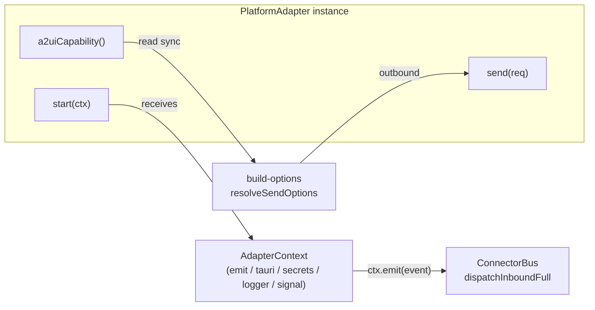
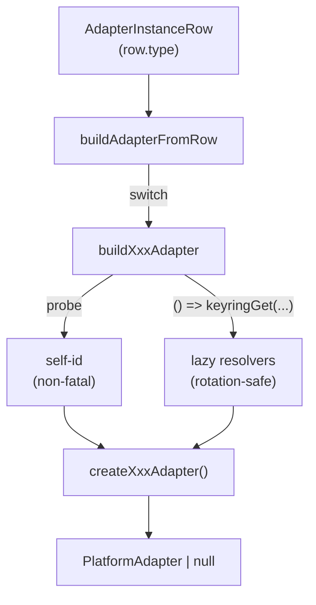

# 适配器模型与注册表

<Status variant="stable" />

<TLDR>
  每个平台连接器都实现单一的 **`PlatformAdapter`** 接口（`types/connectors/adapter.ts:135`）：生命周期
  （`start`/`stop`/`health`）、唯一一个非可选的变更方法（`send`）、一组可选变更方法
  （`streamReply?`/`edit?`/`delete?`/`setTyping?`/`uploadFile?`/`fetchHistory?`），以及**必需且同步**的
  `a2uiCapability()`（`types/connectors/adapter.ts:180`）—— 它在热发送路径上被 `build-options` 读取。运行时
  **工厂** `buildAdapterFromRow(row)`（`lib/connectors/adapter-registry.ts:42`）按 `row.type` 在 11 个构建器
  间分发，每个构建器探测自身 self-id 并装配**惰性凭据解析器**（轮换安全）。一套并行的**纯展示注册表**
  `CONNECTOR_METADATA`（`lib/connectors/adapter-metadata.ts:42`，16 行）为 Discover 页面供数 —— 其 `status`
  与运行时实况刻意解耦。OAuth 完成逻辑存于一个 2 项的 Map（`lib/connectors/oauth-registry.ts:27`），去重与
  自我检测则通过 `MentionAccumulator`（`lib/connectors/adapters/_shared/mention-extractor.ts:24`）共享。
</TLDR>

<StatGrid>
  <Stat label="运行时构建器" value="11" hint="buildAdapterFromRow switch (adapter-registry.ts:45)" />
  <Stat label="A2UI 组件种类" value="37" hint="A2UI_COMPONENT_KINDS (capability.ts:54)" />
  <Stat label="传输模式" value="7" hint="TransportMode union (adapter.ts:6)" />
  <Stat label="平台种类" value="16" hint="ALL_PLATFORM_KINDS (platform-kind.ts:7)" />
  <Stat label="能力标志" value="24" hint="ALL_CAPABILITIES (capability.ts:3)" />
  <Stat label="元数据行" value="16" hint="CONNECTOR_METADATA (adapter-metadata.ts:42)" />
  <Stat label="OAuth 处理器" value="2" hint="slack + lark (oauth-registry.ts:36,55)" />
</StatGrid>

## PlatformAdapter 契约

每个连接器 —— 无论内置还是插件贡献 —— 都实现 `interface PlatformAdapter`
（`types/connectors/adapter.ts:135`）。该契约刻意保持最小：稳定的 `meta`/`id`、三方法的生命周期、**唯一一个**
非可选的变更方法（`send`），以及一次必需的同步能力探测。其余一切都是可选的，并在调用点做特性检测。

| 成员 | 行号 | 必需 | 说明 |
| --- | --- | --- | --- |
| `meta` | `adapter.ts:136` | 是 | `AdapterMeta`（`adapter.ts:15`）：`type`、`displayName`、`version`、`capabilities[]`、`transportModes[]`、`configSchema`（draft-07，驱动自动表单） |
| `id` | `adapter.ts:137` | 是 | 持久化的实例 id |
| `start(ctx)` | `adapter.ts:139` | 是 | 接收 `AdapterContext`；长循环须遵从 `ctx.signal` |
| `stop()` | `adapter.ts:140` | 是 | 拆卸 |
| `health()` | `adapter.ts:141` | 是 | `AdapterHealth`（`adapter.ts:27`），`state` ∈ `starting \| running \| degraded \| down` |
| `send(req)` | `adapter.ts:143` | **是** | 唯一非可选的变更方法 —— 权威的最终消息始终经此流出 |
| `streamReply?(req)` | `adapter.ts:159` | 否 | `StreamReplyRequest`（`adapter.ts:82`）；仅 **WeCom** 实现（原地流式帧） |
| `edit?` | `adapter.ts:160` | 否 | 按 id 编辑既有消息 |
| `delete?` | `adapter.ts:161` | 否 | 删除既有消息 |
| `setTyping?` | `adapter.ts:162` | 否 | 输入中指示 |
| `uploadFile?` | `adapter.ts:163` | 否 | 返回 `AdapterAttachmentRef` |
| `fetchHistory?` | `adapter.ts:164` | 否 | `AsyncIterable<NormalizedInboundEvent>` 回填 |
| `refreshCredentials?` | `adapter.ts:168` | 否 | 不重启地轮换令牌 |
| `a2uiCapability()` | `adapter.ts:180` | **是** | 同步；由 `build-options.ts:resolveSendOptions` 读取以注入能力感知的提示词 |
| `platformSkillCapabilities?()` | `adapter.ts:193` | 否 | 仅 **Lark** 实现（ADR-0026 技能族） |

`send` 是持久脊柱；`streamReply` 是尽力而为的实时预览，与平台侧 stream id 共享，因此 `send` 在不重复消息的
前提下收尾该流 —— 而一个抛错的 `streamReply` 绝不能打断本轮（`adapter.ts:157`）。

### AdapterContext

`start(ctx)` 接收一个 `AdapterContext`（`types/connectors/adapter.ts:88`）—— 适配器通向宿主的唯一窗口：

- `emit(event)`（`adapter.ts:90`）—— 向总线推送一个 `NormalizedInboundEvent`（入站入口）。
- `tauri.*`（`adapter.ts:92-100`）—— `httpRequest`、`openWs`、`fetchAttachment`、`bindWebhookRoute`、
  `unbindWebhookRoute`、`publicBaseUrl`；每一个都包装一条 Rust `connectors_*` 命令。
- `secrets`（`adapter.ts:101`）—— 作用于实例的 keyring `get`/`set`/`delete`/`list`。
- `logger`（`adapter.ts:102`）—— 带前缀的 console 日志器。
- `signal`（`adapter.ts:104`）—— 适配器停止时触发中止。
- `adapterId`（`adapter.ts:106`）—— 便捷访问器。

七个 `TransportMode` 取值（`adapter.ts:6`）—— `longpoll | webhook | reverse-ws | forward-ws |
gateway | imap-smtp | stub` —— 描述适配器如何接收入站流量；`stub` 仅用于测试。



## 能力与 A2UI 矩阵

两套标志系统并存。`ALL_CAPABILITIES`（`types/connectors/capability.ts:3`）是粗粒度的布尔汇总 ——
`send.text`/`markdown`/`html`/`image`/`voice`/`video`/`file`/`card`/`poll`/`location`/`reply`/`emoji`/`mention`/`thread`/`reaction`、
A2UI 汇总位 `send.a2ui`（`capability.ts:25`）、变更类 `edit`/`delete`/`typing`/`history.fetch`
（`capability.ts:27-30`），以及平台特定的逃生舱口 `rich-markdown.telegram`/`.slack` 与
`rich-card.lark`/`.slack`（`capability.ts:32-35`）。`hasCapability(flags, cap)`（`capability.ts:40`）是
成员检查。

细粒度的投影计划是 **A2UI 矩阵**：`A2UI_COMPONENT_KINDS`（`capability.ts:54`）枚举全部 **37** 种组件，
每种映射到一个 `A2UIComponentSupport`（`capability.ts:124`），取值为 `native | simulated | fallback |
unsupported`。一份完整的 `A2UICapabilityMatrix`（`capability.ts:126`）即
`Readonly<Record<A2UIComponentKind, A2UIComponentSupport>>`。

**关键不变量**：适配器只声明它能原生处理的部分，每个未提及的种类默认落到 `fallback` —— 于是助手总能发出
A2UI，不被支持的组件退化为纯文本镜像而非凭空消失：

```ts
// types/connectors/capability.ts:133-144
export function buildA2UICapabilityMatrix(
  partial: Partial<Record<A2UIComponentKind, A2UIComponentSupport>>
): A2UICapabilityMatrix {
  const out: Record<A2UIComponentKind, A2UIComponentSupport> = {} as Record<...>
  for (const kind of A2UI_COMPONENT_KINDS) {
    out[kind] = partial[kind] ?? "fallback" // unmentioned ⇒ fallback
  }
  return Object.freeze(out)
}
```

当某段无法原生发送时，`defaultDegradeChain(from)`（`capability.ts:168`）给出保守的回退顺序。对 A2UI 而言
是 `a2ui → card → markdown → text`（`capability.ts:191`）—— `card` 居中是因为 Lark/Slack 能把退化后的
界面裹进通用卡片；纯文本永远是兜底。`PlatformKind`（`platform-kind.ts:33`）经 `ALL_PLATFORM_KINDS`
（`platform-kind.ts:7`，含 `email`/`kook`/`line`/`mattermost`/`github`）枚举 **16** 种，由
`isPlatformKind`（`platform-kind.ts:35`）守卫。

## 运行时工厂：buildAdapterFromRow

`buildAdapterFromRow(row)`（`lib/connectors/adapter-registry.ts:42`）是类型联合的运行时对偶 —— 它按
`row.type` 分发到每个平台的某个 `buildXxxAdapter`，对任何没有构建器的类型返回 `null`（并打印警告）：

```ts
// lib/connectors/adapter-registry.ts:42-68
export async function buildAdapterFromRow(row: AdapterInstanceRow): Promise<PlatformAdapter | null> {
  switch (row.type) {
    case "telegram": return buildTelegramAdapter(row)
    case "discord":  return buildDiscordAdapter(row)
    case "slack":    return buildSlackAdapter(row)
    case "lark":     return buildLarkAdapter(row)
    case "onebot":   return buildOneBotAdapter(row)
    case "wecom":    return buildWeComAdapter(row)
    case "wechat-personal": return buildWechatPersonalAdapter(row)
    case "matrix":   return buildMatrixAdapter(row)
    case "qq-official": return buildQQOfficialAdapter(row)
    case "wechat-oa": return buildWechatOaAdapter(row)
    case "dingtalk": return buildDingTalkAdapter(row)
    default: console.warn(`[adapter-registry] unsupported adapter type: ${row.type}`); return null
  }
}
```

每个构建器做两件事：**self-id 探测**与**惰性凭据解析器**。

| 构建器 | 行号 | self-id 探测 |
| --- | --- | --- |
| `buildTelegramAdapter` | `:81` | `getMe` → `selfId` |
| `buildDiscordAdapter` | `:119` | `/users/@me` → `selfId` |
| `buildSlackAdapter` | `:153` | `auth.test` → `user_id`；`socket-mode` 对 `events-api-webhook` |
| `buildLarkAdapter` | `:205` | `bot/v3/info` → `selfBotOpenId`，回写到行（`:249`） |
| `buildOneBotAdapter` | `:293` | 无 —— `reverse-ws`/`forward-ws`，可选 bearer |
| `buildWeComAdapter` | `:321` | 无 —— `aibotid` 在首条入站帧到达 |
| `buildWechatPersonalAdapter` | `:338` | 无 —— iLink 仅回复型长轮询 |
| `buildMatrixAdapter` | `:358` | `matrixWhoami` → `selfId` |
| `buildQQOfficialAdapter` | `:389` | 无 —— id 在网关 READY 到达 |
| `buildWechatOaAdapter` | `:409` | 无 —— id 在首条入站消息到达 |
| `buildDingTalkAdapter` | `:429` | 无 —— Stream 模式；令牌按需铸造 |

self-id 探测失败是**非致命**的：适配器仍会启动，但自我提及检测可能漏掉隐式称呼。凭据从不被急切捕获 ——
它们是闭包于 keyring 之上的**惰性解析器**，因此轮换后的密钥会在下次调用时被采用，无需重启：

```ts
// lib/connectors/adapter-registry.ts:104-110 (telegram)
return createTelegramAdapter({
  id: row.id,
  displayName: row.displayName,
  transport,
  botToken: () => connectorsKeyringGet(row.id, "botToken").then((t) => t ?? ""), // lazy
  selfId,
})
```

Lark 还会把成功的 `selfBotOpenId` 探测回写到 `row.settings`（`:249-258`），让冷启动跳过该 API 调用；UI
触点 `refreshSelfBotOpenId(adapterId)`（`:470-538`）在静默启动探测失败时重新探测并重新持久化。



## AdapterContext 与 ctx.emit

生产环境的 `AdapterContext` 由 `buildAdapterContext(input)`（`lib/connectors/adapter-context.ts:123`）装配。
其 `emit` 是唯一的入站入口 —— 它把每个事件直接送入总线的完整流水线：

```ts
// lib/connectors/adapter-context.ts:128-134
emit: async (event: NormalizedInboundEvent) => {
  // Route every inbound event through the bus's full pipeline:
  // dedup → adapter lookup → override → policy → route → handler.
  await bus.dispatchInboundFull(event)
},
```

`secrets` 包装 keyring 的 `get`/`set`/`delete`/`list` 命令（`adapter-context.ts:78-91`），`logger` 是带
前缀的 console（`:60-76`），各 `tauri.*` 方法委托给 `connectors_*` Rust 命令。
`bindWebhookRoute`/`unbindWebhookRoute` 是已接线但未使用 —— 它们直接 `invoke`，因此若未来某个适配器确需
按路由注册，会抛出清晰的错误（`:145-153`）。

## 展示注册表 vs 运行时工厂

`adapter-metadata.ts` 是运行时工厂的**纯展示对偶**：`adapter-registry` 回答“为这一行构建适配器”，而
`CONNECTOR_METADATA`（`lib/connectors/adapter-metadata.ts:42`，16 行）回答“向用户介绍我们支持的每个平台”。
每个 `ConnectorMeta`（`:21`）携带 `type`、`iconName`、`status`（`stable | beta | planned`）、`oauth` 与
`richMessages`。查找经 `getConnectorMeta`（`:94`）/ `listConnectorMetadata`（`:98`），而 `findMetadataGaps`
（`:108`）使该表与 `ALL_PLATFORM_KINDS` 对齐。

这里的 `status` 与运行时实况**刻意解耦** —— 例如 `wechat-personal` 在 `adapters/wechat-personal/` 下确有
真实适配器，却被标为 `"planned"`（`:71`），因为 Discover 徽标的基准追踪的是 Phase-1 内置集，而非完整的
构建器集。Discover 页面消费该注册表；它从不导入工厂。

## OAuth 注册表

`oauth-registry.ts` 把 `PlatformKind` 映射到那个完成 OAuth 授权码交换并将凭据写入 keyring 的异步处理器。
`OAuthHandler`（`lib/connectors/oauth-registry.ts:22`）是 `(code, state) => Promise<void>`，`oauthRegistry`
（`:27`）是一个 `Map`。只有两个平台注册 —— **Slack**（`:36`）与 **Lark**（`:55`），各自隐藏在其处理器模块的
动态 import 之后。Telegram、Discord 与 OneBot 不使用 OAuth。`ConnectorDeepLinkRouter` 在校验 OAuth `state`
参数（形如 `<platform>:<adapterId>:<nonce>`）后调用已注册的处理器，处理器从中解码出 `adapterId`。

## 共享：MentionAccumulator

每个平台解析器都遍历不同的原生消息形状，但遍历后的归约 —— 去重加自我检测加规范返回类型 —— 是一致的，
由 `MentionAccumulator`（`lib/connectors/adapters/_shared/mention-extractor.ts:24`）持有。其
`constructor(selfId)`（`:29`）植入 self id；`add(id)`（`:36`）记录一个候选（对空值/重复为空操作，但在重复的
self-id 上仍翻转 `selfMentioned`）；`markSelfMentioned()`（`:55`）在没有 `@`-实体时强制标记自我提及（例如
回复一条由机器人撰写的消息）；`finalize()`（`:65`）返回总线消费的 `MentionDescriptor`。`mentionsFromIds(selfId, ids)`
（`:74`）是面向已有完整 id 列表的解析器的便捷封装。Discord、Lark、Slack 与 Telegram 解析器均使用它；
OneBot 内联完成该归约。

## 相关

<Cards>
  <Card title="内置适配器" href="./built-in-adapters" description="11 个具体构建器、各自的传输方式与各平台的特殊处理。" />
  <Card title="ConnectorBus" href="./connector-bus" description="ctx.emit 经 dispatchInboundFull 馈入的单例扇入/扇出。" />
  <Card title="AI 与 A2UI" href="./ai-and-a2ui" description="a2uiCapability() 如何塑造 build-options 提示词与富内容桥。" />
  <Card title="A2UI" href="../a2ui" description="该矩阵所投影的跨界面 A2UI 组件模型。" />
  <Card title="入站门控" href="./inbound-gating" description="ctx.emit 之后运行的策略流水线。" />
  <Card title="UI 与插件" href="./ui-and-plugins" description="Discover 页面与插件贡献的适配器。" />
</Cards>
