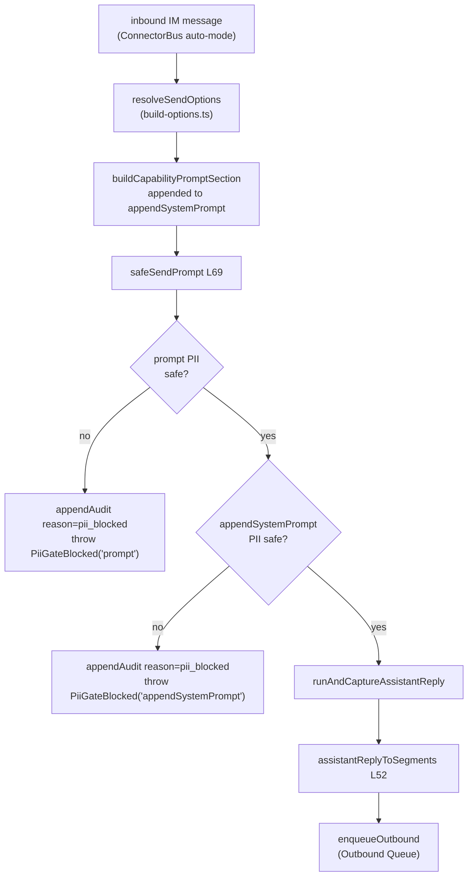
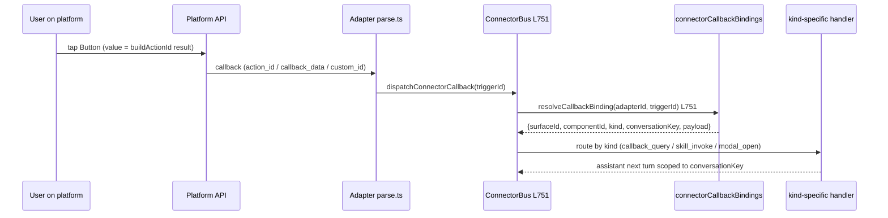
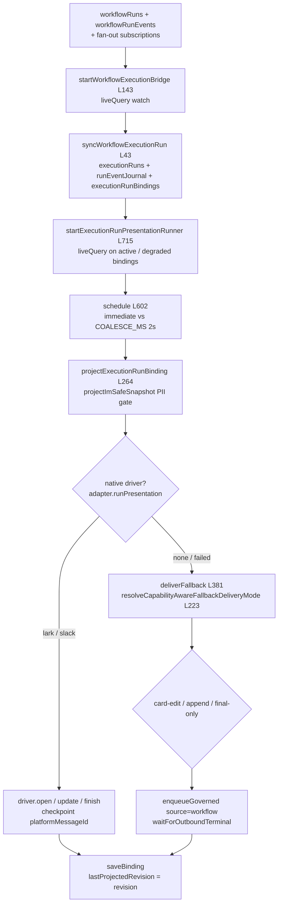

# 自动模式 AI 循环与 A2UI 桥

<Status variant="stable" />

<TLDR>
当一条入站 IM 消息在没有人在环的情况下驱动一次 Claude 回合时，连接器子系统无法复用经人工审阅的聊天输入框路径 —— 于是 `safeSendPrompt`（`lib/connectors/ai-loop/safe-send-prompt.ts:69`）用 `lib/twin/ingest/` 强制执行的同一条 PII 红线包裹 `runAndCaptureAssistantReply`：遍历 prompt 与 build-options 的 `appendSystemPrompt`，对每段调用 `hasNoLeakingPii`，并在调用模型**之前中止**（写入一条 `pii_blocked` 审计行）而非脱敏 —— 因为没有人来决定要删掉什么。捕获到的回复由 `assistantReplyToSegments`（`a2ui-to-segments.ts:52`）投影为可传输的 segment；入站平台富内容由 `projectInboundToA2UI`（`inbound-a2ui-dispatch.ts:26`）投射为给 Inbox 渲染器用的 `InboundA2UIBlock`；插件通过 `createA2UIBuilder`（`surface-builder.ts:315`）声明式地编写 surface；build-options 解析器追加一段感知能力的降级说明（`buildCapabilityPromptSection`，`capability-evaluator.ts:30`）；交互组件通过 `buildActionId` / `recordCallbackBinding` / `resolveCallbackBinding`（`_shared/a2ui-mapper.ts`）往返；工作流 / 团队运行经 `startWorkflowExecutionBridge`（`lib/execution/workflow-bridge.ts:143`）+ `startExecutionRunPresentationRunner`（`lib/connectors/run-presentation/runner.ts:715`）以持久化运行卡片抵达 IM。
</TLDR>

<StatGrid>
  <Stat label="PII 门" value="中止，不脱敏" hint="无人在环 → 无脱敏决策" />
  <Stat label="A2UI 组件种类" value="37" hint="A2UI_COMPONENT_KINDS" />
  <Stat label="回调绑定 TTL" value="30d" hint="DEFAULT_CALLBACK_BINDING_TTL_MS" />
  <Stat label="附件 LRU" value="500 MB" hint="LRU_TOTAL_CAP_BYTES，默认 7d TTL" />
</StatGrid>

本页是连接器流水线的**中段**。[ConnectorBus](./connector-bus) 决定*是否*回复；本层决定*说什么*以及*如何为该渠道塑形*；一切都以调用 `enqueueOutbound` 收尾并交接给[出站队列](./outbound-queue)。A2UI 词汇本身见 [A2UI](../a2ui)；由 IM 触发的工作流运行见[可视化工作流](../visual-workflows)。在更大的栈中的位置见[子系统总览](./index)。

## 自动模式循环：safeSendPrompt

渲染端聊天输入框在任何内容离开设备前都经人工审阅，所以它无需亲自执行 PII 红线。IM 驱动的自动模式循环没有这样的审阅者 —— 于是 `safeSendPrompt` 重新施加 `lib/twin/ingest/` 与 `lib/goal/` 强制执行的同一道门：*原始用户提供的文本在离开设备前必须通过 `hasNoLeakingPii`*。它返回与 `runAndCaptureAssistantReply` 相同的形状，因此调用方可透明替换。

门分三步执行。第 1 步遍历入站 prompt；第 2 步遍历 build-options 注入的 `appendSystemPrompt` 尾巴（能力上下文、twin 运行时提示）；第 3 步委派。关键在于：泄漏会**中止**而非脱敏 —— `PiiGateBlocked`（`safe-send-prompt.ts:46`，按 `source: "prompt" | "appendSystemPrompt"` 区分）在写入 `pii_blocked` 审计行后抛出，使运维能看到自动回复为何从未触发。

```ts
// lib/connectors/ai-loop/safe-send-prompt.ts:75 — Step 1: prompt PII gate
if (!isPiiSafeSendContent(prompt)) {
  await appendAudit({
    adapterId: opts.adapterId,
    kind: "adapter.error",
    at: Date.now(),
    conversationKey: opts.conversationKey,
    reason: "pii_blocked",
    message: "auto-mode prompt rejected by PII gate before sendPrompt",
  })
  throw new PiiGateBlocked("prompt", opts.adapterId, opts.conversationKey)
}
```

`isPiiSafeSendContent`（`safe-send-prompt.ts:123`）通过 `hasNoLeakingPii`（来自 `@cognia/redact`）遍历 `SendContent` 联合体里的每个 `type: "text"` 块 —— 图片/文件块被跳过，因为该门只针对可泄漏文本；二进制附件改由 `attachments.rs` 在磁盘上加密。收敛路径为：build-options 的 `resolveSendOptions` 组装 prompt 与能力尾巴 → `safeSendPrompt` 门控 → `runAndCaptureAssistantReply` 跑回合 → `assistantReplyToSegments` 投影捕获的回复 → `enqueueOutbound` 交接给队列。



## 出站投影：assistantReplyToSegments

聊天页把 A2UI 部件作为渲染端 React 状态消费；IM 出站路径需要它们作为可传输的 `MessageSegment`。`assistantReplyToSegments`（`a2ui-to-segments.ts:52`）桥接二者。A2UI surface **优先**，按创建顺序排列（`reply.a2uiSurfaceOrder ?? Object.keys(surfaces)`），每个由 `buildA2UISegment` 包裹。剩余的去空白 markdown 追加为单个 `{ type: "markdown" }` segment（`a2ui-to-segments.ts:67`）；若回复既无文本也无 surface，则发出一个空的 `{ type: "text" }` segment（`a2ui-to-segments.ts:72`），使 runner 始终有内容可派发 —— 空的 `OutboundRequest` 会被当作畸形而拒绝。

`buildA2UISegment`（`a2ui-to-segments.ts:84`）烤制 `plainTextMirror`：模型提供的 `widget.fallbackText` 优先于自动生成的 `generatePlainTextMirror`。同一构造器被 `scheduled-outbound.ts` 以及运行呈现 runner 的后备路径（`run-presentation/runner.ts:411`）直接复用，用于正常助手回复路径之外发出的 surface。运行时在 `runtime.ts:437` 调用 `assistantReplyToSegments`。

## 入站投影：projectInboundToA2UI

`projectInboundToA2UI`（`inbound-a2ui-dispatch.ts:26`）是总线侧的入站投影。总线对每条入站 `create` 事件调用它一次，传入平台 kind 与原始平台负载（来自 Slack rich_text / 飞书互动卡片 / Telegram 标题 + 内联键盘 / Discord embed + components）；它派发到匹配的各平台 mapper（`../<platform>/inbound-to-a2ui.ts`），返回一个 `InboundA2UIBlock`（`inbound-a2ui-types.ts:50`）或 `null`。该 block 会被持久化到 `StoredMessage.metadata.inboundA2UI`，并由 `components/chat/message-parts/inbound-a2ui-renderer.tsx` 遍历，使 Inbox 展示平台原生的富结构。mapper 尽力而为：nullish 负载、未映射的平台，或抛异常的 mapper 都归结为 `null`，总线随即回退到纯文本渲染。

> 本页的早期修订声称有一个 `segmentsToA2UI`（`segments-to-a2ui.ts`）模块，是每个平台解析器都会调用的规范入站投影。这是不准确的 —— 该模块零调用者，现已**作为死代码移除**。真实的入站路径是 `projectInboundToA2UI` → `InboundA2UIBlock`，且它**不是**出站 `assistantReplyToSegments`（`a2ui-to-segments.ts`）的逆操作：出站把助手 surface 扁平化为可传输的 `MessageSegment[]`，入站则把原始平台负载提升为紧凑的 `InboundA2UIBlock` —— 二者是各自独立的投影，并非一对互逆。

## 插件 Surface 构造器

希望通过 `ctx.connectors.send` 发送富交互内容的插件，需要一个 `content` 为有效**按 id 索引**组件图的 `A2UIMessageSegment`。手写该图（按 id 索引、连线子引用、铸造镜像）正是 `surface-builder.ts` 要消除的摩擦。构造是**纯且无门控**的 —— 它馈入的有副作用的 `send()` 仍由 `connectors:send` 门控。

`validateA2UISurfaceComponents`（`surface-builder.ts:116`）断言 id 唯一、解析根，并在任何悬空子引用上抛出 `A2UISurfaceBuildError`（`surface-builder.ts:48`）：

```ts
// lib/connectors/a2ui-bridge/surface-builder.ts:135 — root resolution
const resolvedRoot = rootId ?? (ids.has("root") ? "root" : components[0].id)
if (!ids.has(resolvedRoot)) {
  throw new A2UISurfaceBuildError(`rootId "${resolvedRoot}" is not among the components`)
}
```

纯构造器的流水线：`buildA2UISurfaceContent`（`surface-builder.ts:158`）组装按 id 索引的 `A2UISegmentContent` → `buildA2UIMessageSegment`（`surface-builder.ts:182`）将其包裹为可传输 segment → `buildA2UIOutboundRequest`（`surface-builder.ts:195`）铸造 `surfaceId` + 幂等键并追加可选的尾部 markdown，产出可直接交给 `send()` 的 `OutboundRequest`。`a2uiComponent` 工厂集（`surface-builder.ts:218`）提供 13 个有类型构造器 —— `text` / `button` / `card` / `row` / `column` / `alert` / `image` / `link` / `select` / `textField` / `list` / `divider` / `badge` —— 每个返回规范的 `A2UIComponent` 子类型，因此输出对渲染器与映射器即用、无需再塑形。`createA2UIBuilder()`（`surface-builder.ts:315`）将它们打包成 `ctx.connectors.a2ui` 命名空间。

## 感知能力的降级

并非每个平台都渲染每种 A2UI 种类。每个适配器声明一份 `A2UICapabilityMatrix`（`../<platform>/capability.ts`），把 `A2UI_COMPONENT_KINDS` 里的每个种类评为 `native` / `simulated` / `fallback` / `unsupported`；`componentKindsByLevel(matrix, level)`（`types/connectors/capability.ts:177`）是对它的唯一查询。桥接层里刻意**没有**逐 surface 的评估器 —— 每个适配器在渲染时于自己的出站映射器（`../<platform>/a2ui-mapper.ts`、飞书 `card.ts`、Slack `block-kit.ts`）内按自身矩阵分支，共享的 `generatePlainTextMirror` 为映射器无法原生绘制的一切保证尽力的镜像。桥接层拥有的是*提示词侧*那一半：`buildCapabilityPromptSection`（`capability-evaluator.ts:30`）把矩阵渲染成精简的系统提示段落，由 `build-options.ts:resolveSendOptions`（`build-options.ts:1935`）追加到 `appendSystemPrompt`：

```ts
// lib/connectors/a2ui-bridge/capability-evaluator.ts:35 — one bullet per support level
const native = componentKindsByLevel(matrix, "native")
const simulated = componentKindsByLevel(matrix, "simulated")
const fallback = componentKindsByLevel(matrix, "fallback")
const unsupported = componentKindsByLevel(matrix, "unsupported")

const lines: string[] = [
  `This conversation is delivered via ${platform}. The platform supports a limited A2UI subset:`,
]
if (native.length > 0) {
  lines.push(`- Renders natively: ${native.join(", ")}.`)
}
```

该段落告知助手哪些种类原生渲染、哪些仅经多步 UX 可用（不要假设同回合同步回复）、哪些降级为纯文本、哪些根本不能发出。一个可选的 `skillCapabilities` 条目声明本渠道可服务的内置技能族，使助手跳过逐工具探测。（本模块早前还有一条逐 surface 的 `evaluateSurfaceAgainstCapability` / `CapabilityEvaluation` 最坏情况阶梯；它没有运行时消费者，已于 2026-08-18 移除。）

## 回调往返

交互组件需要让按钮点击找回其源 surface。每个平台映射器调用 `buildActionId(surfaceId, componentId, action)`（`_shared/a2ui-mapper.ts:119`），返回平台在回调时送回的带命名空间的值（Slack `action_id`、Telegram `callback_data`、Discord `custom_id`、飞书 `value.tag`）：

```ts
// lib/connectors/adapters/_shared/a2ui-mapper.ts:119
export function buildActionId(surfaceId: string, componentId: string, action: string): string {
  return `a2ui:${surfaceId}:${componentId}:${action}`
}
```

Telegram 把 `callback_data` 限制为 64 字节，于是 `truncateActionId`（`_shared/a2ui-mapper.ts:129`）对超长 id 做 SHA-1 哈希用于线上，而完整 id 留在绑定行里。`recordCallbackBinding`（`_shared/a2ui-mapper.ts:171`）以 `${adapterId}:${actionId}` 为键 upsert 一条 `connectorCallbackBindings` 行，`kind` 默认 `"callback_query"`，`expiresAt` 默认 `createdAt + DEFAULT_CALLBACK_BINDING_TTL_MS`（30d）。返程时总线（`bus.ts:751`）反查绑定：

```ts
// lib/connectors/adapters/_shared/a2ui-mapper.ts:216 — reverse lookup
export async function resolveCallbackBinding(
  adapterId: string,
  actionId: string
): Promise<ConnectorCallbackBindingRow | undefined> {
  return getDb()
    .connectorCallbackBindings.where("[adapterId+actionId]")
    .equals([adapterId, actionId])
    .first()
}
```

过期行由每日清扫 `cleanupExpiredCallbackBindings`（`lib/connectors/callback-binding-cleanup.ts:60`）回收，由持久化的家务时钟（`housekeeping-scheduler.ts:57`，任务类型 `connection:housekeeping:callback-bindings`）每 24 h 触发一次 —— 删除超过 `expiresAt` 的行，以及早于 `LEGACY_GRACE_MS`（60 d）的 TTL 前遗留行；`generatePlainTextMirror`（`_shared/a2ui-mapper.ts:255`）是各映射器共享的、内容驱动（非布局驱动）的后备。



## 执行桥与运行呈现 Runner

IM 内的工作流 / 团队运行实时呈现不再有专属的扇出循环。连接器引导（`lib/connectors/bootstrap/install-connector-runtime.ts:738-739`）背靠背启动的两个 runner 分担这项工作 —— 一个写入单一持久执行日志的**源桥**，以及一个拥有原生投射、合并、游标提交与后备的**呈现 runner**：

- **源桥** —— `startWorkflowExecutionBridge`（`lib/execution/workflow-bridge.ts:143`）用 `liveQuery` 监视 `workflowRuns` 连同每个运行的 `workflowRunEvents` 及其 `listForWorkflow` 扇出订阅，并对每行调用 `syncWorkflowExecutionRun`（`workflow-bridge.ts:43`）：创建一条持久的 `executionRuns` 行（`execution:workflow:<runId>`，按 `triggerKind` 取 kind `workflow` / `team` / `scheduled`），向 `runEventJournal` 追加 `plan.created` + `run.started` 及随后每个经 `mapWorkflowRunEvent` 映射的源事件，并按目的地各写一条 `executionRunBindings` 行 —— 触发方的 `triggeredBy.{adapterId, conversationKey}` 加上每个已启用的扇出订阅 —— 初始 `deliveryMode: "native"`、`lastProjectedRevision: 0`。它还启动 `startAgentStateExecutionBridge`，让 agent 运行落入同一份日志。
- **呈现 runner** —— `startExecutionRunPresentationRunner`（`lib/connectors/run-presentation/runner.ts:715`）用 `liveQuery` 监视状态为 `active` / `degraded` 的 `executionRunBindings`，一旦 `latestSnapshot.revision > binding.lastProjectedRevision` 便调度 `projectExecutionRunBinding`（`runner.ts:264`）—— 首个修订、终态状态与 `IMMEDIATE_EVENT_TYPES`（`run.started`、`step.started`、`interrupt.*`……）立即执行，其余按 `COALESCE_MS = 2 s` 合并（`schedule`，`runner.ts:602`）。一个 5 s 心跳（`heartbeatExecutionRunBinding`，`runner.ts:623`）刷新每个非终态绑定的耗时。

投射先跑 `projectImSafeSnapshot`（`runner.ts:179`，`hasNoLeakingPiiDeep`）—— 不安全的快照坍缩为不透明快照并审计 `pii_gate_blocked`。随后，若原生模式启用（kill switch `cognia-run-presentation-native-disabled` / `NEXT_PUBLIC_COGNIA_NATIVE_RUN_PRESENTATION=0`）且适配器暴露 `runPresentation` —— 飞书经 `createLarkRunPresentationDriver`（`lark-driver.ts:320`，卡片流式更新 + 带检查点的待定变更），Slack 经 `createSlackRunPresentationDriver`（`slack-driver.ts:51`，`plan_update` / `task_update` 分块）—— 驱动的 `open` / `update` / `finish` **原地更改同一张原生卡片**，并把 `platformMessageId` + 不透明状态检查点回写到绑定。任何驱动失败都会 `recordDegraded`（审计 `run_projection_degraded`）并落入 `deliverFallback`（`runner.ts:381`），其模式感知能力：

```ts
// lib/connectors/run-presentation/runner.ts:223 — capability-aware fallback mode
export function resolveCapabilityAwareFallbackDeliveryMode(input: {
  hasEditMethod: boolean
  messageEditing?: boolean | undefined
  appendActivity: boolean
  appendFallback?: boolean | undefined
}): FallbackDeliveryMode {
  return resolveFallbackDeliveryMode({
    canEdit: input.hasEditMethod && input.messageEditing !== false,
    appendActivity: input.appendActivity && input.appendFallback !== false,
  })
}
```

`card-edit`（适配器有 `edit` 且 `runtimeCapabilities.messageEditing !== false`）带 `editTargetMessageId` 重发 `buildRunActivitySurface` 卡片；`append` 在状态变化时新发一张卡片，否则至多每 `APPEND_UPDATE_INTERVAL_MS = 30 s` 一张（`shouldDeliverFallbackUpdate`，`runner.ts:235`）；`final-only` 只等终态快照。每次后备都汇入 `enqueueGoverned`（`delivery-gateway`），带 `source: "workflow"`、`sourceWorkflow: { …, nodeId: "run-projection" }` 与幂等键 `execution-run:<bindingId>:<revision>`，再 `waitForOutboundTerminal`，之后才经 `saveBinding` 提交游标（`lastProjectedRevision`）。

审批握手仍留在桥接层：`buildApprovalSurface`（`workflow-to-a2ui.ts:48`，由 `wf_run_workflow_by_name` 工具发出）采用不同的 action-id 命名空间 —— `WF_APPROVE_PREFIX = "wfapp:"` 与 `WF_CANCEL_PREFIX = "wfcan:"`（`workflow-to-a2ui.ts:25`）—— 使总线按前缀路由 `wf_approve` 与 `wf_cancel` 而无需嗅探 payload：

```ts
// lib/connectors/a2ui-bridge/workflow-to-a2ui.ts:49 — approve/cancel Card
const approveActionId = WF_APPROVE_PREFIX + input.bindingId
const cancelActionId = WF_CANCEL_PREFIX + input.bindingId
const safeSummary = (input.summary ?? "").trim()
const components: Record<string, unknown> = {
  root: {
    component: "Card",
    title: input.workflowName,
    children: safeSummary.length > 0 ? ["summary", "actions"] : ["actions"],
  },
```

早前与之相邻的逐步进度行 / 累积状态 / 终态摘要构建器（以及 `cognia://workflow-run/…` 深链）已于 2026-08-18 随 `workflow-progress-runner` 模块一并退役；运行卡片的时间线现在由 `formatRunActivityTimeline` / `buildRunActivitySurface`（`lib/connectors/activity/activity-to-a2ui.ts:131,172`）从持久日志渲染，驱动与后备路径共用。



## 附件缓存

入站媒体只拉取一次并复用。`fetchAttachment`（`attachment-fetcher.ts:65`）是缓存即恢复：它以 `[adapterId+remoteRef]` 为键查 `connectorAttachments` 行，命中未过期时**不触碰** Rust 直接返回：

```ts
// lib/connectors/attachment-fetcher.ts:73 — cache hit short-circuit
if (existing && !isExpired(existing, now)) {
  return {
    ref: { localUrl: existing.localPath, remoteRef: existing.remoteRef },
    cached: true,
  }
}
```

未命中（或 TTL 过期）时它调用 Tauri 的 `connectorsAttachmentFetch` 命令，以 `expiresAt = now + ttl`（默认 7 天，传 `0` 退出）upsert 该行，然后尽力运行一次 `runLruEviction(LRU_TOTAL_CAP_BYTES)`（`attachment-fetcher.ts:124`）—— 从最新往旧遍历、累加 `sizeBytes`，在累计超过 500 MB 上限后丢弃最旧的行。`pruneAttachmentsForAdapter`（`attachment-fetcher.ts:109`）在适配器移除时批量清除其行。Rust 侧（`src-tauri/src/connectors/attachments.rs`）掌管 SHA-256 缓存键与 AES-256-GCM 磁盘加密 —— 这正是 PII 门跳过二进制块的原因：它们从不以明文传输。

## 相关

<Cards>
  <Card title="ConnectorBus" href="./connector-bus" description="决定是否回复并经 dispatchConnectorCallback 路由入站回调的调度器。" />
  <Card title="出站队列与投递" href="./outbound-queue" description="每个被投影的 segment 的终点 —— 持久队列、重试、限流、原地编辑投递。" />
  <Card title="A2UI" href="../a2ui" description="本桥往返投影所依据的 A2UI 组件词汇、schema 与渲染器。" />
  <Card title="可视化工作流" href="../visual-workflows" description="其运行由执行桥镜像为持久执行运行、再交给运行呈现 runner 的工作流运行时。" />
  <Card title="内置适配器" href="./built-in-adapters" description="消费 buildActionId / 能力矩阵并发出原生富内容的各平台映射器。" />
  <Card title="适配器模型" href="./adapter-model" description="这些投影所面向的适配器接口 —— edit()、能力矩阵、parse.ts。" />
</Cards>
