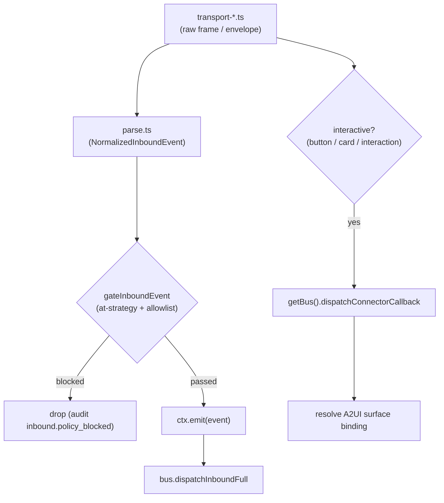

# 内置适配器

<Status variant="stable" />

<TLDR>
  十一个内置适配器随源码树内置在 `lib/connectors/adapters/<platform>/` 下。每个都遵循
  **相同的分解结构**——`parse.ts`（平台信封 → `NormalizedInboundEvent`）、`serialize.ts`
  （`OutboundRequest` → 平台调用）、一个或多个 `transport-*.ts` 驱动、一个 `capability.ts` 矩阵，
  以及一个把它们接在一起的 `index.ts` `createXxxAdapter(opts)` 工厂。入站只有一条
  路径：transport 产出原始帧，parser 将其归一化，`gateInboundEvent`（`lib/connectors/at-gate.ts`）
  施加 at-strategy + 允许/拦截名单门控，然后 `ctx.emit(event)` 落到 `bus.dispatchInboundFull`。
  **交互式回调绕过 emit**——内联按钮 / 卡片 / 交互直接调用
  `getBus().dispatchConnectorCallback(...)`，以便恢复 A2UI surface 绑定。Transport
  涵盖 long-poll、webhook、gateway（WSS）、reverse-WS、Socket Mode、Stream Mode 和 Matrix `/sync`。
</TLDR>

<StatGrid>
  <Stat label="内置适配器" value="11" hint="each 一个 createXxxAdapter 工厂" />
  <Stat label="深度文档化" value="4" hint="Telegram / Discord / Lark / OneBot" />
  <Stat label="Long-poll" value="telegram / matrix / wechat-personal" hint="游标驱动的 HTTP 循环" />
  <Stat label="Persistent WSS" value="discord / qq-official / lark / wecom / slack / dingtalk" hint="opcode、桥接、Socket Mode 或 Stream Mode" />
  <Stat label="Reverse-WS" value="onebot" hint="客户端拨向 cognia（Rust axum）" />
  <Stat label="仅 Webhook" value="wechat-oa" hint="Rust 验签 + 解密" />
</StatGrid>

这十一个适配器是 [`PlatformAdapter`](./adapter-model) 契约的具体实现。
本页讲解它们*共有*的部分、完整的 transport/签名矩阵，以及对四个参考适配器的深入剖析。
它们所依赖的 Rust 信令/解密平面记录在
[Rust 层](./rust-layer)；入站事件如何被门控见 [入站门控](./inbound-gating)；
每个适配器如何宣告富内容见 [AI 与 A2UI](./ai-and-a2ui)。

## 共有的分解结构

每个适配器目录都是同一形态，所以了解一个就了解了全部十一个：

| 文件 | 职责 |
| --- | --- |
| `parse.ts` | 平台事件信封 → `NormalizedInboundEvent`（sender、channel、mentions、segments）。 |
| `serialize.ts` | `OutboundRequest` → 平台 API 调用（文本、媒体、reactions、edits）。 |
| `transport-*.ts` | 连接驱动（long-poll 循环、gateway WS 客户端、webhook 订阅者……）。 |
| `capability.ts` | 该平台的静态能力标志 + A2UI 能力矩阵。 |
| `index.ts` | 把上述一切组装成 `PlatformAdapter` 的 `createXxxAdapter(opts)` 工厂。 |

签名验证（在存在的地方）位于 **Rust** 中（`src-tauri/src/connectors/sigverify/*`），因为
静态导出的限制意味着没有 Next.js HTTP 服务器来接收 webhook——axum 服务器拥有 socket，
并通过 Tauri 事件把已验签的帧交给 TS。

`buildAdapterFromRow`（[adapter-model](./adapter-model)）内部的 `buildXxx` 步骤通过
keyring resolvers（惰性、rotation-safe）解析凭据，通过 identity probe 解析 bot 自身的 id，然后调用工厂。

### 入站路径（每个适配器都是同一条路径）



这个分流是 load-bearing 的：**普通消息**走门控和 `ctx.emit`；**交互式回调**
（`callback_query`、`INTERACTION_CREATE`、`im.interactive_message.action_triggered_v1`……）跳过门控并调用
`dispatchConnectorCallback`，以便 bus 能恢复出站时写入的 `surfaceId` / `componentId`
并驱动下一个 assistant 回合。

## Transport 与签名矩阵

| platform | transport (file) | signature / auth (file / Rust) | self-id resolution | notable caps |
| --- | --- | --- | --- | --- |
| **telegram** | longpoll `getUpdates` 游标 (`transport-longpoll.ts`) 或 webhook | `X-Telegram` secret-token (Rust `sigverify/telegram.rs`) | `getMe` → `result.id` | 回复 / 编辑 (`editMessageText`) / 删除 / react (`setMessageReaction`)；TextField = 模拟 ForceReply |
| **discord** | Gateway v10 WSS (`gateway-client.ts`, opcodes / IDENTIFY / RESUME / heartbeat) | `Authorization: Bot`；Rust Ed25519 验签器已存在，但仅为未来 webhook transport 预留 | READY `user.id`（或 `/users/@me`） | 回复 / 编辑 / 删除 / react / fetchHistory；embeds + ActionRow；模拟 modal |
| **lark** | long-connection (Rust `lark_ws.rs` protobuf, TS `transport-long-conn.ts` 轻量消费者) 或 webhook | `tenant_access_token` Bearer (`auth.ts`) + webhook AES-CBC + verification_token (Rust `sigverify/lark.rs`) | `bot/v3/info` → `open_id` 缓存 | 最丰富的卡片 (`rich-card.lark`) 交互式卡片 2.0；bot-menu 快捷命令 |
| **onebot** | reverse-WS (Rust `ws_server.rs`, `transport-reverse-ws.ts`) 或 forward-WS | 可选 bearer，**无签名** | 首个事件 `self_id` | 回复 / 删除 (recall) / react (NapCat `set_msg_emoji_like`) / fetchHistory (v11)；**无**编辑 / markdown / 卡片（交互 → plainTextMirror 尾部）；v11/v12 自动检测 |
| **slack** | Socket Mode WSS (`transport-socket-mode.ts`) 或 events-api webhook | bot `xoxb` + app `xapp` + webhook HMAC (Rust `sigverify/slack.rs`) | `auth.test` → `user_id` | `rich-card.slack` Block Kit + `rich-markdown.slack`；最丰富的原生 A2UI 集 |
| **qq-official** | Gateway WSS (`gateway-client.ts`, Discord-clone opcodes) 或 webhook（Rust Ed25519 验签，`transport-webhook.ts`） | app access token QQBot (`auth.ts`；registry 注入 `clearTokenCache`，401/403 与 gateway `INVALID_SESSION` 时驱逐) | gateway READY | 仅文本回复（被动 `msg_seq` 由 idempotencyKey 推导）；`delete`（按场景撤回 —— `platformMessageId` 为 `scene:sceneId:id`）；`typing`（仅 C2C，`msg_type 6 input_notify`，≤4 个被动名额）；`send.reaction`（仅 channel 场景）；A2UI 全部 fallback（模板需审批） |
| **wecom** | 通用 Rust WS 桥 `ws_client.rs` (`protocol.ts` plain-JSON `aibot_subscribe` + 30s ping) | `botId` + `secret`，**无**加密 / 签名 | 首帧的 `aibotid` | **streamReply（唯一实现）**；`send.card` template_card；无编辑 / 删除 / 历史 |
| **wechat-oa** | 仅 webhook (Rust `wechat_oa_handler` 验签 + 解密, `transport-webhook.ts` 产出 `{xml}`) | token + EncodingAESKey, GET signature + POST msg_signature + AES (Rust `sigverify/wechat.rs`) | 首条消息 id | 仅文本；`typing`（`custom/typing` Typing / CancelTyping，45015 / 45047 静默）；48h 客服 (customer-service) 窗口 (`errcode 45015` 不可重试)；无 delete / edit / history |
| **wechat-personal** | HTTP long-poll iLink (~35s 游标, `protocol.ts` + index 循环) | iLink `bot_token` QR-login, 回显 `context_token`，**无**主动发送 | login session id | 仅回复文本 + 用于编号回复的 numeric-action-registry；`ret -14` session 过期 |
| **dingtalk** | Stream Mode WSS (`stream-client.ts`, gateway ticket + ack + ping) | AppKey / AppSecret = Stream clientId / secret + OpenAPI app access token (`auth.ts`) | `chatbotUserId` 可选 selfId | markdown-first；出站 `oToMessages/batchSend` + `groupMessages/send` sampleMarkdown；`delete`（经 `groupMessages/recall` / `otoMessages/batchRecall` 撤回 —— `platformMessageId` = `dt:<scope>:<robotCode>:<openConversationId>:<processQueryKey>`，session-webhook 发送不可撤回）；每条入站 `selfMentioned`；模拟 Button |
| **matrix** | `/sync` long-poll (`transport-sync.ts`, `next_batch` 游标, 经 Tauri proxy 的 HTTP) | access token Bearer (`auth.ts` `normalizeHomeserver`)，**无**签名 | whoami → `@bot:hs` + `device_id` | 回复 / 编辑 (`m.replace`) / 删除 (redaction) / react (`m.annotation`) / thread / typing；HTML `formatted_body`；原生 `m.image` / `m.file` / `m.audio` / `m.video` 媒体上传；经 reply-correlation 模拟 Button / Select / TextField |

> `transportModes` meta 字段写 `gateway` 的地方涵盖任意持久 WS 驱动——Discord/QQ opcode
> gateway、Lark long-connection、WeCom WS 桥和 Slack Socket Mode 都报告 `gateway`；真正的 long-poll
> 驱动（Telegram、Matrix、WeChat-Personal）报告 `longpoll`；DingTalk 也因历史上的 outbound-dialing bucket 报告 `longpoll`，但真实平台传输是 Stream Mode WSS；WeChat-OA 报告 `webhook`。

## Telegram

工厂 `createTelegramAdapter(opts)`（`lib/connectors/adapters/telegram/index.ts:52`）。`start()`
（`index.ts:132`）按 `opts.transport` 选择信源：long-poll（`startLongPoll`）或 webhook
（`startWebhookTransport`）。drive 循环把每个 update 分三路路由：

1. `update.callback_query` → `parseTelegramCallbackQuery` → `dispatchConnectorCallback` + best-effort
   `answerCallbackQuery`（`index.ts:156-175`）。
2. 匹配未决 ForceReply 绑定的回复 → `parseTelegramForceReplyCorrelation` →
   `dispatchConnectorCallback`，`actionType:"input"`（`index.ts:183-198`）。
3. 否则 `parseTelegramUpdate` → `gateInboundEvent` → `ctx.emit`（`index.ts:201-207`）。

**Parse 管线。** `parseTelegramUpdate`（`parse.ts:676-717`）对 update 信封进行解复用：
`edited_message` / `edited_channel_post` → `kind:"edit"` 带 `replacesMessageId`；`message_reaction` →
`reactionToEvent` 系统事件；`callback_query` → `null`（在回调通道上处理）；否则
`message`/`channel_post` 由 `messageToEvent`（`parse.ts:391-469`）投影，它会调用 `buildConversationKey`、
`detectMentions`（共享 `MentionAccumulator`）和 `buildSegments`（媒体 → `tg://file/<file_id>` URL）。

特征片段——让 `getUpdates` 实现 exactly-once 的 long-poll 游标推进：

```ts
// lib/connectors/adapters/telegram/transport-longpoll.ts:76-81
attempts = 0
for (const update of body.result) {
  if (opts.signal.aborted) return
  offset = update.update_id + 1
  yield update
}
```

## Discord

工厂 `createDiscordAdapter(opts)`（`lib/connectors/adapters/discord/index.ts:58`）。`start()`
（`index.ts:87`）打开 Gateway 客户端并 `for await` 其 `dispatches`。`INTERACTION_CREATE`
（components / modal_submit）→ `parseDiscordInteraction` → `dispatchConnectorCallback`（`index.ts:116-123`）；
其余 → `parseDiscordDispatch` → `gateInboundEvent` → `ctx.emit`（`index.ts:125-131`）。`selfId`
从 gateway READY 事件中刷新，捕获在 `client.selfId`（`index.ts:108-110`）。

**Parse 管线。** `parseDiscordDispatch`（`parse.ts:510-541`）按 dispatch 类型分支：
`MESSAGE_CREATE` → `messageToEvent`；`MESSAGE_UPDATE` → `messageToEvent(..., "edit")`；`MESSAGE_DELETE` →
`deleteToEvent`；`MESSAGE_REACTION_ADD` / `MESSAGE_REACTION_REMOVE` → `reactionToEvent`。`fetchHistory`
把每个 `GET /channels/:id/messages` 行重新包成合成的 `MESSAGE_CREATE` 并跑同一个
parser，因此历史事件与实时事件形状一致。

特征片段——Gateway opcode 处理，包括 READY self-id 捕获：

```ts
// lib/connectors/adapters/discord/gateway-client.ts:213-231
case OP_DISPATCH: {
  if (msg.t === "READY") {
    const ready = msg.d as {
      user?: { id?: string }
      session_id?: string
      resume_gateway_url?: string
    }
    selfId = ready.user?.id ?? selfId
    session.sessionId = ready.session_id ?? null
    session.resumeGatewayUrl = ready.resume_gateway_url ?? null
    attempts = 0
  } else if (msg.t === "MESSAGE_CREATE" || msg.t === "MESSAGE_UPDATE") {
```

## Lark

工厂 `createLarkAdapter(opts)`（`lib/connectors/adapters/lark/index.ts:97`）。`start()`（`index.ts:159`）
会做一次**预检凭据检查**——没有 appId/appSecret 的行会被干净地跳过，而不是空转一个
注定失败的重连——然后驱动 long-connection 或 webhook transport，把每一帧都路由经共享的
`dispatchEnvelope`。该 dispatcher 在普通消息路径之前对两种事件类型做特殊处理：
`im.interactive_message.action_triggered_v1` → `parseLarkInteractiveCallback` → `dispatchConnectorCallback`
（`index.ts:211-218`）；`application.bot.menu_v6` → `parseLarkBotMenuEvent`（quick-command）→ gate → emit
（`index.ts:221-234`）；否则 `parseLarkEventEnvelope` → gate → emit（`index.ts:235-255`）。

**Parse 管线。** `parseLarkEventEnvelope`（`parse.ts:228-353`）读取 `header.event_type`：
`im.message.message_read_v1` → `read_indicator` 系统事件；`im.message.recalled_v1` → `kind:"delete"`；
`im.chat.member.*` → member-added/removed 系统事件；`im.message.receive_v1` → `kind:"create"`（sender 经
`open_id`、mentions、segments，`chat_type === "p2p"` → private）。Auth：`getTenantAccessToken`
（`auth.ts:65-100`）按其 TTL（`expire ?? 7200` 秒）缓存 `tenant_access_token`，以
`appId:appSecret` 为键。

特征片段——在每条交付的信封上重置退避的 long-connection consume 循环：

```ts
// lib/connectors/adapters/lark/transport-long-conn.ts:127-137
while (!ended && !opts.signal.aborted) {
  if (queue.length === 0) {
    await new Promise<void>((r) => {
      wakeResolve = r
    })
  }
  while (queue.length > 0 && !opts.signal.aborted) {
    attempts = 0 // reset backoff on successful data
    yield queue.shift()!
  }
}
```

## OneBot

工厂 `createOneBotAdapter(opts)`（`lib/connectors/adapters/onebot/index.ts:91`）。它在前面就选定 transport——
存在 URL 时用 `forward-ws`，否则用 reverse-WS 默认。`start()`（`index.ts:173`）以
`onOpen`/`onClose`/`onEvent` 处理器调用 `transport.start(...)`；`onOpen` 触发 `probeUpstreamImpl`，后者调用
OneBot `get_version_info` action 并把 NapCat / Lagrange 特性标志（`markdown-card`、
`upload_group_file`、`set_msg_emoji_like`）记录到适配器行上。`onEvent` 运行 `parseOneBotEvent` → gate →
`ctx.emit`。

**Parse 管线。** `parseOneBotEvent`（`parse.ts:42-60`）检测一次协议变体
（`detectVariant`，按适配器缓存），然后委托给 `parseV11Event` 或 `parseV12Event`。`parseV11Event`
（`v11.ts:189-320`）过滤掉 bot 自身的 `message_sent` 回声，把 `notice_type` recall → `kind:"delete"`、
member-change notice → 系统事件、`message` post → `kind:"create"` 带 CQ-code segments。没有
edit API、没有 markdown、也没有卡片——交互式 A2UI surface 降级为纯文本镜像尾部。

特征片段——把出站 action 与其响应配对的 echo-matched RPC 帧：

```ts
// lib/connectors/adapters/onebot/transport-reverse-ws.ts:136-152
return new Promise<OneBotRpcResponse>((resolve, reject) => {
  const timer = setTimeout(() => {
    pendingRpcs.delete(call.echo)
    reject(new Error(`OneBot RPC timeout: echo=${call.echo} action=${call.action}`))
  }, timeoutMs)

  pendingRpcs.set(call.echo, (resp) => {
    clearTimeout(timer)
    resolve(resp)
  })

  emit(sendTopic, JSON.stringify(call)).catch((err) => {
```

## 自身身份 (whoami)

每个适配器都解析其 bot 自身的 id，以便检测 self-mention 并标注 UI。`lib/connectors/whoami/`
下的专用 probe 用 keyring token 调用平台身份端点，并把
`lastWhoamiResult` + `lastWhoamiAt` 持久化到适配器行上：

- **Telegram**——`probeTelegramIdentity` 调用 `getMe` 并存储 `@username` / `result.id`
  （`telegram-whoami.ts:54-108`）。
- **Slack**——`probeSlackIdentity` 调用 `auth.test` 并存储 `user @ team` / `user_id` / `team_id`
  （`slack-whoami.ts:47-109`）。
- **Discord**——`probeDiscordIdentity` 调用 `GET /users/@me` 并存储 bot 名称 + 头像 + snowflake id
  （`discord-whoami.ts:49-102`）。
- **Matrix**——`probeMatrixIdentity` 调用 `/account/whoami`，并在 homeserver 返回时存储 Matrix user id
  与 device id（`matrix-whoami.ts`）。

持久化的结果在 **Adapters → Config** 中渲染为 "Connected as …"，让操作者一眼
确认 token 有效且绑定到预期的 bot。

## 相关

<Cards>
  <Card title="适配器模型与注册表" href="./adapter-model" description="PlatformAdapter 契约、buildAdapterFromRow，以及这些工厂接入的惰性凭据 resolvers。" />
  <Card title="Rust 层" href="./rust-layer" description="webhook、reverse-WS、Lark long-conn 和 WeCom 桥所依赖的 axum 信令 / sigverify / 解密平面。" />
  <Card title="入站门控" href="./inbound-gating" description="gateInboundEvent——每个适配器在 ctx.emit 前都会调用的 at-strategy + 允许/拦截名单门控。" />
  <Card title="AI 与 A2UI" href="./ai-and-a2ui" description="每个适配器如何宣告富内容，并把 A2UI surface 映射到原生卡片 / blocks / fallback。" />
  <Card title="Slack 配置" href="../../connectors/slack-setup" description="Slack 适配器的 Socket Mode tokens、scopes 和 webhook 签名。" />
  <Card title="Lark 配置" href="../../connectors/lark-setup" description="App ID / secret、long-connection vs webhook，以及 bot-menu 快捷命令。" />
  <Card title="OneBot 配置" href="../../connectors/onebot-setup" description="NapCat / Lagrange reverse-WS 接线和 get_version_info 特性 probe。" />
  <Card title="Discord 配置" href="../../connectors/discord-setup" description="Gateway intents、bot token 和预留的 public-key 字段。" />
</Cards>
