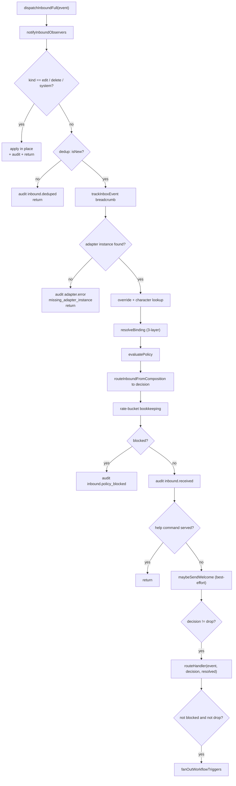
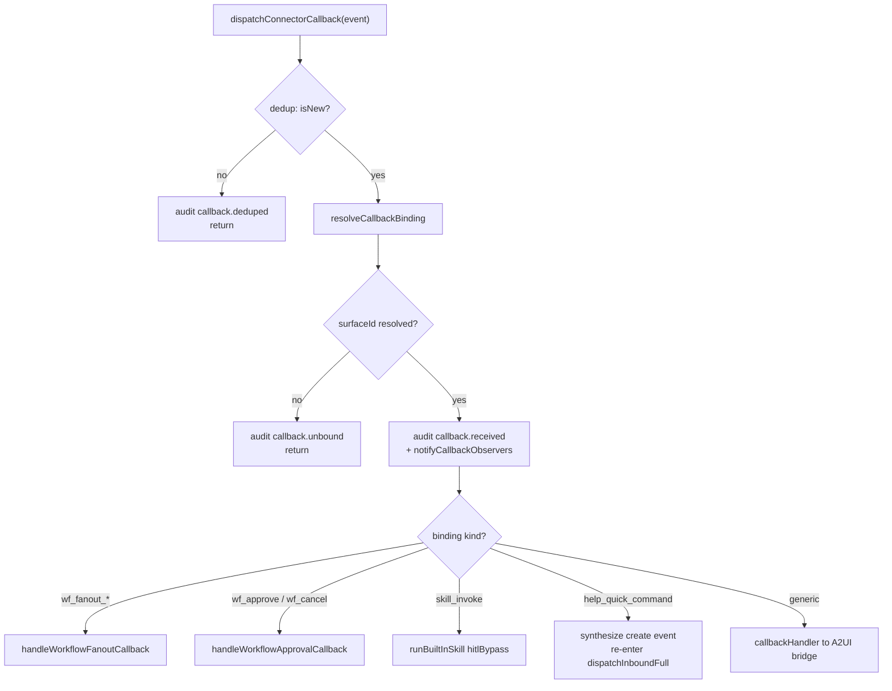
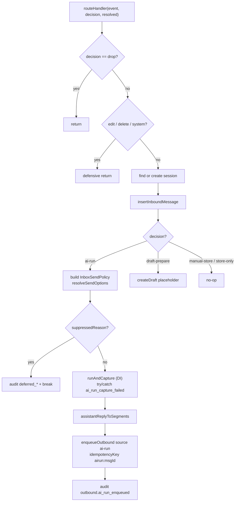

# ConnectorBus 与运行时

<Status variant="stable" />

<TLDR>
`ConnectorBus` 是每个平台适配器汇入的唯一进程内中枢。一个方法 —— `dispatchInboundFull`（`lib/connectors/bus.ts:208`）—— 驱动有序的 11 步入站流水线（去重 → 适配器查找 → 绑定 → 策略 → 路由 → 扇出）。一个并行方法 `dispatchConnectorCallback`（`lib/connectors/bus.ts:721`）处理交互式按钮/选择/表单事件，包含五个按 kind 区分的短路分支。运行时（`lib/connectors/runtime.ts:288`）安装 `bus.routeHandler`，把 `ai-run` 决策转化为一次被捕获的 Claude 回合并入队等待出站投递。生命周期（`lib/connectors/lifecycle.ts`）跟踪运行中的适配器，并在凭据轮换时对其进行热重载。
</TLDR>

<StatGrid>
  <Stat label="bus.ts" value="1087 行" hint="ConnectorBus 类 + getBus()" />
  <Stat label="入站流水线" value="11 步" hint="去重 → 扇出，有序" />
  <Stat label="回调短路" value="5 种 kind" hint="在通用处理器之前" />
  <Stat label="运行时决策" value="4 + drop" hint="ai-run / draft / store / drop" />
</StatGrid>

ConnectorBus 是每个入站平台事件**路由决策的唯一所有者**。适配器从不决定是否回复 —— 它们把平台原始负载归一化为 `NormalizedInboundEvent` 后交给总线。下游的一切（去重、角色绑定、策略门、AI 回合、工作流扇出）都是总线的职责。关于总线在更大连接器栈中的位置见[子系统概览](./index)，关于适配器贡献了什么见[适配器模型](./adapter-model)。

## 单例

`ConnectorBus` 是一个类（`lib/connectors/bus.ts:78`），通过惰性单例 `getBus()`（`lib/connectors/bus.ts:1079`）获取。适配器在启动时注册、停止时注销：

```ts
// lib/connectors/bus.ts:119 — registry mutators
registerAdapter(adapter: PlatformAdapter): void {
  this.adapters.set(adapter.id, adapter)
}

unregisterAdapter(adapterId: string): void {
  this.adapters.delete(adapterId)
}
```

两个**被动观察者通道**让插件可以旁观流量而不掌握决策权。`subscribeInbound`（`lib/connectors/bus.ts:137`）在路由前把每个入站事件喂给 `ctx.connectors.onInbound`；`subscribeCallback`（`lib/connectors/bus.ts:162`）把每个已解析的交互式回调喂给 `ctx.connectors.onCallback`。两者都严格只读 —— 抛错的观察者会被吞掉、绝不改变路由（`lib/connectors/bus.ts:144`、`lib/connectors/bus.ts:171`）。

权威接缝是两个可空字段：`routeHandler`（`lib/connectors/bus.ts:103`，由运行时安装）与 `callbackHandler`（`lib/connectors/bus.ts:111`，接到 A2UI 桥）。出站投递方法 —— `sendOutbound`（`lib/connectors/bus.ts:567`）、`editOutbound`（`lib/connectors/bus.ts:585`）、`deleteOutbound`（`lib/connectors/bus.ts:611`）、`setTypingOutbound`（`lib/connectors/bus.ts:635`）、`uploadFileOutbound`（`lib/connectors/bus.ts:651`）、`streamReplyOutbound`（`lib/connectors/bus.ts:669`）、`fetchHistoryAll`（`lib/connectors/bus.ts:682`）—— 以及能力读取器 `getAdapterA2UICapability`（`lib/connectors/bus.ts:1046`）/ `getAdapterSkillCapabilities`（`lib/connectors/bus.ts:1058`）全都基于同一个内存适配器 map。

## 11 步入站流水线

`dispatchInboundFull(event)`（`lib/connectors/bus.ts:208`）是整个子系统的核心。它严格按序执行；若干步会**短路并返回**，使重复、孤儿或被拦截的事件永远到不了 AI 回合。

1. **打戳** `now = Date.now()`（`lib/connectors/bus.ts:209`）。
2. **通知观察者** —— 被动插件旁观，最前置（`lib/connectors/bus.ts:212`）。
3. **Edit/Delete/System 短路** —— 各分支就地处理并返回（`lib/connectors/bus.ts:215`）。
4. **去重** —— `recordAndCheckInbound`；若已见过，审计 `inbound.deduped` 并停止（`lib/connectors/bus.ts:229`）。
5. **面包屑** —— `trackInboxEvent("inbound.received")` 在去重*之后*触发，使重复事件不会膨胀计数器（`lib/connectors/bus.ts:242`）。
6. **适配器查找** —— 缺失实例时审计 `adapter.error`（`missing_adapter_instance`）并返回（`lib/connectors/bus.ts:250`）。
7. **覆盖查找** —— `readForResolution(conversationKey)`（`lib/connectors/bus.ts:262`）。
8. **角色查找** —— `override.characterId ?? adapterRow.defaultCharacterId`（`lib/connectors/bus.ts:265`）。
9. **解析绑定** —— 通过 `resolveBinding` 做 3 层合并（`lib/connectors/bus.ts:269`）。
10. **评估策略**再**路由** —— `evaluatePolicy` → `resolveImEffectiveConfig`（解析各轴）→ `routeInboundFromComposition` → `toRouteDecision` → `decision`。
11. **记账、审计、help/welcome、路由、扇出** —— 限速桶按 `sender.id:channel.id` 入桶（`lib/connectors/bus.ts:286`）；审计 `inbound.policy_blocked` 或 `inbound.received`（`lib/connectors/bus.ts:292`）；`maybeHandleHelpCommand` 若已服务则提前返回 + `maybeSendWelcome`（`lib/connectors/bus.ts:316`）；`decision !== "drop"` 时调 `routeHandler`（`lib/connectors/bus.ts:333`）；未被拦截且未 drop 时调 `fanOutWorkflowTriggers`（`lib/connectors/bus.ts:347`）。



关键不变量：总线在调用 `routeHandler` **之前**写入 `inbound.policy_blocked` / `inbound.received` 审计行 —— 运行时只为它所采取的独立动作（ai-run 入队、草稿创建、延迟抑制）补写审计行。喂给第 9–10 步的策略/绑定层见[入站门控](./inbound-gating)。

## Edit / Delete / System 短路

Edit、delete、system 事件在最前面就分支出去（`lib/connectors/bus.ts:215`），因为它们不携带新的用户消息。它们从不经过策略门，也**从不扇出到工作流**。

`applyMessageEdit`（`lib/connectors/bus.ts:359`）与 `applyMessageDelete`（`lib/connectors/bus.ts:430`）都通过 **v49 `platformMessageId` 索引**加平台安全过滤来定位目标，因此 Telegram 的 `12345` 编辑不会误伤同样数字 id 的 Discord 行：

```ts
// lib/connectors/bus.ts:375 — indexed lookup + platform safety filter
const db = getDb()
const target = await db.messages
  .where("platformMessageId")
  .equals(replaces)
  .filter((m) => m.metadata?.platformMessage?.platform === event.platform)
  .first()
```

编辑把 `event.segments` 映射回文本 parts 并打上 `editedMetadata`（`editedAt` + 递增的 `editCount`，`lib/connectors/bus.ts:403`）。删除做软删除（parts 变为 `[deleted]`、设置 `metadata.deletedAt`，`lib/connectors/bus.ts:451`）。`applySystemEvent`（`lib/connectors/bus.ts:476`）把 `systemKind` 映射为审计 kind（`read_indicator` / `member_added` / `member_removed`）；在 `member_added` 时推送一次性欢迎卡（`lib/connectors/bus.ts:510`）。无论是否找到匹配行，每条路径都会审计。

## 交互式回调分发

`dispatchConnectorCallback(event)`（`lib/connectors/bus.ts:721`）是交互式界面（Slack `block_actions`、Lark 交互卡片、Telegram `callback_query`、Discord 组件交互）的并行流水线。它在 `"callback"` 命名空间下去重（`lib/connectors/bus.ts:725`），通过 `resolveCallbackBinding` 解析 `(surfaceId, componentId, conversationKey)` 绑定（`lib/connectors/bus.ts:751`），无锚定界面时退到 `callback.unbound`（`lib/connectors/bus.ts:763`），审计 `callback.received`（`lib/connectors/bus.ts:782`），并通知观察者（`lib/connectors/bus.ts:801`）。随后在通用接力之前运行**五个按 kind 区分的短路**：

| 绑定 kind | 行号 | 动作 |
| --- | --- | --- |
| `wf_fanout_approve` / `wf_fanout_cancel` | `lib/connectors/bus.ts:808` | `handleWorkflowFanoutCallback`（写入/丢弃扇出订阅） |
| `wf_approve` / `wf_cancel` | `lib/connectors/bus.ts:849` | `handleWorkflowApprovalCallback`（启动/取消运行，紧凑回复） |
| `skill_invoke` | `lib/connectors/bus.ts:886` | `runBuiltInSkill`，`hitlBypass: true` |
| `help_quick_command` | `lib/connectors/bus.ts:937` | 合成 `create` 事件 + 重入流水线 |
| （通用） | `lib/connectors/bus.ts:1000` | `callbackHandler` 接力给 A2UI 桥 |

`help_quick_command` 分支最有意思：help/welcome 卡片的快捷命令按钮被**完全当作用户输入了该命令**来处理。它构造一个带 `selfMentioned: true` 的合成入站事件（这样仅按提及触发的规则永远不会丢弃它），并重新进入入站流水线顶部：

```ts
// lib/connectors/bus.ts:982 — re-entrancy into dispatchInboundFull
  kind: "create",
}
try {
  await this.dispatchInboundFull(synthetic)
} catch (err) {
```



关于通用接力如何把回调投影为 A2UI ActionEvent，见 [AI 与 A2UI](./ai-and-a2ui)。

## 工作流扇出

`fanOutWorkflowTriggers(event)`（`lib/connectors/bus.ts:525`）是一次成功入站运行的最后一步。它通过 `findMatchingWorkflows` 解析每个订阅了 `trigger.connector.inbound` 的工作流，并通过 `dispatchTrigger` 逐个分发，隔离单个工作流的失败，使一个坏工作流永不拖垮总线：

```ts
// lib/connectors/bus.ts:538 — per-workflow isolation
const dispatches = matches.map(async (m) => {
  try {
    await dispatchTrigger({
      workflowId: m.workflowId,
      kind: "trigger.connector.inbound",
      payload: event,
      originAt,
      binding: { adapterId: event.adapterId, conversationKey: event.conversationKey },
    })
  } catch (err) { /* audit adapter.error workflow_dispatch_failed */ }
})
```

扇出对**每个**非 drop、非拦截的决策都会运行 —— 甚至 `draft-prepare` 也会，因为工作流完全可能合理地响应一条草稿模式的消息。它在 `decision === "drop"` 时被抑制（没有 StoredMessage 可供处理），在被拦截事件上也被抑制（以免间接绕过限速门）。trigger-bridge 一侧见[可视化工作流](../visual-workflows)。

## 运行时：routeHandler

`installRuntime(bus, opts)`（`lib/connectors/runtime.ts:288`）安装 `bus.routeHandler`。该处理器在 `drop` 时短路（`lib/connectors/runtime.ts:297`），在 edit/delete/system 时防御性返回（`lib/connectors/runtime.ts:306`），随后查找或创建会话（`findSessionByConversationKey` `lib/connectors/runtime.ts:105`，被 scheduled-outbound 复用），插入入站 `StoredMessage`（`insertInboundMessage` `lib/connectors/runtime.ts:200`，它通过 `projectInboundToA2UI` 反向投影原生富内容），并基于决策做 switch（`lib/connectors/runtime.ts:323`）。

**ai-run** 路径（`lib/connectors/runtime.ts:324`）是实质性的那条。每次查找都是尽力而为；它从 `quietHours` / `muted` / `forcedMode` 构造 `InboxSendPolicy`，解析 send options，运行抑制门，通过**依赖注入**的 `runAndCapture` 捕获回合，投影回复，再入队出站：

```ts
// lib/connectors/runtime.ts:368 — resolveSendOptions then suppression gate
const sendOptions = await resolveSendOptions({
  session, character, appSettings,
  conversationKey: event.conversationKey,
  platformBinding: session.platformBinding,
  inboxPolicy,
})
if (sendOptions.suppressedReason) {
  await appendAudit({ adapterId: event.adapterId,
    kind: suppressedReasonToAuditKind(sendOptions.suppressedReason), /* ... */ })
  break
}
```

当目标适配器实现 `streamReply` 时，会接上 `onPartial`，使增长中的回复驱动平台侧 stream 帧（`lib/connectors/runtime.ts:397`）；权威的最终消息仍走持久队列。捕获调用被 `try`/`catch` 成 `ai_run_capture_failed`（`lib/connectors/runtime.ts:413`）；回复通过 `assistantReplyToSegments` 投影（`lib/connectors/runtime.ts:437`）；出站任务携带幂等键 `airun:<messageId>`（`lib/connectors/runtime.ts:442`），以 `source: "ai-run"` 入队（`lib/connectors/runtime.ts:443`），随后写 `outbound.ai_run_enqueued` 审计（`lib/connectors/runtime.ts:457`）。其余分支：**draft-prepare** 创建占位草稿（`lib/connectors/runtime.ts:472`）；**manual-store** / **store-only** 为空操作（`lib/connectors/runtime.ts:483`）。



入队任务在下游会发生什么，见[出站队列](./outbound-queue)。

## 生命周期与凭据热重载

`lib/connectors/lifecycle.ts` 是*运行中*适配器的注册表（区别于总线*已注册*的适配器 map）。每个 `AdapterRuntimeEntry`（`lib/connectors/lifecycle.ts:20`）持有适配器句柄、其 `abortController` 以及一个 `restart` 启动器。`registerRunningAdapter`（`lib/connectors/lifecycle.ts:29`）填充它；`unregisterRunningAdapter`（`lib/connectors/lifecycle.ts:33`）中止传输并尽力 `stop()`；`requeueAdapter`（`lib/connectors/lifecycle.ts:67`）先拆除再重跑启动器。心跳**不是**按 entry 的 —— 由单一的 bus-scope 扫描（v51）驱动。

凭据轮换是一条独立的进程级 `EventTarget` 总线（`lib/connectors/credentials-events.ts`）。Settings 保存会调用 `emitCredentialsRotated(adapterId)`（`lib/connectors/credentials-events.ts:33`）；`onCredentialsRotated`（`lib/connectors/credentials-events.ts:42`）注册监听器。适配器通过 keyring getter 惰性读取凭据，因此**下一次**调用已经能看到新值 —— 该事件只是告知*哪个*适配器需要拆除重建（长轮询游标、网关 socket、webhook 签名缓存）。生命周期把两者桥接起来：

```ts
// lib/connectors/lifecycle.ts:89 — rotation drives a requeue + audit
export function subscribeCredentialsRotatedToLifecycle(): () => void {
  return onCredentialsRotated(({ adapterId, rotatedAt }) => {
    void (async () => {
      const present = entries.has(adapterId)
      if (!present) return
      await requeueAdapter(adapterId)
      await appendAudit({ adapterId, kind: "adapter.credentials_rotated",
        at: rotatedAt, fields: { via: "settings_save" } })
    })()
  })
}
```

该处理器是幂等的：若适配器当前未注册（已禁用 / 尚未启动），事件即空操作。`via: "settings_save"` 字段让审计页能把凭据驱动的 requeue 与手动“立即重连”点击区分开。

## 相关

<Cards>
  <Card title="适配器模型" href="./adapter-model" description="每个 PlatformAdapter 贡献了什么 —— 发送、编辑、能力、历史。" />
  <Card title="入站门控" href="./inbound-gating" description="喂给流水线第 9–10 步的策略 / 绑定 / mode-router 各层。" />
  <Card title="出站队列" href="./outbound-queue" description="ai-run 入队任务的落点与投递如何被驱动。" />
</Cards>
