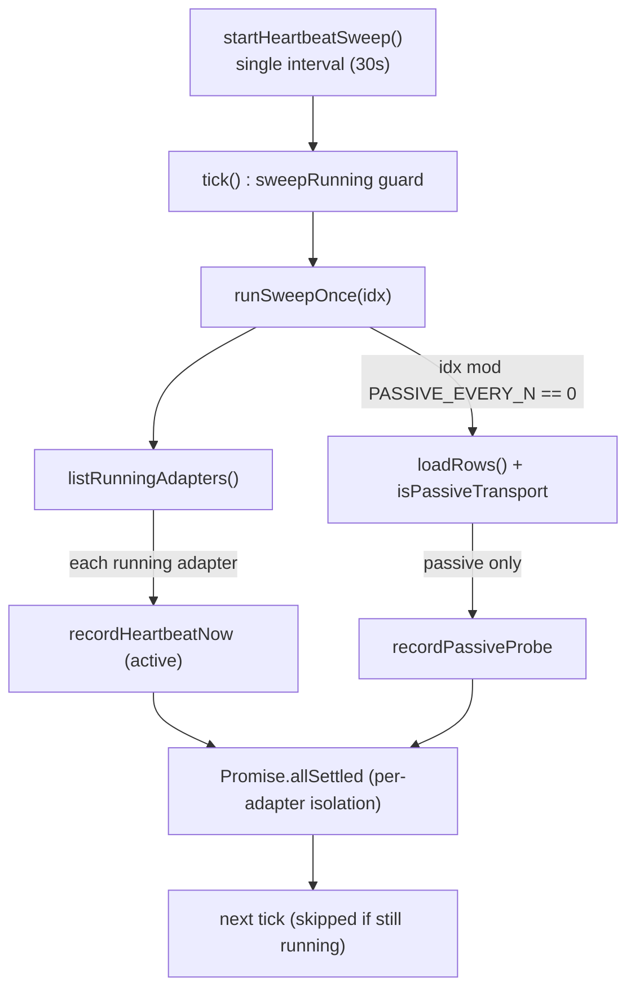
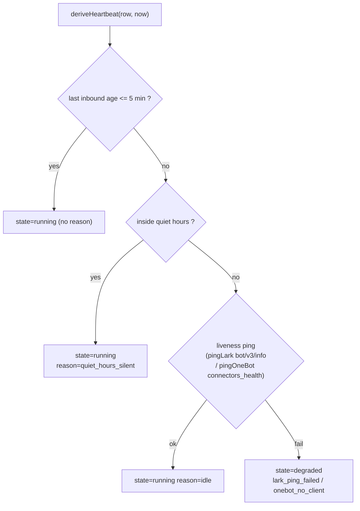
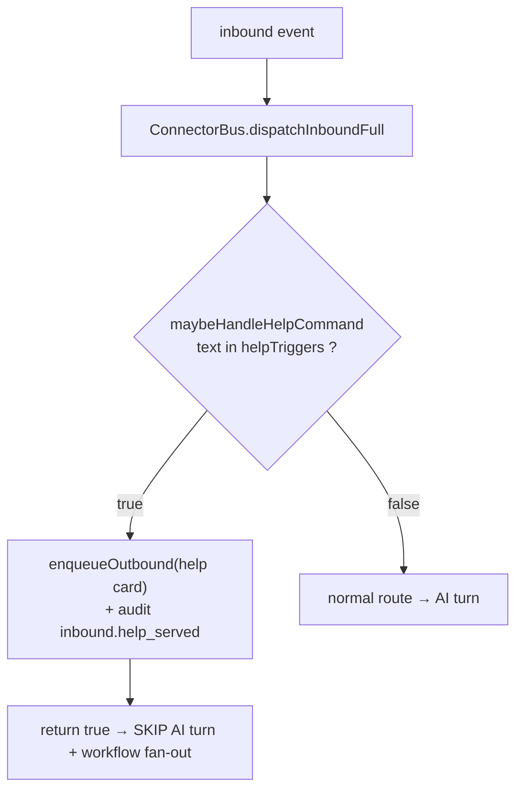

# 健康、审计与帮助

<Status variant="stable" />

<TLDR>
每个运行中的适配器都由**单个总线级心跳扫描**探测：每 30 秒一次主动
`adapter.health()` 快照，再加上每隔一拍对那些空闲等待的传输（Lark webhook、
OneBot 反向 WS）做一次被动存活探测。心跳写入专用的 `connectorHeartbeats` 表；
真实事件写入一个上限 5000 行、横跨 **48 种类别**的 `connectorAudit` 环。纯函数
`deriveHistory` 把两者折叠进 Health Tab 的 24 小时 × 30 分钟点阵网格。同一审计环
也记录跨平台的**帮助/欢迎**分发——当用户输入 `/help` 时，它会短路掉 AI 轮次。
</TLDR>

<StatGrid>
  <Stat label="主动心跳间隔" value="30 s" />
  <Stat label="被动探测节奏" value="60 s / 每隔一拍" />
  <Stat label="心跳保留期" value="48 h" />
  <Stat label="审计环上限" value="5000 行" />
  <Stat label="AuditKind 词表" value="48 种" />
</StatGrid>

本页讲述连接器运行时的可观测性与自描述平面。分发核心见
[连接器总线](./connector-bus)，发送机制见 [出站队列](./outbound-queue)，
富卡片构建器见 [AI 与 A2UI](./ai-and-a2ui)，axum 传输见
[Rust 层](./rust-layer)。

## 双层存活探测

适配器分为两类传输。**主动**传输会驱动一个显式的健康信号——Telegram 长轮询
循环、Discord Gateway 套接字、Slack Socket Mode——因此当传输断开时，
`adapter.health()` 会自行翻转为 `degraded`。**被动**传输（Lark webhook、OneBot
反向 WS）则空闲地等待平台或客户端推送事件；从适配器的视角看，"一小时没有事件"
与"一切正常、流量很安静"完全相同（`passive-heartbeat.ts:10-13`）。两者由单个
谓词区分：

```ts
// lib/connectors/health/passive-heartbeat.ts:57
export function isPassiveTransport(row: AdapterInstanceRow): boolean {
  if (row.type === "onebot") return true
  if (row.type === "lark") {
    const settings = (row.settings ?? {}) as { transport?: string }
    return settings.transport === "webhook"
  }
  return false
}
```

自 schema v51 起，**单个总线级 interval**（`heartbeat-sweep.ts`）每拍服务所有
运行中的适配器，取代了旧的逐适配器定时器扇出（最多 2N 个定时器）。它原样复用
`recordHeartbeatNow` / `recordPassiveProbe`，写入的行完全一致——只是调度被
统一了。



第 N 拍的节奏由两个间隔推导而来，让关系保持显式：

```ts
// lib/connectors/health/heartbeat-sweep.ts:39
export const PASSIVE_EVERY_N = Math.max(
  1,
  Math.round(PASSIVE_HEARTBEAT_INTERVAL_MS / HEARTBEAT_INTERVAL_MS)
)
```

首拍立即触发，这样 Health 视图无需等待一整个间隔就有数据
（`heartbeat-sweep.ts:139`）；而 `sweepRunning` 会跳过下一次调度触发，而不是
在一个慢扫描之上再叠一个并发扫描（`heartbeat-sweep.ts:97`、`129-137`）。

## 主动心跳

`recordHeartbeatNow(adapter, options?)` 立即拍一张快照——它被导出，以便 Health
Tab 的"立即重连"按钮和集成测试无需等待间隔即可强制探测
（`heartbeat.ts:60`）。它通过带索引的 `[adapterId+at]` 范围删除清理超过 48 小时
的行（`heartbeat.ts:69`、`40-53`），调用 `adapter.health()`（抛出即视为
`degraded`，`heartbeat.ts:72-79`），统计 pending+sending 的出站任务数
（`heartbeat.ts:80`、`24-38`），并并入出站运行器的熔断器 + 令牌桶快照
（`heartbeat.ts:84`）。该行写入**专用的 `connectorHeartbeats` 表**，绝不写入
`connectorAudit`：

```ts
// lib/connectors/health/heartbeat.ts:86
  await getDb()
    .connectorHeartbeats.put({
      id: crypto.randomUUID(),
      adapterId: adapter.id,
      kind: "adapter.heartbeat",
      at: now,
      reason: health.reason,
```

每个适配器每天 2 880 行，若把心跳写进审计环，会在每次 append 时搅动全局的
5000 行 `pruneOldest` 并驱逐真实的、操作者可见的事件——因此专用表让审计日志
保持为*真实*事件的记录，并由 48 小时扫描单独界定其上界（`heartbeat.ts:8-14`）。

## 被动心跳

对被动适配器，`deriveHeartbeat(row, options?)` 通过一棵四步决策树判定存活
（`passive-heartbeat.ts:129`）。`fetchLastInboundAt` 经由 `[adapterId+kind+at]`
（v51）索引读取最新的 `inbound.received` 行——纯索引 `.last()`，无需全表扫描
（`passive-heartbeat.ts:66`）。



`PASSIVE_HEARTBEAT_INTERVAL_MS` 为 60 秒，`IDLE_THRESHOLD_MS` 为 5 分钟
（`passive-heartbeat.ts:42-43`）。安静时段的沉默是*预期内*的，因此被标为
`running` 但注释为 `quiet_hours_silent`，让 Health 视图可以提示原因
（`passive-heartbeat.ts:147-158`）。`recordPassiveProbe` 将推导出的状态以
`fields.source: "passive_probe"` 写入 `connectorHeartbeats`
（`passive-heartbeat.ts:187`）。该探测永不抛出——Dexie、网络与审计失败全被吞掉，
以便定时器持续运行。

## 健康历史推导

`deriveHistory(entries, options)` 是一个**纯**辅助函数（不读 Dexie），把审计 +
心跳行的流分桶进 24 小时 × 30 分钟的点阵网格（48 格，`derive-history.ts:103`）。
在单个桶内，**最高严重度**的颜色胜出（`derive-history.ts:130`），由一张固定的
严重度表排序：

```ts
// lib/connectors/health/derive-history.ts:90
const SEVERITY: Record<HealthCellState, number> = {
  down: 4,
  degraded: 3,
  starting: 2,
  running: 1,
  unknown: 0,
}
```

`classify(entry)` 按以下优先级把每一行映射为单元格状态
（`derive-history.ts:45`）：

| 单元格状态  | 触发来源                                                                                                            |
| ----------- | ----------------------------------------------------------------------------------------------------------------- |
| `down`      | `adapter.error`、`delivery.deadlettered`、`inbound.signature_failed`                                                |
| `degraded`  | `circuit.opened`、`delivery.error`、`rate_limit.tripped`、`inbound.deferred_*`、`inbound.policy_blocked`            |
| `running`   | `adapter.heartbeat`（state running）、`delivery.success`、`inbound.received`、`outbound.enqueued`、`adapter.started` |
| `starting`  | `adapter.heartbeat`（state starting）、`adapter.stopped`、`circuit.half_opened`                                     |
| `unknown`   | 桶内无事件                                                                                                          |

三个同族归约器供给 Health Tab 的状态胶囊与提示框：`deriveCurrentState` 返回
最新的心跳快照，或从最新的归类事件合成（`derive-history.ts:142`）；
`deriveLastError` 找到最近的错误/死信/签名失败（`derive-history.ts:172`）；
`deriveLastOk` 找到最近的成功/入站/运行中心跳（`derive-history.ts:188`）。

## 审计环

`appendAudit(entry)` 是 `lib/db/connector-audit.ts:append` 的薄封装
（`audit.ts:12`），后者在**一个事务**内添加该行并清理最旧的行，使表永不超过
`AUDIT_CAP = 5000`（`connector-audit.ts:13`）：

```ts
// lib/db/connector-audit.ts:31
  await db.transaction("rw", db.connectorAudit, async () => {
    await db.connectorAudit.add(row)
    await pruneOldest(AUDIT_CAP)
  })
```

`listRecent(adapterId?, limit)` 返回最新优先的行，可选地按单个适配器限定范围
（`connector-audit.ts:42`）。操作者可经由 `audit-export.ts` 把日志交给同事：
`toCsv(rows)` 对每个单元格做 RFC-4180 转义，并把 `fields` JSON 序列化进单列
（`audit-export.ts:78`），`toJson(rows)` 原样美化打印（`audit-export.ts:87`），
`buildExportFilename` 打上一个按 UTC 可排序的名字
`cognia-audit-<all|adapterId>-<YYYYMMDDHHmm>.<ext>`（`audit-export.ts:108`）。
`exportAuditView(options)` 一次调用完成序列化 + 命名 + 触发浏览器下载
（`audit-export.ts:156`）。

## AuditKind 词表

`AuditKind` 联合类型（`types/connectors/audit.ts:1`）是连接器运行时记录之
一切的 48 种字母表。按族：

| 族                | 类别                                                                                                                                                                                                       |
| ----------------- | --------------------------------------------------------------------------------------------------------------------------------------------------------------------------------------------------------- |
| `delivery.*`      | `delivery.success`、`delivery.error`、`delivery.deadlettered`、`delivery.downgraded`                                                                                                                        |
| `inbound.*`       | `inbound.received`、`inbound.deduped`、`inbound.policy_blocked`、`inbound.signature_failed`、`inbound.edited`、`inbound.deleted`、`inbound.read_indicator`、`inbound.member_added`、`inbound.member_removed` |
| `inbound.deferred_*` | `inbound.deferred_quiet_hours`、`inbound.deferred_muted`、`inbound.deferred_manual_mode`                                                                                                                 |
| 帮助 / 欢迎       | `inbound.help_served`、`inbound.welcome_sent`                                                                                                                                                               |
| `outbound.*`      | `outbound.enqueued`、`outbound.ai_run_enqueued`、`outbound.queue_capped`                                                                                                                                    |
| `callback.*`      | `callback.binding_expired`、`callback.received`、`callback.deduped`、`callback.unbound`、`callback.handler_failed`                                                                                          |
| `goal.*.im`       | `goal.started.im`、`goal.blocked.im`                                                                                                                                                                        |
| `circuit.*`       | `circuit.opened`、`circuit.half_opened`、`circuit.closed`                                                                                                                                                   |
| `adapter.*`       | `adapter.started`、`adapter.stopped`、`adapter.error`、`adapter.credentials_rotated`、`adapter.heartbeat`                                                                                                   |
| `builtin_skill_*` | `builtin_skill_invoked`、`builtin_skill_denied`、`builtin_skill_hitl_pending`、`builtin_skill_hitl_approved`、`builtin_skill_hitl_rejected`、`builtin_skill_failed`                                          |
| `workflow_*`      | `workflow_approval_failed`、`workflow_fanout_failed`                                                                                                                                                        |
| 单例              | `rate_limit.tripped`、`credential.refreshed`、`override.computer_use_changed`                                                                                                                               |

有两样东西落在这个环之*外*。`adapter.heartbeat` 行写入 `connectorHeartbeats`
（其 `kind` 钉死为字面量 `"adapter.heartbeat"`，因为整张表都是心跳），而
`inboxTelemetryEvents`（`lib/db/inbox-telemetry.ts`，上限 3000）是一个与
`connectorAudit` 解耦的、独立的高容量面包屑日志，使其轮转永不挤掉一行
操作者可见的审计记录（`inbox-telemetry.ts:1-12`）。

## 帮助与欢迎

总线内联调用两个分发器。`maybeHandleHelpCommand(event, row, deps?)` 把入站文本
与适配器的帮助触发词匹配（默认 `["/help", "帮助"]`，`help-dispatch.ts:35`）；
命中时它入队一张帮助卡片、审计 `inbound.help_served`，并**返回 `true` 让总线
跳过 AI 轮次 + 工作流扇出**（`help-dispatch.ts:79`）。
`maybeSendWelcome(event, row, deps?)` 每个会话至多推送一张欢迎卡片——经由入站
账本的 `"welcome"` 命名空间、以幂等键 `welcome:<conversationKey>` 去重——并审计
`inbound.welcome_sent`（`help-dispatch.ts:121`）。



两者都用平台无关的 `buildHelpSurface(input)`（`build-help-surface.ts:121`）
构建表面，这是一个产出 `A2UISegmentContent` Card 的纯函数：一行 intro Text、
快捷指令 Button、可选的技能族、以及可选的 @-策略提示。默认文案为中文，且
可完全覆盖（`build-help-surface.ts:64`）。每条快捷指令变成一个携带逐平台
mapper 所记录绑定提示的 Button：

```ts
// lib/connectors/help/build-help-surface.ts:159
    input.quickCommands.forEach((cmd, i) => {
      const id = `qc_${i}`
      const label = cmd.label?.trim() || cmd.triggerKey
      const payload: HelpQuickCommandPayload = { action: cmd.action }
      components[id] = {
        component: "Button",
        text: label,
        action: `qc:${cmd.triggerKey}`,
        bindingKind: "help_quick_command",
        bindingPayload: payload,
      }
```

当用户点击其一时，`ConnectorBus.dispatchConnectorCallback` 会短路并重新进入
入站流水线，如同该指令被键入一样。

## 快捷指令

`IMQuickCommand { triggerKey, label?, action }`（`quick-commands/types.ts:30`）
把逐平台的按钮身份——Feishu `event_key`、WeCom 按钮 `key`——泛化为单一的
`triggerKey`。`normalizeQuickCommand(row)` 同时接受规范形态与遗留的 `eventKey`
形态，返回一个规范行，或对畸形输入返回 `null`（`quick-commands/types.ts:72`）；
`normalizeQuickCommandList(input)` 把它映射到数组之上，静默丢弃畸形条目
（`quick-commands/types.ts:95`）。写入路径始终发出 `triggerKey`，且无需 Dexie
迁移——该 JSON 列形态对 IndexedDB 不透明，运行时读取路径是唯一触碰它之处。

## 相关

<Cards>
  <Card title="连接器总线" href="./connector-bus" description="内联调用帮助/欢迎分发器并路由快捷指令回调的分发核心。" />
  <Card title="AI 与 A2UI" href="./ai-and-a2ui" description="帮助卡片共享的 A2UI 表面构建器——原生富卡片渲染与纯文本降级。" />
  <Card title="出站队列" href="./outbound-queue" description="帮助/欢迎卡片入队之处，也是心跳的 pending-count 字段来源。" />
  <Card title="Rust 层" href="./rust-layer" description="被动心跳背后的 axum 传输与 connectors_health 探测。" />
  <Card title="总览" href="./index" description="Platform Connectors 子系统地图。" />
</Cards>
