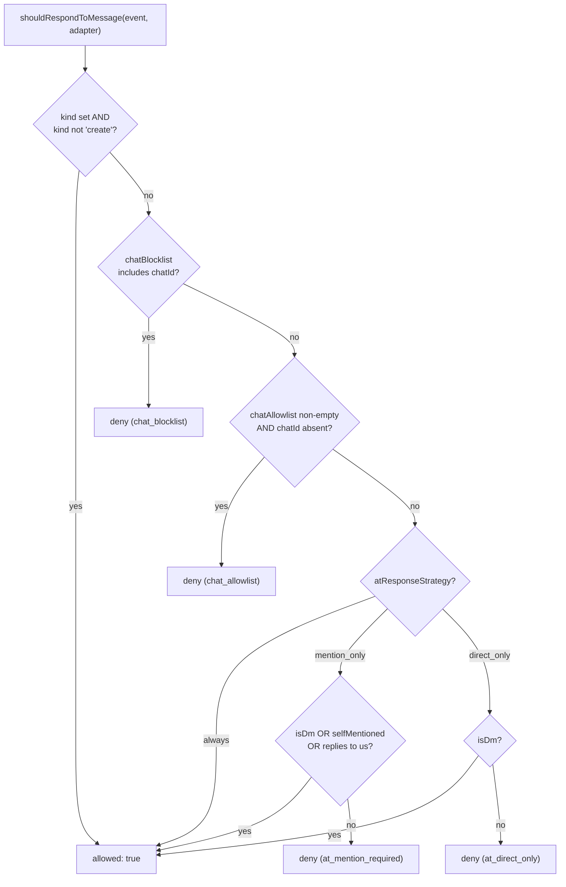
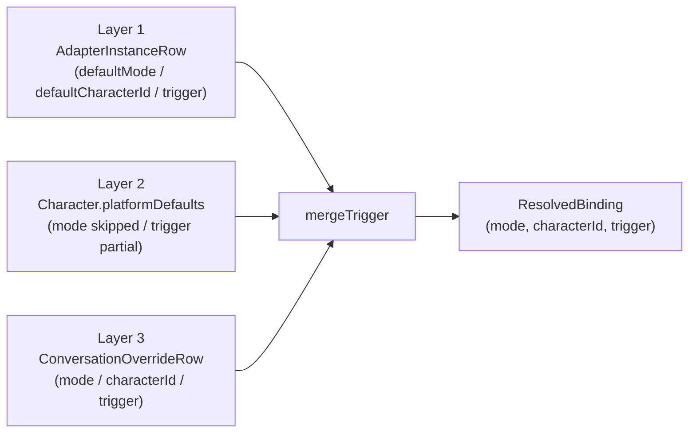
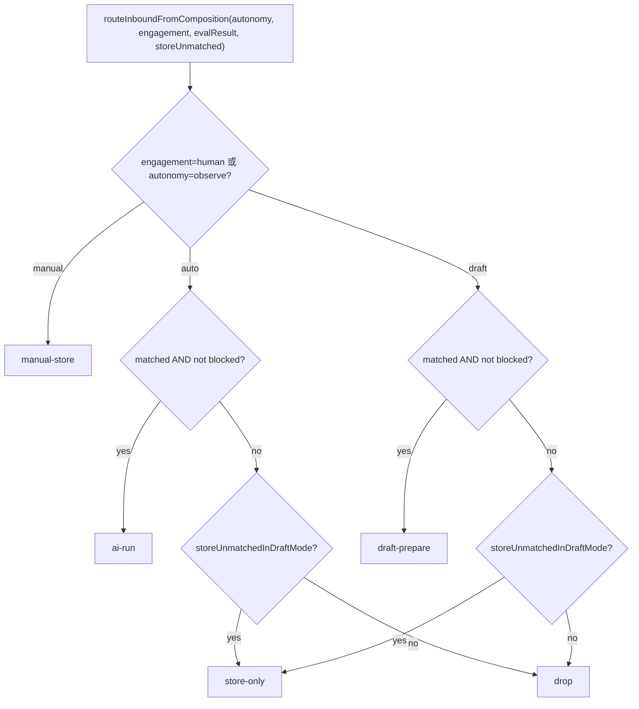

# 入站门控与策略

<Status variant="stable" />

<TLDR>
每条入站平台消息在抵达 `ctx.emit()` 和 AI 之前都要跑一遍关卡。首先**去重账本**丢弃重放；接着每适配器的 **@-门控**（`shouldRespondToMessage`）应用黑名单 / 白名单 / at-策略护栏；存活的事件进入总线，总线把**三层绑定**（适配器 → 角色 → 会话覆盖）解析成 `(mode, characterId, trigger)` 三元组，运行纯函数 **`evaluatePolicy`** 评估器（规则 OR、阻断器首次命中即短路），再把结果交给**模式路由器**，从五个 `RouteDecision` 中选一个——`ai-run`、`manual-store`、`draft-prepare`、`store-only` 或 `drop`。
</TLDR>

<StatGrid>
  <Stat label="账本上限" value="10,000" />
  <Stat label="连接器模式" value="3" />
  <Stat label="路由决策" value="5" />
  <Stat label="触发规则种类" value="7" />
</StatGrid>

## 两阶段门控

入站门控被刻意拆成两个在管线不同位置运行的阶段：

1. **适配器侧 @-门控** —— 在每个适配器分发器内部、紧挨 `ctx.emit()` **之前**运行。它与平台无关（`lib/connectors/at-gate.ts`，schema v45），回答一个粗粒度问题：*机器人到底要不要搭理这个会话 / 消息？* 它读取操作者在 `AdapterInstanceRow` 上配置的字段（聊天黑名单 / 白名单、at-策略），在事件跨入总线之前就短路。
2. **总线侧策略** —— 事件被发出后，总线解析绑定并运行细粒度的 `TriggerPolicy`（`lib/connectors/policy-eval.ts`），决定*如何*回应：现在就 AI-run、存给人工，还是准备草稿。

在这两个阶段之前，**去重账本**（`lib/connectors/dedup.ts`）保证给定的平台消息只被处理一次。

## 去重账本

`recordAndCheckInbound` 是幂等守卫。它记录 `(adapterId, namespace, platformMessageId)`，仅在该元组首次出现时返回 `true`，因此重试的 webhook、重连重放和重复的回调投递都会被廉价丢弃。

```ts
// lib/connectors/dedup.ts:32
export async function recordAndCheckInbound(
  adapterId: string,
  platformMessageId: string,
  namespace: InboundLedgerNamespace = "inbound"
): Promise<boolean> {
  callCount++
  const isNew = await recordInbound(adapterId, platformMessageId, namespace)
  if (callCount % PRUNE_EVERY === 0) {
    await pruneOldest(LEDGER_CAP).catch(() => undefined)
  }
  return isNew
}
```

- **命名空间**（`InboundLedgerNamespace`）默认为 `"inbound"`（`dedup.ts:35`），以兼容每个 v38 之前的调用方。回调处理器传 `"callback"`；首次接触的欢迎器传 `"welcome"`。每个命名空间是独立的滑动窗口，因此一个消息 id 可以跨桶复现而不冲突。
- **惰性裁剪** —— `PRUNE_EVERY = 200`（`dedup.ts:16`）、`LEDGER_CAP = 10_000`（`dedup.ts:17`）。每第 200 次调用 await 一次 `pruneOldest(LEDGER_CAP)`，使表在调用返回前被封顶；裁剪失败会被吞掉（非致命）。

## @-门控

`shouldRespondToMessage(event, adapter)`（`at-gate.ts:62`）是纯决策；`gateInboundEvent(adapterId, event)`（`at-gate.ts:117`）是异步运行时包装器，负责 DB 查询并在拒绝时审计。三项正交检查按序运行：聊天黑名单、聊天白名单，然后 at-策略。



- **非 create 事件直接通过** —— edit / delete / system 事件绕过门控（`at-gate.ts:66`）；at-策略只关乎对新鲜消息的回应。
- **chatId 解析** —— `event.channel.platformChannelId ?? event.channel.id`（`at-gate.ts:53`），因为操作者把平台原生 id 逐字粘贴进名单。
- **先黑名单后白名单** —— 命中黑名单即拒绝（`at-gate.ts:72`）；非空白名单中缺该会话也拒绝（`at-gate.ts:76`）。空 / 未定义的白名单意味着"任何会话都行"。
- **at-策略** —— `AtResponseStrategy = "always" | "mention_only" | "direct_only"`（`at-gate.ts:32`）。新适配器的默认值是 `DEFAULT_AT_RESPONSE_STRATEGY = "mention_only"`（`at-gate.ts:35`）——比 `always` 更安全。私聊总是绕过提及要求，因为它没有提及面。
- **回复机器人等同于称呼它** —— `isReplyToSelf(event)`（`types/connectors/event.ts`）在本门控与会话准入里都与 `selfMentioned` 等价地满足提及要求。没有它，下文的 `reply-to-bot` 触发规则在群里永远不可能命中：准入会在规则被评估之前就丢弃未 @ 的群消息。匹配是严格的——父消息作者必须等于 `event.selfId`，父作者未知时绝不过度匹配。

```ts
// lib/connectors/at-gate.ts:90 — mention_only branch
    case "mention_only":
      if (isDm) return { allowed: true }
      if (event.mentions.selfMentioned || isReplyToSelf(event)) return { allowed: true }
      return { allowed: false, reason: "at_mention_required" }
    case "direct_only":
      if (isDm) return { allowed: true }
      return { allowed: false, reason: "at_direct_only" }
```

**失败时放行。** `gateInboundEvent` 尽力查找适配器行；若该行缺失则返回 `true`（`at-gate.ts:121-122`），使一次瞬时 Dexie 读取失败不会悄悄丢弃所有消息。在真正拒绝时它追加一条携带 `AtGateReason` 的 `inbound.policy_blocked` 审计行（`at-gate.ts:125-131`）并返回 `false`。

### 供 Health 面板的阻断统计

`summariseAtGateBlocks(rows, options)`（`at-gate-stats.ts:71`）是对 `inbound.policy_blocked` 审计行的纯汇总器——没有新埋点、没有 schema 提升。它过滤 24 小时窗口（`DEFAULT_WINDOW_MS`），按 `AtGateReason` 分桶，降序排序，并可选地把超出 `topN` 的尾部折叠进单个 `"other"` 条目（`at-gate-stats.ts:94-108`）。Health Detail 面板用它来渲染"过去 24 小时过滤了 N 条入站消息，主要原因：……"。

## TriggerPolicy 与 evaluatePolicy

事件抵达总线后，解析出的 `TriggerPolicy` 决定 AI 是否被*触发*。`evaluatePolicy(policy, event, state, now)`（`policy-eval.ts:131`）是纯函数——状态被注入且从不变更，因此分发管线拥有可变的限速桶，并在决策后更新它们。

规则与阻断器相互独立：**任一规则命中**置 `matched = true`（OR 语义，`policy-eval.ts:138`）；**第一个阻断器命中**置 `blocked = true` 并携原因短路（`policy-eval.ts:141-145`）。下游路由器仅在 `matched && !blocked` 时才继续。

### 触发规则（OR）

| `TriggerRule.kind`  | 命中条件                                                            | 来源              |
| ------------------- | ------------------------------------------------------------------ | ----------------- |
| `private-default`   | `event.channel.kind === "private"`                                 | `policy-eval.ts:37` |
| `self-mention`      | `event.mentions.selfMentioned`                                     | `policy-eval.ts:40` |
| `reply-to-bot`      | `event.replyTo.parentSenderId === event.selfId`（精确匹配）        | `policy-eval.ts:43` |
| `slash-command`     | `plainText`（trim 后）以任一 `prefixes` 开头                       | `policy-eval.ts:49` |
| `keyword`           | `plainText` 包含任一 `words`（可选大小写不敏感）                   | `policy-eval.ts:54` |
| `user-allowlist`    | `userIds` 包含 `event.sender.id`                                   | `policy-eval.ts:62` |
| `channel-allowlist` | `channelIds` 包含 `event.channel.id`                              | `policy-eval.ts:65` |

### 触发阻断器（首次命中胜出）

| `TriggerBlocker.kind`       | 阻断条件                                                                 | 来源                |
| --------------------------- | ------------------------------------------------------------------------ | ------------------- |
| `user-blocklist`            | `userIds` 包含 `event.sender.id`                                        | `policy-eval.ts:79` |
| `channel-blocklist`         | `channelIds` 包含 `event.channel.id`                                    | `policy-eval.ts:83` |
| `keyword-blocklist`         | `plainText` 包含任一 `words`                                            | `policy-eval.ts:87` |
| `rate-limit`                | 60 秒窗口内用户桶或频道桶超过其上限                                       | `policy-eval.ts:93` |
| `cooldown-after-bot-reply`  | 本会话在 `secs` 内发生过机器人回复                                       | `policy-eval.ts:107` |

限速阻断器在滚动的 60 秒窗口内维护**两个桶**——按 `(user, channel)` 和按频道（跨所有用户求和）：

```ts
// lib/connectors/policy-eval.ts:93 — rate-limit dual bucket
    case "rate-limit": {
      const bucketKey = `${event.sender.id}:${event.channel.id}`
      const window = now - 60_000
      const recent = (state.recentByUserAndChannel[bucketKey] ?? []).filter((t) => t > window)
      if (recent.length >= blocker.perUserPerMin) return "rate-limit (user bucket)"
      const channelTotal = Object.entries(state.recentByUserAndChannel)
        .filter(([key]) => key.endsWith(`:${event.channel.id}`))
        .flatMap(([, ts]) => ts)
        .filter((t) => t > window).length
      if (channelTotal >= blocker.perChannelPerMin) return "rate-limit (channel bucket)"
      return null
    }
```

内置的 `defaultPrivateChatPolicy()`（`policy.ts:33`）使用单条 `private-default` 规则，配宽松的 `30/60` 限速和 `storeUnmatchedInDraftMode: true`；`defaultGroupChatPolicy()`（`policy.ts:41`）基于 `self-mention` / `reply-to-bot` / `/ask`+`/agent` 斜杠命令门控，配更紧的 `5/20` 限速、3 秒回复后冷却，以及 `storeUnmatchedInDraftMode: false`。

## 三层绑定解析

策略运行之前，总线先解析*哪个*策略、模式和角色适用于本会话。`resolveBinding(input)`（`policy-resolve.ts:49`）把三个来源层叠成单个 `ResolvedBinding { mode, characterId, trigger }`（`policy-resolve.ts:27`）。



- **mode** —— 起始于 `adapter.defaultMode`（`policy-resolve.ts:54`）；角色层被跳过（`Character` 没有 `mode` 字段）；若定义则 `override.mode` 最后胜出（`policy-resolve.ts:57`）。
- **characterId** —— 起始于 `adapter.defaultCharacterId`（`policy-resolve.ts:61`）；角色层跳过；`override.characterId` 最后胜出（`policy-resolve.ts:64`）。
- **trigger** —— 基底是 `adapter.trigger` 的浅拷贝（`policy-resolve.ts:68`），然后并入 `character.platformDefaults.trigger`（`policy-resolve.ts:71`），再并入 `override.trigger`（`policy-resolve.ts:77`）——各经 `mergeTrigger`。

合并是**替换而非拼接**：定义了 `rules`（或 `blockers`）的高层会替换整个数组，而不是追加。

```ts
// lib/connectors/policy-resolve.ts:38
function mergeTrigger(base: TriggerPolicy, patch: Partial<TriggerPolicy>): TriggerPolicy {
  return {
    rules: patch.rules !== undefined ? patch.rules : base.rules,
    blockers: patch.blockers !== undefined ? patch.blockers : base.blockers,
    storeUnmatchedInDraftMode:
      patch.storeUnmatchedInDraftMode !== undefined
        ? patch.storeUnmatchedInDraftMode
        : base.storeUnmatchedInDraftMode,
  }
}
```

`CharacterPlatformDefaults { mode?, trigger? }`（`binding.ts:14`）是一个 Character 按平台随附的内容；`PlatformBinding`（`binding.ts:5`）持久化 `(adapterId, conversationKey, platform, conversationRef)` 句柄，使主动出站有目标可发。

## 模式路由器

路由读的是**组合轴**，不是 `mode`。`resolveImEffectiveConfig` 解析该会话的 `autonomy` 与 `engagement`（优先读轴字段，缺失时回落到 `mode` 镜像），`routeInboundFromComposition` 决定这一轮跑不跑，`toRouteDecision` 再投影成路由处理器所说的五个 `RouteDecision`。

`mode` 仍是存储侧的兼容镜像 —— `InboxSendPolicy.forcedMode` 与定时摘要路径依旧读它 —— 但它不再是路由的输入。从它反推各轴会把 `targetKind` 钉死成 `direct`，并让会话真正存下来的每一个轴都失效：`setAssignee` 与 SLA 的 `switchMode` 步骤都直接写轴字段，而 `confirm` / `autopilot` 根本没有对应的旧写法。

只带镜像的旧行会与从前路由得一模一样，这正是无需回填的原因：

| `mode`   | `matched && !blocked` | 否则                                                |
| -------- | --------------------- | --------------------------------------------------- |
| `auto`   | `ai-run`              | `storeUnmatchedInDraftMode ? "store-only" : "drop"` |
| `manual` | `manual-store`        | `manual-store`（总是——忽略策略）                    |
| `draft`  | `draft-prepare`       | `storeUnmatchedInDraftMode ? "store-only" : "drop"` |



`manual` 模式无视策略总是返回 `manual-store`——每条消息都停泊待人工审阅。`auto` 与 `draft` 共享同一回退：仅当策略选择加入时才存储未匹配消息，否则静默丢弃。

## 入站事件与分段类型

每个门控、规则、阻断器都读取同一个归一化形状，因此平台细节绝不越过适配器解析器泄漏。

### NormalizedInboundEvent

`NormalizedInboundEvent`（`event.ts:62`）是跨平台入站载荷。门控层读取的关键字段：

| 字段                 | 类型                       | 使用者                                           |
| -------------------- | -------------------------- | ------------------------------------------------ |
| `kind?`              | `InboundEventKind`         | @-门控（非 create 绕过）、总线 insert/update     |
| `channel`            | `ChannelDescriptor`        | @-门控 chatId、`private-default` / 频道规则       |
| `mentions`           | `MentionDescriptor`        | `self-mention`、`mention_only` 策略              |
| `replyTo?`           | `ReplyDescriptor`          | `reply-to-bot` 规则                              |
| `sender`             | `PlatformIdentity`         | 用户 allow/blocklist、限速桶键                   |
| `plainText`          | `string`                   | `keyword` / `slash-command` 规则 + 阻断器        |
| `segments`           | `MessageSegment[]`         | 经 `segmentsToPlainText` 产出 `plainText` 的来源 |
| `conversationKey`    | `string`                   | 冷却桶、审计行                                   |

`InboundEventKind = "create" | "edit" | "delete" | "system"`（`event.ts:60`）——省略时默认为 `"create"`；只有 create 事件被 @-门控。`ChannelKind = "private" | "group" | "channel" | "thread"`（`event.ts:27`）驱动私聊绕过。`buildConversationKey`（`event.ts:107`）/ `parseConversationKey`（`event.ts:124`）构造与拆分 `platform:adapterId:remoteChatId[:threadId]` 键。

### MessageSegment

`MessageSegment`（`segment.ts:9`）是每个适配器解析器投影出的判别联合。`segmentsToPlainText(segments)`（`segment.ts:110`）把它压平成 `keyword` 和 `slash-command` 匹配器读取的 `plainText`——非文本分段投影为稳定占位符，使正则绝不会意外命中裸 URL 或代码。

| `type`                                   | 纯文本投影                             |
| ---------------------------------------- | -------------------------------------- |
| `text` / `markdown`                      | 字面文本 / markdown                    |
| `mention`                                | `@displayName`（或 `@userId`）         |
| `image` / `video` / `card`               | ` [image] ` / ` [video] ` / ` [card] ` |
| `voice`                                  | 有转写则用转写，否则 ` [voice] `        |
| `file`                                   | ` [file:name] `                        |
| `code`                                   | 原始代码                               |
| `reply` / `location` / `poll`            | ` [reply:…] ` / ` [location:…] ` / ` [poll:…] ` |
| `a2ui`                                   | `plainTextMirror`（或 ` [a2ui] `）     |

## 相关

<Cards>
  <Card title="连接器总线" href="./connector-bus" description="调用门控、解析绑定并运行模式路由器的分发管线。" />
  <Card title="适配器模型" href="./adapter-model" description="@-门控读取的 AdapterInstanceRow 字段——聊天名单、at-策略、defaultMode。" />
  <Card title="出站队列" href="./outbound-queue" description="消息被接纳后 ai-run / draft-prepare 决策流向何处。" />
  <Card title="AI 与 A2UI" href="./ai-and-a2ui" description="被接纳的事件如何驱动 AI 运行并把 A2UI 表面投影回平台。" />
  <Card title="子系统概览" href="./index" description="平台连接器子系统地图。" />
</Cards>
