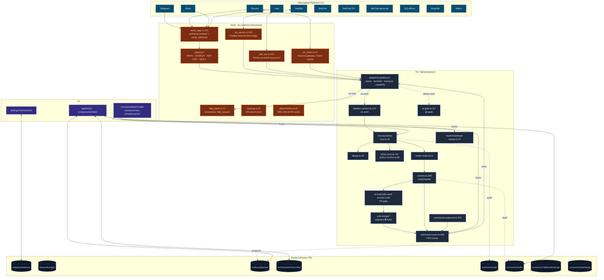
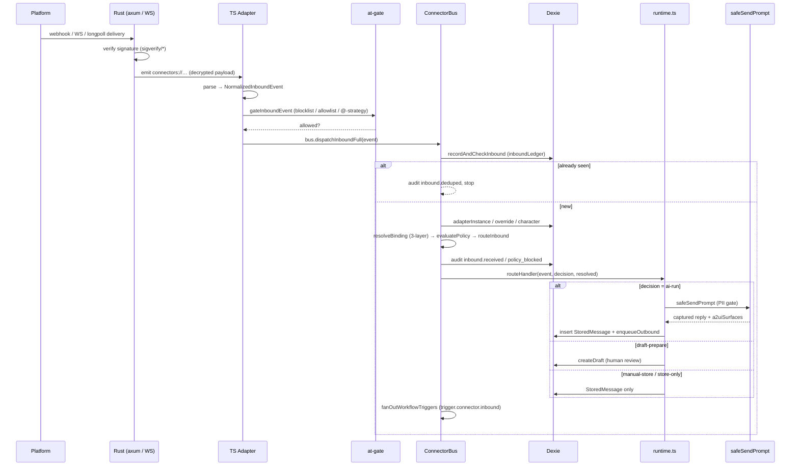
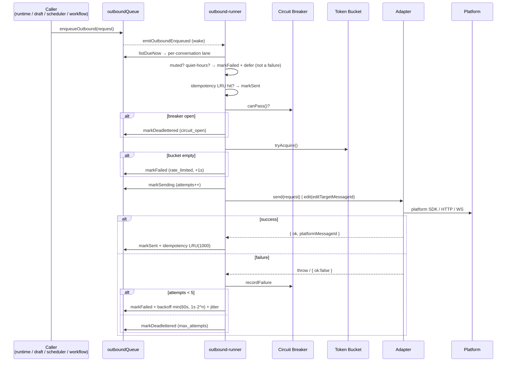

# 平台连接器

<Status variant="stable" />

<TLDR>
  11 个内置 IM 适配器（Telegram · Discord · Slack · Lark · OneBot v11/v12 · WeCom · WeChat OA ·
  个人微信 · QQ 官方 · 钉钉 · Matrix）扇入到单例 **ConnectorBus**（`lib/connectors/bus.ts:78`）。
  每条入站消息都跑一条 11 步流水线 —— 去重 → 适配器查找 → 三层绑定解析 → `TriggerPolicy` 评估 →
  模式路由 → 审计 → 帮助/欢迎 → 路由处理器 → 工作流扇出。出站经过一个 Dexie FIFO 队列
  （`lib/connectors/outbound-runner.ts:284`），外面包裹按会话的串行车道、熔断器、令牌桶、指数退避、
  幂等 LRU 和死信落库。三种模式 —— `auto`（PII 把关的 AI 回复）、`manual`（人工输入）、
  `draft`（AI 起草、人工审批）。Webhook 签名校验（HMAC / Ed25519 / AES-CBC）与 OneBot / Discord /
  Lark 套接字运行在 Rust 侧（`src-tauri/src/connectors/`）。富交互内容经 **A2UI 桥**双向投影，回调绑定
  持久化在 Dexie 中。
</TLDR>

<StatGrid>
  <Stat label="内置适配器" value="11" hint="telegram · discord · slack · lark · onebot · wecom · wechat-oa · wechat-personal · qq-official · dingtalk · matrix" />
  <Stat label="运行模式" value="3" hint="auto · manual · draft" />
  <Stat label="Dexie 表" value="10" hint="adapterInstances · platformIdentities · inboundLedger · outboundQueue · conversationOverrides · connectorAudit · connectorDrafts · connectorAttachments · connectorCallbackBindings · connectorHeartbeats" />
  <Stat label="审计种类" value="48" hint="types/connectors/audit.ts 中的 AuditKind 联合类型" />
  <Stat label="签名校验算法" value="5" hint="Telegram secret-token · Slack HMAC v0 · Discord Ed25519 · Lark AES-CBC · WeChat SHA-1+AES" />
  <Stat label="Tauri 命令" value="18" hint="src-tauri/src/connectors/commands.rs" />
  <Stat label="审计上限" value="5000" hint="connectorAudit FIFO 环（lib/db/connector-audit.ts:13）" />
</StatGrid>

## 它是什么

平台连接器把任意 Cognia 角色变成真实 IM 平台上的真实机器人。运营者在 **设置 → 连接** 里配置一个适配器、
绑定到一个角色，机器人就会应答 —— 在 `auto` 模式下，它通过与应用内聊天完全相同的 build-options 流水线
跑一次完整的 Claude 回合；在 `draft` 模式下，AI 准备好回复，由人在收件箱里审批；在 `manual` 模式下，
人通过机器人手动输入。

整个子系统是围绕单一单例的清晰扇入/扇出：

- **扇入** —— 每个适配器把平台原始负载归一化为 `NormalizedInboundEvent`，调用
  `bus.dispatchInboundFull(event)`。总线去重、解析绑定、评估触发策略、按模式路由，再交给运行时。
- **扇出** —— 出站回复（AI / 人工 / 草稿审批 / 工作流）入到单一 Dexie 队列，由一个泵抽取，统一施加
  静默时段、静音、熔断、限流、退避和死信 —— 无论来源为何。

本页是**架构中枢**。模块地图里的每个方块都是一篇带行号级内部细节的专门技术页。各平台的配置指南见配套的
[连接器配置](../../connectors/slack-setup)章节。

## 模块地图

<Cards>
  <Card title="ConnectorBus 与运行时" href="./connector-bus" description="单例：11 步 dispatchInboundFull 流水线、edit/delete/system 短路、5 分支回调分发器、工作流扇出、运行时 routeHandler、生命周期注册表、凭证热重载" />
  <Card title="适配器模型与注册表" href="./adapter-model" description="PlatformAdapter 契约、AdapterContext、能力标志 + A2UI 矩阵、buildAdapterFromRow 工厂、OAuth 注册表、共享 mention-extractor" />
  <Card title="内置适配器" href="./built-in-adapters" description="全部 11 个平台 —— 传输 + 签名矩阵、四个深度适配器（Telegram / Discord / Lark / OneBot）、解析流水线、自身 id whoami 探测" />
  <Card title="入站把关与策略" href="./inbound-gating" description="去重账本、@-gate、evaluatePolicy 规则/拦截器、三层 resolveBinding 栈、mode-router 决策、NormalizedInboundEvent + MessageSegment 类型" />
  <Card title="出站队列与投递" href="./outbound-queue" description="FIFO 泵关卡、熔断器状态机、令牌桶、退避公式、幂等 LRU、死信、定时出站、DLQ 导出、任务徽章" />
  <Card title="自动模式 AI 回路与 A2UI 桥" href="./ai-and-a2ui" description="PII 把关的 safeSendPrompt 回路、segment ⇄ A2UI 投影、surface 构建器、能力感知降级、工作流进度扇出、回调往返、附件缓存" />
  <Card title="健康、审计与帮助" href="./health-audit" description="主动 + 被动心跳、总线级扫描、健康历史推导、审计环 + 导出、48 种 AuditKind 联合类型、帮助/欢迎卡片、快捷指令" />
  <Card title="Rust 层" href="./rust-layer" description="axum webhook 接收器、5 个签名校验器、OneBot 反向 WS 桥、Lark protobuf 长连接、AES-256-GCM 附件缓存、OS keyring、18 个 Tauri 命令" />
  <Card title="收件箱 UI 与插件扩展" href="./ui-and-plugins" description="ConnectorBusProvider 启动序列、三栏收件箱外壳、模式切换器 / 草稿编辑器 / 出站药丸、7 标签连接设置、插件适配器桥" />
</Cards>

## 分层架构

## 数据流：入站

## 数据流：出站

## 数据模型（Dexie，schema v70）

| 表 | 主键 / 索引 | 用途 | 引入版本 |
| --- | --- | --- | --- |
| `adapterInstances` | `id, type, enabled, [type+enabled]` | 每个已配置机器人一行（type、settings、defaultCharacterId、trigger、quietHours、muted、capabilities） | v18 |
| `platformIdentities` | `id, [platform+remoteUserId]` | 每个观察到的平台用户一行 | v18 |
| `inboundLedger` | `&id, [adapterId+platformMessageId]`, `namespace` | 入站 + 回调 + 欢迎去重，1 万行上限 | v18（namespace v38） |
| `outboundQueue` | `&id, [conversationKey+createdAt], [status+nextAttemptAt]` | 投递任务；`pending → sending → sent \| failed \| deadlettered`，5000 软上限 | v18（复合索引 v51） |
| `conversationOverrides` | `&id, &conversationKey` | 按会话的模式 / 角色 / 静默时段覆写 | v18 |
| `connectorAudit` | `&id, [adapterId+at], [adapterId+kind+at]` | 运营审计日志，5000 FIFO 环 | v18（[adapterId+kind+at] v51） |
| `connectorDrafts` | `&id, [conversationKey+createdAt]` | 待人工审批的草稿 | v18 |
| `connectorAttachments` | `&id, [adapterId+remoteRef], expiresAt` | 附件元数据镜像（二进制由 Rust 在磁盘上加密） | v18 |
| `connectorCallbackBindings` | `&id, [adapterId+actionId]`, `kind` | 交互动作 → surface 绑定，TTL 30 天 | v41 |
| `connectorHeartbeats` | `&id, [adapterId+at]` | 按适配器的存活，48 小时保留 | v51 |

`inboxTelemetryEvents`（v49，3000 上限）是独立的高频面包屑日志，与 `connectorAudit` 解耦，使其轮转
永不挤占运营可见的审计行。

## 自旧文档以来的变化

本章节替换的单页文档已与实现脱节。具体更正：

| 旧文档的说法 | 实际情况 | 来源 |
| --- | --- | --- |
| 「七个内置适配器」 | 实际发布 **11** 个（新增 QQ 官方、WeCom、WeChat OA、个人微信、钉钉、Matrix） | `lib/connectors/adapter-registry.ts:42` |
| 「Dexie v18」 | 连接器表始于 v18；schema 现已 **v70**（回调绑定 v41、心跳 v51） | `lib/db/schema.ts:163`、`:1535` |
| 「自动模式 AI 回路是 Phase 1 桩」 | 回路是**真实的** —— `safeSendPrompt` 在 PII 把关后跑完整 Claude 回合 | `lib/connectors/ai-loop/safe-send-prompt.ts:69` |
| 「`connectorAttachments` 仅有 schema」 | 抓取 + AES-256-GCM 缓存流水线已**上线** | `lib/connectors/attachment-fetcher.ts:65`、`src-tauri/src/connectors/attachments.rs:40` |
| （缺失）交互内容 | 双向 **A2UI 桥**双方向投影富卡片，并持久化回调绑定 | `lib/connectors/a2ui-bridge/`、`adapters/_shared/a2ui-mapper.ts:171` |
| （缺失）存活 | 主动 + 被动**心跳**通过单一总线级扫描驱动健康标签 | `lib/connectors/health/heartbeat-sweep.ts:74` |

## 信任边界与 Web 模式降级

- **签名校验在 Rust 侧。** Telegram secret-token、Slack HMAC v0（带 300 秒重放窗口）、Discord Ed25519、
  Lark AES-CBC 解密 + verification-token、WeChat SHA-1 + AES 全部在 `src-tauri/src/connectors/sigverify/`
  中运行，任何负载到达 TS 之前都已校验。axum 服务器默认仅绑定回环（`connectors_start_server`，
  `commands.rs:57`）。
- **除 keyring 封装外，密钥从不以明文越过 IPC 边界。** App secret 在 Rust 内部读取以建立 Lark 长连接；
  TS 侧的凭证 getter 是惰性解析器，下一次调用即可取到轮换后的密钥。
- **自动模式回路有 PII 把关。** 若入站文本或追加的系统提示未通过 `hasNoLeakingPii`，`safeSendPrompt`
  会中止（不脱敏、不调用模型）—— 这是 Twin、Goal 和 Agent Team 共用的红线。
- **Web 模式（无 Tauri）没有适配器。** 每种传输都需要 Rust 运行时。连接章节会显示横幅；收件箱的模式
  切换器与编辑器发送对平台绑定的会话被禁用。

## 相关子系统

<Cards>
  <Card title="A2UI" href="./a2ui" description="连接器桥投影的目标/源 surface 格式" />
  <Card title="可视化工作流" href="./visual-workflows" description="trigger.connector.inbound + IM 触发的运行进度扇出" />
  <Card title="调度器" href="./scheduler" description="connection:outbound:send + connection:scheduled:digest 执行器" />
  <Card title="插件系统" href="./plugin-system" description="通过 manifest.connectors[] 贡献新平台适配器" />
  <Card title="连接器配置" href="../../connectors/slack-setup" description="各平台运营者快速上手指南" />
</Cards>

## 相关 ADR

- [ADR 0009 — Platform Connectors](../../adr/0009-platform-connectors)
- [ADR 0025 — Unified Subscription](../../adr/0025-unified-subscription)（凭证 / keyring 模型）
- [ADR 0036 — WeChat / WeCom Connectors](../../adr/0036-wechat-wecom-connectors)
