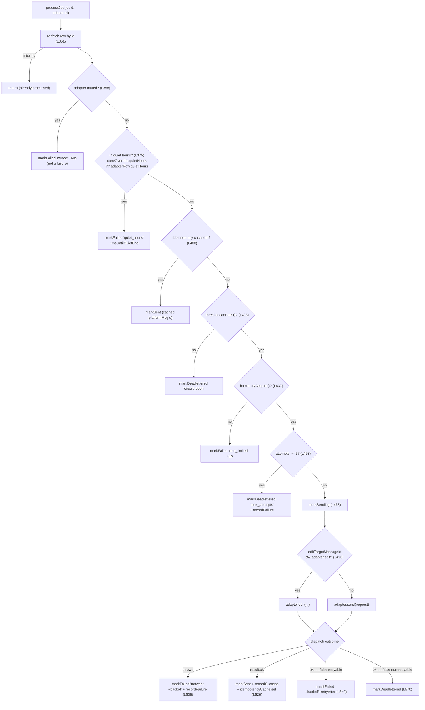
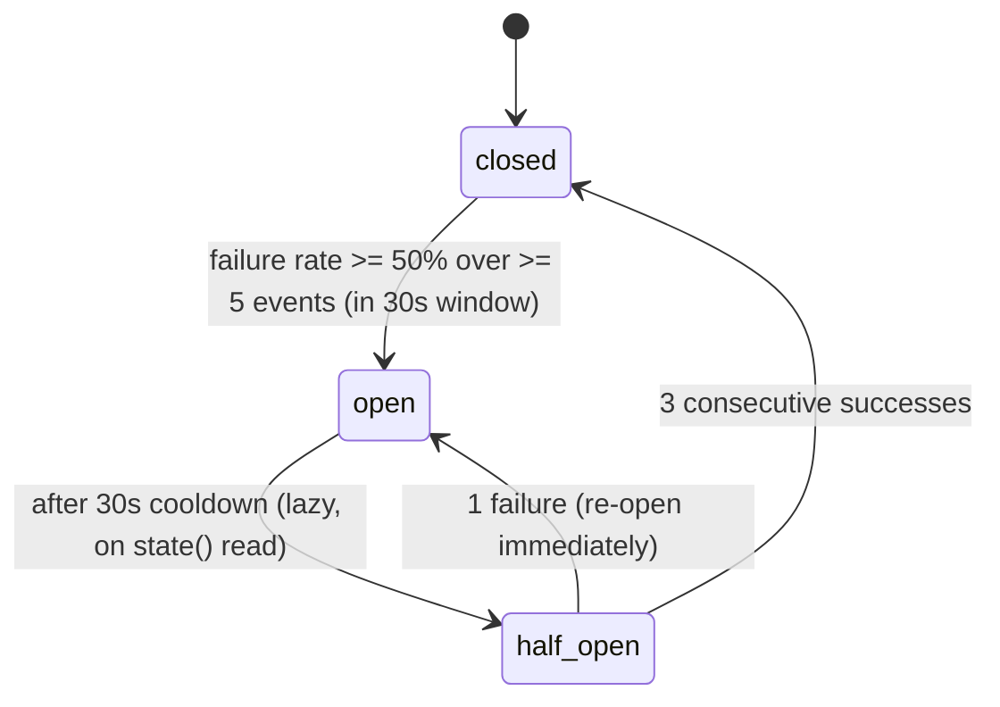

# 出站队列与投递

<Status variant="stable" />

<TLDR>
助手发往平台的每一条回复都是 Dexie `outboundQueue` 表中的一行持久化记录，而非对适配器的直接调用。一个由唤醒驱动的单一循环——`startOutboundRunner`（`lib/connectors/outbound-runner.ts:284`）——把到期的行排空进按会话的 FIFO 通道，并让每个作业依次穿过一条有序关卡链：重新拉取 → muted → 静默时段 → 幂等 → 熔断器 → 令牌桶 → 最大尝试次数 → 派发（`processJob`，`lib/connectors/outbound-runner.ts:345`）。失败会以指数退避 + 抖动重试，最多 `MAX_ATTEMPTS=5` 次，之后进入死信。循环从不忙轮询：它会休眠直到下一个重试截止时间（`peekNextWakeAt`）或一次新的入队唤醒（`subscribeOutboundEnqueued`，`lib/db/outbound-jobs.ts:64`）。两个调度器执行器（`lib/connectors/scheduled-outbound.ts:375`）为队列供给数据——一个直接发送，一个走完整 AI 回合——另有三个清理扫描负责修剪回调绑定、在软上限处老化队列，以及导出死信队列。
</TLDR>

<StatGrid>
  <Stat label="最大尝试次数" value="5" hint="MAX_ATTEMPTS——之后进入死信" />
  <Stat label="退避上限" value="60s" hint="MAX_BACKOFF_MS + 随机抖动" />
  <Stat label="令牌桶" value="20 / 5/s" hint="每个适配器的 capacity / refillPerSec" />
  <Stat label="熔断器阈值" value="50%" hint="在 30s 窗口内 >=5 个事件之上" />
  <Stat label="队列软上限" value="5000" hint="最旧的 pending 被老化为死信" />
</StatGrid>

出站投递是连接器流水线的**后半段**。[ConnectorBus](./connector-bus) 决定*是否*回复，[AI 与 A2UI](./ai-and-a2ui) 决定*说什么*；两者都以调用 `enqueueOutbound` 收尾。从那一刻起，runner 掌管可靠性——排序、重试、限流和熔断器——因此任何入站路径或工作流节点都不会因平台 API 缓慢或失败而阻塞。关于它在更大堆栈中的位置，请参阅[子系统概览](./index)。

## 队列

`outboundQueue` 是一张 Dexie 表（`lib/db/outbound-jobs.ts`），其行会穿过一个五状态生命周期。`OutboundJobStatus` 为 `"pending" | "sending" | "sent" | "failed" | "deadlettered"`；`OutboundJobSource` 将来源记录为 `"ai-run" | "manual" | "workflow" | "draft-approved"`，以便收件箱 UI 能为每一行打标签，审计日志能按来源下钻。

每次入队都汇聚到一个单一卡点：

```ts
// lib/db/outbound-jobs.ts:105 — the single enqueue chokepoint
export async function enqueueOutbound(input: EnqueueInput): Promise<OutboundJobRow> {
  const now = Date.now()
  const row: OutboundJobRow = {
    id: newId(), adapterId: input.adapterId,
    conversationKey: input.conversationKey, request: input.request,
    status: "pending", attempts: 0, createdAt: now,
    nextAttemptAt: input.nextAttemptAt ?? now,
    idempotencyKey: input.request.metadata.idempotencyKey,
    source: input.source,
    ...(input.source === "workflow" && input.sourceWorkflow
      ? { sourceWorkflow: input.sourceWorkflow } : {}),
  }
```

请求体是一个 `OutboundRequest`（`types/connectors/outbound.ts:4`）：`conversationRef`、`segments`、可选的 `replyTo` / `threadId` / `editTargetMessageId`（`types/connectors/outbound.ts:17`），以及一个 `metadata` 对象，其 `idempotencyKey` 是**必填**的（`types/connectors/outbound.ts:20`）。适配器以一个 `OutboundResult`（`types/connectors/outbound.ts:43`）作答：`ok`、可选的 `platformMessageId`、一个 `OutboundError`（`code`、`message`、`retryable`、`retryAfterMs?`，`types/connectors/outbound.ts:28`），以及任意段 `downgrades`。`newIdempotencyKey()`（`types/connectors/outbound.ts:54`）为不自带键的调用方包装了 `crypto.randomUUID()`。

### EventTarget 唤醒总线

runner 过去每 200 ms 忙轮询一次。如今它会休眠直到有可处理的变化发生，由一个 `EventTarget` 唤醒——`enqueueOutbound` 从上面那个单一卡点触发它——因此每条入队路径（`ai-run` / `manual` / `workflow` / `draft-approved`）都会唤醒循环，而无需每个调用点知道 runner 的存在（`lib/db/outbound-jobs.ts:56`）：

```ts
// lib/db/outbound-jobs.ts:64 — pure wake signal, no payload
export function subscribeOutboundEnqueued(handler: () => void): () => void {
  const listener = () => { try { handler() } catch (err) { /* log */ } }
  outboundBus.addEventListener(OUTBOUND_ENQUEUED_EVENT, listener)
  return () => outboundBus.removeEventListener(OUTBOUND_ENQUEUED_EVENT, listener)
}
```

依赖方向得以保持：runner 导入此模块；此模块不从 `lib/connectors` 导入任何内容。三个读取辅助函数驱动循环的调度：`listDueNow()`（`lib/db/outbound-jobs.ts:199`）通过 `[status+nextAttemptAt]` 复合索引，按最旧优先返回每一个 `nextAttemptAt <= now` 的 `pending`/`failed` 行；`peekNextWakeAt()`（`lib/db/outbound-jobs.ts:224`）返回最早的*未来*截止时间，使循环恰好休眠到那一刻；以及生命周期变更器 `markSending`（`lib/db/outbound-jobs.ts:257`，递增 `attempts`）、`markSent`（`lib/db/outbound-jobs.ts:271`）、`markFailed`（`lib/db/outbound-jobs.ts:279`，其 `nextAttemptAt` 驱动每一次退避/延后）和 `markDeadlettered`（`lib/db/outbound-jobs.ts:294`）。

当表越过 `OUTBOUND_QUEUE_SOFT_CAP=5000`（`lib/db/outbound-jobs.ts:38`）时，`enqueueOutbound` 调用 `enforceQueueSoftCap`（`lib/db/outbound-jobs.ts:142`），它将最旧的仍为 `pending` 的行以 `queue_capped` 代码老化为 `deadlettered`，并各自发出一行审计。只有 `pending` 行会被老化——`sending`/`failed` 仍在途中，终态行已经完成。

## 泵的关卡链

`processJob(jobId, adapterId)`（`lib/connectors/outbound-runner.ts:345`）是投递的核心。它**严格按顺序**运行——每个关卡要么使作业短路（标记 + 审计 + 返回），要么落入下一个。第一个触发的关卡胜出：



按顺序，关卡链是：

1. **重新拉取**按 id 拉取该行（`outbound-runner.ts:351`）——某次先前的通道执行可能已递增 `attempts`；行缺失则静默返回。
2. **Muted**（`outbound-runner.ts:358`）——若 `adapterRow.muted === true`，`markFailed("muted", …)` 延后 `+60_000` ms。不计为失败（熔断器不受影响）。
3. **静默时段**（`outbound-runner.ts:375`）——有效窗口为 `convOverride.quietHours ?? adapterRow.quietHours`，因此同一个机器人可以为每个聊天设置不同的值守窗口。若 `isInQuietHours` 为真，则 `markFailed("quiet_hours", …)` 延后 `msUntilQuietEnd`。
4. **幂等短路**（`outbound-runner.ts:408`）——若 LRU 已持有此 `idempotencyKey`，说明平台已确认；以缓存的 `platformMessageId` 执行 `markSent`，并审计 `delivery.success`（`idempotency_cache_hit`）。
5. **熔断器**（`outbound-runner.ts:423`）——若 `!breaker.canPass()`，则 `markDeadlettered("circuit_open", …)`。是死信而非重试：熔断器在其冷却期内保持打开。
6. **令牌桶**（`outbound-runner.ts:437`）——若 `!bucket.tryAcquire()`，则 `markFailed("rate_limited", …)` 延后 `+1_000` ms，使下一个补充窗口重新拾取它。
7. **最大尝试次数**（`outbound-runner.ts:453`）——若 `job.attempts >= MAX_ATTEMPTS`，则 `markDeadlettered("max_attempts", …)` **并** `breaker.recordFailure()`。
8. **markSending**（`outbound-runner.ts:468`）——翻转状态并递增 `attempts`。
9. **编辑 vs 发送派发**（`outbound-runner.ts:490`）——若请求携带 `editTargetMessageId` 且适配器实现了 `edit()`，则路由到 `adapter.edit()` 进行原地更新；否则 `adapter.send()`（并且，若请求了编辑但不受支持，则审计 `edit_unsupported` 回退）。
10. **结果**：**抛出**错误 → `markFailed("network", …)` + 退避 + `recordFailure`（`outbound-runner.ts:509`）；**`result.ok`** → `markSent` + `recordSuccess` + `idempotencyCache.set` + 审计 `delivery.success`（`outbound-runner.ts:526`）；**`result.ok === false`** → 若 `error.retryable`，则 `markFailed` 带退避 + `retryAfterMs`（`outbound-runner.ts:549`），否则立即 `markDeadlettered`（`outbound-runner.ts:570`）。

退避在尝试次数上呈指数增长，设有上限，并带随机抖动以使各适配器间的重试去相关：

```ts
// lib/connectors/outbound-runner.ts:511 — exponential backoff + jitter
const backoff = Math.min(MAX_BACKOFF_MS, BASE_BACKOFF_MS * 2 ** job.attempts) + jitter()
```

常量：`MAX_ATTEMPTS=5`（`outbound-runner.ts:137`）、`BASE_BACKOFF_MS=1_000`（`:138`）、`MAX_BACKOFF_MS=60_000`（`:139`）、默认 `jitter = () => Math.random() * 500`（`:287`）。`startOutboundRunner` 在其 `AbortSignal` 中止时**解决（resolve）**，且**从不拒绝（reject）**（`outbound-runner.ts:284`）——每个投递错误都通过审计日志浮现，从不抛给调用方。空闲休眠是一张安全网，而非轮询：循环通常会精确唤醒（`DEFAULT_IDLE_CAP_MS=60_000`，`:147`）。

## 平台幂等

内存 LRU 与行证据去重（上文关卡 4）都关不上 `adapter.send()` 成功与 `markSent` 之间的崩溃窗口 —— ack 随 runner 一起死了，本地没有任何证据。这个窗口由每个 adapter 在 `ambiguousDelivery`（`types/connectors/runtime-capability.ts`）中声明的**平台侧**契约来关闭，且每个已上线平台都必须显式声明（`hasExplicitRuntimeCapabilityOverride`，由 `runtime-capability.test.ts` 钉住）：

| 平台 | `ambiguousDelivery` | adapter 透传的每消息令牌 | ack 丢失后的重试 |
| --- | --- | --- | --- |
| **lark** | `remote_idempotent` | 消息创建 `uuid` = `idempotencyKey` | 平台返回原消息 |
| **matrix** | `remote_idempotent` | `PUT …/send/{type}/{txnId}`，`txnId = idempotencyKey:<chunk>` | homeserver 返回同一 event id |
| **discord** | `remote_idempotent` | 每次消息创建都带 `nonce` + `enforce_nonce: true`（`discordNonce(idempotencyKey, index)`，FNV-1a → base36，≤25 字符，每个 REST 分片 / 语音 / 媒体通道各一个；Rust multipart 上传输出同样字段） | Discord 返回原消息（去重窗口“几分钟”—— 相对 ≥5 min 的 stale-`sending` 恢复 UNVERIFIED，因此行证据去重保留） |
| **qq-official** | `reconciliation_required` | 被动 `msg_seq = 1 + fnv1a(idempotencyKey) % 65535`（同一任务 → 同一 `msg_id + msg_seq`） | 平台**拒绝**重复对（死信 `platform_4xx`，错误码 UNVERIFIED）—— 不会静默双发，但也拿不到原 id |
| **slack / telegram / onebot / wecom / wechat-personal / wechat-oa / dingtalk** | `reconciliation_required` | 无 | 可能重复；审计轨迹 + `delivery_unknown` 状态是运营者对账的依据 |

契约测试 `lib/connectors/adapters/runtime-contract.test.ts` 断言每个 `remote_idempotent` adapter 确实把 key 打到了线上（Lark `uuid`、Matrix `txnId` 路径段、Discord `nonce` body 字段）。

## 按会话的 FIFO 通道

同一会话内的消息必须按 `createdAt` 顺序到达，但跨会话发送应当并行运行。runner 用一个 `Map<conversationKey, ConversationLane>` 同时实现两者。一个 `ConversationLane`（`outbound-runner.ts:189`）是一条 promise 链尾——每个入队的工作项都在前一个结算后运行：

```ts
// lib/connectors/outbound-runner.ts:193 — serialize per-conversation work
enqueue(work: () => Promise<void>): Promise<void> {
  this.tail = this.tail
    .then(() => work())
    .catch(() => {
      // Errors are handled inside `work`; lane must not stall on them.
    })
  return this.tail
}
```

排空循环在一遍中把每个到期行拉入其会话的通道，由一个 `inFlight` 集合守护，使得一个在 DB 中仍为 `pending` 的作业（因为 `markSending` 发生得*晚*，在关卡链的各关卡之后）不会被重复入队；通道的 `finally` 会清除该 id 并 `wake()` 循环，以防作业被重排到更早的截止时间。

幂等是一个按插入顺序排列、带上限的 `LruMap`（`outbound-runner.ts:151`，`IDEMPOTENCY_LRU_CAP=1000`，`:140`），以 `idempotencyKey` 为键。成功时 runner 记录 `platformMessageId`；之后命中同一键的重试会短路到 `markSent`，无需第二次适配器往返。淘汰为最旧优先：

```ts
// lib/connectors/outbound-runner.ts:168 — LRU set with oldest-eviction
set(key: K, value: V): void {
  if (this.map.has(key)) {
    this.map.delete(key)
  } else if (this.map.size >= this.cap) {
    this.map.delete(this.map.keys().next().value as K) // evict oldest
  }
  this.map.set(key, value)
}
```

runner 还把它的实时按适配器状态映射发布到一个模块级注册表，使心跳探针无需 runner 引用即可读取快照，途径是 `getAdapterRuntimeStateSnapshot(adapterId)`（`outbound-runner.ts:261`）——当没有 runner 在运行或该适配器尚未发送时返回 `null`。

## 熔断器

每个适配器都有一个滑动窗口熔断器（`lib/connectors/circuit-breaker.ts`）。runner 构造它时只传入 `now` + `onStateChange`（`outbound-runner.ts:307`），因此**所有五个阈值都使用其默认值**。该状态机有三个状态：



转换是惰性求值的。`evaluateThreshold` 仅在 `closed` 时触发，修剪窗口，要求满足 `minEvents`，并在失败率越过阈值时打开：

```ts
// lib/connectors/circuit-breaker.ts:120 — open only from closed, on rate
function evaluateThreshold(now: number): void {
  if (_state !== "closed") return
  pruneWindow(now)
  if (events.length < cfg.minEvents) return
  const failures = events.filter((e) => !e.success).length
  const rate = (failures / events.length) * 100
  if (rate >= cfg.failureThresholdPct) {
    openedAt = now
    transition("open", now)
  }
}
```

`recordSuccess`（`circuit-breaker.ts:133`）在 `closeOnSuccessCount` 次连续的半开成功后关闭熔断器（并重置窗口）；`recordFailure`（`circuit-breaker.ts:149`）在任何半开失败时立即重新打开；`state()`（`circuit-breaker.ts:162`）在 `cooldownMs` 过去后惰性地把 `open → half_open` 升级；`canPass()`（`circuit-breaker.ts:173`）仅在 `closed` 或 `half_open` 时返回真（半开状态恰好允许那些决定恢复与否的探测发送）。

| 选项 | 默认值 | 来源 |
| --- | --- | --- |
| `windowMs` | 30000 | `circuit-breaker.ts:41` |
| `minEvents` | 5 | `circuit-breaker.ts:42` |
| `failureThresholdPct` | 50 | `circuit-breaker.ts:43` |
| `cooldownMs` | 30000 | `circuit-breaker.ts:44` |
| `closeOnSuccessCount` | 3 | `circuit-breaker.ts:45` |

runner 把 `onStateChange` 接线为发出 `breaker.open` / `breaker.close` 遥测面包屑（`outbound-runner.ts:312`），使 [健康与审计](./health-audit) 面板能够重放熔断器历史。

## 令牌桶

限流是一个经典的令牌桶（`lib/connectors/rate-limit.ts`）。`createTokenBucket`（`rate-limit.ts:52`）以**满**状态启动；`refill`（`rate-limit.ts:59`）添加 `elapsedSec * refillPerSec` 个令牌，以 `capacity` 为上限；`tryAcquire(n=1)`（`rate-limit.ts:67`）仅在 `tokens >= n` 时扣除 `n`，否则返回 `false` 而不消耗任何东西（因此一次被拒的发送绝不会部分排空桶）。runner 把每个适配器调校为 **capacity 20 / refillPerSec 5**（`outbound-runner.ts:328`）——可突发 20，持续 5/s。一次被拒的获取会把作业延后 `+1_000` ms（上面的关卡 6），让下一个补充窗口重新拾取它。

## 定时出站

主动发送不等待入站事件。`installScheduledOutboundHandlers()`（`lib/connectors/scheduled-outbound.ts:375`）向 [调度器](../scheduler) 注册两个调度器 `TaskExecutor`：

- **`connection:outbound:send`** —— `handleOutboundSend`（`scheduled-outbound.ts:96`）校验载荷，通过 `parseConversationKey` 恢复平台，并以 `source: "manual"`（或 `"workflow"`）直接调用 `enqueueOutbound`。**无 AI**——由人类或一个 [可视化工作流](../visual-workflows) 节点排入一次未来发送（周期性提醒、时区感知的广播）。
- **`connection:scheduled:digest`** —— `handleScheduledDigest`（`scheduled-outbound.ts:346`）委托给 `runConnectorDigestTurn`（`scheduled-outbound.ts:197`），一个完整的 AI 回合：`resolveSendOptions` → 抑制关卡（静默时段 / muted / 强制手动）→ `injectedDigestSender`（默认为 `safeSendPrompt`，即 **PII 关卡**）→ `assistantReplyToSegments` → 以 `source: "ai-run"` 执行 `enqueueOutbound`。会话必须已经存在（`findSessionByConversationKey`）——定时摘要绝不自动创建会话，因为没有入站用户事件来播种对话上下文。

`runConnectorDigestTurn` 是一个无调度器耦合的纯异步函数，因此连接器回调通道可以复用同一套生产级 AI 循环，而无需注册额外的任务类型。回合内部细节请参阅 [AI 与 A2UI](./ai-and-a2ui)。

## 清理与诊断

四个支持模块保持队列健康且可观测：

- **`daily-schedule.ts`** —— 通用的 `startDailySchedule(options)`（`lib/connectors/daily-schedule.ts`）：一个 `setTimeout` 初始延迟（默认 60 s，使其不与应用启动争抢）交接给一个 `setInterval`（默认 24 h）。返回一个 `{ dispose, runNow }` 句柄；抛出的任务会被捕获并记录，因此一次失败绝不会终结整个计划。终态行保留清理（`sweepTerminalOutboundRows`）**不再**在此调度 —— 它是 `housekeeping-scheduler.ts` 中的托管调度任务 `connection:housekeeping:outbound-retention`，可跨重启存活并出现在调度器 UI 中。
- **`callback-binding-cleanup.ts`** —— `cleanupExpiredCallbackBindings(options?)`（`lib/connectors/callback-binding-cleanup.ts:60`）修剪 `expiresAt < now` 的 `connectorCallbackBindings` 行，外加没有 `expiresAt` 且早于 60 天宽限窗口（`LEGACY_GRACE_MS`，`:44`）的遗留行。`startCallbackBindingCleanupSchedule`（`:174`）以其自己的 24 h 定时器运行它，并将每次修剪审计为 `callback.binding_expired`。
- **`dlq-export.ts`** —— `buildDlqDownload(rows, format)`（`lib/connectors/dlq-export.ts:105`）把死信行渲染为 CSV 或 JSON，供设置面板交给浏览器下载流程。CSV 列集（`CSV_FIELDS`，`:13`）以 RFC-4180 转义往返 id / adapter / conversation / status / attempts / 时间戳 / `lastError` / `idempotencyKey`。
- **`derive-job-badge.ts`** —— `deriveJobBadge(inputs)`（`lib/connectors/derive-job-badge.ts:76`）是一个纯 UI 辅助函数，为一个队列行计算 `normal | paused-muted | paused-quiet-hours | circuit-blocked` 之一。它**复用 runner 的 `isInQuietHours` / `msUntilQuietEnd`**（`derive-job-badge.ts:25`），因此操作者看到的徽标与运行时应用的延后始终一致——同一个 `etaMs`（"42 分钟后恢复"）来自同一个安排了延后的函数。

那两个静默时段辅助函数正是为了让这个 UI 派生能够共享它们而从 runner 导出：`isInQuietHours(nowMs, from, to, tz)`（`outbound-runner.ts:53`）支持跨午夜窗口，而 `msUntilQuietEnd(nowMs, to, tz)`（`outbound-runner.ts:100`）是对窗口 `to` 时间下次出现前的毫秒数的 O(1) 计算。

## 相关

<Cards>
  <Card title="跨壳中继" href="./cross-shell-relay" description="手机或浏览器如何把回复送进这条队列，以及本地 runner 绝不能派发的镜像行。" />
  <Card title="ConnectorBus 与运行时" href="./connector-bus" description="其 ai-run 决策以入队一个出站作业收尾的入站流水线。" />
  <Card title="AI 与 A2UI" href="./ai-and-a2ui" description="runConnectorDigestTurn 背后的 resolveSendOptions、PII 关卡和 assistantReplyToSegments。" />
  <Card title="调度器" href="../scheduler" description="触发 connection:outbound:send 和 connection:scheduled:digest 的 TaskExecutor 宿主。" />
</Cards>
