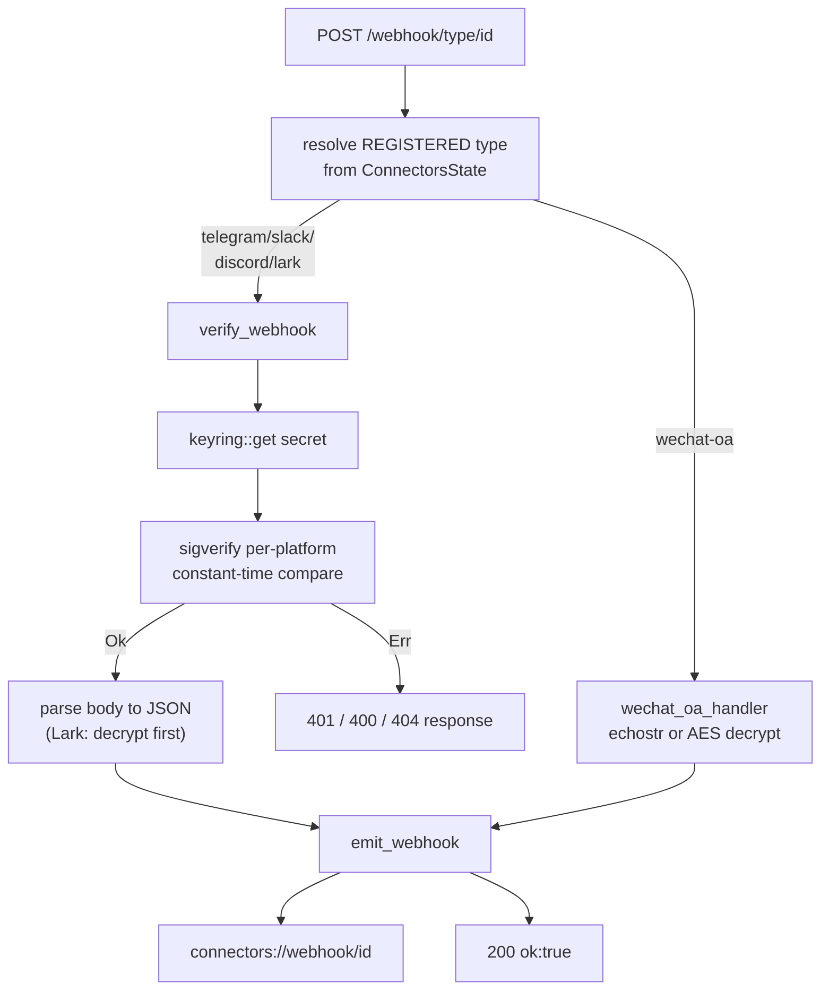
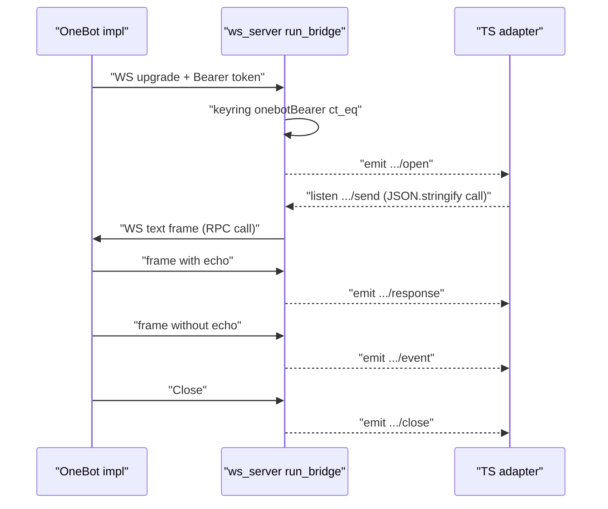

# Rust 层

<Status variant="stable" />

<TLDR>
  凡是连接器需要、而静态导出渲染端无法安全完成的工作，都落在 `src-tauri/src/connectors/` 中：带常量时间签名验证的入站 HTTP
  webhook 接收（`sigverify/*`）、长存活的 WebSocket 套接字（`ws_server.rs` 中的 OneBot 反向 WS、`ws_client.rs` 中的通用出站、
  `lark_ws.rs` 中的飞书 protobuf 长连接）、OS keyring 密钥托管（`keyring.rs`）、按主机限速的 HTTP 客户端（`http_client.rs`），
  以及一个 AES-256-GCM 磁盘附件缓存（`attachments.rs`）。axum 路由（`axum_app.rs`）按**已注册**的 adapter 类型——而非 URL 段——
  分发每个 `POST /webhook/{type}/{id}`，因此伪造路径无法跳过验证；随后在 `connectors://webhook/<id>` 上发出已解析（对飞书为已解密）
  的报文体。这一切都可由 TS 侧通过 `lib/connectors/tauri/commands.ts` 中的类型化封装抵达，它们 `invoke` 下列 21 个
  `#[tauri::command]`（`commands.rs`，注册于 `lib.rs`），并将入站流量呈现在四类 Tauri 事件通道上。
</TLDR>

<StatGrid>
  <Stat label="Rust 源文件" value="~14" hint="connectors/ + sigverify/" />
  <Stat label="Tauri 命令" value="21" hint="注册于 lib.rs" />
  <Stat label="签名算法" value="5" hint="telegram / slack / discord / lark / wechat" />
  <Stat label="事件通道族" value="4" hint="webhook / onebot / ws / lark-ws" />
</StatGrid>

这是 TS [adapter 模型](./adapter-model)与十一个[内置 adapter](./built-in-adapters) 之下的原生地基：adapter 调用
`lib/connectors/tauri/commands.ts` 中的类型化封装，后者 `invoke` 下文的 Rust 命令。Rust 层发出的入站帧由各 transport 消费，
并经[入站门控](./inbound-gating)处理；每个 adapter 如何宣告富内容见 [AI 与 A2UI](./ai-and-a2ui)。

## 为什么用 Rust

有三类工作被下沉到原生代码：

- **签名验证**必须在原始请求体与密钥相遇之处运行，既不跨越 IPC 边界、也不驻留于 JS 堆。每个平台的方案——Telegram 的密钥令牌头、
  Slack 的 HMAC-SHA256 basestring、Discord 的 Ed25519、飞书的 token + AES 解密、微信的 SHA-1 + AES——都在 `sigverify/*.rs`
  中以 `subtle::ConstantTimeEq` 常量时间比较实现，因此错误签名不泄露任何时序信息。
- **长存活套接字**——OneBot 的反向 WS 服务、Discord/Slack 出站网关，以及飞书的二进制 protobuf 长连接——需要持久的原生事件循环。
  静态导出渲染端没有服务、会在导航时丢失套接字；Rust 持有该循环，并经 Tauri 事件把帧桥接到渲染端。
- **密钥托管**位于 OS keyring（`keyring.rs`，服务 `com.cognia.platforms`）。诸如飞书 `appSecret` 之类的 App 密钥在 Rust 内部
  读取（`lark_ws.rs:273-274`），因此永不跨越 IPC。

HTTP/WS 服务**默认仅绑定回环**——`connectors_start_server` 的 `bind_loopback_only` 标志映射为 `LOCALHOST` 与 `UNSPECIFIED`
（`commands.rs:68-72`）——因此除非操作者显式选择，webhook 接收器不会暴露给局域网。

## axum Webhook 接收器

`axum_app.rs` 构建路由。`build_unresolved_router`（`axum_app.rs:71`）接好 `/health`、catch-all webhook 路由，以及 OneBot
WS 路由；`build_router` 再附上已解析的 `ConnectorsState`、`EmitterExt`（`connectors://webhook/<id>` 的 sink），并——仅在生产中
——附上反向 WS 桥接所需的 `AppHandleExt`。

```rust
// src-tauri/src/connectors/axum_app.rs:71-76
pub fn build_unresolved_router() -> Router<ConnectorsState> {
    let base = Router::new()
        .route("/health", get(health_handler))
        .route("/webhook/{adapter_type}/{adapter_id}", any(webhook_handler));
    ws_server::register_routes(base)
}
```

`webhook_handler`（`axum_app.rs:103`）从 `ConnectorsState` 解析 adapter 的**已注册**类型，把 WeChat-OA 分流到它专属的
`wechat_oa_handler`（`axum_app.rs:178`——GET `echostr` 握手 + POST `msg_signature` + AES 解密），其余则调用纯函数
`verify_webhook`（`axum_app.rs:261`）。`Ok` 时发出报文体并返回 `200`；`Err` 时返回验证器的状态（`axum_app.rs:138-144`）。

防伪造的关键在于丢弃 URL 的 `{adapter_type}` 段——验证完全按 adapter 注册时的类型分发：

```rust
// src-tauri/src/connectors/axum_app.rs:275-281
match adapter_type.as_str() {
    "telegram" => verify_telegram(adapter_id, headers, body).await,
    "slack" => verify_slack(adapter_id, headers, body).await,
    "discord" => verify_discord(adapter_id, headers, body).await,
    "lark" => verify_lark(adapter_id, body).await,
    _ => Err((StatusCode::BAD_REQUEST, "unsupported adapter type")),
}
```

每个逐平台验证器从 keyring 读取各自的凭证（`verify_telegram` 的 `secretToken` 在 `axum_app.rs:284`，`verify_slack` 的
`signingSecret` 在 L303，`verify_discord` 的 `publicKey` 在 L329，`verify_lark` 的 `verificationToken` + 可选 `encryptKey`
在 L354），调用匹配的 `sigverify` 函数，成功后把报文体解析为 JSON。飞书验证器还会在读取 token 前先解密
`{"encrypt":"<base64>"}` 事件（`axum_app.rs:367-377`），同时支持 schema-2.0（`header.token`）与旧版（顶层 `token`）。



## 签名验证

`sigverify/mod.rs` 声明五个验证器模块以及共享的 `SigError` 枚举（`Missing` / `Mismatch` / `Stale`）。每个验证器都不依赖
`AppHandle`，并被单独做单元测试。

| 平台 | 函数（`sigverify/<file>.rs`） | 方案 | 重放防护 |
| -------- | -------------------------------- | ------ | ------------ |
| Telegram | `verify_secret_token`（`telegram.rs:9`） | `X-Telegram-Bot-Api-Secret-Token` 常量时间相等 | — |
| Slack | `verify_v0`（`slack.rs:27`） | 对 `v0:<ts>:<body>` 做 HMAC-SHA256 → `v0=<hex>` | ±300 s 窗口 → `Stale` |
| Discord | `verify_ed25519`（`discord.rs:14`） | 对 `timestamp ++ body` 做 Ed25519 | — |
| Lark | `verify_token`（`lark.rs:21`）+ `decrypt_body`（`lark.rs:50`） | token 相等；AES-256-CBC 解密 | — |
| WeChat-OA | `verify_signature`（`wechat.rs:32`）/ `verify_msg_signature`（`wechat.rs:52`）/ `decrypt`（`wechat.rs:72`） | 排序拼接部分的 SHA-1；AES-256-CBC | — |

### Telegram

通过 `subtle::ConstantTimeEq` 做单次常量时间头比较：

```rust
// src-tauri/src/connectors/sigverify/telegram.rs:9-16
pub fn verify_secret_token(provided: Option<&str>, expected: &str) -> Result<(), SigError> {
    let provided = provided.ok_or(SigError::Missing)?;
    if provided.as_bytes().ct_eq(expected.as_bytes()).into() {
        Ok(())
    } else {
        Err(SigError::Mismatch)
    }
}
```

### Slack

构造 `v0:<ts>:<body>` basestring，以签名密钥做 HMAC-SHA256，格式化为 `v0=<hex>` 并常量时间比较——在此之前已将早于 300 s 的
请求作为 `Stale` 拒绝：

```rust
// src-tauri/src/connectors/sigverify/slack.rs:45-54
let base_string = format!("v0:{}:{}", timestamp, String::from_utf8_lossy(body));

let mut mac = HmacSha256::new_from_slice(signing_secret.as_bytes())
    .expect("HMAC can take key of any size");
mac.update(base_string.as_bytes());
let result = mac.finalize().into_bytes();
let expected_hex = format!("v0={}", hex::encode(result));

// Constant-time comparison
if !bool::from(
    expected_hex
        .as_bytes()
```

### Discord

被签名的消息是 `timestamp` 字节与报文体的拼接；十六进制签名与公钥经解码后用 `ed25519_dalek::VerifyingKey::verify` 验证：

```rust
// src-tauri/src/connectors/sigverify/discord.rs:28-35
    let signature = Signature::from_bytes(&sig_bytes);
    let verifying_key = VerifyingKey::from_bytes(&key_bytes).map_err(|_| SigError::Mismatch)?;

    // Message = timestamp bytes ++ body bytes
    let mut message = timestamp.as_bytes().to_vec();
    message.extend_from_slice(body);

    verifying_key
```

### Lark

`verify_token` 是对事件头 token 的普通相等比较；加密事件先被解密。AES 密钥为 `SHA-256(encrypt_key)`，IV 为解码后密文的前 16
字节，报文体为带 PKCS#7 填充的 AES-256-CBC：

```rust
// src-tauri/src/connectors/sigverify/lark.rs:52-75
    let digest = Sha256::digest(encrypt_key.as_bytes());
    let key_arr: [u8; 32] = digest
        .as_slice()
        .try_into()
        .map_err(|_| SigError::Mismatch)?;

    // Base64-decode the ciphertext
    let raw = BASE64
        .decode(encrypted_b64)
        .map_err(|_| SigError::Mismatch)?;

    if raw.len() < 16 {
        return Err(SigError::Mismatch);
    }

    // IV = first 16 bytes; ciphertext = remainder
    let (iv, ciphertext) = raw.split_at(16);

    let iv_arr: [u8; 16] = iv.try_into().map_err(|_| SigError::Mismatch)?;

    // Decrypt with PKCS#7 unpadding (cbc 0.2 / cipher 0.5 API)
    let decryptor = Aes256CbcDec::new(&key_arr.into(), &iv_arr.into());
```

### WeChat-OA

签名是按字典序排序后各部分的 SHA-1 十六进制——GET URL 验证用 `[token, ts, nonce]`，POST 消息签名用
`[token, ts, nonce, encrypt]`。“安全模式”随后用 AES-256-CBC 解密，手动剥除 block-32 PKCS#7 填充（填充值可能超过 AES 块大小），
再读取 `random(16) ++ msg_len(4 BE) ++ msg ++ appid` 布局：

```rust
// src-tauri/src/connectors/sigverify/wechat.rs:94-104
    let pad = *plain.last().ok_or(SigError::Mismatch)? as usize;
    if pad == 0 || pad > 32 || pad > plain.len() {
        return Err(SigError::Mismatch);
    }
    plain.truncate(plain.len() - pad);

    // Layout: random(16) ++ msg_len(4, big-endian) ++ msg ++ appid.
    if plain.len() < 20 {
        return Err(SigError::Mismatch);
    }
    let msg_len = u32::from_be_bytes([plain[16], plain[17], plain[18], plain[19]]) as usize;
```

## OneBot 反向 WS 桥接

OneBot adapter 是拨入 cognia，而非反之。`ws_server.rs:83` 注册 `/ws/onebot/{adapter_id}`；处理器从 keyring 读取
`onebotBearer` token 并验证 `Authorization: Bearer …` 头——未配置 token 时接受升级（开发态免鉴权），配置了 token 则常量时间比较，
否则返回 `401`（`ws_server.rs:97-124`）。

升级完成后，`run_bridge`（`ws_server.rs:142`）拆分套接字并：

- 订阅 `connectors://onebot/<id>/send`（TS adapter 发出 `JSON.stringify(call)`；监听器解码一层并把 call 作为 WS 文本帧转发，
  `ws_server.rs:150-158`），并在重连时驱逐前一连接的监听器；
- 发出 `connectors://onebot/<id>/open`（`ws_server.rs:174`）；
- 用 `route_frame` 分类每个入站帧——带 `echo` 字段的帧是 API 响应 → `/response`，不带的是事件推送 → `/event`
  （`ws_server.rs:190-195`）；
- 断连时发出 `connectors://onebot/<id>/close`（`ws_server.rs:217`），但仅当它仍是已注册连接时（更新的重连不应被拆除）。

```rust
// src-tauri/src/connectors/ws_server.rs:190-195
                let topic = match route_frame(text) {
                    FrameRoute::Response => format!("connectors://onebot/{adapter_id}/response"),
                    FrameRoute::Event => format!("connectors://onebot/{adapter_id}/event"),
                    FrameRoute::Drop => continue,
                };
                let _ = app.emit(&topic, text.to_string());
```



## 通用出站 WS

`ws_client.rs` 是 Discord 网关与 Slack Socket Mode transport 背后那个感知代理的出站 WebSocket 客户端。`open_ws`
（`ws_client.rs:47`）拨号目标（当代理激活且不在 bypass 列表时遵循代理配置），返回稳定的 UUIDv4 句柄，并运行两个 pump：一个
mpsc → sink 出站 pump，以及一个发出 `connectors://ws/<id>/message` 的入站 pump。`ws_send`（`ws_client.rs:162`）向句柄的
通道推入；`ws_close`（`ws_client.rs:175`）发送 Close 并丢弃句柄。生命周期事件走 `connectors://ws/<id>/{open,message,close}`。

## 飞书 protobuf 长连接

飞书长连接讲一种通用 passthrough 无法解码的二进制 protobuf 帧（`pbbp2.Frame`），因此 `lark_ws.rs` 是专用客户端。该帧是手写的
`prost::Message` derive——没有 `.proto` / `build.rs`：

```rust
// src-tauri/src/connectors/lark_ws.rs:74-75
#[derive(Clone, PartialEq, ::prost::Message)]
pub struct Header {
```

`open`（`lark_ws.rs:272`）从 keyring 读取 `appId` / `appSecret`，并启动一个带指数退避（`1000 * 2^attempts`，上限 32 s）的
自重连循环。`connect_and_run`（`lark_ws.rs:329`）向 endpoint POST `{AppID,AppSecret}`，收到 `{URL,ClientConfig}`，逐字拨号
该 URL，运行 keepalive ping（默认 120 s），并对每个二进制消息做 `Frame::decode`。`handle_frame`（`lark_ws.rs:444`）按
`message_id`/`sum`/`seq` 重组分块报文、解压 gzip，在 `connectors://lark-ws/<id>/event` 上发出完整的 `event`/`card` 信封，
并以 `build_ack` 构造的 `200` Response 对每个数据帧确认：

```rust
// src-tauri/src/connectors/lark_ws.rs:137-140
fn build_ack(mut frame: Frame, biz_rt_ms: i64) -> Frame {
    frame.set_header(H_BIZ_RT, biz_rt_ms.to_string());
    let resp = serde_json::json!({ "code": 200, "headers": {}, "data": null });
    frame.payload = serde_json::to_vec(&resp).unwrap_or_default();
```

## OS Keyring

`keyring.rs` 在服务 `com.cognia.platforms`（`keyring.rs:12`）下封装 `keyring` crate 的 OS 后端，并以账户
`<adapter_id>:<credential>`（`keyring.rs:14`）为每个密钥定键。`set`（L24）、`get`（L33——`NoEntry` 映射为 `None`）与
`delete`（L45——`NoEntry` 视为成功）是原语；`list`（L60）探测每个传入的账户名并返回存在的子集，因为 OS keyring 不提供可靠枚举。
附件主密钥是唯一以**空** `adapter_id`、账户 `attachment-master-key` 存储的条目。

## HTTP 客户端（限速）

`http_client.rs:77` 的 `http_request` 是每个无需套接字的 adapter 的出站 HTTP 路径。它为每主机定键一个 30 请求/秒的令牌桶
（`DEFAULT_MAX_TOKENS = 30`，`http_client.rs:21-24`），在拨号前拒绝超额主机，施加 30 s 默认超时，并经共享代理配置路由——除非
URL 在 bypass 列表上。

## 加密附件缓存

`attachments.rs` 将远端媒体缓存到磁盘，并在静止时加密。`fetch_attachment`（`attachments.rs:40`）把缓存键导出为
`SHA-256("<adapter_id>:<remote_ref>")` → `<key>.enc`；命中缓存时解密并返回，完全不触网：

```rust
// src-tauri/src/connectors/attachments.rs:54-58
    if enc_path.exists() {
        let plaintext = decrypt_file(&enc_path)?;
        std::fs::write(&raw_path, &plaintext)
            .map_err(|e| format!("cache write failed: {e}"))?;
        return Ok(AttachmentRef {
```

未命中时它带上适配器提供的可选请求头去获取源、用 12 字节随机 nonce（前置于密文）做 AES-256-GCM 加密，并同时写入 `.enc`
密文 blob 与解密副本。可选请求头路径用于需要 Bearer 鉴权的 Matrix `mxc://` 下载。主密钥是来自 `OsRng` 的 32 字节，首次使用时自动生成进 keyring。

## 媒体上传

`media_upload.rs` 负责平台媒体库的反向路径：从远端 `sourceUrl` 或本地路径读取字节，套用适配器提供的上传请求头，把原始二进制
POST 到平台媒体库，并返回响应中的 `content_uri`。Matrix 用它在发送原生 `m.room.message` 媒体事件前上传图片、文件、语音与视频段。

## Tauri 命令面

`commands.rs` 恰好暴露 21 个 `#[tauri::command]`——渲染端唯一能抵达的入口点。它们注册于 `src-tauri/src/lib.rs`
（连同 `.manage(ConnectorsState)`），并经 `lib/connectors/tauri/commands.ts` 中的类型化封装调用。

| 行 | Rust 命令 | TS 封装 |
| ---- | ------------ | ---------- |
| `commands.rs:17` | `connectors_register_adapter` | `connectorsRegisterAdapter` |
| `commands.rs:27` | `connectors_unregister_adapter` | `connectorsUnregisterAdapter` |
| `commands.rs:37` | `connectors_health` | `connectorsHealth` |
| `commands.rs:57` | `connectors_start_server` | `connectorsStartServer` |
| `commands.rs:88` | `connectors_stop_server` | `connectorsStopServer` |
| `commands.rs:116` | `connectors_reset_all_ws` | `connectorsResetAllWs` |
| `commands.rs:109` | `connectors_keyring_set` | `connectorsKeyringSet` |
| `commands.rs:118` | `connectors_keyring_get` | `connectorsKeyringGet` |
| `commands.rs:126` | `connectors_keyring_delete` | `connectorsKeyringDelete` |
| `commands.rs:134` | `connectors_keyring_list` | `connectorsKeyringList` |
| `commands.rs:146` | `connectors_http_request` | `connectorsHttpRequest` |
| `commands.rs:155` | `connectors_ws_open` | `connectorsWsOpen` |
| `commands.rs:164` | `connectors_ws_send` | `connectorsWsSend` |
| `commands.rs:170` | `connectors_ws_close` | `connectorsWsClose` |
| `commands.rs:182` | `connectors_lark_ws_open` | `connectorsLarkWsOpen` |
| `commands.rs:190` | `connectors_lark_ws_close` | `connectorsLarkWsClose` |
| `commands.rs:222` | `connectors_onebot_probe` | `connectorsOnebotProbe` |
| `commands.rs:199` | `connectors_attachment_fetch` | `connectorsAttachmentFetch` |
| `commands.rs:241` | `connectors_media_upload` | `connectorsMediaUpload` |
| `commands.rs:216` | `connectors_lark_upload_file` | `connectorsLarkUploadFile` |
| `commands.rs:233` | `connectors_lark_upload_image` | `connectorsLarkUploadImage` |

`connectors_start_server` 接受一个 `bind_loopback_only` 标志，用以在 `LOCALHOST` 与 `UNSPECIFIED` 间选择
（`commands.rs:68-72`）；而 `connectors_ws_send` 命令被包在一个 `perf::guard` 中，使出站吞吐量显现于性能仪表盘。
`connectors_reset_all_ws` 会在连接器 bootstrap 时清理 Webview 硬刷新遗留的通用 WS 与 Lark 长连接句柄，避免旧 socket 继续投递重复入站事件。

## 事件通道

渲染端从不轮询——Rust 层在四类 Tauri 事件通道上推送入站流量与生命周期。下表中以前导 `…` 标注的通道用于替换 `<id>`。

| 通道 | 发出者 | 含义 |
| ------- | ------- | ------- |
| `connectors://webhook/<id>` | `axum_app.rs:47` | 已验证（飞书：已解密）的 webhook 报文体 |
| `connectors://onebot/<id>/open` · `/event` · `/response` · `/close` | `ws_server.rs:174,190-195,217` | 反向 WS 生命周期 + 已路由的帧（在 `…/send` 上监听） |
| `connectors://ws/<id>/open` · `/message` · `/close` | `ws_client.rs:122,139,149` | 通用出站 WS 生命周期 + 入站文本 |
| `connectors://lark-ws/<id>/event` · `/close` | `lark_ws.rs:479,312` | 飞书长连接事件信封 + 终止 close |

## 相关

<Cards>
  <Card title="内置 Adapter" href="./built-in-adapters" description="调用这些 Rust 命令的十一个 TS adapter。" />
  <Card title="Adapter 模型" href="./adapter-model" description="原生层之下的 PlatformAdapter 契约。" />
  <Card title="入站门控" href="./inbound-gating" description="这里发出的帧在入总线前于何处被门控。" />
  <Card title="AI 与 A2UI" href="./ai-and-a2ui" description="每个 adapter 如何在这些 transport 上宣告富内容。" />
</Cards>
