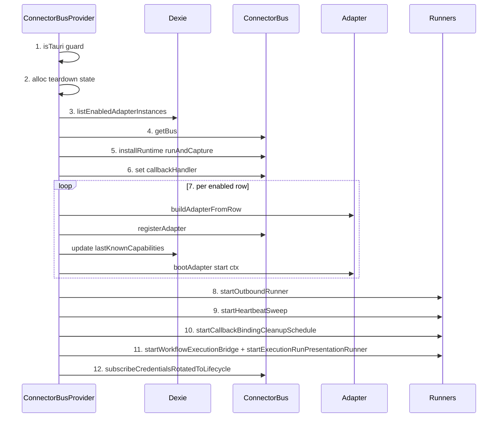
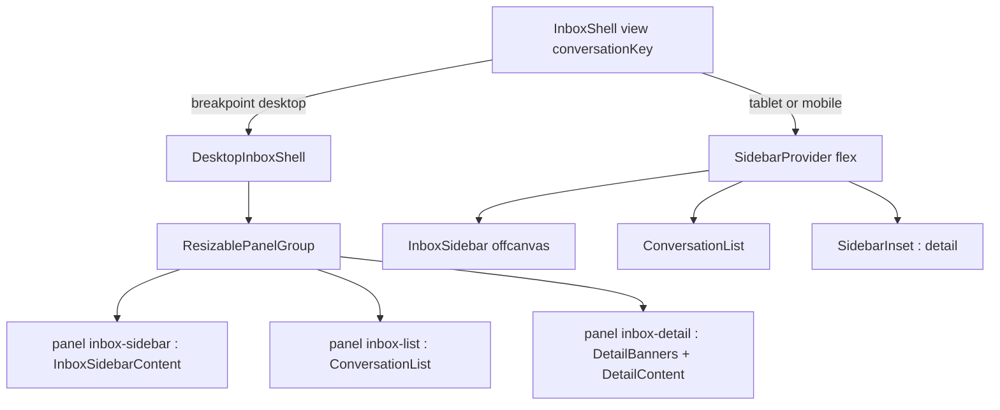
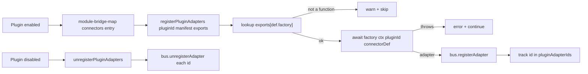

# 收件箱 UI 与插件扩展

<Status variant="stable" />

<TLDR>
平台连接器 UI 由单一的、仅在 Tauri 下生效的 React provider —— `ConnectorBusProvider`
—— 锚定，其唯一的 `useEffect` 运行一套严格的十二步启动流程：引导 bus 单例、接入运行时
与回调处理器、注册并启动每个已启用的适配器，并拉起四个后台 runner。操作者看到的一切
（三栏收件箱外壳、七标签连接设置、模式切换器、草稿编辑器、出站状态徽标）都是经由
`useLiveQuery` 对 Dexie 表的薄反应式视图。插件通过在 manifest 中声明 `connectors`
扩展适配器舰队；`registerPluginAdapters` 构建每个 factory 的适配器并交给同一个 bus
—— 没有新传输层，也没有特权路径。
</TLDR>

<StatGrid>
  <Stat label="连接设置标签" value="7" />
  <Stat label="启动步骤" value="12" />
  <Stat label="收件箱栏数" value="3" />
  <Stat label="插件契约字段" value="5" />
</StatGrid>

## 启动脊柱：ConnectorBusProvider

`ConnectorBusProvider({ children })`
（`components/connectors/connector-bus-provider.tsx:54`）是整个子系统的脊柱。它除了
渲染 `<>{children}</>` 之外什么都不做 —— 所有行为都在挂载时只触发一次的单个
`useEffect` 中。该 provider 在 Web 模式下是严格的 no-op：`if (!isTauri()) return`
（`connector-bus-provider.tsx:56`）在任何工作之前就直接退出，因为每个连接器传输层
（axum、keyring）都是仅存在于 Tauri 外壳中的 Rust shim。

启动是一套**有序的十二步序列**：

1. **Tauri 守卫** —— `if (!isTauri()) return`（`connector-bus-provider.tsx:56`）。
2. **拆卸状态** —— 分配清理闭包稍后读取的 `AbortController`、`cancelled` 标志与
   `startedAdapters` 数组（`connector-bus-provider.tsx:58-63`）。
3. **列出已启用行** —— `listEnabledAdapterInstances()`，置于一个吞掉
   `NotFoundError`（陈旧 IndexedDB schema）的 `try/catch` 中，而非让应用崩溃
   （`connector-bus-provider.tsx:148-167`）。
4. **获取 bus** —— `const bus = getBus()` 返回进程单例
   （`connector-bus-provider.tsx:170`）。
5. **安装运行时** ——
   `installRuntime(bus, { runAndCapture: runAndCaptureAssistantReply })` 将
   ai-run 分支接到一次真实的 Claude 回合（`connector-bus-provider.tsx:177`）。
6. **接入回调处理器** ——
   `bus.callbackHandler = defaultConnectorCallbackHandler`，让入站交互事件投射到
   匹配的 A2UI surface（`connector-bus-provider.tsx:183`）。
7. **适配器注册循环** —— 对每个已启用行：
   `buildAdapterFromRow` → `bus.registerAdapter` → 刷新
   `lastKnownCapabilities` → `bootAdapter`
   （`connector-bus-provider.tsx:187-212`）。
8. **启动出站 runner** ——
   `startOutboundRunner({ adapters, signal: ac.signal })`
   （`connector-bus-provider.tsx:217-218`）。
9. **启动心跳 sweep** —— 一个合并的 `startHeartbeatSweep()` 计时器服务每个运行中的
   适配器（`connector-bus-provider.tsx:225-226`）。
10. **启动回调绑定清理计划** ——
    `startCallbackBindingCleanupSchedule()` 每日修剪过期绑定
    （`connector-bus-provider.tsx:234-235`）。
11. **启动执行桥 + 运行呈现 runner** ——
    `startWorkflowExecutionBridge()`（`lib/execution/workflow-bridge.ts:143`）
    把 `workflowRuns` 镜像为持久的 `executionRuns` + 逐会话的
    `executionRunBindings`；`startExecutionRunPresentationRunner()`
    （`lib/connectors/run-presentation/runner.ts:715`）把这些绑定投射为原生运行
    卡片（飞书 / Slack 驱动）或经出站队列的感知能力后备
    （`lib/connectors/bootstrap/install-connector-runtime.ts:738-739`）。
12. **订阅凭据轮换 → 生命周期** ——
    `subscribeCredentialsRotatedToLifecycle()`，经由同一个 `AbortController` 解绑
    （`connector-bus-provider.tsx:250-255`）。

共享的启动主体现已迁入
`lib/connectors/bootstrap/install-connector-runtime.ts`（provider 调用
`installConnectorRuntime()`），并在第 9 与第 11 步之间多了几个启动 ——
`startLarkSurfaceSweep` / `startBindRequestExpirySweep`（`:722-723`）与
`startResumeReconnect`（`:732`）—— 本列表把它们并入 runner 阶段。

第 5、6 与 8–11 步 —— 运行时/回调接入与各 runner 的启动：

```ts
// components/connectors/connector-bus-provider.tsx:177-183
installRuntime(bus, { runAndCapture: runAndCaptureAssistantReply })
bus.callbackHandler = defaultConnectorCallbackHandler
```

```ts
// components/connectors/connector-bus-provider.tsx:217-242
const adapters = new Map(bus.listAdapters().map((a) => [a.id, a]))
void startOutboundRunner({ adapters, signal: ac.signal })
if (!cancelled) heartbeatSweep = startHeartbeatSweep()
if (!cancelled) cleanupHandle = startCallbackBindingCleanupSchedule()
```

```ts
// lib/connectors/bootstrap/install-connector-runtime.ts:737-739
if (!cancelled) {
  stopWorkflowExecutionBridge = startWorkflowExecutionBridge()
  stopExecutionRunPresentationRunner = startExecutionRunPresentationRunner()
```

### bootAdapter —— 单适配器生命周期

`bootAdapter(adapter, row, bus)`（`connector-bus-provider.tsx:77-146`）驱动单个
适配器走完其完整生命周期：`buildAdapterContext` → `adapter.start(ctx)` →
`registerRunningAdapter`（带一个 `restart` 闭包，会重读持久化行，从而让凭据轮换在
不重启应用的情况下生效）→ 审计 `adapter.started` → 立即触发一次
`recordHeartbeatNow`，使 Health 视图对这次（重）启动立刻有最新快照。`start()` 失败
被隔离：它以 `reason: "start_failed"` 审计 `adapter.error`、中止该适配器的信号，并
返回 `false`，而不会污染整个循环。

### 清理

effect 的返回闭包（`connector-bus-provider.tsx:258-296`）将 `cancelled = true`、
调用 `ac.abort()`、释放 cleanup/heartbeat/执行桥/呈现 runner 句柄，然后遍历
`listRunningAdapters()` 对每个执行 `unregisterRunningAdapter`（审计
`adapter.stopped`）。一个防御性的第二遍会停止 `startedAdapters` 中任何从未进入注册表
的裸句柄，从而不泄漏任何传输层。



## 收件箱外壳

`InboxShell()`（`components/inbox/inbox-shell.tsx:183`）是一个响应式三栏布局 ——
侧栏 / 会话列表 / 详情 —— 由共享的 `useBreakpoint()` hook 切换。`InboxView = "all" |
"by-adapter" | "by-platform" | "conversation"`（`inbox-shell.tsx:41`）驱动侧栏高亮
与列表筛选。

- **桌面（≥ 1024 px）** —— `DesktopInboxShell` 渲染一个 `ResizablePanelGroup`
  （`inbox-shell.tsx:123`），其三个面板（`inbox-sidebar` / `inbox-list` /
  `inbox-detail`）可拖拽，尺寸由 `useInboxLayoutStore` 播种并持久化。shadcn 的
  `<Sidebar>` 外壳*不*渲染；其内层内容（`<InboxSidebarContent />`）放在面板 1，但
  `SidebarProvider` 仍然挂载，从而让隐藏的 `SidebarTrigger` 保有有效的
  `useSidebar()` 上下文。
- **平板（768–1023 px）** —— `SidebarProvider` + flex 布局；侧栏初始折叠
  （`defaultOpen={!isTablet}`）以为详情栏腾出空间。
- **移动端（< 768 px）** —— 由 `conversationKey` 切换的单栏堆叠：
  `showList = !isMobile || !conversationKey` 与
  `showDetail = !isMobile || Boolean(conversationKey)`
  （`inbox-shell.tsx:212-213`）。侧栏变为离屏 Sheet。

两种布局都不再挂载自己的调色板：⌘/Ctrl+K 是统一全局搜索（ADR-0129），绑定平台的会话
是它的一个 provider（`lib/global-search/providers/system.ts`），因此在应用任何位置
搜索都能找到它们。



### 模式切换器

`ModeSwitcher({ conversationKey, sessionId, currentMode, onModeChange })`
（`components/inbox/mode-switcher.tsx:38`）渲染一个 badge 触发的下拉菜单，列出
`ALL_MODES`（auto / manual / draft）。`handleSelect`（`mode-switcher.tsx:47`）做
两件事：将新模式 `upsertByConversationKey` 写入 `conversationOverrides`，然后尽力而为地
`invoke("claude_interrupt", { session_id })` 以终止任何进行中的流，从而在操作者切换到
manual 或 draft 后，正在运行的 auto 模式回合不会继续写入。该 invoke 包裹在吞错的
`try/catch` 中 —— 它是安全阀，而非硬性门控。

### 草稿编辑器

`DraftEditor({ draft, onClose })`（`components/inbox/draft-editor.tsx:28`）在某会话
存在待处理草稿时渲染。它用 `useDraftApproval` 暴露可编辑的 `text` / `markdown` 段
（image / file / voice 与 A2UI 段以只读方式渲染）。批准时，`beforeApprove` 钩子以
provenance `source: "draft-approved"` 将编辑后的段入队到出站队列：

```tsx
// components/inbox/draft-editor.tsx:31-39
beforeApprove: async ({ segments: edited }) => {
  if (!draft.outboundPreview) return
  await enqueueOutbound({
    adapterId: draft.outboundPreview.conversationRef.adapterId,
    conversationKey: draft.conversationKey,
    request: { ...draft.outboundPreview, segments: edited },
    source: "draft-approved",
  })
},
```

### 出站状态徽标

`OutboundStatusPill({ jobId })`（`components/inbox/outbound-status-pill.tsx:45`）
对 `outboundQueue.get(jobId)` 执行 `useLiveQuery`，并将该行的状态经由
`STATUS_CONFIG`（`outbound-status-pill.tsx:34-43`）映射其五种状态 ——
`pending` / `sending` / `sent` / `failed` / `deadlettered`。`failed` 的任务会带一个
重试按钮，其 `handleRetry` 将该行重置为 `status: "pending"` 并刷新 `nextAttemptAt`。
配套的 `OutboundSourceBadge`（`outbound-status-pill.tsx:113`）展示来源：`workflow`
来源的任务链接到 `/workflows/{workflowId}/runs/{runId}#node-{nodeId}`；`manual` 与
`draft-approved` 渲染为纯色徽标；`ai-run`（主导路径）不渲染任何东西。

## 连接设置

`ConnectionsSection()`
（`components/settings/connections/connections-section.tsx:55`）是该子系统的设置主页。
活动标签经由 `?connectionsTab=` 查询参数与 URL 同步，缺省回退到 `overview`。它接入
**七个标签**（`TAB_IDS`，`connections-section.tsx:41-49`）：

> 注意：文件头部注释写着 "Phase 1 ships 4 tabs"
> （`connections-section.tsx:8-13`），但代码接入了七个 —— 头部注释已过时。当
> `usePlatform() !== "tauri"` 时会渲染一个 Web 模式 `Alert`
> （`connections-section.tsx:69` / `:81`），因为连接器只在 Tauri 外壳中运行。

| 标签 | id | Trigger | Content |
| --- | --- | --- | --- |
| Overview | `overview` | `connections-section.tsx:84` | `OverviewTab` (`:107`) |
| Adapters | `adapters` | `connections-section.tsx:87` | `AdaptersTab` (`:110`) |
| Conversations | `overrides` | `connections-section.tsx:90` | `ConversationsTab` (`:113`) |
| Outbound | `outbound` | `connections-section.tsx:93` | `OutboundTab` (`:116`) |
| Audit | `audit` | `connections-section.tsx:96` | `AuditTab` (`:119`) |
| Capability | `capability` | `connections-section.tsx:99` | `CapabilityMatrixTab` (`:122`) |
| Inbox assets | `assets` | `connections-section.tsx:102` | `InboxAssetsTab` (`:125`) |

共七个标签页。Conversations 的 id 是 `overrides` 而非 `conversations` ——
深链参数（`?connectionsTab=`）早于那次改名。这里没有独立的 Inbox 标签页：
原先的按适配器会话汇总已被 `/inbox` 路由取代；旧的 `?connectionsTab=tunnel`
链接现在落到 Overview，隧道卡片就在那里。两处缺席都由
`connections-section.test.tsx` 钉住。

## 实时数据绑定

几乎每个连接器 UI 表面都是经由 `useLiveQuery` 对 Dexie 的薄反应式投影 —— 无命令式
刷新，无手动订阅。bus 与 runner 写表；UI 重新渲染。

| 表 | 索引 / 键 | 消费者（经 useLiveQuery 读取） |
| --- | --- | --- |
| `sessions` | — | conversation-list、page-client |
| `messages` | `[sessionId+createdAt]` | 预览 / 未读计数 |
| `conversationOverrides` | conversationKey | 模式映射（由 mode-switcher 写入） |
| `connectorDrafts` | `[conversationKey+createdAt]` | draft-banner |
| `outboundQueue` | jobId | outbound-status-pill |
| `adapterInstances` | id | inbox-sidebar |
| `connectorCallbackBindings` | — | debug inspector |

## 插件适配器扩展

插件通过在 manifest 中声明 `connectors` 条目加入连接器舰队。渲染端的桥接
（`lib/plugin/bridge/connectors-bridge.ts:124`）刻意做得很薄：它只发现 factory 并接线；
策略、FIFO 排队与重试全部经由既有的 bus/runner 机制不变地流转。插件适配器运行在
渲染端（TypeScript），与内置适配器完全一致，并经由同样的
`lib/connectors/tauri/commands.ts` shim 触达 Rust 传输原语。

`registerPluginAdapters(pluginId, manifest, exports)`
（`connectors-bridge.ts:61`）读取 `manifest.connectors`，在插件的 `exports` 中查找每个
def 的 `factory`，await 该 factory，并将得到的适配器注册到 bus，把 id 收集到模块级的
`pluginAdapterIds` map（`connectors-bridge.ts:50`）：

```ts
// lib/plugin/bridge/connectors-bridge.ts:72-95
for (const def of defs) {
  const factoryFn = exports[def.factory]
  if (typeof factoryFn !== "function") {
    console.warn(`[connectors-bridge] plugin ${pluginId}: factory "${def.factory}" not found in exports — skipping`)
    continue
  }
  let adapter: PlatformAdapter
  try {
    adapter = await (factoryFn as AdapterFactory)({ pluginId, connectorDef: def })
  } catch (err) {
    console.error(`[connectors-bridge] plugin ${pluginId}: factory "${def.factory}" threw —`, err)
    continue
  }
  bus.registerAdapter(adapter)
  ids.push(adapter.id)
}
```

`unregisterPluginAdapters(pluginId)`（`connectors-bridge.ts:102`）对插件拥有的每个 id
执行 `bus.unregisterAdapter` 并删除该 map 条目。两者都经由
`lib/plugin/contracts/module-bridge-map.ts:163-173` 接入插件生命周期，它在插件
启用/禁用时将 `connectors` manifest 字段路由到 `register`/`unregister` —— 由于
factory 查找是按导出名而非按 per-entry importer，manager 从 loader 的缓存提供
`moduleExports`。

### PluginConnectorDef 契约

`manifest.connectors` 中的每个条目（由 `PluginManifest.connectors` 在
`types/plugin/plugin.ts:555` 引用）是一个五字段的 `PluginConnectorDef`
（`types/plugin/plugin.ts:928-942`）：

```ts
// types/plugin/plugin.ts:928-942
export interface PluginConnectorDef {
  /** Platform kind string (e.g. "telegram", "discord", or a custom string). */
  type: string
  /** Name of the exported factory function from the plugin's main entrypoint. */
  factory: string
  /** JSON Schema (draft-07) describing the per-instance settings shape. */
  configSchema: object
  /** Default trigger policy (optional — overridden by bus defaults if absent). */
  defaultTrigger?: Record<string, unknown>
  /** Transport modes this adapter supports. */
  transportModes: string[]
}
```



## 相关

<Cards>
  <Card title="跨壳中继" href="./cross-shell-relay" description="此处每个界面写入时经过的唯一 facade，以及它们为何都不按壳分支。" />
  <Card title="连接器总线" href="./connector-bus" description="provider 引导的单例：注册、分发管线、回调处理器。" />
  <Card title="出站队列" href="./outbound-queue" description="草稿编辑器入队、状态徽标订阅的 FIFO 队列。" />
  <Card title="健康与审计" href="./health-audit" description="启动与生命周期写入的心跳 sweep 与审计轨迹。" />
  <Card title="子系统索引" href="./index" description="平台连接器总览与 schema 版本。" />
  <Card title="插件系统" href="../plugin-system" description="manifest、生命周期，以及路由 connectors 的 module bridge map。" />
  <Card title="连接器适配器开发指南" href="../../plugin-dev/connector-adapters" description="如何编写插件连接器适配器及其 PluginConnectorDef。" />
</Cards>
