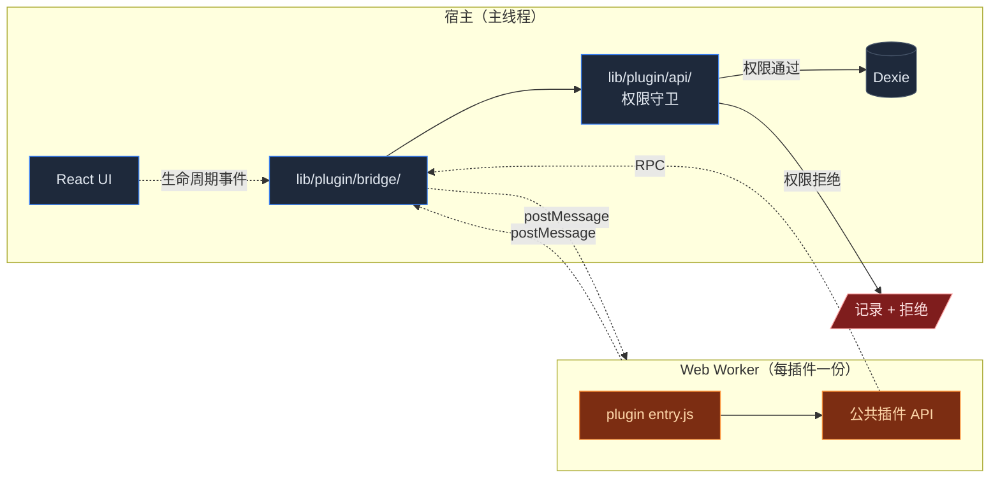
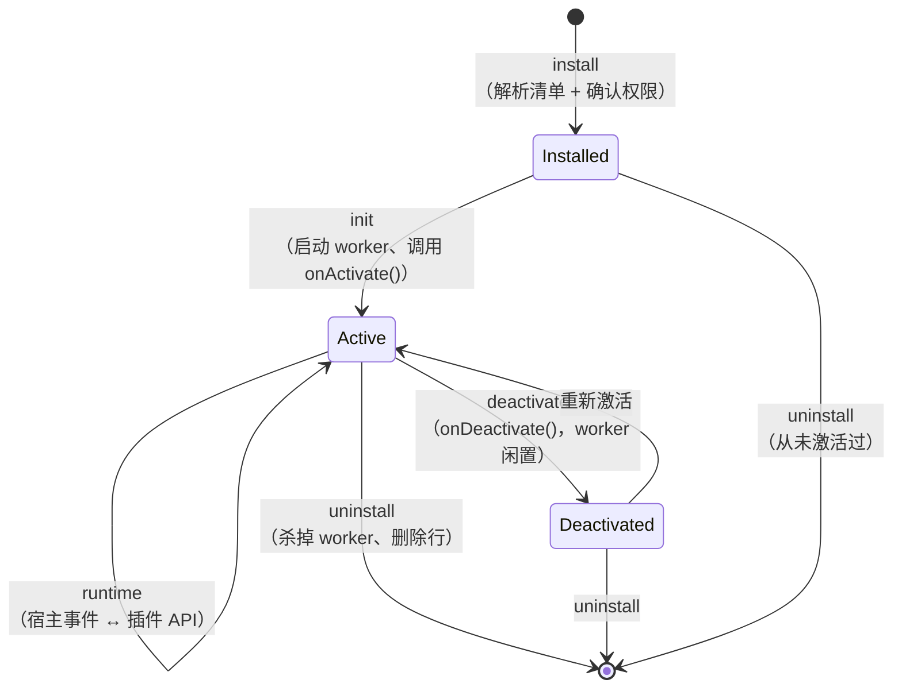

# 插件系统

<Status variant="experimental" />

<TLDR>
  每插件一个沙箱化 Web Worker、声明式 + 用户同意的权限、版本化 API 的 RPC 桥、丰富的扩展点矩阵，
  以及供分发的市场。插件以签名的 `.cognia-plugin` 归档发布，与宿主 DOM 隔离运行。 共 15 个 API
  命名空间、上百条扩展点合同（contracts），并能注册工作流节点、连接器适配器。
</TLDR>

<StatGrid>
  <Stat label="Dexie 表" value="5" hint="v15 引入，沿用至 v26" />
  <Stat label="API 命名空间" value="15" hint="见下表" />
  <Stat label="清单版本" value="v1" hint="Zod 校验" />
  <Stat label="沙箱" value="Worker" hint="postMessage RPC 桥" />
</StatGrid>

Cognia 提供沙箱化的插件运行时，让第三方代码扩展应用而不必 fork。插件可以：

- 在面板、聊天、画布、状态栏等扩展点注入 UI。
- 注册 MCP 服务器和技能资源。
- 声明定时任务（由[调度器](./scheduler)执行）。
- 注册[可视化工作流](./visual-workflows)节点和[平台连接器](./platform-connectors)适配器。
- 订阅生命周期事件（chat send / response、孪生 ingest 等）。

全部需要用户对每项权限明确同意。

## 代码位置

```text title="lib/plugin/ 概览"
lib/plugin/
  index.ts                # 顶层 barrel：导出 hook + validatePluginManifest
  api/                    # 15 个 API 命名空间的实现
  bridge/                 # 与宿主子系统的桥（a2ui / themes / tools / workflow / agent）
  contracts/              # 扩展点 / hook / activation / runtime 的契约清单
  core/                   # bootstrap / manager / registry / sandbox / loader / validation
  devtools/               # dev-server、hot reload、debugger、profiler
  lifecycle/              # 安装 / 卸载 / 更新 / 回滚 / 备份
  messaging/              # IPC、message bus、hooks-system
  package/                # 清单解析、catalog 条目
  scheduler/              # 插件侧定时任务注册
  security/               # 权限守卫、代码签名
  connectors-bridge.ts    # 把 manifest.connectors 注册进 ConnectorBus

lib/db/
  plugins.ts              # plugins 表（已安装插件）
  plugin-permissions.ts   # plugin_permissions 表
  plugin-reviews.ts       # plugin_reviews（市场评价缓存）
  plugin-analytics.ts     # plugin_analytics（每安装遥测）
  plugin-scheduled-jobs.ts# plugin_scheduled_jobs（插件注册的任务）
  plugin-bridge.ts        # plugin_bridge（宿主 ↔ 插件消息日志）
  plugin-types.ts         # 行类型

components/plugins/        # 设置 UI + 市场
```

5 张插件表在 [Dexie schema v15 引入](../data/storage#v15-插件表)，并在后续版本中无修改地保留至 v26。

## 清单格式

插件附带 `cognia-plugin.json`：

```jsonc
{
  "schemaVersion": 1,
  "id": "com.example.my-plugin",
  "name": "My Plugin",
  "version": "0.1.0",
  "description": "...",
  "author": "...",
  "icon": "icon.svg",
  "entry": "main.js",
  "permissions": [
    "chat.read",
    "chat.send",
    "twin.read",
    "scheduler.register",
    "fs.read:$DOWNLOADS",
  ],
  "surfaces": [
    { "kind": "panel", "id": "main", "title": "My Plugin" },
    { "kind": "chat-action", "id": "summarize", "label": "Summarize" },
  ],
  "scheduledJobs": [
    { "id": "daily-sync", "trigger": { "type": "cron", "expression": "0 9 * * *" } },
  ],
  "connectors": [{ "type": "custom-im", "factory": "./connectors/my-im.js" }],
  "workflowNodes": [{ "kind": "action.custom.report", "factory": "./workflow/report.js" }],
}
```

Schema 校验：`lib/plugin/core/validation.ts:validatePluginManifest`（一组 Zod schema）。任何字段缺失或不合规，安装即失败。

### 清单字段

<TypeTable
  type={{
    schemaVersion: {
      description: "清单格式版本。当前为 `1`。",
      type: "1",
      required: true,
    },
    id: {
      description: "反向 DNS 标识；用户已安装插件中必须唯一。",
      type: "string",
      required: true,
    },
    name: { description: "市场和设置中显示的名称。", type: "string", required: true },
    version: { description: "插件版本（semver）。", type: "string", required: true },
    description: { description: "安装对话框显示的简短描述。", type: "string" },
    author: { description: "自由格式作者标签。", type: "string" },
    icon: { description: "SVG 图标路径，相对清单。", type: "string" },
    entry: { description: "ES module 入口；加载到 worker。", type: "string", required: true },
    permissions: {
      description: "安装时申请的能力列表。",
      type: "string[]",
      required: true,
    },
    surfaces: {
      description: "插件贡献的 UI 输出层（面板、聊天动作）。",
      type: "Surface[]",
    },
    scheduledJobs: {
      description: "激活时希望向调度器注册的任务。",
      type: "ScheduledJob[]",
    },
    connectors: {
      description: "贡献给 ConnectorBus 的适配器（Telegram、Slack 等）。",
      type: "PluginConnectorDef[]",
    },
    workflowNodes: {
      description: "向可视化工作流注册的自定义节点。",
      type: "WorkflowNodeDef[]",
    },
  }}
/>

## 权限模型

`lib/plugin/security/` 强制：

- **预先声明** —— 插件调用的每个 API 必须在 `permissions[]` 列出。
- **用户同意** —— 安装对话框用人话展示权限摘要；用户逐项确认。
- **限定作用域** —— 文件系统、网络、资源权限要限定作用域（`fs.read:$DOWNLOADS` 而非 `fs.read:*`）。
- **可撤销** —— 用户可在 **设置 → 插件 → `<插件>` → 权限** 中关闭任意权限。
- **可审计** —— 每次 API 调用都写入 `plugin_bridge`（限量）。维护 tab 可看日志。

## 沙箱



插件运行在每安装一份的**专用 Web Worker** 中：

- 没有 DOM 访问（只能通过 `postMessage` 与宿主通信）。
- 没有直接网络访问 —— `fetch` 经由桥并受 `network.fetch:<origin>` 权限守护。
- 不能 import 宿主代码；只看公共插件 API。
- 卸载或禁用插件时被杀掉。

`lib/plugin/bridge/` 是宿主侧的 postMessage 通道，把强类型消息序列化回 worker。

## 生命周期



`lib/plugin/core/manager.ts` 是编排器；事件钩子在 `lib/plugin/messaging/hooks-system.ts` 注册 + 派发。备份、回滚、热更新分别由 `lib/plugin/lifecycle/{backup,rollback,updater}.ts` 处理。

## API 命名空间（15 个）

插件经由 `lib/plugin/api/` 调用版本化的 API。`api/index.ts` 是 barrel，依次导出 15 个 factory：

| 命名空间         | 文件                  | 能力                                                      |
| ---------------- | --------------------- | --------------------------------------------------------- |
| `session.*`      | `session-api.ts`      | 读会话/消息，发模板化消息                                 |
| `project.*`      | `project-api.ts`      | 读工程元信息、绑定的工作区与角色                          |
| `vector.*`       | `vector-api.ts`       | 查询活动向量库（不可 upsert，特权操作）                   |
| `theme.*`        | `theme-api.ts`        | 读当前主题 token、注册自定义主题、切换 light/dark         |
| `export.*`       | `export-api.ts`       | 调用单会话导出（Markdown / JSON / 美化 HTML / 动画 HTML） |
| `i18n.*`         | `i18n-api.ts`         | 读当前 locale、注册插件命名空间的翻译 key                 |
| `canvas.*`       | `canvas-api.ts`       | 读 / 写画板文档、注册画板侧工具                           |
| `artifact.*`     | `artifact-api.ts`     | 注册新的 artifact 渲染器与预览组件                        |
| `notification.*` | `notification-api.ts` | 弹 toast、发原生通知、注册可绑定动作                      |
| `aiProvider.*`   | `ai-provider-api.ts`  | 注册自定义 AI provider（用 OpenAI 兼容协议或自定义实现）  |
| `extension.*`    | `extension-api.ts`    | 把组件挂载到扩展点（chat header / sidebar / toolbar……）   |
| `permission.*`   | `permission-api.ts`   | 读 / 申请 / 撤销权限                                      |
| `media.*`        | `media-api.ts`        | 注册图像滤镜、视频效果、转场，并消费媒体管线              |
| `storage.*`      | `storage-api.ts`      | 每插件一份 KV 存储（小、有上限）                          |
| `crypto.*`       | `crypto-helpers.ts`   | 受限的 SubtleCrypto 桥，保证插件内不直接暴露 key 句柄     |

宿主侧实现与命名空间文件并列。每一处都先做权限守卫。除上述 API 外，sandbox 内还能用 `network.fetch` 与 `fs.*`（按 origin / 路径限定作用域，权限模型同上）。

### Bridge 集成

`lib/plugin/bridge/` 把命名空间接到具体子系统：`themes-bridge.ts` 喂回[主题运行时](../ui/theming-and-i18n)；`tools-bridge.ts` 接入 Claude builtin-tools；`agent-integration.ts` 把插件贡献的 agent 包装为可在 chat 选择的角色；`workflow-integration.ts` 把插件注册的工作流节点喂给 [`registerNodeExecutor`](./visual-workflows)；`a2ui-bridge.ts` 把 A2UI surface 渲染交给插件实现。`connectors-bridge.ts` 是更上层的入口，调用 `registerPluginAdapters(...)` 把 `manifest.connectors[]` 直接注册进 [ConnectorBus](./platform-connectors)。

## 扩展点与契约

`lib/plugin/contracts/plugin-points.ts` 是契约权威库：

- **`CANONICAL_EXTENSION_POINTS`** —— UI 槽位 ID（`chat.header` / `sidebar.left.top` / `toolbar.right` / `statusbar.center` / `canvas.toolbar` / `panel.footer` / `settings.general` …）。
- **`CANONICAL_HOOK_POINTS`** —— 事件 hook ID（`chat.before-send` / `chat.after-response` / `twin.ingest.completed` …）。
- **`CANONICAL_ACTIVATION_PATTERNS`** —— 触发激活的事件模式（`onView:<id>` / `onCommand:<id>` / `onLanguage:<lang>` …）。
- **`CANONICAL_RUNTIME_POINTS`** —— 运行时绑定点（`runtime.workflow.executor` / `runtime.connector.adapter` …）。

每条契约带 `binding`、`docs`、`requiredTests`、稳定性等元数据，runtime 校验器、SDK 一致性检查和文档生成器都消费同一份合同，避免漂移。

## 定时任务

插件通过 `scheduler.register({ id, trigger })` 注册任务。插件调度器（`lib/plugin/scheduler/`）：

1. 校验 trigger。
2. 写一行 `plugin_scheduled_jobs`。
3. 转给[调度器](./scheduler)，`type === "plugin"`，触发时调插件的 `onJob({ id, … })`。

插件被禁用 / 卸载时，其任务被墓碑标记，重启用前不再触发。

## 市场

`lib/plugin/package/` 内含一个市场客户端。插件以签名的 `.cognia-plugin` 归档（zip：清单 + 源码 + 签名）发布。

- 目录是一个静态 JSON feed（URL 可配置）。
- 评价从目录拉取，缓存到 `plugin_reviews`。
- 安装流：下载 → 验证签名 → 解析清单 → 显示权限对话框 → 解压 → 注册。

市场 UI 在 `components/plugins/`。

## Devtools

`lib/plugin/devtools/` 仅在开发模式可见的检查器：

- 宿主与 worker 间的实时消息日志。
- 权限决策（"已授权"、"被拒"、"被拒——权限缺失"）。
- 触发的定时任务及结果。
- 性能：每个 API 调用耗时（`profiler.ts`）。
- 本地 `dev-server.ts` 支持热加载未打包的源码包，配合 `hot-reload.client.ts` 在改动后秒级重载。

通过环境变量在 dev 中启用（`NEXT_PUBLIC_PLUGIN_DEVTOOLS=1`），生产隐藏。

## 内置插件运行时钩子

宿主把插件接入：

- **聊天发送** —— `chat.before-send` hook —— 插件可改写 / 取消。
- **聊天响应** —— `chat.after-response` hook —— 插件可后置处理。
- **孪生 ingest** —— 孪生 source 完成 ingest 时触发。
- **调度器事件** —— 每次定时任务运行时触发。
- **连接器入站** —— ConnectorBus 收到事件时分发。

插件在 `onActivate()` 中订阅。

## 在哪里入手

| 目标              | 文件                                                                     |
| ----------------- | ------------------------------------------------------------------------ |
| 加新权限          | `lib/plugin/contracts/plugin-capabilities.ts`，相应 API 命名空间内做守卫 |
| 加新 API 命名空间 | `lib/plugin/api/<name>.ts`，在 `api/index.ts` 加 `export`                |
| 加新扩展点 ID     | `lib/plugin/contracts/plugin-points.ts` 的相应数组                       |
| 改进沙箱          | `lib/plugin/security/`、`lib/plugin/core/sandbox.ts`                     |
| 调整市场 UX       | `components/plugins/`、`lib/plugin/package/`                             |

## 测试

- `lib/plugin/index.test.ts` —— 注册表与生命周期集成。
- `lib/plugin/utils/icon.test.ts` —— 图标解析（SVG sanitiser）。
- 每个 API 命名空间有对应 `*-api.test.ts`，验证权限守卫与返回形态。
- `lib/plugin/contracts/runtime-proof-audit.test.ts` —— 静态校验每条契约都有 binding / docs / tests 三要素。

## 下一篇

<Cards>
  <Card title="设置 UI" href="./settings-ui" description="插件设置入口、扩展点的可视形态" />
  <Card title="技能系统" href="./skills-system" description="插件可贡献内置技能与资源" />
  <Card title="可视化工作流" href="./visual-workflows" description="插件如何贡献 workflow 节点" />
  <Card title="平台连接器" href="./platform-connectors" description="插件如何贡献连接器适配器" />
  <Card
    title="桌面 handlers"
    href="../plugins/desktop-handlers"
    description="桌面侧的命令 / 协议钩子"
  />
</Cards>
