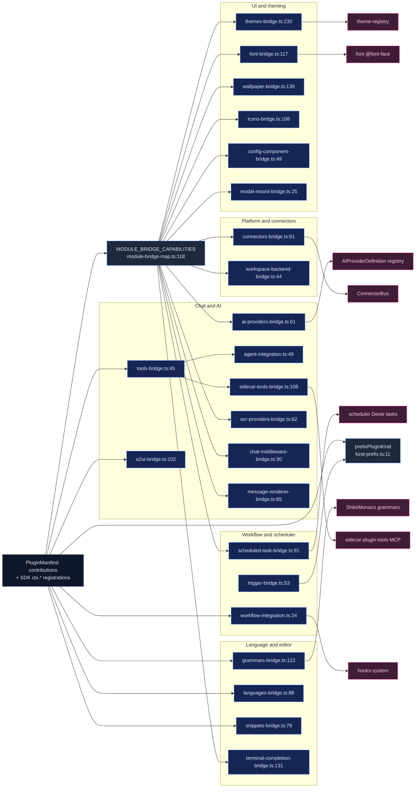

# 贡献桥接器

<Status variant="experimental" />

<TLDR>
  桥接器是「插件声明的贡献」与「宿主子系统」之间的接缝——声明可以是静态的 `manifest.*` 扩展点数组，
  也可以是命令式的 SDK `ctx.*` 注册；桥接器把声明的形状适配成宿主的原生接口，并以 `pluginId` 为键
  注册，从而实现幂等拆卸。大多数异步桥接器共享统一的 `register(manifest, installRoot, { importer })`
  与 `unregister(pluginId)` 契约，由 `PluginManager` 通过字段驱动表 `MODULE_BRIDGE_CAPABILITIES`
  （`module-bridge-map.ts:118`）通用派发：它依据 `manifest[manifestField]?.length` 对每个条目做门控，
  并在单个 await 循环里归一化 11 种签名（`:84-110`）。VS Code 风格的桥接器（语法、图标、语言、片段）是
  仅存储的注册表，由 `vscode-loader`/`context.ts` 驱动，而非此表；`index.ts`（`:5-22`）只重导出四个
  类桥接器（A2UI、Tools、Agent、Workflow）；`prefixPluginKind`（`kind-prefix.ts:11`）为贡献的
  工作流节点、触发器与目录 id 加命名空间。
</TLDR>

<StatGrid>
  <Stat label="桥接器文件" value="26" hint="lib/plugin/bridge/ TS，不含测试" />
  <Stat label="异步派发条目" value="11" hint="MODULE_BRIDGE_CAPABILITIES (module-bridge-map.ts:118)" />
  <Stat label="重导出的类桥接器" value="4" hint="A2UI · Tools · Agent · Workflow (index.ts:5-22)" />
  <Stat label="VS Code 存储桥接器" value="4" hint="grammars · icons · languages · snippets" />
  <Stat label="派发表" value="2" hint="module-bridge-map（异步）+ capability-bridge-map（同步叠加）" />
  <Stat label="拆卸键" value="pluginId" hint="按插件幂等 unregister" />
</StatGrid>

## 这是什么

桥接器是「插件*声明*的内容」与「宿主*运行*的内容」之间的接缝。插件以两种方式声明贡献：静态地，作为
manifest 上的扩展点数组（`manifest.themes`、`manifest.connectors`、`manifest.aiProviders` 等）；或
命令式地，在 `activate()` 内调用 SDK 的 `ctx.*` 注册（`ctx.agent.registerTool`、
`ctx.a2ui.registerComponent` 等）。桥接器接收这一声明形状，按需从插件安装根目录惰性导入工厂 `entry`，
将其适配成宿主的原生接口，并注册进宿主的实时注册表——始终以 `pluginId` 为键，使拆卸具备幂等性。

大多数异步桥接器暴露相同的契约：

```ts title="Uniform async bridge contract"
register(
  manifest: PluginManifest,
  installRoot: string,
  { importer }: { importer: ModuleImporter },
): Promise<{ registered: number; errors: BridgeError[] }>

unregister(pluginId: string): void | Promise<void>
```

`PluginManager` 从不按名字调用这些桥接器。它遍历字段驱动表 `MODULE_BRIDGE_CAPABILITIES`
（`module-bridge-map.ts:118`），依据 `manifest[manifestField]?.length` 对每个条目做门控，并在单个
await 循环里归一化全部 11 种签名（`:84-110`）。VS Code 风格的桥接器（语法、图标、语言、片段）*不在*
此表中——它们是仅存储的注册表，由 `vscode-loader`/`context.ts` 驱动。桶文件 `index.ts`（`:5-22`）只
重导出四个类桥接器（A2UI、Tools、Agent、Workflow）。

`prefixPluginKind`（`kind-prefix.ts:11-16`）为每个贡献的工作流节点、触发器与目录 id 加命名空间，使
两个插件永不冲突：`trigger.foo` 变为 `trigger.${pluginId}.foo`（保留前导的 `trigger.`），其余一切
变为 `${pluginId}.${rawKind}`。

## 桥接器目录

| File | Consumes | Feeds | Key export(s) `:line` |
| --- | --- | --- | --- |
| `index.ts` | — | re-export barrel | `:5-22` |
| `kind-prefix.ts` | raw kind strings | id namespacing | `prefixPluginKind` `:11` |
| `tools-bridge.ts` | `PluginTool` (SDK `registerTool`) | renderer agent (`AgentTool`) + plugin store | `PluginToolsBridge` `:30`, `registerTool` `:45`, `convertToAgentTool` `:108`, `jsonSchemaToZod` `:177` |
| `sidecar-tools-bridge.ts` | enabled plugins' tools (store) | SDK sidecar `cognia-plugin-tools` MCP | `buildPluginToolsManifest` `:108`, `buildTerminalDockManifestEntries` `:61` |
| `agent-integration.ts` | plugin tools + modes (store) | agent tools/modes merge | `PluginAgentBridge` `:43`, `getPluginTools` `:49`, `getPluginModes` `:76`, `executeTool` `:114`, `mergeWithBuiltinTools` `:337` |
| `a2ui-bridge.ts` | `PluginA2UIComponent` / `A2UITemplateDef` (SDK) | A2UI catalog + surface lifecycle hooks | `PluginA2UIBridge` `:35`, `registerComponent` `:102`, `registerTemplate` `:206`, `createSurfaceFromTemplate` `:247`, `dispose` `:332` |
| `ai-providers-bridge.ts` | `manifest.aiProviders[]` | host `AIProviderDefinition` registry | `registerAiProvidersForPlugin` `:61`, `adaptLlmToHost` `:138`, `adaptEmbeddingToHost` `:176` |
| `ocr-providers-bridge.ts` | `manifest.ocrProviders[]` | OCR registry | `registerOcrProvidersForPlugin` `:62` |
| `workspace-backend-bridge.ts` | `manifest.workspaceBackends[]` | `WorkspaceProvider` registry | `registerWorkspaceBackendsForPlugin` `:44` |
| `message-renderer-bridge.ts` | `manifest.messageRenderers[]` | chat message-part renderer registry | `registerMessageRenderersForPlugin` `:65`, `isReservedPartType` `:56` |
| `connectors-bridge.ts` | `manifest.connectors[]` (factory in exports) | `ConnectorBus` adapters | `registerPluginAdapters` `:61`, `unregisterPluginAdapters` `:102` |
| `chat-middleware-bridge.ts` | `manifest.chatMiddlewares[]` | chat-middleware registry (exec gated off) | `registerChatMiddlewaresForPlugin` `:30` |
| `terminal-completion-bridge.ts` | `manifest.terminalCompletionProviders[]` + SDK | terminal completion registry (ADR-0039) | `registerTerminalCompletionProvidersForPlugin` `:131`, `adaptPluginCompletionProvider` `:59` |
| `scheduled-task-bridge.ts` | `manifest.scheduledTasks[]` | scheduler Dexie tasks (type `plugin`) | `registerScheduledTasksForPlugin` `:91`, `toTaskTrigger` `:60` |
| `modal-mount-bridge.ts` | `manifest.modalMounts[]` | plugin modal store | `registerModalMountsForPlugin` `:25` |
| `config-component-bridge.ts` | `manifest.configComponent` | per-plugin settings panel (on demand) | `loadConfigComponent` `:49`, `invalidateConfigComponentForPlugin` `:90` |
| `font-bridge.ts` | `manifest.fonts[]` | `<style>` `@font-face` + font-registry | `applyPluginFonts` `:117`, `revertPluginFonts` `:205`, `buildFontFaceRule` `:236` |
| `wallpaper-bridge.ts` | `manifest.wallpapers[]` | wallpaper registry (picker) | `applyPluginWallpapers` `:139`, `revertPluginWallpapers` `:173` |
| `themes-bridge.ts` | `manifest.themes[]` + `themePacks[]` | theme-registry + theme-pack-registry | `PluginThemesBridge` `:225`, `registerPluginThemes` `:230`, `registerPluginThemePacks` `:293`, `sanitizeCssVariables` `:119` |
| `grammars-bridge.ts` | `contributes.grammars[]` (TextMate) | Shiki/Monaco grammar store | `registerGrammar` `:122`, `unregisterGrammarsByPlugin` `:177`, `findGrammarByScopeName` `:210` |
| `icons-bridge.ts` | `contributes.iconThemes[]` | icon system + Monaco file-icon | `registerIconTheme` `:108`, `resolveFileIcon` `:172` |
| `languages-bridge.ts` | `contributes.languages[]` | language/mime detection + Monaco | `registerLanguage` `:88`, `detectLanguage` `:156` |
| `snippets-bridge.ts` | `contributes.snippets[]` (VS Code JSON) | Monaco completion + slash palette | `registerSnippetFile` `:79`, `listSnippetsForLanguage` `:139` |
| `trigger-bridge.ts` | plugin-emitted trigger events (SDK) | workflow orchestrator `dispatchTrigger` | `dispatchPluginTrigger` `:53` (uses `prefixPluginKind` `:57`) |
| `workflow-integration.ts` | plugin hooks (store) | hooks-system dispatch (chat/workflow/export/RAG lifecycle) | `PluginWorkflowIntegration` `:18`, `processMessageBeforeSend` `:24`, `getPluginWorkflowIntegration` `:176` |
| `terminal-dock-schemas.ts` | none (built-in) | JSON Schemas for 4 synthetic dock tools | `TERMINAL_DOCK_*_SCHEMA` `:24`/`:58`/`:82`/`:100`, `TERMINAL_DOCK_PLUGIN_ID` `:19` |

## 派发流程



## 通用桥接器范式

大多数异步桥接器遵循惰性工厂原型。`ai-providers-bridge.ts:73-98` 先清除旧状态，解析 SDK API，
逐个适配贡献，并记录每插件一份的销毁器列表：

```ts title="ai-providers-bridge.ts:73-98 (lazy-factory archetype)"
unregisterAiProvidersForPlugin(pluginId)
const api = createAIProviderAPI(pluginId)
for (const def of defs) {
  try {
    const adapted = await adaptProvider(def, pluginId, installRoot, importer, options)
    const unregister = api.registerProvider(adapted)
    unregistrars.push(unregister)
    registered++
  } catch (err) {
    errors.push({ pluginId, providerId: def.id, message })
  }
}
unregistrarsByPlugin.set(pluginId, unregistrars)
```

每个异步桥接器中都反复出现三种角色：

- **订阅/解析**——`adaptProvider`（`:100-113`）动态导入 `installRoot`/`entry` 并查找具名工厂。
- **变换**——`adaptLlmToHost`（`:138`）把缓冲式的 `complete()` 包装成
  `AsyncIterable<AIChatChunk>`。
- **注册 + 清理**——`api.registerProvider` 返回销毁器；拆卸时执行
  `unregisterAiProvidersForPlugin`（`:207-218`）。

`themes-bridge.ts:240-271` 展示了「收集错误」变体：每个贡献先用 `resolveContribution` 解析，再以加了
命名空间的 id `${pluginId}.${contributionId}` 注册，循环永不抛错，错误被收集起来；
`unregisterPluginThemes(pluginId)`（`:280`）是幂等的。

`kind-prefix` 命名空间在触发器接缝处可见：

```ts title="trigger-bridge.ts:57"
const prefixedKind = prefixPluginKind(pluginId, kind)
const registration = findAnyTriggerVersion(prefixedKind)
await dispatchTrigger({ workflowId, kind: prefixedKind as never, payload, originAt })
```

## 值得注意的桥接器

- **chat-middleware-bridge（`:30`）**——以 `priority`/`timeoutMs`（`:49-55`）注册每个
  `manifest.chatMiddlewares[]`。注册不等于执行：运行器 `runChatMiddlewareChain` 仅在默认关闭的开关后
  触发（`lib/claude/chat-middleware/feature-flag.ts`；`module-bridge-map.ts:216-232`）。禁用时清除
  熔断器（`:65`）。
- **tools-bridge 对 sidecar-tools-bridge**——进程内（`PluginToolsBridge:30`，`:177` 处的
  JSON-Schema 转 Zod，`:108-152` 处带实时 `execute` 的 `AgentTool`）对进程外
  （`buildPluginToolsManifest:108` 扁平化已启用插件的工具，剥离 `execute` 函数，sidecar 构建 MCP
  服务器并经 `plugin_tool_exec` 往返）。单次 `ctx.agent.registerTool()` 同时点亮两者。
- **workflow-integration（`PluginWorkflowIntegration:18`）**——通过 hooks-system 扇出插件生命周期
  *钩子*（而非自定义节点）；`processMessageBeforeSend:24-49`。
- **connectors-bridge（`:61`）**——调用每个 `manifest.connectors[].factory`（在插件导出中查找
  `:73-87`），调用 `bus.registerAdapter`（`:89`），并按插件追踪适配器 id（`:50`）以便拆卸（`:102`）。
- **ai-providers-bridge（`:61`）**——把缓冲式的 `complete`/`embed` 适配成流式
  `AIProviderDefinition`；提供方 id 加命名空间 `${pluginId}:${def.id}`（`:115`）。
- **a2ui-bridge（`PluginA2UIBridge:35`）**——把组件注册进 A2UI 目录，外面包一层注入上下文的 HOC
  （`createWrappedComponent:157`），并带有 `role="alert"` 的降级回退（`:177-186`）；`dispose` 在
  `:332`。
- **config-component-bridge（`loadConfigComponent:49`）**——按需；惰性导入
  `manifest.configComponent.entry`，按 `pluginId` 缓存（`:74`），以 null 回退到通用配置表单
  （`:76-81`），并在禁用/重载时失效（`:90`）。

## 陷阱

- **注册不等于执行（默认关闭）**——chat-middleware 在启用时注册，但仅在功能开关后运行
  （`chat-middleware-bridge.ts:14-16`）；终端坞工具仅当 `settings.terminal.exposeDockToAgents`
  为 true 时出现（`sidecar-tools-bridge.ts:64`，默认关闭 `:49`）；调度任务遵循
  `def.defaultEnabled === false`，会暂停新行（`scheduled-task-bridge.ts:128-130`）。
- **两张派发表**——`module-bridge-map.ts`（11 个异步/资产桥接器）对
  `capability-bridge-map.ts`（同步的内联定义叠加能力）。VS Code 风格的存储桥接器（语法、图标、语言、
  片段）两者皆不在——它们由 `vscode-loader`/`context.ts` 驱动。表头（`module-bridge-map.ts:24-27`）
  指出这 7 个桥接器虽已构建并测试，但在接线之前一直静默地空操作。
- **字段驱动门控 + 合成键**——派发依据 `manifest[manifestField]?.length` 门控；没有联合标签的能力
  （workspace-backend、message-renderer、chat-middleware、modal-mount、density-preset）使用合成键
  （`:148-162`）。
- **terminal-dock-schemas 不是插件**——它是内置能力
  （`TERMINAL_DOCK_PLUGIN_ID = "cognia:builtin:terminal-dock"`，`:19`），经由 plugin-tools 线路
  暴露，并在渲染端由 `terminal_dock_` 前缀派发（`:21-22`）。
- **异步 unregister**——调度器的 `unregister` 是异步的（它删除 Dexie 行，
  `module-bridge-map.ts:273-275`）；管理器会 await 全部。
- **幂等性 / 重新启用**——桥接器在 `register` 顶部清除该插件的旧状态
  （`ai-providers-bridge.ts:73`；字体/壁纸为替换而非追加 `:142-143`）。类桥接器保留仅供测试的
  `__reset…ForTesting` 单例。
- **保留命名空间 / 冲突**——`message-renderer-bridge` 拒绝宿主保留的 `partType`（`:46-54`）；
  语法/语言在跨插件 id 冲突时抛错（`grammars-bridge.ts:152`、`languages-bridge.ts:110`）；a2ui
  警告并覆盖（`a2ui-bridge.ts:106-112`）；主题对 CSS 变量做净化以防 `</style>` 注入
  （`themes-bridge.ts:143`），并拒绝 `vscodeJsonPath` 中的路径穿越（`:55-62`）。

## 下一步

<Cards>
  <Card title="契约与注册表" href="./contracts-and-registries" description="MODULE_BRIDGE_CAPABILITIES / capability-bridge-map 两张表，以及桥接器馈送的宿主注册表" />
  <Card title="上下文 API（ctx）" href="./context-api" description="命令式桥接器在 activate() 中消费的 ctx.* 注册面" />
  <Card title="核心运行时" href="./core-runtime" description="在启用/禁用时驱动桥接器 register/unregister 的 PluginManager 生命周期" />
</Cards>
