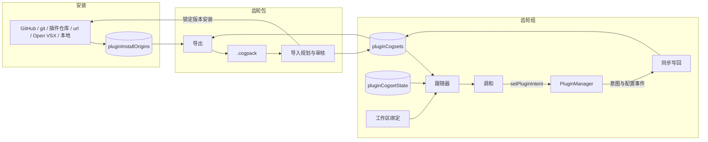

# 齿轮组、齿轮包与安装来源

<Status variant="experimental" />

<TLDR>
**齿轮组（cogset）**是一组一起运行的具名插件。切换是独占的：它的成员、宿主的常驻集以及它们的必需依赖会运行，其余全部关闭，不会卸载任何插件。**齿轮包（cogpack，`.cogpack`）**是签名的 zip，把每个成员锁定到确切修订：能重新获取的写引用，其余内嵌。每次安装都把**来源**记录到 `pluginInstallOrigins`，这使齿轮组能够被导出。决策记录：ADR-0209。
</TLDR>

<StatGrid>
  <Stat label="Dexie 表" value="4 张（v235）" />
  <Stat label="成员来源类型" value="7 种" />
  <Stat label="宿主命令" value="2 个伴随命令 + 2 个桌面命令" />
  <Stat label="生效齿轮组顺序" value="会话 → 工作区 → 全局" />
</StatGrid>

## 1. 代码位置

| 领域 | 路径 |
| --- | --- |
| 类型 | `types/plugin/plugin-cogset.ts` |
| 表 | `lib/db/plugin-cogsets.ts`、`lib/db/cogpack-installs.ts`、`lib/db/plugin-install-origins.ts` |
| 安装来源 | `lib/plugin/origin/install-origin.ts` |
| 齿轮组引擎 | `lib/plugin/cogset/`（plan、reconcile、write-through、follower、effective、bootstrap-default、actions、remote） |
| 齿轮包格式与导入 | `lib/plugin/cogpack/`（manifest、package、export、trust、resolvers、import、update-diff、plugin-tree） |
| 共享归档核心 | `lib/packaging/signed-zip.ts`、`lib/packaging/archive-path.ts` |
| 界面 | `components/plugins/cogsets/`、`components/plugins/cogpacks/`、`components/workspace/workspace-cogset-binding.tsx` |
| 启动 | `components/providers/initializers/plugin-cogset-initializer.tsx`、`lib/headless/runtimes/plugin-runtime.ts` |
| Rust | `crates/cognia-plugin-runtime/src/plugin_tree.rs`、`src-tauri/src/cli_bridge/mod.rs`（`plugin_install_from_files`）、`crates/cognia-plugin-runtime/src/wasm/installer.rs`（锁定提交的 git 检出） |

## 2. 整体结构



## 3. 安装来源

每个把插件文件写到磁盘的宿主命令，其调用模块都会调用 `recordInstallOrigin`（由 `lib/plugin/origin/install-paths.test.ts` 约束）：

| 来源 | 记录的来源信息 |
| --- | --- |
| GitHub | owner、repo、subdir 以及完整提交；分支或标签会在下载前解析为提交 |
| git（预构建 WASM） | URL 以及宿主实际检出的提交（`checkout_git_source`） |
| HTTP 插件仓库 | 插件仓库 URL、版本、校验和 |
| 签名 URL 安装包 | 安装包 URL、已校验的 sha256、签名 URL 和公钥 |
| Open VSX | namespace、name、版本、VSIX sha256、目标平台 |
| 安装包自带的插件 | builtin |
| 本地目录、WASM 文件、拖入的 VSIX、手动导入的清单 | local（不可重新获取） |

浏览器内置插件通过 `builtin://` 路径识别。缺少记录不会造成任何故障：该插件导出时按内嵌处理。在配对客户端上，记录会以 `plugin_install_origin_record` 发送到宿主。宿主以及备份恢复会用 `parseInstallOriginRecord` 校验这类记录，在写入前套用齿轮包成员来源的检查（https、完整提交、sha256）。

## 4. 切换齿轮组

`planCogsetActivation`（`lib/plugin/cogset/plan.ts`）在任何变更之前决定一切：

- **目标：**成员 ∪ 常驻集 ∪ 必需依赖闭包，按 `resolveLoadOrder` 排序。
- **停用：**目标之外的已启用插件，先停用依赖方。
- **问题：**未安装、在此宿主的运行时档位上被阻止；依赖缺失（`dependency-missing`）、无法在此运行（`dependency-disabled`）、版本不符（`dependency-version`）或形成循环（`dependency-cycle`）；版本与成员的 `expectedVersion` 不一致。每项都带有由界面翻译的结构化字段，每个未满足的依赖各占一条结果。
- **配置：**与插件当前配置不同的成员配置。插件自身的机密信息始终保留。

然后 `activateCogset`（`reconcile.ts`）保存正在离开的齿轮组的当前配置，依次停用、应用配置、启用。开关通过 `togglePluginEnabled` 进行，原因标记为 `cogset`。每个插件的结果保存为 `lastApplied`；任何非可选成员失败都会使结果变为 `partial`，“重试”会重新执行。

齿轮组处于应用状态时，`write-through.ts` 会让它保持最新：

- 手动启用会添加成员；
- 手动停用会移除成员，并把常驻插件移出常驻集；
- 修改设置会更新成员配置（不含机密信息）。

## 5. 运行哪个齿轮组

跟随器（`follower.ts`）计算生效齿轮组：会话覆盖，否则当前工作区的 `pluginCogsetId`，否则 `globalCogsetId`。当它与 `appliedCogsetId` 不一致时就激活它。只要执行代理中登记有任何运行任务，它就会等待，并在切换器中以 `pending` 展示等待状态。切换工作区会清除会话覆盖。在界面中切换时，如果有智能体正在运行会先请求确认，确认后立即切换。

首次运行时 `ensureDefaultCogset` 根据已启用的插件创建 **Default**，并将其同时设为全局和已应用，因此不会有任何可见变化。

## 6. 齿轮包文件

一个 zip，包含 `manifest.json`（RFC 8785 规范化 JSON），内嵌成员的文件位于 `plugins/<id>/` 下。每个文件都以 sha256 声明，因此对清单的 Ed25519 签名同样覆盖了这些文件。限制：压缩后 100 MB、解压后 300 MB、8192 个文件。

成员来源：`builtin`、`github`、`git`、`registry`、`url`、`openvsx`、`embedded`。机密配置字段永远不会写入；只有字段名通过 `secretFields` 随包携带。

## 7. 导入

`planCogpackImport` 校验文件并判定信任：

- **“要求签名”**拒绝未签名的齿轮包。
- **“仅限受信任发布者”**还会拒绝未知签名者。

然后用各来源已有的安装器在锁定修订上预览每个成员，并与已安装插件对比。审核在一个对话框中展示所有内容：

- 每个成员的权限、缺失的外部程序和冲突；
- 需要填写的机密字段；
- 齿轮包未携带的必需依赖；
- 激活后会被关闭的已安装插件；
- 如果之前导入过该齿轮包，则展示更新差异。

`applyCogpackImport` 安装用户批准的内容，把用户输入的机密信息写入插件配置，然后创建或更新齿轮组，并在 `cogpackInstalls` 中记录此次导入。特殊情况：

- **WASM 成员**按审核中展示的授权安装。
- **git 成员**无法预览，因此在安装完成后立即审核其能力。
- **内嵌成员**由宿主根据文件安装（`plugin_install_from_files`）。该命令接收审核过的成员 id，并拒绝以下情况：清单指向其他插件的树、仅大小写不同的重复路径（`plugin.json` 旁边的 `PLUGIN.JSON`）、NTFS 流、Windows 设备名，以及以点或空格结尾的名称。

无法打开的文件会按其 `PackageFormatError` 的代码（`lib/packaging/archive-path.ts`）给出说明：签名无效、校验和不符、未声明的文件、不安全的路径等，技术细节显示在下方。

## 8. 市场预设

GitHub 市场仓库可以在列出插件的同一个 `marketplace.json` 中把插件分组为预设（`lib/plugin/package/github-marketplace.ts`）。预设通过目录中的 `name` 引用插件：

```json
{
  "name": "acme-tools",
  "plugins": [
    { "name": "notes", "source": "./plugins/notes" },
    { "name": "pdf", "source": "./plugins/pdf" }
  ],
  "presets": [
    { "name": "Writer", "description": "Notes and PDF export", "plugins": ["notes", "pdf"] }
  ]
}
```

预设卡片会依次安装成员，每个成员都经过常规的安装前审核。目录中不存在的名称会在卡片上列为缺失。安装完成后，“保存为齿轮组”会把已安装的插件以及原本就存在的插件组成一个以该预设为来源的齿轮组。预设不锁定任何版本；齿轮包才是锁定版本、可携带的形式。

## 9. 配对客户端与备份

`pluginCogsets` 和 `pluginCogsetState` 以只读方式同步到配对客户端。配对客户端通过 `plugin_cogset_activate` 切换；其余编辑都在宿主上进行。备份携带齿轮组、齿轮包导入记录、安装来源、常驻集和全局选择，恢复时重新映射插件 id。

## 10. 注意事项

- 齿轮组只通过 `expectedVersion` 锁定版本。自动更新会保留会破坏当前齿轮组锁定版本的更新并改为提示用户，但用户主动发起的更新仍会改变插件版本。
- 通过 VS Code 文件安装的插件无法随齿轮包携带；导出对话框会列出它们。
- 删除齿轮组会删除指向它的 `cogpackInstalls` 记录，因此再次导入该齿轮包会新建齿轮组。
- 记录时的版本与当前安装版本不一致的来源不会被信任：该成员按内嵌处理。
- 预设仍然是目录条目。预设安装完成后，“保存为齿轮组”可以把已安装的插件变成一个齿轮组。
