# Context API（ctx）

<Status variant="experimental" />

<TLDR>
`ctx` 是传递给每个插件 `activate(ctx)` 的唯一运行时对象，在 `lib/plugin/core/context.ts` 中分两层装配：`createPluginContext`（`context.ts:181`）装配始终在线、内联定义的基础命名空间，`createFullPluginContext`（`context.ts:233`）则把 `lib/plugin/api/` 下每个 `create*API(pluginId)` 工厂展开合入同一个 `FullPluginContext`（`context.ts:297-317`），叠加扩展功能命名空间。所有触及宿主的命名空间均由 `createGuardedAPI`（`permission-guard.ts:777`）包裹——这是一个 Proxy，强制要求声明的权限，并将 `"confirm"` 级权限路由到异步同意经纪人（`permission-guard.ts:810-854`）。凭据剥离投影使 `ctx.subscription`、`ctx.connectors`、`ctx.backup`、`ctx.vector` 不会泄露密钥。
</TLDR>

<StatGrid>
  <Stat label="基础命名空间" value="21" hint="在 context.ts 内联定义" />
  <Stat label="扩展命名空间" value="~30" hint="lib/plugin/api/ 下的 create*API 工厂" />
  <Stat label="受保护表面" value="11 / ~34" hint="平台/触及宿主的文件使用 createGuardedAPI" />
  <Stat label="DANGEROUS 权限" value="git:write · terminal:* · connectors:send/manage · automation:*" hint="硬授权 + 同意" />
  <Stat label="同意层级" value="confirm" hint="异步同意经纪人，permission-guard.ts:810-854" />
  <Stat label="隔离" value="id 命名空间化" hint="<pluginId>:<localId> + 禁用时 clear*ForPlugin" />
</StatGrid>

## 1. 目的

`ctx` 是传递给每个插件 `activate(ctx)` 的唯一运行时对象，在 `lib/plugin/core/context.ts` 内部分两层装配：

- `createPluginContext`（`context.ts:181`）构建**基础上下文**——始终在线、本地定义的命名空间：`logger`、`storage`、`events`、`ui`、`a2ui`、`agent`、`settings`、`python`、`network`、`fs`、`clipboard`、`shell`、`db`、`shortcuts`、`contextMenu`、`tray`、`window`、`secrets`、`scheduler`、`workflow`、`dexie`。
- `createFullPluginContext`（`context.ts:233`）通过调用 `lib/plugin/api/` 下每个 `create*API(pluginId)` 工厂并展开合入同一个 `FullPluginContext`（`context.ts:297-317`），叠加**扩展功能命名空间**。聚合出口是 `lib/plugin/api/index.ts`。

触及宿主的命名空间由 `createGuardedAPI`（`permission-guard.ts:777`）包裹——这是一个 Proxy，拦截每次方法调用，强制要求声明的权限，并对 `"confirm"` 级权限路由到异步同意经纪人（`permission-guard.ts:810-854`）。

## 2. 命名空间目录

### 基础命名空间

在 `context.ts` 中内联定义。

| ctx.X | 来源 | 包裹 | 受控？ | 关键方法（:行） |
| --- | --- | --- | --- | --- |
| `ctx.logger` | `context.ts:331` | plugin logger | 否 | `createLogger` |
| `ctx.storage`（基础） | `context.ts:340` | localStorage | 否 | get/set/delete/keys/clear（`:357-381`） |
| `ctx.events` | `context.ts:389` | 内存 emitter（合并 ipc、bus `:274-278`） | 否 | on/off/emit/once（`:394-432`） |
| `ctx.ui` | `context.ts:456` | toasts / dialogs / statusbar | 否 | `showToast:483`、`showDialog:489`、`registerStatusBarItem:519` |
| `ctx.a2ui` | `context.ts:541` | useA2UIStore | 否 | `createSurface:545`、`updateComponents:553`、`registerComponent:574` |
| `ctx.agent` | `context.ts:588` | registry + agent-executor | 内联校验 manifest | `registerTool:590`、`executeAgent:615`（toolsEnabled 时需 `agent:control` `:630`）、`runExternalAgent:662`（`agent:dispatch-external` `:668`） |
| `ctx.settings` | `context.ts:757` | useSettingsStore | 否 | `get:762`、`set:770`、`onChange:781` |
| `ctx.python` | `context.ts:798` | Rust `plugin_python_*` | 限速器 | `call:801`、`eval:810`、`import:819` |
| `ctx.network` | `context.ts:865` | fetch / invokePluginApi | 限速器 | get/post `:917`、`download:934`、`upload:973` |
| `ctx.fs` | `context.ts:991` | Rust fs 网关 | 限速器（`fs:read`/`write`/`delete`） | `readText:1009`、`writeText:1030`、`watch:1109` |
| `ctx.clipboard` | `context.ts:1157` | navigator / Rust | 限速器 | `readText:1160`、`writeText:1176` |
| `ctx.shell` | `context.ts:1266` | Rust shell 网关 | 限速器 | `execute:1269`、`spawn:1274`、`open:1326` |
| `ctx.db` | `context.ts:1335` | Rust SQL 网关 | 限速器 | `query:1338`、`execute:1343`、`transaction:1348` |
| `ctx.shortcuts` | `context.ts:1390` | Rust 全局快捷键 | 否 | `register:1394`、`registerMany:1430` |
| `ctx.contextMenu` | `context.ts:1447` | Rust 右键菜单 | 否 | `register:1451`、`registerMany:1493` |
| `ctx.tray` | `tray-api.ts:29` | lib/tray/registry + Rust | 能力受控（`"tray"` 否则为空操作 `:14`） | `register` |
| `ctx.window` | `context.ts:1505` | Rust window 命令 | 否 | `create:1549`、`getMain:1556`、`focus:1558` |
| `ctx.secrets` | `context.ts:1578` | Rust keyring 网关 | 否 | store/get/delete/has（`:1580-1587`） |
| `ctx.scheduler` | `context.ts:~1592` | scheduler | 否 | scheduler API |
| `ctx.workflow` | `context.ts:214` | workflow 节点 / 触发器注册表 | 否 | 节点 / 触发器注册 |
| `ctx.dexie` | `dexie-api.ts:40` | 命名空间化 Dexie | 强制命名空间 | `table:20`、`rawDb:31` |

### 扩展命名空间

来自 `lib/plugin/api/`。

| ctx.X | 来源 | 包裹 | 受控？ | 关键方法（:行） |
| --- | --- | --- | --- | --- |
| `ctx.session` | `session-api.ts:35` | useSessionStore + messageRepository | 无 | `getCurrentSession:41`、`getSession:51`、`createSession:56` |
| `ctx.project` | `project-api.ts:20` | useProjectStore | 无 | `getCurrentProject:23`、`createProject:38`、`updateProject:45` |
| `ctx.vector` | `vector-api.ts:36` | createVectorStore / embeddings | 无 | `getStore:40`、search / upsert |
| `ctx.theme` | `theme-api.ts:84` | useSettingsStore theme | 无 | `getTheme:87`、`setMode:98`、`setColorPreset:107` |
| `ctx.export` | `export-api.ts:83` | export 工具 | 无 | export 方法 |
| `ctx.i18n` | `i18n-api.ts:19`（+loader 合并 `context.ts:281`） | next-intl + 插件 i18n loader | 无 | t、getLocale、onLocaleChange（`:287`） |
| `ctx.canvas` | `canvas-api.ts:252` | canvas / artifact store | 无 | canvas 操作 |
| `ctx.artifact` | `artifact-api.ts:36` | artifact 渲染器注册表 | 无 | `registerRenderer` |
| `ctx.media` | `media-api.ts:1146` | media 注册表 | 无 | 滤镜 / 特效注册 |
| `ctx.notifications` | `notification-api.ts:45` | 内存通知中心 | 无 | `create:48` |
| `ctx.ai` | `ai-provider-api.ts:111` | 动态 provider loader | 无 | `registerProvider:114` |
| `ctx.extensions` | `extension-api.ts:77` | 扩展点注册表 | governance + hasPermission 回调（`:88`） | `registerExtension:83` |
| `ctx.permissions` | `permission-api.ts:112` | 权限授予 store | 无 | hasPermission、request |
| `ctx.messagePart` | `message-part-api.ts:55` | message-part-renderers | 无（类型受限 `:26`） | `registerPartRenderer:30` |
| `ctx.ocr` | `ocr-api.ts:46` | lib/ocr/registry | 无 | `registerProvider:41`、`listRegistered:42` |
| `ctx.workspace` | `workspace-api.ts:48` | workspace-backend-registry | 无 | `registerBackend:38`、`listRegistered:44` |
| `ctx.modal` | `modal-api.ts:44` | plugin-modal-store | 无 | `openModal:33`、`openById:39`、`closeAll:41` |
| `ctx.chat` | `chat-api.ts:41` | chat-middleware 注册表 | 无 | `use:44` |
| `ctx.capabilities` | `capabilities-api.ts:34` | 平台检测 | 无（只读标志） | 返回 `{tauri,mobile,web,browser,platform}` `:37` |
| `ctx.git` | `git-api.ts:173` | lib/git/commands（活动仓库） | `git:read` / `git:write`（DANGEROUS） | `status:179`、`commit:199`、`push:208` |
| `ctx.goals` | `goal-api.ts:103` | getGoalRuntime | `goal:read` / `goal:write` | `get:108`、`create:116`、`decomposeSubgoals:136` |
| `ctx.subscription` | `subscription-api.ts:61` | subscription/core/transport + Dexie | `subscription:read`（只读） | `listAccounts:64`、`getUsage:76`、`onUsageUpdate:88` |
| `ctx.terminal` | `terminal-api.ts:175` | terminal dock（spawnFromDock） | `terminal:spawn`/`write`/`kill`/`completion`/`safety`（DANGEROUS） | `spawn:206`、`write:236`、`kill:243`、`classifyCommand:304` |
| `ctx.perf` | `perf-api.ts:42` | perf 后端 | `perf:read`（只读） | `snapshot:44`、`hotspots:45`、`subscribe:48` |
| `ctx.connectors` | `connectors-api.ts:248` | ConnectorBus + adapterInstances | `connectors:read`/`send`/`manage`（send、manage 为 DANGEROUS） | send / edit / delete + A2UI builder（`:35`） |
| `ctx.share` | `share-api.ts:51` | lib/share + shared-links Dexie | `share:read` / `share:create` | `create:53`、`revoke:54`、`getStats:57` |
| `ctx.backup` | `backup-api.ts:64` | buildExportEnvelope / importEnvelope | `backup:read` / `backup:write`（绝不含 API key） | `create:66`、`restore:75`、`listHistory:82` |
| `ctx.automation` | `automation-api.ts:101` | lib/automation/client（Computer Use） | `automation:read`/...（全部 DANGEROUS） | `capabilities:53`、`getFocus:54`、`readTree:56` |
| `ctx.companion` | `companion-api.ts:85` | 配对设备 + goal 运行时 | `companion:read`/`control`/`goal-control` | `listDevices:90`、`setRemoteControl:96`、`pauseGoal:114` |

辅助文件（非 `ctx.X`）：`crypto-helpers.ts`（AES-GCM `deriveKey:17`，被 Storage API 使用）；`message-part-renderers.ts`（`ctx.messagePart` 的底层注册表）。

## 3. 保护模式

接线方式统一：声明权限映射，用 `createGuardedAPI` 包裹原始 API，返回的 Proxy 拦截每个方法、调用 `guard.require`，并按需 await 同意。`git-api.ts:218-252`：

```ts
return createGuardedAPI(pluginId, api, {
  status: "git:read",
  log: "git:read",
  commit: "git:write",
  push: "git:write",
})
```

保护核心（`permission-guard.ts:810-854`）在不涉及 `"confirm"` 级权限、或方法为 `consentExempt` 时走快速同步路径（`:821-829`）；否则先硬要求授权，再按每个 `"confirm"` 权限 await 同意经纪人（`:835-853`）。`terminal-api.ts:310-333` 展示了对同步查询/订阅辅助方法（`list`、`onData`、`classifyCommand`）应用 `consentExempt`。相同的权限字符串在 Rust 侧镜像——`automation-api.ts:8-15` 记录了双门栈：TS 的 `PermissionGuard` 加上 Rust 的 automation 策略 / kill-switch。

## 4. 凭据剥离投影

若干命名空间对内部子系统投影出一份消毒过的、无凭据的视图：

- `ctx.subscription`（`subscription-api.ts`）：`sanitizeUsage`（`:51`）剥离 `rawHeaders` 与 `localId`；`getActiveAccountId`（`:65`）丢弃解析出的 env bearer，仅返回 id；公开类型是无凭据的 `AccountSummary`（`:9-12`）。**没有写表面**。
- `ctx.connectors`（`connectors-api.ts:14-24`）：`connectors:read` 返回无凭据的 `PluginConnectorAdapterInfo`（`:82`）；绝不返回活动的 `PlatformAdapter` 或 `credentialsRef`。
- `ctx.backup`（`backup-api.ts:71,:80`）：create 与 restore 上 `includeApiKey` 均硬置为 `false`。
- `ctx.vector`（`vector-api.ts:53-58`）：云 provider 仅按 `configId` 引用；密钥留在操作系统 keyring 中。

## 5. 代码片段

(a) `share-api.ts:51-68` —— 声明权限映射并保护：

```ts
export function createShareAPI(pluginId: string): PluginShareAPI {
  const api: PluginShareAPI = {
    create: (input) => createShareLink(input),
    revoke: (code) => revokeShareLink(code),
    getStats: (code) => getShareStats(code),
  }
  return createGuardedAPI(pluginId, api, {
    getStats: "share:read",
    create: "share:create",
    revoke: "share:create",
  })
}
```

(b) `subscription-api.ts:50-55` —— 从用量行剥离凭据：

```ts
function sanitizeUsage(row: SubscriptionUsageRow | UsageSnapshot): PluginUsageSnapshot {
  const { rawHeaders: _rawHeaders, ...rest } = row as SubscriptionUsageRow
  delete (rest as { localId?: number }).localId
  return rest
}
```

(c) `terminal-api.ts:177-185` —— 通过 id 命名空间化强制所有权：

```ts
function assertOwned(id: string): void {
  const row = useTerminalStore.getState().sessions[id]
  if (!row) throw new TerminalAccessError(`ctx.terminal: unknown session ${id}`)
  if (row.extensionId !== pluginId) throw new TerminalAccessError(`session ${id} is not owned by this plugin`)
}
```

(d) `context.ts:628-634` —— 启用工具的 agent 运行前的内联 manifest 校验：

```ts
if (agentConfig.toolsEnabled === true) {
  const { pluginHasApiPermission } = await import("@/lib/plugin/api/permission-api")
  if (!pluginHasApiPermission(pluginId, "agent:control"))
    throw new Error('agent.executeAgent: tool-enabled runs require the agent:control permission')
}
```

## 6. 装配图

```mermaid
graph TD
  ctx["ctx center<br/>context.ts:233"]

  subgraph dataGrp["data"]
    session["ctx.session<br/>session-api.ts:35"]
    project["ctx.project<br/>project-api.ts:20"]
    vector["ctx.vector<br/>vector-api.ts:36"]
    dexie["ctx.dexie<br/>dexie-api.ts:40"]
    subscription["ctx.subscription<br/>subscription-api.ts:61"]
    backup["ctx.backup<br/>backup-api.ts:64"]
  end

  subgraph aiGrp["ai"]
    agent["ctx.agent<br/>context.ts:588"]
    ai["ctx.ai<br/>ai-provider-api.ts:111"]
    goals["ctx.goals<br/>goal-api.ts:103"]
    ocr["ctx.ocr<br/>ocr-api.ts:46"]
    chat["ctx.chat<br/>chat-api.ts:41"]
  end

  subgraph uiGrp["ui"]
    ui["ctx.ui<br/>context.ts:456"]
    a2ui["ctx.a2ui<br/>context.ts:541"]
    theme["ctx.theme<br/>theme-api.ts:84"]
    canvas["ctx.canvas<br/>canvas-api.ts:252"]
    modal["ctx.modal<br/>modal-api.ts:44"]
    messagePart["ctx.messagePart<br/>message-part-api.ts:55"]
  end

  subgraph platformGrp["platform"]
    fs["ctx.fs<br/>context.ts:991"]
    shell["ctx.shell<br/>context.ts:1266"]
    terminal["ctx.terminal<br/>terminal-api.ts:175"]
    git["ctx.git<br/>git-api.ts:173"]
    automation["ctx.automation<br/>automation-api.ts:101"]
    companion["ctx.companion<br/>companion-api.ts:85"]
    connectors["ctx.connectors<br/>connectors-api.ts:248"]
    perf["ctx.perf<br/>perf-api.ts:42"]
    share["ctx.share<br/>share-api.ts:51"]
  end

  guard["createGuardedAPI<br/>permission-guard.ts:777"]

  ctx --> dataGrp
  ctx --> aiGrp
  ctx --> uiGrp
  ctx --> platformGrp

  guard -.guards.-> git
  guard -.guards.-> terminal
  guard -.guards.-> subscription
  guard -.guards.-> automation
  guard -.guards.-> connectors
  guard -.guards.-> goals
  guard -.guards.-> perf
  guard -.guards.-> share
  guard -.guards.-> backup
  guard -.guards.-> companion

  classDef data fill:#1e3a5f,stroke:#4a90d9,color:#fff
  classDef ai fill:#3d2c5c,stroke:#9b6dd6,color:#fff
  classDef uiCls fill:#1f4d3a,stroke:#4caf80,color:#fff
  classDef platform fill:#5c3a1e,stroke:#d98b4a,color:#fff
  classDef sec fill:#5c1e2c,stroke:#d94a6a,color:#fff

  class session,project,vector,dexie,subscription,backup data
  class agent,ai,goals,ocr,chat ai
  class ui,a2ui,theme,canvas,modal,messagePart uiCls
  class fs,shell,terminal,git,automation,companion,connectors,perf,share platform
  class guard sec
```



## 7. 注意事项

- `FullPluginContext`（`context.ts:141-175`）是 `Omit<PluginContext, "storage"> & Omit<PluginContextAPI, "storage">` 再交叉 14 个 ADR-0026 v2 命名空间，从而使基础接口保持不变。
- ~34 个文件中只有 **11 个**使用 `createGuardedAPI`（即触及平台/宿主的那些）。其余未受控——隔离来自 id 命名空间化（`<pluginId>:<localId>`）加上禁用时的自动清理（`clear*ForPlugin`）。
- DANGEROUS 权限：`git:write`、所有 `terminal:*`、`connectors:send`、`connectors:manage`、以及每一个 `automation:*`。automation 额外叠加第二道 Rust 门（`automation-api.ts:8-20`）。
- `consentExempt`（`permission-guard.ts:791`，用于 `terminal-api.ts:331`）允许同步查询/订阅辅助方法共用一个 confirm 级权限却跳过弹层；但仍需要该授权。
- 表面限制：automation 省略宿主管理操作；`subscription` / `perf` / `connectors:read` 没有写表面；backup 硬置 `includeApiKey:false`；`messagePart` 拒绝宿主自有的 `part.type`（`tool-`、`text`、`a2ui`、`artifact`、`canvas`）；git 仅在活动绑定仓库上操作（`useGitStore().rootDir`，`git-api.ts:163-167`）。
- 对前端型插件 `ctx.python` 未定义（`context.ts:199`）；除非声明 `manifest.dexie` 否则 `ctx.dexie` 未定义（`context.ts:215`）；除非声明 `"tray"` 能力否则 `ctx.tray` 为空操作（`tray-api.ts:13-14`）。

<Cards>
  <Card title="插件核心运行时" href="./core-runtime" description="构建并交付 ctx 的 activate/deactivate 生命周期与 manifest 加载器。" />
  <Card title="插件安全" href="./security" description="createGuardedAPI、同意经纪人、权限授予，以及 DANGEROUS 权限的双门栈。" />
  <Card title="插件桥接" href="./bridges" description="触及宿主的 ctx 命名空间所包裹的 IPC、bus 与 Rust 网关。" />
</Cards>
