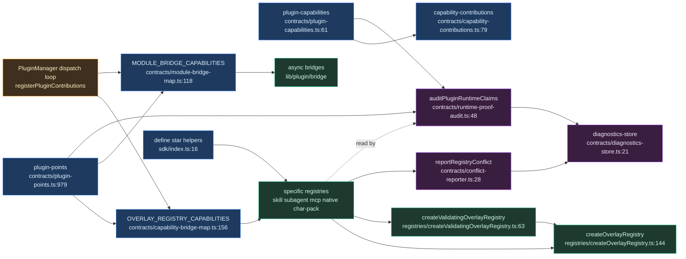

# 契约、注册表与 SDK

<Status variant="experimental" />

<TLDR>
`lib/plugin/contracts/` 是声明式真相层：`plugin-points.ts:979` 与 `plugin-capabilities.ts:61` 用 binding/docs/requiredTests 证明字段编目每个扩展点与能力，`capability-bridge-map.ts:156` 与 `module-bridge-map.ts:118` 把 manifest 字段接到注册表/桥，`runtime-proof-audit.ts:48` 断言每个"已实现"表面都有证据。`lib/plugin/registries/` 是类型化的覆盖注册表存储（内置 ← 插件覆盖，按 id 去重）；`lib/plugin/sdk/` 是宿主从不消费的纯 `define*()` 类型透传（`sdk/index.ts:8`）。
</TLDR>

<StatGrid>
  <Stat label="能力契约" value="33" />
  <Stat label="UI 槽 / 钩子 / 激活" value="49 / ~150 / 26" />
  <Stat label="运行时点" value="11" />
  <Stat label="同步覆盖能力" value="9" />
  <Stat label="异步模块桥" value="13" />
  <Stat label="SDK define*() 辅助函数" value="7" />
</StatGrid>

## 目的

`lib/plugin/contracts/` 是**声明式真相层**：它声明插件可以贡献什么，以及每个声明的表面是否真的被接线。两个规范目录是其锚点：

- `plugin-points.ts` —— 每个 UI 槽 / 钩子 / 激活 / 运行时扩展点，各自携带 `binding`、`docs` 与 `requiredTests` 证明字段。
- `plugin-capabilities.ts` —— 33 个 `PluginCapability` 契约。

`capability-contributions.ts:79` 把插件的能力标签映射到具体的 manifest 条目，供 UI 摘要使用。两个接线映射把 manifest 字段连到运行时存储：`capability-bridge-map.ts` 负责同步覆盖注册表分发，`module-bridge-map.ts` 负责异步模块加载桥。可证明性由 `runtime-proof-audit.ts`、`conflict-reporter.ts` 与 `diagnostics-store.ts` 强制执行，它们证明每个"已实现"表面都有证据，并上报冲突与诊断。

`lib/plugin/registries/` 是建在 `createOverlayRegistry` 基底之上的类型化内存存储（内置 ← 插件覆盖，按 id 去重，带插件标签）。`lib/plugin/sdk/` 是面向作者的 `define*()` 辅助函数 —— 纯类型透传（`define-skill.ts:23`、`define-subagent.ts:22`），用于收窄内联 manifest 条目；宿主从不消费它们（`sdk/index.ts:8`）。

## 覆盖注册表模式

`createOverlayRegistry.ts` 是一个叶子工厂，产出隔离的 `Map<string, InternalEntry<T>>` 闭包（`createOverlayRegistry.ts:149`）。每个条目携带可选的 `pluginId` 标签，因此 `unregisterByPlugin` 能一次性丢弃某插件的全部贡献（`createOverlayRegistry.ts:189-198`）。条目按存储键去重；冲突策略默认 **last-wins**，并有可选的 `first-wins-cross-plugin` 模式——保护由*不同*插件拥有的现任条目，同时仍允许*同一*插件刷新自己的条目（`createOverlayRegistry.ts:160-183`）：

```ts
if (
  previous &&
  conflictPolicy === "first-wins-cross-plugin" &&
  previous.pluginId !== opts?.pluginId
) {
  onConflict?.({
    name: options?.name,
    key,
    existingPluginId: previous.pluginId,
    incomingPluginId: opts?.pluginId,
  })
  return previous
}
```

`createValidatingOverlayRegistry.ts` 用一个挂边 `warningsById` 映射和一个 `validate(entry) => W[]` 选项包裹基础工厂。它在注册时盖上非阻塞的 `requires` 警告，并在 `refreshAllWarnings()` 时重新运行（`createValidatingOverlayRegistry.ts:63-91`）：

```ts
function stamp(id: string, entry: T): void {
  const warnings = options.validate(entry)
  if (warnings.length > 0) warningsById.set(id, Object.freeze(warnings))
  else warningsById.delete(id)
}
```

无论是否有警告，条目**始终被注册**；`getWarnings(id)` 返回 `[]`，从不返回 `undefined`（`createValidatingOverlayRegistry.ts:105-107`）。

## plugin-points.ts

有四个 `PluginPointKind` 值：`"ui-slot" | "hook" | "activation" | "runtime"`（`plugin-points.ts:13`）。每个 `PluginPointContract` 携带 `binding`、`docs`、`requiredTests`，一个 `"implemented" | "virtual" | "deprecated"` 的 `status`，以及一个 `stability` 等级（`plugin-points.ts:20-49`）。

| 类别 | 目录 | 数量 | 备注 :line |
| --- | --- | --- | --- |
| ui-slot | `CANONICAL_EXTENSION_POINTS` | 49 | 通过 `UI_SLOT_OVERRIDES` 弃用（`:588`）；4 个 vscode 槽是注册宿主而非 JSX 挂载（`:228-233`） |
| hook | `CANONICAL_HOOK_POINTS` | ~150 | 7 个降级至 `DEPRECATED_HOOK_POINTS`（`:482-492`） |
| activation | `CANONICAL_ACTIVATION_PATTERNS` | 26 | `:496-531` |
| runtime | `CANONICAL_RUNTIME_POINTS` | 11 | 各自通过 `RUNTIME_POINT_BINDINGS` 绑定到所属注册表单例（`:736-755`）+ 一个复用的权限（`:763-775`） |

四类全部合并进 `PLUGIN_POINT_CONTRACTS`（`plugin-points.ts:979-984`）。校验发出 `PluginPointDiagnostic` 代码 —— `plugin.point.unknown` / `alias` / `deprecated` / `virtual` / `permission_denied`（`plugin-points.ts:62-86`）—— 经由 `validateExtensionPoint`（`:1096`）、`validateHookPoint`（`:1176`）与 `validateActivationEvent`（`:1209`）。`EXTENSION_POINT_ALIASES` 解析遗留 id（`plugin-points.ts:276-288`）。

每个运行时点直接绑定到拥有它的注册表单例（`plugin-points.ts:736-741`）：

```ts
const RUNTIME_POINT_BINDINGS: Record<CanonicalRuntimePoint, string> = {
  "workflow.node": "lib/workflow/nodes/registry.ts:registerNodeExecutor",
  "provider.ai-llm": "lib/plugin/api/ai-provider-registry.ts:registerLlmProvider",
  "chat.middleware": "lib/claude/chat-middleware/registry.ts:registerChatMiddleware",
}
```

桥映射**不**以 point-id 为键；它们以 manifest 字段 / 能力标签为键，并引用运行时点绑定所命名的同一批注册表单例。`capability-bridge-map.ts`（`OVERLAY_REGISTRY_CAPABILITIES` `:156-303`）持有 9 个同步覆盖能力，统一为 `register(id, def, { pluginId })` / `unregisterByPlugin(pluginId)` 形态；`defineOverlayCapability<E>` 是唯一的型变桥（`:144-148`）。`module-bridge-map.ts`（`MODULE_BRIDGE_CAPABILITIES` `:118-277`）持有 13 个异步桥，各自归一化为 `register(ctx) => Promise<void>` / `unregister(pluginId)`（`:97-110`）。两者都通过 `Object.keys` 暴露各自的 `*_CAPABILITY_KEYS`。

## 可证明的贡献

`auditPluginPointContracts()` 遍历每个契约；对于 `status === "implemented"`，它断言 `binding`、`docs` 与 `requiredTests` 非空，产出 `"verified" | "missing_proof" | "not_applicable"` 的 `proofStatus`（`plugin-points.ts:990-1025`）。`auditPluginCapabilityContracts()` 对 33 个能力做同样的事，并额外要求工具 / 命令 / 钩子提供 `builtinContributionPaths`（`plugin-capabilities.ts:826-905`）。`runtime-proof-audit.ts:auditPluginRuntimeClaims()` 把两者加上手写的 `RUNTIME_RISK_AUDITS` 组合成一个 `PluginRuntimeClaimsAuditReport`（`runtime-proof-audit.ts:48-54`）。

`diagnostics-store.ts` 是一个带发布/订阅的模块级 `Map<pluginId, PluginPointDiagnostic[]>` —— `recordPluginPointDiagnostic` / `getAllPluginPointDiagnostics` / `subscribePluginPointDiagnostics`（`diagnostics-store.ts:21-60`）。`recordSilentFailure` 按 `expected` 分支：web 模式无 Tauri 产出 debug 日志，桌面端产出 warning 加一条 `plugin.silent-failure` 诊断（`diagnostics-store.ts:79-98`）。

`conflict-reporter.ts:reportRegistryConflict` 把 `plugin.conflict.rejected` 路由给落败的插件（`conflict-reporter.ts:28-38`）；它是 `first-wins-cross-plugin` 注册表的 `onConflict` 汇点：

```ts
export function reportRegistryConflict(info: RegistryConflictInfo): void {
  const owner = info.winnerPluginId ?? "another plugin"
  recordPluginPointDiagnostic(info.pluginId, {
    code: "plugin.conflict.rejected",
    severity: "warning",
    pointKind: "runtime",
    pointId: info.attemptedId,
    message: `${info.registry} ${info.attemptedId} is already provided by ${owner}`,
  })
}
```

## 注册表目录

| 注册表文件 | 存储 | SDK `define*` | 关键导出 :line |
| --- | --- | --- | --- |
| `skill-registry.ts` | `PluginSkillDef`（plain） | `defineSkill` | `registerSkill :19`、`unregisterSkillsByPlugin :23`、`listSkillIds :29` |
| `mcp-server-preset-registry.ts` | `PluginMcpServerPresetDef`（plain） | `defineMcpServerPreset` | `registerMcpServerPreset :29`、`listMcpServerPresetIds :39` |
| `native-anthropic-tool-registry.ts` | `PluginNativeAnthropicToolDef`（plain）+ beta 头 | `defineNativeAnthropicTool` | `registerNativeAnthropicTool :28`、`computeAnthropicBetaHeaders :79` |
| `subagent-registry.ts` | `PluginSubagentDef`（plain） | `defineSubagent` | `registerSubagent :29`、`listSubagentEntries :44` |
| `character-pack-registry.ts` | `PluginCharacterPackDef`（validating） | `defineCharacterPack` | `registerCharacterPack :51`、`refreshAllPackWarnings :58`、`getPackCharacterByRuntimeId :122`、`buildOverlayCharacterId :162` |
| `agent-team-template-registry.ts` | `PluginAgentTeamTemplateDef`（validating） | `defineAgentTeamTemplate` | `registerAgentTeamTemplate :132`、`validateTemplateRequires :88`、`getTemplateWarnings :161` |
| `workflow-template-registry.ts` | `PluginWorkflowTemplateDef`（validating） | `defineWorkflowTemplate` | `registerWorkflowTemplate :111`、`validateWorkflowTemplateRequires :77`、`getWorkflowTemplateWarnings :124` |
| `shared-memory-adapter-registry.ts` | `PluginSharedMemoryAdapterDef`（plain） | （无） | `registerSharedMemoryAdapter :24`、`unregisterSharedMemoryAdaptersByPlugin :28` |
| `command-safety-registry.ts` | 按 pluginId 的 `ToolRules`（plain，合并） | （无 —— `ctx.terminal` 命令式） | `registerPluginCommandRules :30`、`getPluginCommandRulesets :48` |
| `createOverlayRegistry.ts` | 工厂 —— 基底 | — | `createOverlayRegistry :144` |
| `createValidatingOverlayRegistry.ts` | 工厂 —— requires 警告包装 | — | `createValidatingOverlayRegistry :63` |

## SDK define*() 目录

所有辅助函数都是纯类型透传，**除了** `defineCharacterPack`，它会立即校验。

| 辅助函数 | 产出 | :line |
| --- | --- | --- |
| `define-skill.ts` | `PluginSkillDef` | `:23` |
| `define-subagent.ts` | `PluginSubagentDef` | `:22` |
| `define-mcp-server-preset.ts` | `PluginMcpServerPresetDef` | `:23` |
| `define-native-anthropic-tool.ts` | `PluginNativeAnthropicToolDef` | `:28` |
| `define-agent-team-template.ts` | `PluginAgentTeamTemplateDef`（`requires` 块） | `:27` |
| `define-workflow-template.ts` | `PluginWorkflowTemplateDef`（`requires` 块） | `:24` |
| `define-character-pack.ts` | `PluginCharacterPackDef` —— 空 / 超过 50 / 重复 localId 时抛出；未知 TTS / 超大头像时警告 | `:46`（上限 `:35`、`:44`） |
| `index.ts` | 全部 7 个的桶导出 | `:16-22` |

## 数据流



## 陷阱

- **Validating 与 plain 覆盖。** 只有 `character-pack`、`agent-team-template` 与 `workflow-template` 使用 `createValidatingOverlayRegistry`；其余为 plain。警告是非阻塞的——条目无论如何都会注册——因此兄弟覆盖的变更必须调用 `refreshAll*Warnings()` 以清除陈旧的缺失依赖警告（接线于 `capability-bridge-map.ts:165-176`）。
- **能力桥与模块桥映射。** `capability-bridge-map.ts` 是同步内联 def 覆盖能力（`:151-156`）；`module-bridge-map.ts` 是异步模块加载能力，归一化在单一 `register(ctx) => Promise` / `unregister` 之后（`:84-110`）。定制接线（modes / commands / themes / lsp / a2ui）两者皆不在（`capability-bridge-map.ts:10-16`）。若干模块桥键是合成的（workspace-backend、message-renderer、chat-middleware）—— 字段驱动分发（`module-bridge-map.ts:113-117`）。
- **审计的"证明"是字段存在，而非可达性。** 审计检查证明字符串非空；真正的可达性由单独的静态槽审计脚本强制执行，该脚本按 `REGISTRATION_HOST_EXTENSION_POINTS` / `hostKind` 分支（`plugin-points.ts:222-233`）。
- **first-wins-cross-plugin 是可选的。** 默认是 last-wins；此处的 plain id-键注册表在跨插件 id 冲突时静默 last-wins。

<Cards>
  <Card title="桥" href="./bridges" description="把 manifest 字段连到运行时子系统的异步模块加载桥。" />
  <Card title="核心运行时" href="./core-runtime" description="驱动能力桥与模块桥的 PluginManager 分发循环。" />
  <Card title="安全" href="./security" description="权限门控、信任，以及支撑冲突与静默失败上报的诊断。" />
</Cards>
