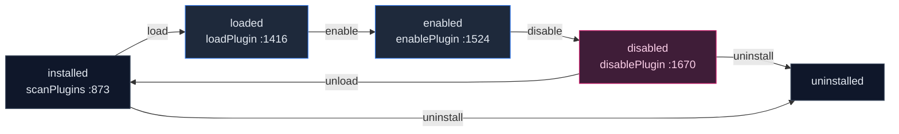
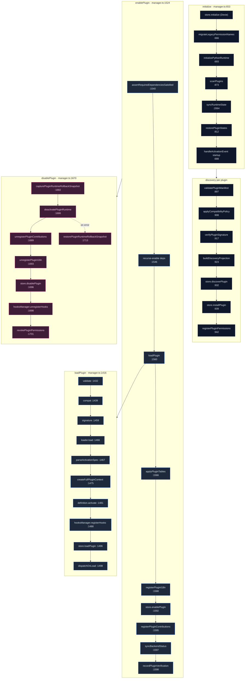

# 核心运行时

<Status variant="experimental" />

<TLDR>
  核心运行时（`lib/plugin/core/`）是整个插件平台的生命周期引擎。它的中枢是 `PluginManager`
  （`manager.ts:364`），一个按外壳划分的惰性单例（`getPluginManager` `manager.ts:317`、
  `initializePluginManager` `manager.ts:336`），由 `resolvePluginRuntimeBootstrap`
  （`bootstrap.ts:21`）配置 —— 它会选择浏览器或 Tauri 配置档，并拒绝在非主窗口中运行。管理器在其构造函数
  （`manager.ts:381`）中接好四个协作者 —— `PluginLoader`、`PluginRegistry`、一个
  `PluginLifecycleHooks` 管理器，以及惰性的 A2UI/Themes 桥接，然后驱动每个插件走完状态机
  **installed → loaded → enabled → disabled → uninstalled**。发现阶段（`scanPlugins`
  `manager.ts:873`）会先对每个清单做校验、兼容性检查与签名检查，再写入 Zustand `usePluginStore`；
  `enablePlugin`（`manager.ts:1524`）对依赖进行门控、应用 Dexie 表与 i18n、并注册贡献；每条反向路径都会捕获回滚快照。
</TLDR>

<StatGrid>
  <Stat label="源文件" value="16" hint="lib/plugin/core/ 的 TS，不含测试" />
  <Stat label="状态机状态" value="5" hint="installed · loaded · enabled · disabled · uninstalled" />
  <Stat label="协作者" value="4" hint="loader · registry · hooks · 惰性桥接（manager.ts:381）" />
  <Stat label="覆盖式注册表" value="5" hint="tools · components · templates · modes · commands（registry.ts）" />
  <Stat label="插件运行时" value="4" hint="frontend JS · WASM · VS Code 扩展 · Python（非 Tauri 为桩）" />
  <Stat label="浏览器内置插件" value="15" hint="打包内的静态列表（browser-builtin-registry.ts:55）" />
</StatGrid>

## 它是什么

`lib/plugin/core/` 是让插件“活起来”的地方。插件平台中的其他一切 —— `ctx.*` API、贡献桥接、安全守卫、市场 ——
都挂在 `PluginManager` 驱动的生命周期之上。管理器是插件状态转换的唯一所有者：它是唯一会调用插件
`activate(context)`、注册其贡献、应用其 Dexie 表、并在禁用或卸载时将这一切拆解回去的代码。

该运行时是外壳感知的。`resolvePluginRuntimeBootstrap`（`bootstrap.ts:21`）会检查宿主 —— 浏览器、Tauri
桌面端，或一个次级窗口 —— 并产出一个 `PluginManagerConfig`。非主窗口会被直接拒绝，因此始终只有一个管理器实例驱动发现与加载。

## 逐文件清单

| 文件 | 用途 | 关键导出（`:line`） |
| --- | --- | --- |
| `index.ts` | 核心面的桶式再导出 | 再导出 `index.ts:5-26` |
| `bootstrap.ts` | 将外壳解析为 `PluginManagerConfig`（浏览器/Tauri，门控非主窗口） | `resolvePluginRuntimeBootstrap` `:21` |
| `manager.ts` | 中央生命周期编排器 + 单例/工厂 | `PluginManager` `:364`；`getPluginManager` `:317`；`createPluginManager` `:332`；`initializePluginManager` `:336`；`__resetPluginManagerForTesting` `:353`；`resolveGovernanceMode` `:118`；`PluginEnableError` `:255`；`PluginDependencyError` `:277`；`PLUGIN_ENABLE_FAILED_EVENT` `:299` |
| `loader.ts` | 按类型动态加载模块 + 限时拆卸 | `PluginLoader` `:66`；`DEFAULT_TEARDOWN_TIMEOUT_MS` `:25`；`DirtyTeardownReason`/`DirtyTeardownRecord` `:41`/`:43` |
| `registry.ts` | 贡献存储（tools/components/templates/modes/commands） | `PluginRegistry` `:54`（覆盖于 5 个 `createOverlayRegistry` 之上的门面） |
| `descriptor.ts` | 从清单构建面向 UI 的 `ExtensionDescriptor` | `buildExtensionDescriptor` `:87`；`derivePluginInstallRootKind` `:20` |
| `context.ts` | 构建 `PluginContext`/`FullPluginContext` API 对象 | `createPluginContext` `:181`；`createFullPluginContext` `:233`；`isFullPluginContext` `:323`；`teardownPluginWorkflowRegistrations` `:2170`；类型 `FullPluginContext` `:141` |
| `compatibility.ts` | 对宿主/node/python 做语义化版本门控 → 诊断 | `evaluatePluginCompatibility` `:119`；`CompatibilityRuntime` `:15`；`CompatibilityDiagnostic` `:5` |
| `validation.ts` | 清单 + 配置的模式/取值校验 | `validatePluginManifest` `:289`；`validatePluginConfig` `:1167`；`parseManifest` `:1311` |
| `verification.ts` | 构建不可变的 `PluginVerificationSnapshot` + 能力证明 | `createPluginVerificationSnapshot` `:35`；`collectCapabilityRuntimeProofs` `:14` |
| `transport.ts` | 通往 Rust `plugin_api_invoke` 的类型化 IPC 网关（重试/兼容） | `invokePluginApi` `:92`；`invokePluginApiBatch` `:142`；`PluginGatewayError` `:52` |
| `policy-runtime.ts` | 将持久化策略推送至 manager/verifier/updater 单例 | `applyPluginPolicyToRuntime` `:55` |
| `plugin-asset-resolver.ts` | 跨运行时资源/路径拼接 + Tauri `convertFileSrc` 解析器 | `createPluginAssetResolver` `:45`；`joinPluginPath` `:28` |
| `logger.ts` | 惰性的插件系统日志器映射（初始化周期安全） | `loggers` `:192`；`createPluginSystemLogger` `:123`；`pluginLogger` `:179` |
| `browser-builtin-registry.ts` | 15 个打包内内置插件的静态列表（浏览器配置档） | `getBrowserBuiltinRegistry` `:148`；`getBrowserBuiltinRegistryEntry` `:155` |
| `load-order.ts` | 依赖拓扑排序 + 环/阻塞/降级解析 | `resolveLoadOrder` `:114`；`LoadOrderBlockReason` `:23`；`LoadOrderPluginInput` `:29` |

## 状态机

一个插件会经过五种状态。发现阶段将其初始化为 **installed**；启用会将其向前推进至 **loaded → enabled**；
禁用、卸载与移除则反向走完路径，每一步都会捕获回滚快照，从而让部分失败可以被撤销。



## 生命周期流程（有序）

管理器把每次转换都作为一条有序、带行号的流水线来运行。下图沿着一个插件从启动到启用追踪其路径，右侧是禁用/回滚的返回路径。



`deactivatePluginRuntime`（`manager.ts:1686`）会调用插件的 `definition.deactivate()`
（`manager.ts:2262`），随后调用 `loader.unload`（`manager.ts:2282`）。禁用路径内一旦发生任何错误，所捕获的快照会被
`restorePluginRuntimeRollbackSnapshot`（`manager.ts:1713`）重放，使插件停留在一致的状态。

## 构建并传入 `activate` 的上下文

整个生命周期的枢纽在于 `loadPlugin` 构建一个 `FullPluginContext` 并把它交给插件的 `activate`。返回的 hooks（若有）会被保留以供后续分发。

```ts
// manager.ts:1475-1481
const context = createFullPluginContext(plugin, this, { enableDebug })
this.contexts.set(pluginId, context)
let hooks: PluginHooks | undefined
if (typeof definition.activate === "function") {
  hooks = (await definition.activate(context)) || undefined
}
```

## 贡献注册表

`PluginRegistry`（`registry.ts:54`）是一个覆盖于五个 `createOverlayRegistry` 实例之上的薄门面 —— 分别对应
tools、components、templates、modes 与 commands。冲突策略是 **first-wins-cross-plugin**：对同一 id，较晚的跨插件注册者会被拒绝并报告为
`plugin.conflict.rejected`；同插件的重新注册则只是刷新该条目（`registry.ts:10-17`）。

```ts
// registry.ts:55-59
private tools = createOverlayRegistry<PluginTool>({
  name: "tools",
  conflictPolicy: "first-wins-cross-plugin",
  onConflict: makeConflictHandler("tool"),
})
```

模板按 `<pluginId>:<id>` 命名空间化（`registry.ts:150`），因此两个插件可以发布同一本地名称的模板而不冲突。

## 依赖加载顺序

`resolveLoadOrder`（`load-order.ts:114`）通过对依赖图做 Kahn 拓扑排序来计算安全的启用顺序。环用 Tarjan SCC
检测（`load-order.ts:61`）；阻塞集合会增长至不动点（`load-order.ts:144-175`），从而让任何传递性地依赖被阻塞插件的插件也一并被拦下。

```ts
// load-order.ts:193-203
const queue = survivors.filter((id) => (indegree.get(id) ?? 0) === 0)
const order: string[] = []
while (queue.length > 0) {
  const id = queue.shift()!
  order.push(id)
  for (const dependent of dependents.get(id) ?? []) {
    const next = (indegree.get(dependent) ?? 0) - 1
    indegree.set(dependent, next)
    if (next === 0) queue.push(dependent)
  }
}
```

## 兼容性门控

`evaluatePluginCompatibility`（`compatibility.ts:119`）会用清单的 `engines`（宿主 / node / python）对照正在运行的运行时进行检查并产出诊断。当宿主版本不满足
`engines.cognia` 时，它会推入诊断码 `compat.cognia_engine_mismatch`（`compatibility.ts:139-150`）。随后由治理模式决定结果：**block**
在出现任何 error 诊断时即拒绝，而 **warn** 则记录日志并继续（`manager.ts:708-743`）。

## 扩展描述符

`buildExtensionDescriptor`（`descriptor.ts:87`）把清单投射为设置面板渲染所用的面向 UI 的形状。`availableOperations`
是*推导*得来的，取决于安装根类型（`descriptor.ts:51`）：内置插件从不提供 uninstall，dev 插件获得 reload，市场插件获得 update。

```ts
// descriptor.ts:97-122 (shape)
{
  id, version, source,
  identity: { canonicalId, observedSources, activeSource },
  resolvedPath,
  installRoot: { kind, path },
  entrypoints,
  declaredCapabilities,
  compatibility: { status, diagnostics },
  availableOperations,
}
```

## 核心如何与平台其余部分相连

- **经由加载器接入隔离运行时。** `loadWasmDefinition` / `unloadWasmPlugin`（`loader.ts:11`、
  `:152` / `:605`）与 `loadVscodeDefinition` / `unloadVscodeExtension`（`loader.ts:12`、`:136` /
  `:608`）驱动 WASM 与 VS Code 宿主。WASM 在安装期通过 `invoke("plugin_wasm_load")`（`manager.ts:1393`）预加载。
- **传输。** 每次桌面端 API 调用都流经 `invokePluginApi` → `invoke("plugin_api_invoke")`
  （`transport.ts:114`），从 `context.ts` 接好。
- **安全。** 管理器用 `getPermissionGuard().registerPlugin`（`manager.ts:1913`）注册每个插件，并在禁用/卸载时撤销
  （`manager.ts:1701`、`:1761`、`:1845`）。签名走 `verifyPluginSignature`（`manager.ts:1880`）；WASM 能力授予走
  `applyWasmCapabilityGrant`（`manager.ts:1373`）；速率限制走 `context.ts` 内的 `getPluginRateLimiter().check`。
- **桥接。** `registerPluginContributions`（`manager.ts:3144`）注册 modes/commands、斜杠命令、
  经由 `PluginThemesBridge` 的主题、16 个 `OVERLAY_REGISTRY_CAPABILITIES`（`manager.ts:3223`）、
  20 个 `MODULE_BRIDGE_CAPABILITIES`（`manager.ts:3252`）、LSP 服务器（`manager.ts:3269`），
  以及 skill→character 附着（`manager.ts:3347`）。
- **Dexie。** `applyPluginTables` / `removePluginTables`（`manager.ts:1566` / `:1838`）为插件添加并丢弃其命名空间化的表；
  只有当清单声明时才暴露 `ctx.dexie`（`context.ts:215`）。

## 注意事项

- **浏览器 vs Tauri 的内置插件分叉。** 浏览器配置档自带 15 个静态内置插件（`browser-builtin-registry.ts:55`），当路径以
  `builtin://` 开头时经由其入口 `load()` 加载（`loader.ts:172-182`）；Tauri 则改用
  `invoke("plugin_scan_directory")`（`manager.ts:883`）发现。
- **幂等性。** 当插件已处于目标状态时，加载与启用会提前返回（`loader.ts:83`、`manager.ts:1424`、`:1532`）；
  `loadingPromises` 对并发加载去重（`loader.ts:88`）；所有 `unregister*` 路径对从未注册过的插件都是空操作。
- **错误隔离与回滚。** 安装通过 `InstallTransactionState`（`manager.ts:213`）逐步跟踪，并由
  `performInstallRollback`（`manager.ts:1253`）回退；禁用/卸载会捕获 `PluginRuntimeRollbackSnapshot`
  （`capture` `:568`、`restore` `:589`）。逐贡献的失败会被捕获并记录，绝不抛出（`manager.ts:2456`、`:2492`、`:2520`）。
- **拆卸是限时的，而非可取消的。** WASM/VS Code 卸载运行在 `withTimeout`（5 秒，`loader.ts:25`）之下；超时会调用
  `recordSilentFailure` 并置位 `dirtyTeardowns` 标志（`loader.ts:617-647`）。
- **治理覆盖。** `COGNIA_PLUGIN_POINT_GOVERNANCE_MODE`（`warn` | `block`）覆盖默认值（`manager.ts:118`）；在 `block`
  模式下，被阻塞的激活会在 `parseActivationSpec`（`manager.ts:1965`）中抛出。
- **日志器刻意惰性。** 日志器映射使用 `Object.defineProperty` getter（`logger.ts:25-43`）以绕开一个 Jest CJS
  初始化顺序的循环。
- **非 Tauri 下的 Python 是桩。** 在 Tauri 之外，Python 运行时是一个仅告警的桩（`loader.ts:278-292`）。
- **`importModule` 是被包裹的 `eval`。** 它尝试三种策略 —— Tauri 资源协议 → `fetch` + `eval` → script 标签 ——
  且不支持 `require()`（`loader.ts:439`、`:480`）。

## 下一步

<Cards>
  <Card title="Context API (ctx)" href="./context-api" description="createFullPluginContext 组装并交给 activate() 的能力面" />
  <Card title="Security & permissions" href="./security" description="管理器接好的守卫、同意、签名验证与速率限制器" />
  <Card title="Sandbox, messaging & WASM" href="./messaging-and-sandbox" description="加载器的 JS/WASM/VS Code 运行时、传输与跨插件 IPC、消息总线" />
</Cards>
