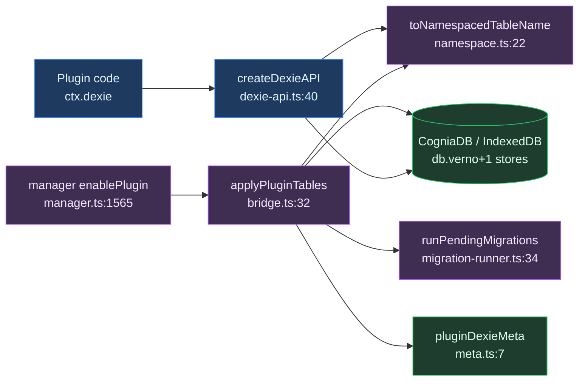
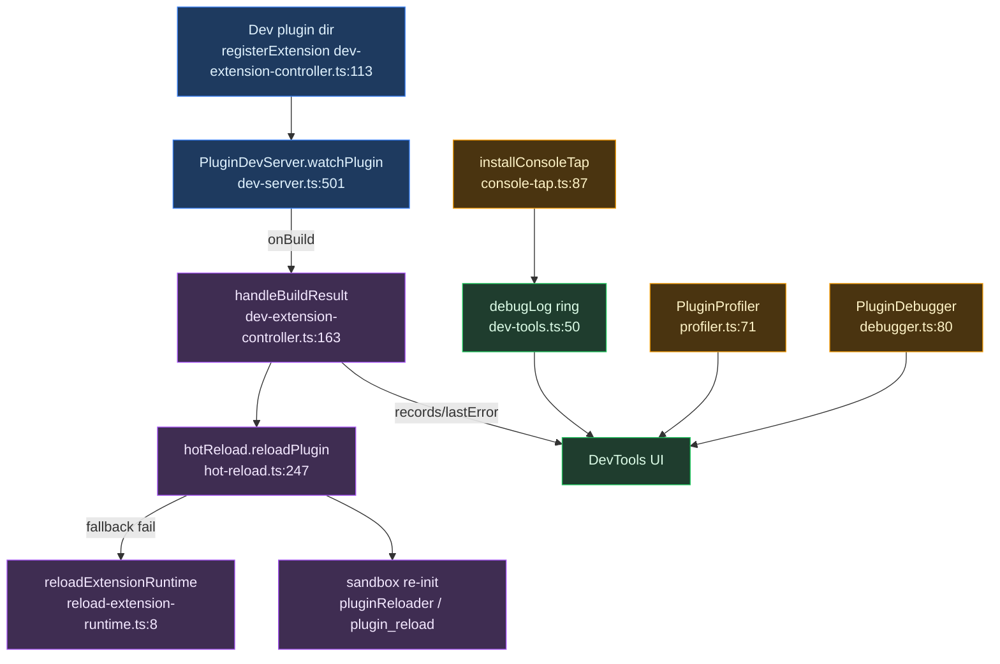

# 存储与 devtools

<Status variant="experimental" />

<TLDR>
插件在唯一共享的 `CogniaDB` Dexie 实例中获得不会冲突的 IndexedDB 表——表名以 `<pluginId>:<tableName>` 形式存储（`namespace.ts:11`），任何改变表集合的 enable/disable 都会递增全局 Dexie schema 版本（`bridge.ts:60`）。另有一套仅用于开发的能力（`hot-reload.ts:63`、`dev-server.ts:77`、`profiler.ts:71`、`debugger.ts:80`、`console-tap.ts:87`），可在不重启应用的情况下对正在开发的插件进行监听、构建、热重载与插桩。
</TLDR>

<StatGrid>
  <Stat label="每插件表数上限" value="≤ 20" hint="MAX_TABLES_PER_PLUGIN — namespace.ts:14" />
  <Stat label="命名空间分隔符" value=":" hint="PLUGIN_TABLE_NAMESPACE_SEPARATOR — namespace.ts:11" />
  <Stat label="dev server 端口" value="9527" hint="默认值 — dev-server.ts:100" />
  <Stat label="热重载防抖" value="300 ms" hint="debounceMs 默认 — hot-reload.ts" />
  <Stat label="调试日志环" value="1000 / 500" hint="debugger.ts:317 / dev-server.ts:284" />
  <Stat label="重连尝试" value="5（退避）" hint="dev-server.ts:261" />
</StatGrid>

本模块分为两半。**Part A（Dexie）** 是生产路径：它在唯一共享的 Dexie 数据库内为每个插件提供私有的、命名空间化的表，因此两个插件永远不会在表名上冲突。**Part B（devtools）** 是仅用于开发的路径：一个 Tauri 托管的 dev server、热重载、console tap、debugger 与 profiler，仅会为你正在开发的插件点亮。

---

## Part A — Dexie 表

### 目的与流水线

插件在唯一共享的 `CogniaDB` Dexie 实例内获得命名空间化的 IndexedDB 表，因此两个插件永远不会冲突。物理表名以 `<pluginId>:<tableName>` 形式存储（`namespace.ts:11`、`namespace.ts:22`）。

端到端流水线：

1. manager 读取 `manifest.dexie`。
2. `applyPluginTables`（`bridge.ts:32`）执行 `close → version(N+1).stores(patch) → open`，递增 schema 版本。
3. 注册信息记录到 `pluginDexieMeta` 核心表（`meta.ts`、`bridge.ts:65`）。
4. 随后插件通过 `ctx.dexie = createDexieAPI(...)`（`dexie-api.ts:40`）调用受限的作用域操作，该 API 在 `context.ts:216` 接入插件上下文。
5. 可选的 manifest 迁移会在每次版本递增时通过 `runPendingMigrations`（`migration-runner.ts:34`）执行一次。

接线位置：`applyPluginTables` 在 `activate()` 之前运行于 `manager.ts:1565`；`removePluginTables` 在 `manager.ts:1838`；`createDexieAPI` 在 `context.ts:216`（仅当 `getDb()` 可用时）。

### 命名空间

每个表操作都路由经过 `namespace.ts` 中的辅助函数——唯一事实来源（`namespace.ts:6`）。

```ts
// namespace.ts:22-24
export function toNamespacedTableName(pluginId: string, tableName: string): string {
  return `${pluginId}${PLUGIN_TABLE_NAMESPACE_SEPARATOR}${tableName}`
}
```

分隔符为 `":"`，且 `MAX_TABLES_PER_PLUGIN = 20`（`namespace.ts:11`、`namespace.ts:14`）。`fromNamespacedTableName` 反向映射，并对无前缀的核心表返回 `null`（`namespace.ts:30`），作用域 API 正是借此拒绝跨插件与核心表访问。

### 应用表（schema 递增）

```ts
// bridge.ts:60-70
const nextVersion = db.verno + 1
await db.close()
db.version(nextVersion).stores(patch)
await db.open()
await putPluginDexiaMeta({
  pluginId,
  tableNames: namespacedNames,
  dexieVersion: nextVersion,
  appliedAt: Date.now(),
})
```

`applyPluginTables` 是幂等的：若表集合未变化则提前返回（`bridge.ts:46`）。以 `retentionMode "purge"` 移除时，会在同一 close/open 周期内将 stores 置空（`bridge.ts:89`）。超过 `MAX_TABLES_PER_PLUGIN = 20` 会抛错（`bridge.ts:37`），而改变后的表集合需先调用 `removePluginTables`（`bridge.ts:28`）。

### 迁移

迁移由插件自身的 manifest 版本驱动，而非 Dexie schema 版本。

```ts
// migration-runner.ts:39-52
const pending = migrations
  .filter((m) => m.toVersion > ctx.previousVersion && m.toVersion <= ctx.currentVersion)
  .sort((a, b) => a.toVersion - b.toVersion)
for (const mig of pending) {
  const fn = ctx.upgradeHandlers[mig.upgrade]
  if (!fn) throw new Error(`Migration upgrade function ${mig.upgrade} not found`)
  await fn(tx)
}
```

`MigrationContext` 携带 `previousVersion` 与 `currentVersion`——插件的 manifest 版本（`migration-runner.ts:15`）。迁移的 `toVersion` 针对的是 manifest 版本，绝不是 Dexie `verno`。

### 作用域 API

```ts
// dexie-api.ts:59-74
table<T, K = unknown>(name: string): Dexie.Table<T, K> {
  const namespacedName = toNamespacedTableName(pluginId, name)
  const parsed = fromNamespacedTableName(namespacedName)
  if (!parsed || parsed.pluginId !== pluginId) {
    throw new Error(`Plugin ${pluginId} attempted to access table ${name}`)
  }
  return db.table<T, K>(namespacedName)
}
```

`rawDb()` 返回一个 `Proxy`，将 `table` 与 `transaction` 经 `resolveTableName` 重新路由，拒绝任何跨插件或核心表访问（`dexie-api.ts:76`）。`table()` 与 `rawDb()` 的 Proxy 强制执行同一道守卫（`dexie-api.ts:48`、`dexie-api.ts:67`）。

### Schema 版本模型

两个解耦的轴：

- **全局 Dexie `db.verno`** —— 整个 `CogniaDB` 一个单调递增的版本。每次改变表集合的 enable/disable 都会将其加一（`bridge.ts:60`、`bridge.ts:94`），并把新值作为 `dexieVersion` 持久化到 `PluginDexieMeta`（`lib/db/plugin-types.ts:151`）。`pluginDexieMeta` 自身是一个以 `&pluginId, appliedAt` 为键的核心表（`schema.ts:1052`、`schema.ts:226`）。
- **每插件 manifest 版本** —— 仅驱动迁移。`MigrationContext` 携带 `previousVersion` / `currentVersion`，即插件自身的 manifest 版本（`migration-runner.ts:15`）。

Dexie schema 版本（结构性）与插件迁移版本（数据性）互相独立：前者关乎共享数据库的物理 IndexedDB schema；后者关乎单个插件行的转换。

### Dexie 写入路径



---

## Part B — devtools

### 目的

为正在开发的插件提供的仅开发能力：

- 一个 Tauri **dev server**（`dev-server.ts`），通过 WebSocket 监听、构建并提供服务；
- **热重载**（`hot-reload.ts`），在不重启应用的情况下重新实例化已变更的插件；
- 一个 **console tap**（`console-tap.ts`），将浏览器 `console.*` 捕获进调试环；
- 一个 **debugger**（`debugger.ts`），含断点、监视、调用栈与日志；
- 一个 **profiler**（`profiler.ts`），含计时、内存与火焰图；
- 一个 **DevExtensionController**（`dev-extension-controller.ts`），为解包的插件目录编排 `build → reload → rollback`。

`dev-tools.ts` 持有共享的内存原语（调试环、hook 检查器、manifest 校验器、mock 上下文）。

### 逐文件映射

| 文件 | 用途 | 关键导出 `:line` |
| --- | --- | --- |
| `index.ts` | 桶式再导出 | `index.ts:5-61` |
| `dev-tools.ts` | 内存原语：调试日志环、hook 调用检查器、插件检查器、mock ctx、严格 manifest 校验器 | `setDebugMode` / `isDebugEnabled` / `debugLog` / `getDebugLogs` `:33,43,50,96`；`inspectPlugin` / `inspectAllPlugins` `:228,256`；`createMockPluginContext` `:368`；`validateManifestStrict` `:481`；`PluginDevTools` `:612` |
| `console-tap.ts` | 将 `console.{log,info,warn,error,debug}` 打补丁进 `debugLog` 环；仅安装一次 | `installConsoleTap` `:87`；`uninstallConsoleTap` `:120`；`isConsoleTapInstalled` `:131` |
| `debugger.ts` | 运行时调试：会话、断点、调用帧、监视表达式、日志环 + 处理器；`createDebugContext` 包裹 `ctx.logger` | `PluginDebugger` `:80`；`getPluginDebugger` / `resetPluginDebugger` `:509,516`；`log` `:317`；`createDebugContext` `:441` |
| `profiler.ts` | 性能/内存分析：开始/结束 profile、会话、汇总、热点、火焰图 | `PluginProfiler` `:71`；`getPluginProfiler` / `resetPluginProfiler` `:452,459`；`withProfiling` `:467`；`startProfile` / `endProfile` `:118,144` |
| `hot-reload.ts` | HMR 管理器：Tauri 文件监听、防抖、状态保存/恢复、经 loader+reloader 或 Tauri 命令重载 | `PluginHotReload` `:63`；`getPluginHotReload` / `resetPluginHotReload` `:503,512`；`reloadPlugin` `:247`；`startWatching` `:125` |
| `hot-reload.client.ts` | 基于单例的 `"use client"` React hook | `usePluginHotReload` `:6` |
| `reload-extension-runtime.ts` | 经 manager 的 disable→enable 周期重新实例化 | `reloadExtensionRuntime` `:8` |
| `dev-server.ts` | Tauri dev server 客户端：WS 连接+重连、构建、console-log 缓冲、命令 | `PluginDevServer` `:77`；`getPluginDevServer` / `resetPluginDevServer` `:614,621`；`buildPlugin` `:333`；`start` / `stop` `:123,170` |
| `dev-server.client.ts` | 基于单例的 `"use client"` React hook | `usePluginDevServer` `:6` |
| `dev-extension-controller.ts` | 编排 `build → hot-reload → re-enable` 回滚，按插件记录 | `DevExtensionController` `:47`；`DevExtensionRecord` `:27`；`registerExtension` `:113`；`handleBuildResult` `:163` |

### 热重载深入

`PluginHotReload.startWatching` 仅为 `source` 是 `"dev"` 或 `"local"` 的插件收集路径，调用 Tauri 的 `plugin_watch_start` 命令，并监听 `plugin:file-change`（`hot-reload.ts:139`）。`handleFileChange` 按插件防抖（`debounceMs` 默认 300），然后触发 `reloadPlugin`（`hot-reload.ts:201`）。

```ts
// hot-reload.ts:247-268 — re-instantiation core
if (this.config.preserveState) await this.preservePluginState(pluginId)
await this.invalidateModuleCache(pluginId)
if (this.pluginLoader && this.pluginReloader) {
  const definition = await this.pluginLoader(pluginId)
  await this.pluginReloader(pluginId, definition)
} else {
  await invoke("plugin_reload", { pluginId })
}
```

状态经 `localStorage` 键 `cognia-plugin-storage:<id>` 加上 Tauri 的 `plugin_get_state` / `plugin_set_state` 命令往返（`hot-reload.ts:336`）。缓存失效会递增 `__plugin_cache_<id>` 的 window 时间戳并调用 `plugin_invalidate_cache`（`hot-reload.ts:400`）。

`reload-extension-runtime.ts` 是交给控制器的具体 reloader：

```ts
// reload-extension-runtime.ts:8-16
if (plugin.status === "enabled") {
  await manager.disablePlugin(plugin.manifest.id, "dev-reload")
}
await manager.enablePlugin(plugin.manifest.id, "dev-reload")
```

`DevExtensionController.handleBuildResult`：构建成功时调用 `hotReload.reloadPlugin`；若失败则回退到注入的 `reloadHandler`（disable→enable），将 `fallbackMode` 翻转为 `"re-enable"`，并记录一个 `"rollback"` 生命周期阶段（`dev-extension-controller.ts:199`）。

### dev server

`PluginDevServer` 是 Tauri 托管 dev server 的**客户端**——静态导出中不存在 Node HTTP 服务器。`start()` 调用 `plugin_dev_server_start`，打开一个 `ws(s)://host:port/ws` WebSocket，并监听 Tauri 的 `plugin:dev-server` 事件（`dev-server.ts:131`）。默认端口为 `9527`（`dev-server.ts:100`）。

它提供构建结果（`plugin_build`，`dev-server.ts:333`），以及 reload / update / inspect / command 消息，并带有一个上限 500 的 `DevConsoleMessage` 日志缓冲（`dev-server.ts:284`）。自动重连采用指数退避，最多 5 次尝试（`dev-server.ts:261`）。React 客户端 `dev-server.client.ts:6` 通过 `onConsoleLog`（保留最近 100 条）加 `onMessage` 订阅。

### console tap、profiler、debugger

**console-tap**（`console-tap.ts:87`）仅限浏览器。它将每个 console 级别包裹进 `debugLog(pluginId, level, "console", message, data)`（`console-tap.ts:105`），自动启用调试模式（`console-tap.ts:97`）。仅安装一次；disposer 恢复原始实现（`console-tap.ts:120`）。

**profiler**：`startProfile` / `endProfile` 捕获 `performance.now()` 增量与 `usedJSHeapSize` 内存增量（`profiler.ts:118`、`profiler.ts:394`），经 `profileStack` 嵌套。`getSummary` 汇总每操作统计与前 10 名热点（`profiler.ts:247`）；`getFlameGraphData` 构建火焰树（`profiler.ts:330`）。`withProfiling` 包裹同步与异步函数（`profiler.ts:467`）。

```ts
// profiler.ts:467-483 — wrap any fn with timing + memory capture
const result = withProfiling(profiler, "render", () => renderHeavyView())
const async = await withProfiling(profiler, "ingest", () => ingestBatch(rows))
```

**debugger**：按插件维护一个单例 `LogEntry` 环，上限 `maxLogEntries = 1000`（`debugger.ts:317`）；`error` 级别捕获 `new Error().stack`（`debugger.ts:330`）。断点按位置 glob 加可选条件匹配，条件经 `new Function` 编译（`debugger.ts:398`）；监视在受限作用域内求值表达式（`debugger.ts:284`）。`createDebugContext` 包裹 `ctx.logger`，使每条插件日志镜像进调试环（`debugger.ts:441`）。`dev-tools.ts` 另外提供一个正交的 hook 调用检查器（`recordHookCall` / `getHookCalls`，`dev-tools.ts:149,177`）以及轻量的 `startMeasure` / `endMeasure`（`dev-tools.ts:281,295`）。

### dev-extension 热路径



---

## 陷阱

- **`.client.ts` 与 `.ts` 的拆分** —— `dev-server.ts` 与 `hot-reload.ts` 是环境无关的单例管理器，调用 Tauri；`.client.ts` 变体带有 `"use client"`，是 React hook 包装器（`dev-server.client.ts:1`、`hot-reload.client.ts:1`）。只能从 React 组件导入 `.client` 文件。
- **仅开发的门控** —— 热重载仅监听 `source` 为 `"dev"` 或 `"local"` 的插件（`hot-reload.ts:140`），且 `HotReloadConfig.enabled` 默认为 `false`（`hot-reload.ts:77`）。`DevExtensionController.registerExtension` 在非桌面环境下短路返回 `unsupported_env`（`dev-extension-controller.ts:114`）。dev server 完全由 Tauri 支撑，因此浏览器内的 Logs / Bus 标签页为空——这正是 console tap 存在的原因。
- **命名空间冲突规避** —— 每个表操作都经过 `namespace.ts` 辅助函数作为唯一事实来源（`namespace.ts:6`）。`dexie-api` 在 `table()` 与 `rawDb()` 的 Proxy 中均拒绝对核心表或其他插件表的裸访问（`dexie-api.ts:48`、`dexie-api.ts:67`）。`applyPluginTables` 对未变化的集合幂等，但超过 `MAX_TABLES_PER_PLUGIN = 20` 会抛错（`bridge.ts:37`）；改变后的集合需先调用 `removePluginTables`（`bridge.ts:28`）。

---

<Cards>
  <Card title="核心运行时" href="./core-runtime" description="manifest、生命周期，以及驱动 applyPluginTables 与热重载的 enable/disable 流水线。" />
  <Card title="Context API" href="./context-api" description="ctx.dexie 及插件上下文其余部分如何组装与门控。" />
  <Card title="消息与沙箱" href="./messaging-and-sandbox" description="dev-extension 热路径每次重载都会重新初始化的沙箱。" />
</Cards>
