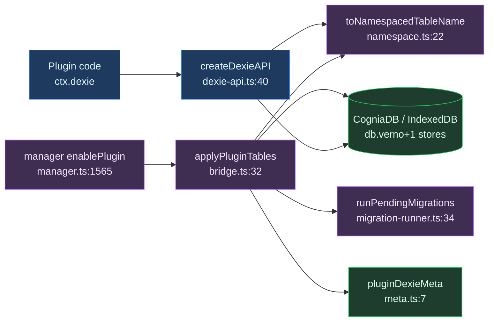
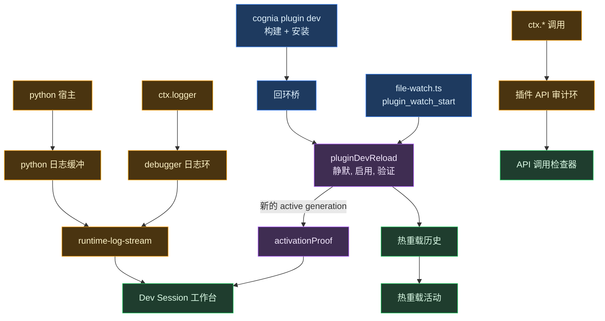

# 存储与 devtools

<Status variant="experimental" />

<TLDR>
插件在唯一共享的 `CogniaDB` Dexie 实例中获得不会冲突的 IndexedDB 表。表名以 `<pluginId>:<tableName>` 形式存储（`namespace.ts:11`），任何改变表集合的 enable/disable 都会递增全局 Dexie schema 版本（`bridge.ts:60`）。另有一套开发者模式界面：监听本地来源插件的目录（`file-watch.ts`），走与 CLI 相同的那一条已验证路径重载（`plugin-dev-reload.ts`），并把它打出的日志合成一条流（`runtime-log-stream.ts`）。应用自己从不构建，那是 `cognia plugin dev` 的活。
</TLDR>

<StatGrid>
  <Stat label="每插件表数上限" value="≤ 20" hint="MAX_TABLES_PER_PLUGIN — namespace.ts:14" />
  <Stat label="命名空间分隔符" value=":" hint="PLUGIN_TABLE_NAMESPACE_SEPARATOR — namespace.ts:11" />
  <Stat label="监听防抖" value="300 ms" hint="DEFAULT_DEBOUNCE_MS — file-watch.ts" />
  <Stat label="重载验证超时" value="20 s" hint="timeoutMs — plugin-dev-reload.ts" />
  <Stat label="每插件日志环" value="1000 / 500" hint="debugger.ts / python log-buffer.ts" />
  <Stat label="API 审计环" value="500" hint="MAX_RECENT_AUDIT_EVENTS — interface-catalog.ts" />
</StatGrid>

本模块分为两半。**Part A（Dexie）** 是生产路径：它在唯一共享的 Dexie 数据库内为每个插件提供私有的、命名空间化的表，因此两个插件永远不会在表名上冲突。**Part B（devtools）** 是开发者模式路径：一个文件监听器、一条已验证的重载，以及展示开发中插件到底在做什么的那几个读取面。

---

## Part A — Dexie 表

### 目的与流水线

插件在唯一共享的 `CogniaDB` Dexie 实例内获得命名空间化的 IndexedDB 表，因此两个插件永远不会冲突。物理表名以 `<pluginId>:<tableName>` 形式存储（`namespace.ts:11`、`namespace.ts:22`）。

端到端流水线：

1. manager 读取 `manifest.dexie`。
2. `applyPluginTables`（`bridge.ts:32`）执行 `close → version(N+1).stores(patch) → open`，递增 schema 版本。
3. 注册信息记录到 `pluginDexieMeta` 核心表（`meta.ts`、`bridge.ts:65`）。
4. 随后插件通过 `ctx.dexie = createDexieAPI(...)`（`dexie-api.ts:40`）调用受限的作用域操作，该 API 在 `context.ts:216` 接入插件上下文。
5. 可选的 manifest 迁移会在每次版本递增时通过 `runPendingMigrations`（`migration-runner.ts:34`）执行一次。

接线位置：`applyPluginTables` 在 `activate()` 之前运行于 `manager.ts:1565`；`removePluginTables` 在 `manager.ts:1838`；`createDexieAPI` 在 `context.ts:216`（仅当 `getDb()` 可用时）。

### 命名空间

每个表操作都路由经过 `namespace.ts` 中的辅助函数——唯一事实来源（`namespace.ts:6`）。

```ts
// namespace.ts:22-24
export function toNamespacedTableName(pluginId: string, tableName: string): string {
  return `${pluginId}${PLUGIN_TABLE_NAMESPACE_SEPARATOR}${tableName}`
}
```

分隔符为 `":"`，且 `MAX_TABLES_PER_PLUGIN = 20`（`namespace.ts:11`、`namespace.ts:14`）。`fromNamespacedTableName` 反向映射，并对无前缀的核心表返回 `null`（`namespace.ts:30`），作用域 API 正是借此拒绝跨插件与核心表访问。

### 应用表（schema 递增）

```ts
// bridge.ts:60-70
const nextVersion = db.verno + 1
await db.close()
db.version(nextVersion).stores(patch)
await db.open()
await putPluginDexiaMeta({
  pluginId,
  tableNames: namespacedNames,
  dexieVersion: nextVersion,
  appliedAt: Date.now(),
})
```

`applyPluginTables` 是幂等的：若表集合未变化则提前返回（`bridge.ts:46`）。以 `retentionMode "purge"` 移除时，会在同一 close/open 周期内将 stores 置空（`bridge.ts:89`）。超过 `MAX_TABLES_PER_PLUGIN = 20` 会抛错（`bridge.ts:37`），而改变后的表集合需先调用 `removePluginTables`（`bridge.ts:28`）。

### 迁移

迁移由插件自身的 manifest 版本驱动，而非 Dexie schema 版本。

```ts
// migration-runner.ts:39-52
const pending = migrations
  .filter((m) => m.toVersion > ctx.previousVersion && m.toVersion <= ctx.currentVersion)
  .sort((a, b) => a.toVersion - b.toVersion)
for (const mig of pending) {
  const fn = ctx.upgradeHandlers[mig.upgrade]
  if (!fn) throw new Error(`Migration upgrade function ${mig.upgrade} not found`)
  await fn(tx)
}
```

`MigrationContext` 携带 `previousVersion` 与 `currentVersion`——插件的 manifest 版本（`migration-runner.ts:15`）。迁移的 `toVersion` 针对的是 manifest 版本，绝不是 Dexie `verno`。

### 作用域 API

```ts
// dexie-api.ts:59-74
table<T, K = unknown>(name: string): Dexie.Table<T, K> {
  const namespacedName = toNamespacedTableName(pluginId, name)
  const parsed = fromNamespacedTableName(namespacedName)
  if (!parsed || parsed.pluginId !== pluginId) {
    throw new Error(`Plugin ${pluginId} attempted to access table ${name}`)
  }
  return db.table<T, K>(namespacedName)
}
```

`rawDb()` 返回一个 `Proxy`，将 `table` 与 `transaction` 经 `resolveTableName` 重新路由，拒绝任何跨插件或核心表访问（`dexie-api.ts:76`）。`table()` 与 `rawDb()` 的 Proxy 强制执行同一道守卫（`dexie-api.ts:48`、`dexie-api.ts:67`）。

### Schema 版本模型

两个解耦的轴：

- **全局 Dexie `db.verno`** —— 整个 `CogniaDB` 一个单调递增的版本。每次改变表集合的 enable/disable 都会将其加一（`bridge.ts:60`、`bridge.ts:94`），并把新值作为 `dexieVersion` 持久化到 `PluginDexieMeta`（`lib/db/plugin-types.ts:151`）。`pluginDexieMeta` 自身是一个以 `&pluginId, appliedAt` 为键的核心表（`schema.ts:1052`、`schema.ts:226`）。
- **每插件 manifest 版本** —— 仅驱动迁移。`MigrationContext` 携带 `previousVersion` / `currentVersion`，即插件自身的 manifest 版本（`migration-runner.ts:15`）。

Dexie schema 版本（结构性）与插件迁移版本（数据性）互相独立：前者关乎共享数据库的物理 IndexedDB schema；后者关乎单个插件行的转换。

### Dexie 写入路径



---

## Part B — devtools
### 目的

面向正在开发中的插件的开发者模式界面。它刻意做得很小：构建、安装、重载的权威在
`cognia plugin dev` CLI，应用的职责是验证与呈现。

- **开发者模式**（`developer-mode.ts`）是唯一的门。构建模式与遗留的
  `localStorage` 标记在启动时被折叠成一个持久化值，所以 devtools 区块和 Creator
  不可能对「开发者界面是否存在」给出不同答案。
- **文件监听**（`file-watch.ts`）监听本地来源插件的安装目录，300 ms 防抖后走与
  CLI 相同的已验证重载路径。
- **日志环**（`debugger.ts`）保留插件经 `ctx.logger` 写出的每一行，并打上它来自
  哪个生命周期 generation。
- **运行时日志流**（`runtime-log-stream.ts`）把这个环与 Python 宿主的缓冲合成
  一条按时间排序的视图，并点名那些根本没有输出通道的运行时。

### 逐文件映射

| 文件 | 用途 | 关键导出 |
| --- | --- | --- |
| `developer-mode.ts` | 唯一持久化的开发者模式标记，以及从遗留信号单向迁移的启动逻辑 | `isDeveloperModeEnabled`、`useDeveloperMode`、`setDeveloperModeEnabled`、`migrateDeveloperMode` |
| `debugger.ts` | 每插件、每 generation 的日志环，上限 1000 条。`createDebugContext` 包住 `ctx.logger`，让插件的每条日志都镜像进来 | `getPluginDebugger`、`startSession`、`log` / `getLogs` / `onLog`、`createDebugContext` |
| `file-watch.ts` | 应用内监听器：按运行时判定资格、精确路径归属、防抖、走已验证路径重载 | `startPluginFileWatch`、`watchEligibility`、`resolveWatchedPluginId` |
| `runtime-log-stream.ts` | 合并前端日志环与 Python 缓冲的读取面，按运行时打标 | `getPluginRuntimeLogs`、`subscribePluginRuntimeLogs`、`logSourcesFor` |

### 重载的权威在哪里

应用不做构建。`cognia plugin dev` 负责构建与安装，然后经回环桥请求渲染端重载并
自证。该请求落在 `lib/cli-bridge/handlers/plugin-dev-reload.ts`：它先让插件静默，
再重新启用，然后等待生命周期协调器报出一个**新的 active generation**，才返回
`activationProof`。只有这个算成功。安装事件、文件变化、发出一个重载信号，都不算。

`file-watch.ts` 用的是同一个 handler，所以应用内重载与 CLI 重载受同一份证据约束。
它做不到的是构建：`wasm` 与 `vscode-extension` 会被报为 `needs-build`，因为改源码
不会产生新产物，重载只会把同一份字节重新激活，看起来却像成功了。

### 各个面板展示什么

`components/plugins/devtools/plugin-devtools-pane.tsx` 挂三样东西：**Dev Session
工作台**（阶段时间线、激活证明、尝试诊断、合并后的运行时日志）、**监听卡片**
（哪些插件在被监听，以及每个没被监听的为什么），以及**热重载活动**（安装、卸载、
已验证重载各一行，并标出是谁驱动的）。

工作台的 Advanced 标签另有 **API 调用检查器**（每一次 `ctx.*` 调用及其权限判定，
不采样地直接读审计环）、**生命周期表**、**触发器审计**与**扩展点诊断**。



### 这里曾经有过什么

记下来是为了别再重建。这个界面的上一代曾经有 `PluginDevServer`、`PluginProfiler`、
`DevExtensionController`、`ManagedIdeDevMode`、一个 console tap，以及一个
`PluginHotReload` 管理器，由一个九标签页的 `PluginDevtoolsPanel` 驱动。它们全都没有
生产调用方：那个面板没有挂载点，那些模块只被彼此、以及一个没人导入的 barrel 引用。

`PluginDevServer` 值得单独点名。它提供了 `getUrl()`、`getWebSocketUrl()` 和
`connectedClients`，而那个服务器并不存在：`plugin_dev_server_start` 只是把内存里的
`running` 置为 `true` 然后返回。debugger 的断点同样是名义上的，它的条件求值器还会用
用户字符串构造 `new Function`。

它们连同各自的 Tauri 命令一起被删除了。底下那个文件监听器是真的，现在由
`file-watch.ts` 驱动。

---

## 陷阱

- **结构体参数放在 `args` 下** —— `plugin_watch_start(app, args: WatchStartArgs)` 只收一个结构体，Tauri 会从 `args` 键读取。`file-watch.ts` 取代的那个模块传的是扁平的 `{ paths }`，`args` 永远缺失，命令在创建任何监听器之前就被拒。`lib/plugin/core/context.ts` 里已经为 `plugin_show_notification` 记过同一个坑。
- **只有新的 active generation 才算成功** —— 安装事件说明产物落盘了，文件变化说明字节动了，两者都不说明插件激活了。任何在没有 `activationProof` 的情况下报成功的东西，报的是别的事。
- **监听资格按运行时判定，并且理由要显示出来** —— `dev` 与 `local` 来源的 `frontend`、`python`、`hybrid` 会被监听。`wasm` 与 `vscode-extension` 在界面上被报为 `needs-build`，而不是悄悄跳过：否则一个永远不重载的插件，和一个坏掉的监听器长得一模一样。
- **命名空间冲突规避** —— 每个表操作都经过 `namespace.ts` 辅助函数作为唯一事实来源（`namespace.ts:6`）。`dexie-api` 在 `table()` 与 `rawDb()` 的 Proxy 中均拒绝对核心表或其他插件表的裸访问（`dexie-api.ts:48`、`dexie-api.ts:67`）。`applyPluginTables` 对未变化的集合幂等，但超过 `MAX_TABLES_PER_PLUGIN = 20` 会抛错（`bridge.ts:37`）；改变后的集合需先调用 `removePluginTables`（`bridge.ts:28`）。

---

<Cards>
  <Card title="核心运行时" href="./core-runtime" description="manifest、生命周期，以及驱动 applyPluginTables 与热重载的 enable/disable 流水线。" />
  <Card title="Context API" href="./context-api" description="ctx.dexie 及插件上下文其余部分如何组装与门控。" />
  <Card title="消息与沙箱" href="./messaging-and-sandbox" description="dev-extension 热路径每次重载都会重新初始化的沙箱。" />
</Cards>
