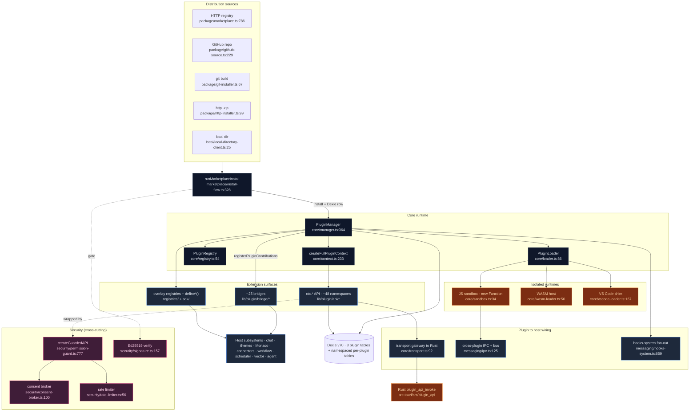

# 插件系统

<Status variant="experimental" />

<TLDR>
  Cognia 中的插件是一个经过签名、由 manifest 描述的 bundle，宿主把它加载进隔离运行时，并授予一份
  **能力受限的 API**（`ctx`）。中枢编排器是 `PluginManager`（`lib/plugin/core/manager.ts:364`）——一个
  惰性单例，把每个插件走完 `发现 → 校验 → 兼容性闸门 → 验签 → 加载 → 激活 → 启用 → 注册贡献`，每一步都有
  基于快照的回滚。插件以三种方式扩展应用：**调用** `ctx.*` API（约 48 个权限受控命名空间，在
  `lib/plugin/core/context.ts:233` 组装）；**声明贡献**，由约 25 个*桥接器*（`lib/plugin/bridge/`）投射进
  宿主子系统（chat、主题、字体、Monaco、连接器、工作流、调度器……）；以及通过 `define*()` SDK 助手把类型化
  条目**注册**进 overlay 注册表。每个触达宿主的调用都经过 `createGuardedAPI`
  （`lib/plugin/security/permission-guard.ts:777`）：显式授权检查、对危险权限的按调用同意、以及令牌桶限流。
  JS 在 `new Function` 沙箱中运行；WASM 在 Rust wasmtime 宿主中运行；完整的 VS Code 扩展则通过 sidecar shim 运行。
</TLDR>

<StatGrid>
  <Stat label="源文件" value="~150" hint="lib/plugin/ TS，不含测试" />
  <Stat label="ctx.* 命名空间" value="~48" hint="lib/plugin/api 中 32 个 + context.ts 中的基础命名空间" />
  <Stat label="贡献桥接器" value="~25" hint="lib/plugin/bridge/，由 module-bridge-map 分发" />
  <Stat label="扩展点" value="49 + ~150" hint="UI 槽位 + hooks（另含 26 激活 + 11 运行时），见 plugin-points.ts" />
  <Stat label="权限" value="~55（22 个危险）" hint="PluginPermission 联合类型，types/plugin/plugin.ts:262" />
  <Stat label="核心 Dexie 表" value="8" hint="plugins · permissions · reviews · analytics · jobs · dexieMeta · skillUsage · marketplaceSources（schema v70）" />
  <Stat label="插件运行时" value="4" hint="前端 JS · WASM 组件 · VS Code 扩展 · 角色包" />
  <Stat label="Manifest" value="v1" hint="Zod 校验，validatePluginManifest" />
</StatGrid>

## 它是什么

Cognia 提供的是一个真正的插件平台，而非脚本钩子。第三方（以及在仓库内的一等）代码无需 fork 即可扩展应用，
并以显式的按权限用户同意为前提。一个插件可以：

- **调用宿主能力**：通过 `ctx.*`——chat、向量检索、agent、文件系统、终端、git、连接器、Computer Use 自动化、
  伴侣设备等。
- **贡献界面**：在 manifest 中声明——主题、字体、壁纸、图标主题、TextMate 语法、语言、代码片段、消息分段渲染器、
  A2UI 组件、配置面板、模态挂载、AI/OCR/工作区 provider、连接器适配器、chat 中间件。
- **注册类型化条目**：通过 SDK——技能、子智能体、MCP server 预设、原生 Anthropic 工具、agent 团队模板、
  工作流模板、角色包。
- **运行计划任务**：经由[调度器](../scheduler)，发出工作流触发器，并监听约 150 个生命周期 hook（chat 收发、
  工具使用、twin 摄取、团队事件……）。

一等插件在仓库内 `plugins/` 目录下（`computer-use`、`github-delivery`、`clipboard-history`、`screenshot`、
`web-tools` 等），由与市场插件相同的 manager 加载——唯一区别是安装来源。

## 代码位置

```
lib/plugin/
  core/          # 生命周期编排：manager、loader、registry、context、descriptor、
                 #   compatibility、validation、verification、transport、sandbox、wasm-*、vscode-loader
  api/           # ctx.* 表面——32 个 *-api.ts 命名空间 + index barrel
  bridge/        # 约 25 个把插件贡献投射进宿主子系统的桥接器
  contracts/     # 声明式真相：plugin-points、capabilities、bridge maps、runtime-proof 审计
  registries/    # 类型化 overlay-registry 存储（技能、子智能体、预设、模板……）
  sdk/           # define*() 面向作者的类型化助手
  security/      # permission-guard、consent-broker、signature、rate-limiter、wasm-grant、migration
  package/       # 来源：marketplace、github、git、http 安装器 + 依赖/冲突解析
  marketplace/   # install-flow.ts——与对话框无关的安装编排器
  lifecycle/     # backup、update、rollback
  local/         # “加载未打包” 本地目录安装
  messaging/     # message-bus、ipc（跨插件 RPC）、hooks-system、constants
  dexie/         # 按插件命名空间隔离的 IndexedDB 表 + 迁移运行器
  devtools/      # 仅开发：hot-reload、dev-server、console-tap、debugger、profiler
  vscode-shim/   # VS Code 扩展宿主：manifest-adapter、rpc-dispatcher、lm/languages/webview/monaco
  lsp/           # LSP server 注册表、bootstrap、二进制策略、Tauri 客户端适配器
  character-pack/# .cognia-pack.json 内容包
  scheduler/ commands/ operator/ auth/ launcher/   # 计划任务、命令总线、Computer Use、认证

lib/db/  plugins · plugin-permissions · plugin-reviews · plugin-analytics ·
         plugin-scheduled-jobs · plugin-types   （schema v70）

components/plugins/   # 设置 UI、市场网格、审计面板、devtools
src-tauri/src/plugin_api/   # Rust 网关：plugin_api_invoke、wasm 宿主、vscode 宿主、验签
```

## 模块地图

每个方框是一篇文档页。逐模块页内含精确到行的内部细节。

<Cards>
  <Card title="核心运行时" href="./core-runtime" description="PluginManager 生命周期（发现→校验→验签→加载→激活→启用）、loader、registry、descriptor、兼容性闸门、加载顺序拓扑排序、transport 网关" />
  <Card title="Context API（ctx）" href="./context-api" description="约 48 个 ctx.* 命名空间、context.ts 如何组装它们、createGuardedAPI 模式、凭据剥离投影" />
  <Card title="贡献桥接器" href="./bridges" description="约 25 个把 manifest/SDK 贡献投射进 chat、主题、字体、Monaco、连接器、工作流的桥接器；module-bridge-map 分发循环；kind-prefix 命名空间化" />
  <Card title="契约、注册表与 SDK" href="./contracts-and-registries" description="plugin-points 目录、capability/module bridge maps、overlay-registry 基座、9 个类型化注册表、define*() 助手、runtime-proof 审计" />
  <Card title="安全与权限" href="./security" description="五段链路：声明权限 → 同意 → 守卫 → 限流 → Ed25519 签名；危险默认；可信发布者锚点；权限迁移" />
  <Card title="沙箱、消息与 WASM" href="./messaging-and-sandbox" description="new Function JS 沙箱、Node --permission 启动器、transport 与跨插件 IPC、消息总线、hooks-system 扇出、WASM loader/runtime" />
  <Card title="打包、市场与生命周期" href="./packaging-and-lifecycle" description="四种安装来源、runMarketplaceInstall 步进机、依赖解析、冲突检测、带轮换的 backup/update/rollback" />
  <Card title="存储（Dexie）与 devtools" href="./dexie-and-devtools" description="按插件命名空间隔离的 IndexedDB 表、迁移运行器、dev-server、hot-reload、console-tap、debugger、profiler" />
  <Card title="VS Code 扩展与 LSP" href="./vscode-and-lsp" description="经 sidecar shim 运行真实 .vsix 扩展、manifest 适配、24 个 Monaco 语言 provider、LSP 注册表 + 二进制策略、角色包" />
</Cards>

## 端到端架构



## 一行看懂生命周期

```mermaid
flowchart LR
  D["discover<br/>scanPlugins :873"] --> V["validate<br/>validation.ts:289"]
  V --> C["compat gate<br/>compatibility.ts:119"]
  C --> S["verify signature<br/>signature.ts:157"]
  S --> EN["enablePlugin<br/>manager.ts:1524"]
  EN --> L["loadPlugin<br/>manager.ts:1416"]
  L --> CX["build ctx + activate()<br/>context.ts:233"]
  CX --> RC["register contributions<br/>manager.ts:2404"]
  RC -. disable .-> RB["rollback snapshot restore<br/>manager.ts:1670"]
```



每一次状态转换都是幂等且回滚受保护的：load/enable 在已处于目标状态时提前返回，并发加载经由 promise map 去重，
失败的 enable 会重放它的 `unregister*ByPlugin` 清理——因此一个坏主题或坏技能不会阻塞其余部分。

## 插件运行时

| 类型 | 加载者 | 隔离 | 备注 |
| --- | --- | --- | --- |
| `frontend`（JS） | `core/loader.ts` 三策略 `eval`/builtin 闭包 | `new Function` 沙箱 + 对进程外入口的 Node `--permission` 重执行 | 默认类型；不支持 `require()` |
| `wasm`（组件） | `core/wasm-loader.ts` → Rust wasmtime | Rust 宿主 + WASI preopen 授权账本 | `wasm-runtime.ts` 提供浏览器回退（jco 路径为结构化 stub） |
| `vscode-extension` | `core/vscode-loader.ts` → Node sidecar | sidecar 进程，RPC 分发 `vscode.*` | 真实 `.vsix` 支持；24 个 Monaco 语言 provider |
| 角色包 | `character-pack/local-pack-store.ts` | 仅内容（无代码） | `.cognia-pack.json`，启动时扫描 |

## 相较旧文档的变化

本节替换的单页文档已与实现脱节。具体更正：

| 旧文档的说法 | 实际情况 | 来源 |
| --- | --- | --- |
| “API 命名空间：11” | `ctx` 对象暴露 **约 48** 个命名空间；仅 `*-api.ts` 文件就有 **32** 个 | `lib/plugin/core/context.ts:233`、`lib/plugin/api/` |
| “Dexie 表：5” | **8** 个插件自有核心表（最初的 5 个 + `pluginDexieMeta` v27、`pluginSkillUsage`、`pluginMarketplaceSources`），外加无上限的按插件命名空间表；schema 现为 **v70** | `lib/db/schema.ts:148`、`:226`、`:1052`、`:1204`、`:1808` |
| “沙箱：Worker · postMessage RPC 桥” | JS 插件运行在 **`new Function`/`AsyncFunction`** 沙箱中，注入权限受控的全局——**并非** Web Worker / postMessage 通道。OS 级隔离是另行的 Node `--permission` 重执行启动器 | `lib/plugin/core/sandbox.ts:223`、`lib/plugin/launcher/launchPluginJs.ts:107` |
| （暗示）单一 API 表面 | 存在 **两个**不同的 RPC 表面——`transport.ts`（渲染端→Rust 网关）与 `messaging/ipc.ts`（带熔断器的跨插件 IPC）——外加 `message-bus` 事件总线 | `lib/plugin/core/transport.ts:92`、`lib/plugin/messaging/ipc.ts:465` |
| （缺失）WASM + VS Code | 还存在两个运行时：Rust wasmtime WASM 宿主，以及运行真实 `.vsix` 扩展、含 24 个 Monaco 语言 provider 的 Node-sidecar VS Code 扩展 shim | `lib/plugin/core/wasm-loader.ts:56`、`lib/plugin/core/vscode-loader.ts:167` |
| （缺失）签名细节 | 插件以 **Ed25519** 验签；可信发布者锚点为**构建期注入**，未设置时回落为 `[]`（不存在可伪造的空密钥发布者） | `lib/plugin/security/signature.ts:85`、`:157` |

## 信任与沙箱边界

- **危险权限按调用同意。** `confirmDangerousByDefault` 为 `true`（`permission-guard.ts:254`）：约 22 个
  `DANGEROUS_PERMISSIONS`（`shell:execute`、`filesystem:write`、全部 `terminal:*`、全部 `automation:*`、
  `connectors:send`……）在每次调用时弹出提示，而非安装时静默授予。
- **守卫没有通配符。** `check()` 进行精确的 `grants.get(pluginId)?.get(permission)` 查找——任何地方都不存在
  `*:allow` 展开（`permission-guard.ts:402`）。
- **签名既闸门加载也闸门安装。** 开启 `trustedPublishersOnly` 且无构建期公钥时，*每个*插件都会被拒——锚点为 `[]`，
  绝非可伪造的空密钥发布者（`signature.ts:85`）。
- **JS 沙箱是软隔离；WASM 宿主与 Node 启动器是硬隔离。** 进程内 JS 隔离是权限受控的全局表面，并非 OS 边界。
  WASI preopen 是 fail-closed（空授权直接抛错），Node `--permission` 启动器在某作用域为空时整段省略该 flag，
  而不是传 `*`。
- **Web 模式降级而非崩溃。** WASM、transport 网关、签名加密与 VS Code shim 在 Tauri 之外都返回 warn-stub；
  只读市场预览在浏览器中仍可用。

## 下一步

<Cards>
  <Card title="核心运行时" href="./core-runtime" description="从这里开始：插件如何被发现、校验与激活" />
  <Card title="Context API（ctx）" href="./context-api" description="插件调用的能力表面" />
  <Card title="安全与权限" href="./security" description="守卫、同意与签名模型" />
  <Card title="调度器" href="../scheduler" description="插件计划任务的运行处" />
</Cards>
