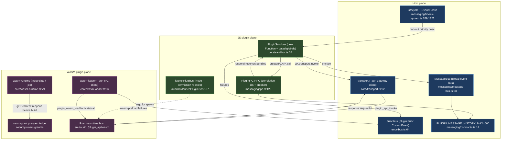

# 沙箱、消息与 WASM

<Status variant="experimental" />

<TLDR>
插件从不以宿主原始权限运行。JS 插件通过 `PluginSandbox`（`lib/plugin/core/sandbox.ts:34`）求值 —— 一个按权限门控的全局对象表面被喂给 `new Function` / `AsyncFunction`，绝不使用环境 `eval`。操作系统级隔离是独立的 Node 24 `--permission` 重新执行（`lib/plugin/launcher/launchPluginJs.ts:107`）。WASM 插件分为 Tauri-IPC 客户端（`lib/plugin/core/wasm-loader.ts:56`）与受 `wasm-grant` 预打开账本约束的浏览器回退（`lib/plugin/core/wasm-runtime.ts:79`）。流量行经两条 RPC 通道 —— 渲染端→Rust 的 `transport.ts` 与插件↔插件的 `ipc.ts` —— 外加类型化的 `message-bus.ts` 事件总线，三者共享 `PLUGIN_MESSAGE_HISTORY_MAX = 500`（`messaging/constants.ts:14`）。
</TLDR>

<StatGrid>
  <Stat label="JS 隔离" value="new Function" hint="无 Web Worker；门控全局作为具名参数" />
  <Stat label="操作系统边界" value="Node --permission" hint="重新执行，失败即拒绝" />
  <Stat label="RPC 通道" value="2 + 1 总线" hint="transport · ipc · message-bus" />
  <Stat label="错误码" value="8" hint="transport 网关" />
  <Stat label="系统事件" value="18" hint="SystemEvents 预定义" />
  <Stat label="历史上限" value="500" hint="PLUGIN_MESSAGE_HISTORY_MAX" />
</StatGrid>

## 1. 目的

插件从不以宿主原始权限运行。JS 插件通过 `PluginSandbox`（`lib/plugin/core/sandbox.ts`）执行，它手工构建一个按权限门控的全局对象表面，并通过 `new Function` / `AsyncFunction` 而非环境 `eval` 求值代码。独立的 Node `--permission` 重新执行启动器（`lib/plugin/launcher/launchPluginJs.ts`）在操作系统级约束文件系统 / 网络 / 子进程表面。

WASM 插件走平行路径。`wasm-loader.ts` 是面向 Rust `wasmtime` 宿主的轻量 Tauri-IPC 客户端；`wasm-runtime.ts` 是浏览器端的 `WebAssembly.instantiate` / `@bytecodealliance/jco` 回退，受 `wasm-grant` 预打开账本约束。

插件间与插件↔宿主流量行经消息系统：`messaging/ipc.ts` 是带关联 id、断路器与超时的请求/响应 RPC；`messaging/message-bus.ts` 是全局类型化事件总线；`constants.ts` 保存共享历史上限。钩子系统（`messaging/hooks-system.ts`）按优先级顺序把生命周期 / 应用事件扇出到每个插件，`error-bus.ts` 收集插件错误。

`transport.ts` 是 Tauri `plugin_api_invoke` 网关客户端（渲染端→Rust），与跨插件 IPC 不同。**没有 Web Worker** —— JS 隔离是 `new Function` 加 Node `--permission` 重新执行，而非 `postMessage`。



## 2. sandbox.ts —— 进程内 JS 沙箱

`PluginSandbox` **不**派生 Web Worker。它从声明的权限构建一个允许列表 `Set<string>`（`buildAllowedAPIs`，`sandbox.ts:49`）—— 始终开启的 `console` / `JSON` / `Math` / `Promise` / `Date` / `Map`（`:53-72`）；为 `network:fetch` 门控的 `fetch` / `Headers`（`:77`）、`WebSocket`（`:84`）、`navigator.clipboard`（`:88`）与 `indexedDB`（`:98`）。

随后合成沙箱化全局（`createSandboxedGlobals`，`:112`）：带前缀日志器的 `console`（`:137`）；被钳制到 `config.timeout || 30000` 的 `setTimeout`（`:151-157`）；下限 `100ms` 的 `setInterval`（`:160-167`）；注入 `X-Plugin-Id` 头的权限门控 `fetch`（`:169-185`）；以及按 `database:read` / `database:write` 门控、以 `plugin:<id>:` 为前缀的 `localStorage` 代理（`:187-214`）。

代码通过把全局作为具名函数参数注入来运行：

```ts
execute<T>(code: string, context: Record<string, unknown> = {}): T {
  const safeContext = { ...this.sandboxedGlobals, ...context }
  const argNames = Object.keys(safeContext)
  const argValues = Object.values(safeContext)
  const fn = new Function(...argNames, `"use strict"; return (${code})`)
  return fn(...argValues) as T
}
```

即 `sandbox.ts:223-241`。`executeAsync`（`:246`）把函数体包进 `AsyncFunction` 并与超时竞速（`:262-267`）。`executeCode(language, code)`（`:301`）是独立的重型 web 沙箱（Pyodide / Worker）—— 按 `sandbox:web-execute` 门控（`:302`），委托给 `@/lib/sandbox/web`（`:304`）。

## 3. transport 与 ipc 与 message-bus

两条 RPC 通道加一条事件总线。

### A. transport.ts —— 渲染端→Rust 网关

请求信封是 `PluginApiInvokeRequest`（`transport.ts:25`）：`{sdkVersion, pluginId, requestId, api, payload, timeoutMs?, context?}`。响应是 `PluginApiInvokeResponse<T>`（`:35`）：`{requestId, success, data?, error?, runtimeVersion, compat}`。`requestId` 是 `crypto.randomUUID()`（`createRequestId`，`:77`）。仅 `TIMEOUT` / `INTERNAL` 会重试（`shouldRetry`，`:84`），采用 `retryDelayMs * attempt` 退避（`:127`）：

```ts
const response = await invoke<PluginApiInvokeResponse<T>>("plugin_api_invoke", { request })
if (response.success) return response.data as T
const error = response.error ?? { code: "INTERNAL", message: "Unknown plugin gateway error" }
if (attempt <= retries && shouldRetry(error.code)) { await sleep(retryDelayMs * attempt); continue }
throw new PluginGatewayError({ code: error.code })
```

错误码（`transport.ts:3`）：

| 错误码 | 含义 | 重试 |
| --- | --- | --- |
| `INVALID_REQUEST` | 信封格式错误 | 否 |
| `PERMISSION_REQUIRED` | 权限尚未授予 | 否 |
| `PERMISSION_DENIED` | 权限被拒绝 | 否 |
| `NOT_SUPPORTED` | 当前外壳不支持该 API | 否 |
| `NOT_FOUND` | 目标 / 资源缺失 | 否 |
| `CONFLICT` | 状态冲突 | 否 |
| `TIMEOUT` | 网关超时 | 是 |
| `INTERNAL` | 未知网关错误 | 是 |

批量路径 `invokePluginApiBatch` 调用 `plugin_api_batch_invoke`（`:142`）。

### B. ipc.ts —— 跨插件 RPC

`IPCMessage` 信封（`ipc.ts:63`）是 `{id, type, channel, senderId, targetId?, payload, timestamp, replyTo?}`，其中 `type` 是四种之一：`request | response | broadcast | event`。一个 `pendingRequests` `Map<requestId, ResponseHandler>` 跟踪进行中的调用。`sendAndWait`（`:231`）在 `requestId` 下注册超时定时器与 `AbortSignal`（`:257-272`）；`respond`（`:298`）按 `requestId` 解析（`:306`）。

`createIPCAPI(pluginId).call`（`:807`）路由到 `PluginIPC.call`（`:465`），它查找 `exposedMethods.get(targetPluginId).get(methodName)`（`:472-480`），守护一个按 `(target::method)` 的断路器（`:482-485`，`getBreaker` `:544`），让 `withTimeout(handler)` 与中止竞速（`:518-520`），记录成功 / 失败（`:524` / `:534`），并在 `closed → open` 转换时发射一次 `recordSilentFailure`（`:565-575`）：

```ts
const breaker = this.getBreaker(targetPluginId, methodName)
if (!breaker.canPass()) throw new CircuitOpenError(targetPluginId, methodName)
if (options.signal?.aborted) throw new IPCAbortError("aborted before dispatch")
```

中止（`IPCAbortError`，名称 `"AbortError"`，`:56`）**不**计入断路器（`:528-532`）。历史上限为 `maxHistory ?? PLUGIN_MESSAGE_HISTORY_MAX`（`:154`）。`validateMessage` 拒绝超过 `maxMessageSize`（1MB）的载荷（`:638-647`）。

### C. message-bus.ts —— 类型化事件总线

`BusEvent`（`message-bus.ts:15`）是 `{id, type, source, payload, timestamp, metadata?}`。`emit`（`:107`）记录 → 日志 → 投递；`deliverEvent`（`:262`）收集精确、RegExp 模式与 `"*"` 订阅，按优先级降序排序（`:290`），各自在自己的 `try/catch` 中运行（`:292-302`），并修剪一次性订阅（`:304-307`）。`createEventAPI(pluginId)` 位于 `:518`。

`SystemEvents`（`:59`）预定义 18 种类型：

| 分组 | 事件 |
| --- | --- |
| 插件生命周期 | `PLUGIN_LOADED` · `PLUGIN_ENABLED` · `PLUGIN_DISABLED` · `PLUGIN_UNLOADED` · `PLUGIN_ERROR` |
| 会话 | `SESSION_CREATED` · `SESSION_SWITCHED` · `SESSION_DELETED` |
| 智能体 | `AGENT_STARTED` · `AGENT_COMPLETED` · `AGENT_ERROR` |
| 消息 | `MESSAGE_SENT` · `MESSAGE_RECEIVED` |
| 应用 / UI | `THEME_CHANGED` · `SETTINGS_CHANGED` · `APP_READY` · `APP_CLOSING` |

`constants.ts`：`PLUGIN_MESSAGE_HISTORY_MAX = 500`（`:14`）统一 IPC 与 MessageBus 的上限。

## 4. hooks-system.ts

三个类。

**`HookDispatcher`**（`hooks-system.ts:249`）携带优先级枚举 `HookPriority {CRITICAL=100, HIGH=75, NORMAL=50, LOW=25, DEFERRED=0}`（`:153`）。`registerHook` 返回取消订阅（`:274`）。`executeHook` 并行运行（`Promise.allSettled`，`:363`）或带 `stopOnFirst` / `continueOnError` 的串行（`:371-382`）；中间件运行 `before` / `after` / `error`（`:225`）；`executePipeline` 链式变换（`:467`）。排序为优先级降序再 `pluginId.localeCompare`（`getSortedHooks`，`:523-527`）。

**`PluginLifecycleHooks`**（`:659`）：`registerHooks`（`:667`）；`dispatchOnLoad` / `Enable` / `Disable` / `Unload`（`:695-721`）；`onConfigChange`（`:723`）；以及管道式的 `dispatchOnMessageSend`（`:961`）/ `Receive`（`:978`）/ `Render`（`:995`）。团队钩子通过每插件 `queueMicrotask` 发射后即忘（`dispatchTeamHook`，`:875-903`）—— `onTeamStart` / `onTeamPlanReady` / `onTeammateClaim` / `onTeammateRelease` / `onTeamBudgetWarn` / `onTeamComplete` / `onConsensus*` / `onSharedMemoryWrite` / `Delete` / `onTeamDelegationStart` / `Complete`（`:905-955`）。智能体钩子：`onAgentStart` / `Step` / `ToolCall` / `Complete` / `Error`（`:790-857`）。

**`PluginEventHooks`**（`:1323`）从 `usePluginStore` 读取已启用插件（`:1346`），带 10 秒超时（`:1365`），并变换 `onBuildOptions`（按字段浅合并，`:1608`）、`onUserPromptSubmit`（拦截 / 修改，先到先得，`:1670`）、`onPreToolUse`（拒绝 / 修改，`:1694`）、`onPostToolUse`（`:1718`）、`onPreCompact`（`:1752`）与 `onPostChatReceive`（`:1785`）。失败遥测使用 `recordPluginHookError`（256 环形缓冲，`:67`）；`recordPluginHookEvent` 发射一个 agent-trace span（`:113-144`）。单例为 `getPluginLifecycleHooks` / `getPluginEventHooks`（`:2202` / `:2212`）。

```ts
queueMicrotask(() => {
  const startTime = Date.now(); let caught: unknown
  try { handler(payload) }
  catch (error) { caught = error; loggers.hooks.error(`Error in plugin ${pluginId} ${name}:`, error) }
  recordPluginHookEvent({ pluginId, hookName: String(name), startTime, durationMs: Date.now()-startTime, sessionId, error: caught })
})
```

即 `hooks-system.ts:884-901`。

## 5. wasm-loader.ts + wasm-runtime.ts

`wasm-loader.ts` 是**生产 Tauri 路径**：`isWasmHostAvailable = isTauri()`（`:44`）。`loadWasmDefinition`（`:56`）校验 `wasmMain` 与 `wasm.apiVersion`（`:60-65`），在浏览器中返回仅警告的桩（`:67-78`），否则调用 `invoke("plugin_wasm_load")`（`:88`）。它返回 `activate → plugin_wasm_activate`（产出 guest 导出，`:100`）与 `deactivate → plugin_wasm_deactivate`（`:116`）。`callWasmExport → plugin_wasm_call` 把 JSON 包成 `list<u8>`（`:131-149`）；`unloadWasmPlugin → plugin_wasm_unload`（`:155`）。重型工作 —— 编译、能力门控、store 生命周期、epoch 中断 —— 位于 Rust 的 `src-tauri/src/plugin_api/wasm/`。

`wasm-runtime.ts` 是**浏览器端**运行时。其授权模型在构建运行时**之前**从 `getGrantedPreopens(pluginId)`（`lib/plugin/security/wasm-grant.ts`）解析预打开 —— 空或缺失的授权是硬性早期失败（`:79-89`）。宿主函数导入是纯的，无真实 FS 或网络（`:169-182`）：

```ts
const importObject: WebAssembly.Imports = {
  cognia: {
    preopen_count: () => grantedSet.size,
    preopen_at: (idx) => [...grantedSet][idx] ?? "",
    read_file: (path) => { if (!grantedSet.has(path)) throw new Error(`wasm-runtime: preopen denied for ${path}`); return memorySnapshot.get(path) ?? new Uint8Array() },
  },
}
```

`loadWasmPlugin`（`:79`）返回带 disposed 守卫 `call` / `dispose` 的 `WasmPluginHandle`（`:29`，`:96-107`）。默认工厂（`:121`）嗅探 wasm magic（`looksLikeComponent`，`:152` —— 第 5 字节 `≠ 0x01` 即组件），路由到 `instantiateCoreModule`（`:163`）或 `loadComponent`（`:207`）。组件路径通过 `Function("s","return import(s)")`（`:216`）对 webpack 隐藏地动态导入 `@bytecodealliance/jco`，当前抛出结构化的“尚未接线”错误（`:230-233`）。

## 6. launchPluginJs.ts

ADR-0028 第 5 阶段 —— 在 Node 24 `--permission` 下重新执行插件 JS 入口，使 FS / 网络 / 子进程表面受清单 `PluginPermission[]` 约束。该模块是纯标志构建，无 I/O。`nodePermissionArgs(scope)`（`:55`）发出 `--permission`，随后从 CSV 列表条件性地发出 `--allow-fs-read` / `--allow-fs-write` / `--allow-net` / `--allow-child-process`；**空列表省略该标志**（失败即拒绝，绝不 `*`）（`:56-69`）。`deriveScopeFromManifest`（`:81`）把粗粒度权限映射到具体的路径 / 主机 / 子进程列表，采用保守的空默认值（`:89-96`）。`buildLaunchArgv(entryPath, scope, extra)`（`:107`）产出 `[...nodePermissionArgs, entryPath, ...extra]`。

## 7. error-bus.ts

单一类型化 DOM `CustomEvent` 通道，`PLUGIN_ERROR_EVENT = "plugin:error"`（`:22`）。12 个阶段（`:24`）为 `install | install-rollback | load | enable | disable | uninstall | config | activation | permission-register | wasm-preload | hot-reload | local-install`；严重度为 `error | warning`（`:38`）；detail 为 `{pluginId, pluginName?, stage, message, severity, recoverable}`（`:40`）。`dispatchPluginError`（`:64`）无论是否有订阅者，总是通过 `loggers.plugin` 记录（`:66-73`），随后仅当 `window` 已定义时派发 `CustomEvent`（`:74-75`）。`subscribePluginError(handler)`（`:83`）返回取消订阅，当 `window` 未定义时为空操作（`:84`）。

## 8. 注意事项

- **无 Web Worker。** JS 隔离是 `new Function` / `AsyncFunction`，门控全局作为具名参数注入（`sandbox.ts:236` / `:258`）。操作系统级隔离是独立的 Node `--permission` 重新执行（`launchPluginJs.ts`）；进程内沙箱是软隔离。
- **两条 RPC 通道。** `transport.ts` 是渲染端→Rust（`plugin_api_invoke`，仅重试 `TIMEOUT` / `INTERNAL`，UUID `requestId`）；`ipc.ts` 是插件↔插件（内存内，`Date.now()` + 随机 id，按端点断路器）。
- **Web 与 Tauri。** WASM、transport 与 `executeCode` 在浏览器中降级：`wasm-loader` 返回警告桩（`:67`），`wasm-runtime` 纯运行 `WebAssembly.instantiate`，`error-bus` 在 `window` 未定义时对 DOM 事件空操作但仍记录日志。
- **关联 / 幂等。** IPC 待处理条目以 `requestId` 为键；中止 / 超时的 `cleanup()` 删除待处理条目（`ipc.ts:249-255`）。`requestId` 在 transport 重试间保持不变（`:98`）。无幂等键 —— 重试的 transport 调用是一次新的 `invoke`。
- **计数。** IPC `type` 有 4 种；transport 有 8 个错误码；`SystemEvents` 有 18 种预定义类型；`PluginErrorStage` 有 12 个阶段。
- **可重入。** 团队钩子在 `queueMicrotask` 中逐插件派发（`hooks-system.ts:875-903`）。MessageBus、IPC 与钩子各自把每个处理器包进自己的 `try/catch`。
- **共享历史上限。** IPC 与 MessageBus 都取自 `PLUGIN_MESSAGE_HISTORY_MAX`（`constants.ts`）；上限历史上曾在 100 与 500 之间分歧。
- **WASM 授权是提前失败即关闭**，且组件（`jco`）路径当前是结构化错误桩。

<Cards>
  <Card title="安全模型" href="./security" description="权限授予、同意、签名，以及支撑 WASM 运行时的 wasm-grant 预打开账本。" />
  <Card title="核心运行时" href="./core-runtime" description="挂载沙箱并派发钩子的插件管理器、加载器与生命周期。" />
  <Card title="Dexie 与开发者工具" href="./dexie-and-devtools" description="插件所属的 Dexie 表，以及围绕插件系统的开发者工具。" />
</Cards>
