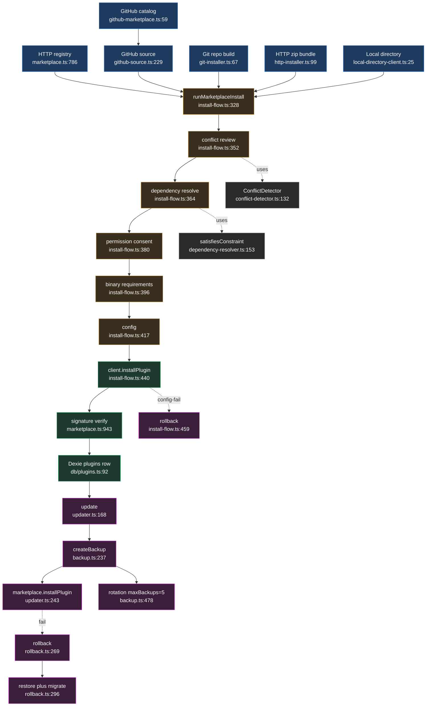

# 打包、市场与生命周期

<Status variant="experimental" />

<TLDR>
任何插件安装 —— HTTP 注册中心、GitHub 市场仓库、原始 git 构建、签名的 HTTP zip、本地目录 —— 都汇入 `runMarketplaceInstall`（`install-flow.ts:328`），它先跑一条有序闸门（manifest → 冲突 → 依赖 → 权限 → 二进制 → 配置），再调用各来源各自的 `installPlugin`。在安装步骤之前不存在任何 Dexie `plugins` 行（`install-flow.ts:6-7`）。安装完成后，`updater.ts`、`backup.ts`、`rollback.ts` 负责版本管理、快照轮转（默认 5）以及带迁移的恢复。
</TLDR>

<StatGrid>
  <Stat label="安装来源" value="5" />
  <Stat label="install-flow 闸门" value="6（步骤 0-5）" />
  <Stat label="冲突类型" value="6" />
  <Stat label="每插件保留备份" value="5（默认）" />
  <Stat label="自动备份间隔" value="24h（默认）" />
  <Stat label="签名闸门" value="strict-on" />
</StatGrid>

## 1. 目的

本子系统是插件的分发与生命周期主干。它接受来自**五种来源**的插件，并将它们全部送入一条单一、与对话框无关的安装流水线，安装后还负责保持其更新并可回退。

五种来源：

- **HTTP 注册中心**（`marketplace.ts`）—— 通过 `proxyFetch` 查询的远程插件注册中心。
- **GitHub“市场仓库”**（`github-marketplace.ts` → `github-source.ts`）—— 提供 `marketplace.json` 目录的 GitHub 仓库。
- **直接 git 仓库**（`git-installer.ts`）—— 用 `cargo-component` 在本地构建（WASM）的仓库 URL。
- **HTTP `.zip` 包**（`http-installer.ts`）—— 带分离式 Ed25519 签名的包 URL。
- **本地磁盘目录**（`local/`）—— 含 `plugin.json` 的“加载已解压”目录。

所有 UI 安装都汇入 `runMarketplaceInstall`（`marketplace/install-flow.ts`），它在一条有序链上设闸 —— manifest 拉取 → 冲突检测（`conflict-detector.ts`）→ 依赖解析（`dependency-resolver.ts`）→ 权限同意 → 二进制需求探测 → 配置 —— 随后调用各来源各自的 `installPlugin`。该来源调用在行被提升之前执行权威的 **Rust 下载 + 签名校验**。一旦安装完成（存在一行 Dexie `plugins`），生命周期管理器接手版本管理：`updater.ts`（备份 → 下载 → 安装 → 校验）、`backup.ts`（快照 + 轮转）、`rollback.ts`（备份 → 禁用/卸载 → 恢复 → 迁移 → 加载/启用 → 校验）。

## 2. `install-flow.ts` —— `runMarketplaceInstall`

入口是 `install-flow.ts:328` 处的 `runMarketplaceInstall(opts)`。它**与对话框无关**：每个交互决策都作为回调注入（`install-flow.ts:81-162`），因此同一流程可驱动桌面对话框、测试和无头路径。**在步骤 4 之前不创建任何 Dexie 行**（`install-flow.ts:6-7`）。

| # | 步骤 | 行号 | 行为 |
| --- | --- | --- | --- |
| 0 | 解析 manifest | `:336-349` | `client.getPlugin(pluginId)`；`null` → `failed`/`install`（`:340`）；抛错 → `failed`/`install`（`:344`） |
| 1 | 冲突审查 | `:352-358` | `detectConflicts()`（`:352`）；若有冲突则 `requestConflictReview()`；取消 → `cancelled`/`conflict`（`:356`） |
| 1.5 | 依赖审查 | `:364-377` | `resolveDependencyIssues()`（`:364`）；缺失/冲突且无回调 → `cancelled`/`dependencies`（`:371`）；取消 → `:375` |
| 2 | 权限审查 | `:380-391` | 仅当声明/可选权限非空；取消 → `cancelled`/`permission`（`:389`） |
| 2.5 | 二进制需求 | `:396-409` | `resolveMissingBinaries()`（`:396`）；无回调 → `cancelled`/`binary-requirements`（`:403`）；取消 → `:407` |
| 3 | 配置 | `:417-431` | 仅当 `hasConfigSchema`；`requestConfig()`；取消 → `cancelled`/`config`（`:420`）；值被捕获（`:429`） |
| 4 | 安装 | `:439-447` | `client.installPlugin(pluginId, version)`（`:440`）；抛错 → `failed`/`install`（`:445`） |
| 5 | 持久化配置 | `:449-487` | `setPluginConfig()`（`:451`）；失败 → 安装后回滚（`:459-480`）；回滚失败 → `failed`/`install-rollback`（`:474`） |
| — | 成功 | `:489` | `{ status: "installed", pluginId }` |

结果是一个判别联合 —— `installed` | `cancelled{stage}` | `failed{stage, message}`（`install-flow.ts:172-175`）—— 因此调用方能精确分支到流程停在何处。

冲突步骤如下（`install-flow.ts:351-358`）：

```ts
const conflict = await detectConflicts(pluginId, manifest)
if (conflict) {
  const decision = await opts.requestConflictReview(conflict)
  if (decision === "cancel") return { status: "cancelled", stage: "conflict" }
}
```

`detectConflicts`（`install-flow.ts:191`）首先检查 id 碰撞 → 发出 `high` 严重度的 `alreadyInstalled:${version}` 冲突（`:200`），随后委托给 `ConflictDetector.detectForPlugin`，将各检测器的 `error`/`warning`/`info` 映射到 `high`/`medium`/`low`（`:228-235`）。默认的安装后回滚会惰性解析 `getPluginManager().rollbackInstallation`（`:504-523`），若管理器尚未引导则返回 `null`（`:516`）。

## 3. 来源

| 来源 | 文件 | 输入 | 如何拉取 | 关键函数 `:line` |
| --- | --- | --- | --- | --- |
| HTTP 注册中心 | `marketplace.ts` | registry URL + `pluginId` | `proxyFetch(registryUrl/plugins)`；Rust `plugin_install` / `plugin_download_version` | `getPlugin :584`、`searchPluginsStrict :526`、`installPlugin :786` |
| GitHub 市场仓库 | `github-marketplace.ts` | owner/repo ref | GitHub contents API 取 `marketplace.json`（3 个候选路径 `:12-16`），解析 `plugins[]` | `fetchMarketplaceCatalog :59`、`fetchAllSourceEntries :110` |
| GitHub 来源（按插件） | `github-source.ts` | `owner/repo[@ref][/sub]` 或 URL | 经 contents API 的 `fetchGithubFile`（base64 解码 `:130-142`）；经 Rust `installPluginFromGithub` 安装 | `parseGithubPluginRef :63`、`fetchGithubPluginPreview :176`、`makeGithubMarketplaceClient :229` |
| Git 仓库（WASM 构建） | `git-installer.ts` | `repoUrl` + branch | Tauri `plugin_wasm_install_from_git` —— 浅克隆 + `cargo component build` | `installFromGit :67` |
| HTTP zip 包 | `http-installer.ts` | `bundleUrl`（+ `signatureUrl`、`expectedPublicKeyBase64`） | Tauri `plugin_wasm_install_from_url`；Ed25519 校验；记录 `trustedPublishers` | `installFromUrl :99`、`previewBundleManifest :89`、`isPublisherKeyTrusted :157` |
| 本地目录 | `local/install-from-directory.ts` | 含 `plugin.json` 的绝对 `sourceDir` | Tauri `plugin_install_from_directory`；经 `preview_local_manifest` 预览 | `installPluginFromDirectory :45`、`previewLocalManifest :94` |
| 本地（客户端适配器） | `local/local-directory-client.ts` | `sourceDir` | 将上述两者包成一个 `{ getPlugin, installPlugin }` 客户端 | `createLocalDirectoryClient :25` |

GitHub 市场仓库与按插件的 GitHub 来源是组合的：目录客户端（`github-marketplace.ts:59`）列出条目，每个条目解析为一个按插件的 GitHub 客户端（`github-source.ts:229`），后者拉取 manifest 并驱动 Rust 安装。

## 4. `dependency-resolver.ts`

`DependencyResolver.resolve()`（`:226`）递归遍历声明的依赖（`resolveRecursive :255`）。对每个依赖，它**先查已安装映射**（`:275`），否则做 `pluginProvider` 市场查找（`:308`），否则将该依赖压入 `missing`（`:344`）。循环依赖经 `visiting` 集合检测，产生**警告而非抛错**（`:266-269`）。最终安装顺序是经 Kahn 算法的拓扑排序（`calculateInstallOrder :369` —— 入度映射 + 零入度队列，`:396-411`）。

约束失败按其来源拆分：未满足其约束的已安装版本变为 `conflict`（`:289-297`）；先失败的市场版本会尝试 `versionProvider` 寻找替代（`:322-333`）。成功意味着**既无 missing 也无 conflicts**（`:249`）：

```ts
result.success = result.missing.length === 0 && result.conflicts.length === 0
```

`satisfiesConstraint`（`:153`）经 `parseConstraint`（`:84`）支持 `^`、`~`、`>=`、`>`、`<=`、`<`、`" - "` 区间、精确锁定以及 `*`。install-flow **直接**使用 `satisfiesConstraint`（`install-flow.ts:311`）做其更轻量的 `resolveDependencyIssues` 检查，而非运行完整的递归解析器。

## 5. `conflict-detector.ts`

`ConflictDetector.detectAll()`（`:103`）在所有已安装插件上运行**六项检查**；`detectForPlugin(id)`（`:132`）对一个候选与其他每个插件成对运行相同检查。冲突类型（`ConflictType :27-35`）：

| 类型 | 严重度 | 检测器 `:line` | 触发条件 |
| --- | --- | --- | --- |
| version | error/warning | `:172` | 依赖约束不可满足（`:204`）或相互排斥的约束（`:218`） |
| namespace | error | `:255` | 同一命名空间（默认为 `pluginId`，`:260`）被 ≥2 个插件声明 |
| command | warning | `:290` | 同一 command id 被 ≥2 个插件注册 |
| shortcut | warning | `:325` | 归一化后的快捷键碰撞（`normalizeShortcut :357`） |
| capability | info | `:365` | ≥2 个插件声明排他的 `themes` 能力（`:367`） |
| resource | warning | `:397` | 共享资源路径 |

当不存在 error 时流水线可继续 —— `canProceed = errors.length === 0`（`:127`）。每种类型都有建议的自动解决方案（`generateAutoResolutions :473-565`）：command → `skip`、shortcut → `rebind`、namespace → `prefix`、version → `upgrade`/`downgrade`、capability → `disable`、resource → `prioritize`。

version 检测器对已安装依赖的版本测试每条需求（`:200`）：

```ts
const unsatisfied = requirements.filter(
  (req) => !satisfiesConstraint(installedDep.manifest.version, req.constraint),
)
```

## 6. `catalog-entry.ts` + `marketplace.ts`

`PluginRegistryEntry`（`marketplace.ts:30-55`）是注册中心的线上形态：`id` / `name` / `version` / `latestVersion` / `downloads` / `rating` / `tags` / `categories` / `verified` / `featured` / `manifest` / `downloadUrl` / `checksum` / `source`。`PluginMarketplace`（`:513`）上的查询 API 暴露 `searchPlugins` / `searchPluginsStrict`（`:572` / `:526`，构建 `URLSearchParams` `:531-540` 后 `proxyFetch`）、`getPlugin`（`:584`，`404` → `null` `:598`）以及 `getVersions`（`:612`，桌面端 Rust `plugin_marketplace_versions` `:620-622`）。

`buildExtensionCatalogEntry`（`catalog-entry.ts:83`）将 `PluginRegistryEntry` 与已安装的 `Plugin` 合并为 `ExtensionCatalogEntry`：它派生 `installed` / `enabled`（`:102-103`），从描述符诊断加生命周期诊断计算兼容性（`buildLifecycleDiagnostics :15` —— 浮现 `lifecycle.reload.failed_after_update` `:30` 与失败动作警告 `:42`），并在同时存在 last-known-good 与失败快照时向 `availableOperations` 追加 `"rollback"`（`buildCatalogOperations :64-81`）。

## 7. `lifecycle/` —— 备份 + 回滚 + 更新器

### `updater.ts`

`update()`（`:168`）运行四个步骤：**步骤 1** 若已配置则备份（`createBackup` reason 为 `pre-update`，`:212`），**步骤 2** 校验目标版本在市场中存在（`:229-233`），**步骤 3** `marketplace.installPlugin`（`:243`）随后投影新版本并 `refreshRuntimePlugins`（`:248-249`），**步骤 4** 校验已安装版本（`:260`）。它发出 `UpdateProgress` 阶段 `checking` | `downloading` | `backing_up` | `installing` | `verifying` | `complete` | `error`（`:40-47`）。失败时返回带错误的结果，且**不自动恢复**。自动更新按间隔运行（`:351`）；`notifyOnly` 则改为派发 `plugin:updates-available`（`:370`）。

```ts
const backupResult = await getPluginBackupManager().createBackup(pluginId, {
  reason: "pre-update",
  metadata: { targetVersion },
})
```

### `backup.ts`

`createBackup`（`:237`）调用 Tauri `plugin_backup_create`（`:256`）；索引以 `backupPath` 为键持久化到 `localStorage`（`:91-112`）。轮转由 `cleanupOldBackups`（`:478`）处理 —— `while (backups.length > maxToKeep)` 弹出最旧的并调用 `plugin_backup_delete`（`:485-489`）；默认 `maxBackupsPerPlugin: 5`（`:80`）。恢复有三种形态 —— `restore` / `restoreLatest` / `restoreToVersion`（`:337` / `:388` / `:404`）—— 全部委托给 `plugin_backup_restore`（`:364`）。自动备份间隔默认 24h（`:82`、`:518`）。

### `rollback.ts`

`rollback(pluginId, target)`（`:269`）运行六个步骤：**步骤 1** 回滚前备份（`:277-287`），**步骤 2** `plugin_disable` + `plugin_unload`（`:290-291`），**步骤 3** 恢复 —— 经 `restoreToVersion` 从备份恢复**或**经 `marketplace.installPlugin`（`:296-309`），**步骤 4** 数据迁移（`applyMigration :316`，up/down `MigrationScripts :452-465`），**步骤 5** `plugin_load` + `plugin_enable`（`:320-321`），**步骤 6** 校验版本匹配（`:324-328`）。抛错时记录 `success: false` 且**不自动重新恢复**（`:343-357`）。`createRollbackPlan`（`:158`）发出 8 步有序计划（`:174-249`），供 UI 在运行前预览回滚。

## 8. 端到端流程



## 9. 注意事项

- **`trustedPublishersOnly` 不在这里。** 该开关位于签名子系统，而非这些目录。`policy-runtime.ts:71-72` 将 `trustedPublishersOnly ?? false` 映射到校验器的 `trustedPublishersOnly`，并反转为 `allowUntrusted`。校验器拒绝未知签名者（`signature.ts:204`）。**无构建期锚点**时它拒绝一切（`signature.ts:83`）。
- **签名闸门的位置。** 注册中心安装在 Rust `plugin_install` **之后**、提升行**之前**校验（`marketplace.ts:935-959`）；`requireSignatures` 默认 strict-on（`signature.ts:113`）。禁用它仍会运行校验，但记录一条 Audit-Panel 旁路诊断（`marketplace.ts:960-974`）。HTTP 与 git 安装在 **Rust 内部**校验并返回 `signatureVerified`（`http-installer.ts:146`、`git-installer.ts:78`）。install-flow 本身**不做**签名检查 —— 它信任客户端。
- **已安装插件持久化在哪。** Dexie `plugins` 表（`lib/db/plugins.ts:92` put、`:42` get、`:115` `setPluginConfig`）；install-flow 经 `listPlugins` / `getPlugin` / `setPluginConfig` 读写（`install-flow.ts:20`）。磁盘上的 WASM/文件位于 Rust 插件根（`plugin_get_directory`，`marketplace.ts:888`）。备份索引位于 `localStorage`（`backup.ts:91-112`）；备份文件本身由 Tauri 写入。
- **仅 Tauri 对比 web。** 在 web/Capacitor 中，git、HTTP 与本地安装是硬性桌面错误（`git-installer.ts:68`、`http-installer.ts:124`、`install-from-directory.ts:49`）；当 `!isTauri()` 时 `marketplace.installPlugin` 返回失败（`marketplace.ts:867`）。只读预览在浏览器内仍可用。`defaultDetectBinary` 将探测器导入失败视为“不可用”，从而使二进制闸门仍会浮现（`install-flow.ts:284-288`）。

<Cards>
  <Card title="安全与签名" href="./security" description="trustedPublishersOnly、构建期锚点，以及为注册中心安装设闸的签名校验器。" />
  <Card title="核心运行时" href="./core-runtime" description="插件管理器、加载/启用/卸载，以及 install-flow 提升进入的运行时。" />
  <Card title="Dexie 与开发者工具" href="./dexie-and-devtools" description="支撑安装状态的 plugins 表，及围绕它的开发者工具。" />
</Cards>
