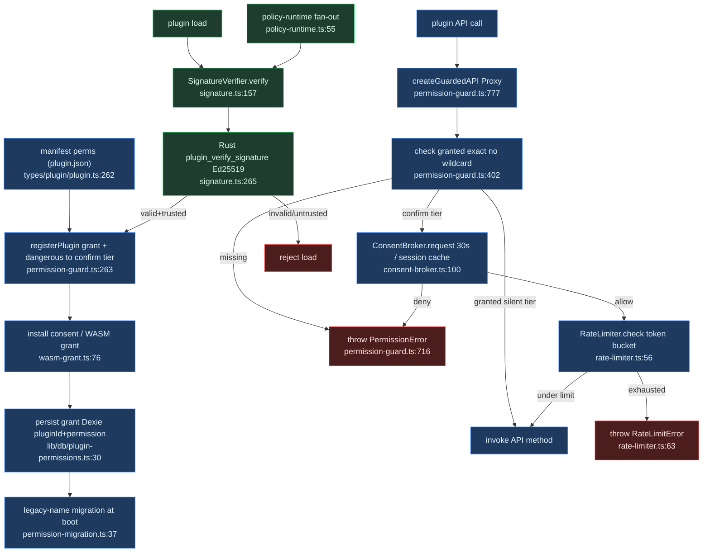

# 安全与权限

<Status variant="experimental" />

<TLDR>
插件的 `plugin.json` 声明 `PluginPermission` 字符串（规范联合类型位于 `types/plugin/plugin.ts:262`）。注册时守卫将每一项记为 `manifest` 授予，并把 `DANGEROUS_PERMISSIONS` 标记到 `confirm` 层级（`permission-guard.ts:280`）。集中强制点是 `createGuardedAPI`（`permission-guard.ts:777`）—— 一个包裹每个面向插件命名空间的 `Proxy`，对每个方法调用 `guard.require()`，并把 `confirm` 层级的方法路由到每次调用的授权代理。签名校验（`signature.ts:157`）把守加载；令牌桶限流器（`rate-limiter.ts:56`）限制频率。
</TLDR>

<StatGrid>
  <Stat label="规范权限数" value="~55" hint="types/plugin/plugin.ts:262-318" />
  <Stat label="危险权限" value="confirm 层级" hint="permission-guard.ts:177-221" />
  <Stat label="授权超时" value="30 秒自动拒绝" hint="consent-broker.ts:54" />
  <Stat label="签名算法" value="Ed25519" hint="signature.ts:71" />
  <Stat label="通配授予" value="无" hint="仅精确查找" />
  <Stat label="权限存储" value="3 处桥接" hint="守卫 / Dexie / API map" />
</StatGrid>

## 1. 五段链路

安全是一条五段流水线。清单中声明的权限流入安装/运行期授权，再进入每次受控 API 调用的守卫强制，再进入限流，最后在加载时进入代码签名与校验。全部位于 `lib/plugin/security/`。

插件的 `plugin.json` 列出 `PluginPermission` 字符串（规范联合类型位于 `types/plugin/plugin.ts:262`）。注册时守卫将每一项记为 `manifest` 授予，并把 `DANGEROUS_PERMISSIONS` 标记到 `confirm` 层级（`permission-guard.ts:280`）。集中强制点是 `createGuardedAPI`（`permission-guard.ts:777`），一个包裹每个面向插件 API 命名空间的 `Proxy`，对每个方法调用 `guard.require()`（会抛出 `PermissionError`），并把 `confirm` 层级的方法路由到每次调用的授权代理。签名校验（`signature.ts`）把守加载；限流（`rate-limiter.ts`）限制频率。

## 2. 守卫 —— `permission-guard.ts`

`createGuardedAPI<T>(pluginId, api, permissionMap, { consentExempt })` 返回原始 API 上的一个 `Proxy`（`permission-guard.ts:777`）。每次 `get`：非函数与未映射的方法直接透传（`:801`、`:806`）；已映射的方法返回一个包装器。

快速路径（`:824-829`）保留同步门控 —— 逐权限循环 `guard.require` —— 当设置了 `consentExempt` 或没有任何所需权限处于 `confirm` 层级时。否则授权路径（`:835-853`）先硬性要求授予，再通过 `checkWithConsent` 把每个 `confirm` 权限延迟交给代理，被拒时抛出 `PermissionError("Consent denied")`。

```ts
// permission-guard.ts:820-829
const needsConsent =
  !consentExempt.has(prop as keyof T) &&
  permissions.some(
    (permission) => guard.getTier(pluginId, permission) === "confirm",
  )
if (!needsConsent) {
  for (const permission of permissions) {
    guard.require(pluginId, permission, context)
  }
  return (value as (...args: unknown[]) => unknown).apply(target, args)
}
```

`require()`（`:419`）调用 `check()`（`:402`），后者通过 `isGrantValid()`（`:432`，遵守 `expiresAt`）校验授予。不存在通配 `*:allow` —— `check()` 做的是精确的 `grants.get(pluginId)?.get(permission)` 查找。每次检查都被审计（`:593`）。

## 3. 授权代理 —— `consent-broker.ts`

默认危险：`PermissionGuard.config.confirmDangerousByDefault: true`（`permission-guard.ts:254`）意味着声明的 `DANGEROUS_PERMISSIONS` 在 `confirm` 层级注册（`:280-288`），因而每次调用都会弹窗。宿主与测试传入 `false` 以恢复静默授予行为。

渲染端，`PluginConsentBroker.request()`（`consent-broker.ts:100`）先检查内存中的会话授予缓存，否则派发一个 `plugin:consent-request` `CustomEvent`（`PLUGIN_CONSENT_REQUEST_EVENT` `:57`），并以 30 秒自动拒绝超时等待结果（`DEFAULT_CONSENT_TIMEOUT_MS = 30_000` `:54`）。覆盖层调用 `respond(requestId, { allow, persist })`（`:139`）；当 `persist === true && allow` 时，代理把 `sessionKey(pluginId, permission)` 加入 `sessionGrants`（`:144`）。

```ts
// consent-broker.ts:100-102
async request(req: PluginConsentRequest): Promise<boolean> {
  if (this.hasSessionGrant(req.pluginId, req.permission)) return true
  const requestId = generateRequestId()
  // ... dispatch event, await respond() or timeout
}
```

会话授予在 killswitch（`clearAllSessionGrants` `:156`）、插件禁用（`clearSessionGrantsForPlugin` `:161`）以及重载时清空。

`consentExempt` 是 `createGuardedAPI` 的参数（`permission-guard.ts:791`）—— 共享某个危险权限的同步 query/subscribe 辅助方法会跳过弹窗，但仍需该授予。测试注入 `BrokerOptions.emit`（`:68`）；`__resetPermissionGuardForTesting`（`permission-guard.ts:766`）在 `NODE_ENV=test` 之外抛错。

## 4. 签名与校验 —— `signature.ts` + `verification.ts`

构建期注入的 Ed25519 公钥 `OFFICIAL_PLUGIN_PUBLIC_KEY` 来自 `process.env.NEXT_PUBLIC_COGNIA_PLUGIN_PUBKEY`（`signature.ts:71-73`）；`isOfficialPublisherKeyConfigured()`（`:76`）报告它是否存在。空公钥意味着没有可被伪造的锚点（`:85-96`）：`OFFICIAL_TRUSTED_PUBLISHERS` 被播种为 `[]`，而绝非一个带 `publicKey: ""` 的发布者。

```ts
// signature.ts:85-96
const OFFICIAL_TRUSTED_PUBLISHERS: TrustedPublisher[] =
  isOfficialPublisherKeyConfigured()
    ? [
        {
          id: "cognia-official",
          name: "Cognia Official",
          publicKey: OFFICIAL_PLUGIN_PUBLIC_KEY,
          trustLevel: "official",
          addedAt: new Date("2024-01-01T00:00:00.000Z"),
          domains: ["cognia.app"],
        },
      ]
    : []
```

`PluginSignatureVerifier.verify()`（`signature.ts:157`）读取 `signature.json` / `plugin-signature.json`（`readSignatureFile` `:453`）；若缺失且 `requireSignatures` 开启（默认 `true` `:113`）则拒绝。它检查过期（`:178`），并通过 Rust 的 `invoke("plugin_verify_signature")`（`:265`）做密码学校验。若签名者不受信任且 `trustedPublishersOnly` 开启（`:204`）则拒绝；否则告警。`SignatureConfig` 由 `policy-runtime.ts:66-73` 推送。

对于分离式 Ed25519，`verifyDetachedBundleSignature()`（`:533`）调用 Rust 的 `plugin_verify_detached_signature` 加 `plugin_public_key_fingerprint`（`:548-555`）；浏览器模式降级为 `valid: false`，原因 `"host-unavailable"`（`:538`）。辅助方法：`shortFingerprint()`（`:582`）、`signPlugin`（`:349`）、`generateKeyPair`（`:371`）。

`verification.ts` 是另一个独立关注点 —— 能力运行期证明。`createPluginVerificationSnapshot()`（`verification.ts:35`）为 `media` / `canvas` / `ai-provider` 附加 `capabilityProofs`（`RUNTIME_PROOF_CAPABILITIES` `:12`）。

## 5. 限流 —— `rate-limiter.ts`

按 `(plugin, operation)` 配对的令牌桶：`PluginRateLimiter.buckets` 是一个 `Map<pluginId, Map<operation, TokenBucket>>`（`rate-limiter.ts:50`）。`check()`（`:56`）按经过的秒数 × `refillPerSecond` 惰性补充令牌，若不足一个令牌则抛出 `RateLimitError`（`:63`），否则递减。

```ts
// rate-limiter.ts:56-68
check(pluginId: string, operation: string): void {
  const limit = this.limits[operation]
  if (!limit) return
  const bucket = this.getBucket(pluginId, operation, limit)
  this.refill(bucket, limit)
  if (bucket.tokens < 1) throw new RateLimitError(pluginId, operation)
  bucket.tokens -= 1
}
```

`DEFAULT_RATE_LIMITS`（`:29`）：

| 操作 | 容量 | 每秒补充 |
| --- | --- | --- |
| `process:spawn` | 5 | 0.1 |
| `network:fetch` | 60 | 1 |
| `python:eval` | 10 | 0.2 |

限流器的键使用旧式 `fs:*` / `db:*` 操作名，与规范的 `filesystem:*` / `database:*` 权限字符串相互独立。

## 6. 持久化与迁移 —— `permission-migration.ts` + `permission-requests.ts`

已授予的决策持久化在 Dexie `pluginPermissions` 表，每个 `[pluginId+permission]` 复合主键一行（`lib/db/plugin-permissions.ts:1-6`），存储 `decision` / `expiresAt` / `grantedBy` / `grantedAt`。

`migrateLegacyPermissionNames()`（`permission-migration.ts:37`）在管理器引导时运行。它通过 `LEGACY_TO_CANONICAL`（`{ fs:read → filesystem:read, fs:write → filesystem:write }` `:22`）重写旧式别名 —— 撤销后重新调用 `setPermission` 并保留字段（`:44-52`）；幂等，每次重写记录一条诊断（`:53`）。

`permission-requests.ts` 是集中式的单活动加队列管理器。`PluginPermissionRequest`（`:11`）为 `{ id, pluginId, permission, reason?, kind: "manifest" | "api", timestamp }`。`requestPluginPermission()`（`:68`）入队并在 resolvers map 中返回 `Promise<boolean>`；`resolvePluginPermission(id, granted)`（`:83`）解决它并出队下一个请求（`:90`）。`subscribePermissionRequests`（`:108`）为 UI 覆盖层供数据。

## 7. WASM 能力授予 —— `wasm-grant.ts`

一个无头写入器，应用 `WasmCapabilityGrantDecision` `{ pluginId, grantedPermissions[], grantedPreopens[] }`（`wasm-grant.ts:20`）。`applyWasmCapabilityGrant()`（`:76`）把每个权限授予守卫，撤销任何被移除的过时权限（`:90-94`），并把 WASI preopens 持久化到键为 `cognia:wasm-plugin:preopens` 的 `localStorage` 账本（`:36`）。它为 Rust `plugin_wasm_load` 返回 `{ permissions, preopens }`。`getGrantedPreopens()`（`:115`）在重启时重新应用；`clearWasmCapabilityGrant()`（`:124`）在卸载时清除。

## 8. 策略扇出 —— `policy-runtime.ts`

策略扇出把持久化的 `PluginPolicySnapshot` `{ governance, signatureRequired, trustedPublishersOnly?, autoUpdate }`（`policy-runtime.ts:30`）推入三个运行期单例。`applyPluginPolicyToRuntime()`（`:55`）：

1. `PluginManager.setPluginPointGovernanceMode`（`:58`）
2. `PluginSignatureVerifier.setConfig({ requireSignatures, trustedPublishersOnly, allowUntrusted: !trustedPublishersOnly })`（`:66-73`）
3. `PluginUpdater.configureAutoUpdate`（`:82`，24 小时，仅通知）

该快照持久化到 `localStorage` 的 `cognia.plugins.policy`，在启动时及每次 `Settings → Plugins → Policy` 切换时应用，每步用 `try/catch` 包裹以应对尚未启动的单例。

## 9. 权限分类

规范类型是位于 `types/plugin/plugin.ts:262-318` 的 `PluginPermission` 联合类型（~55 个字符串），在 `lib/plugin/core/validation.ts:63` 中镜像为运行期校验器 `VALID_PERMISSIONS`。分类来自 `PERMISSION_GROUPS`（`permission-guard.ts:83-119`）。

| 分组 | 代表性权限 |
| --- | --- |
| filesystem | `filesystem:read`、`filesystem:write` |
| network | `network:fetch` |
| clipboard | `clipboard:read`、`clipboard:write` |
| media | `media:*` |
| database | `database:read`、`database:write` |
| settings / session | `settings:*`、`session:*` |
| terminal | `terminal:spawn`、`terminal:write` |
| git | `git:read`、`git:write` |
| goal / connectors | `goal:write`、`connectors:send`、`connectors:manage` |
| share / backup | `share:create`、`backup:write` |
| automation / companion | `automation:*`、`companion:control` |
| 其他 | `notification`、`secrets:read`/`secrets:write`、`agent:control`、`agent:dispatch-external`、`python:execute`、`sandbox:web-execute`、`subscription:read`、`perf:read` |

### 危险权限

`DANGEROUS_PERMISSIONS`（`permission-guard.ts:177-221`）在注册时被标记到 `confirm` 层级：

| 权限 | 权限 |
| --- | --- |
| `shell:execute` | `process:spawn` |
| `python:execute` | `filesystem:write` |
| `secrets:write` | `agent:dispatch-external` |
| `terminal:spawn` | `terminal:write` |
| `git:write` | `connectors:send` |
| `connectors:manage` | `share:create` |
| `backup:write` | 全部六个 `automation:*` |
| `companion:control` | — |

注意：`companion:goal-control` **不**危险 —— 它是 `goal:write` 的子集（`:218-219`）。

### Rust 一致性

`crates/cognia-cli/src/cmd_lint.rs` 中的 `cognia plugin lint` CLI 硬编码了 `VALID_PERMISSIONS` / `VALID_CAPABILITIES` / `VALID_PLUGIN_TYPES`。契约测试 `lib/plugin/contracts/rust-capability-parity.test.ts:52` 同时读取 Rust 与 TS 的 `validation.ts` 列表并断言二者一致。

## 10. 端到端流程



## 11. 注意事项

- **Keyring 后端依赖。** 密钥以及签名/WASM 的路由都经过 Rust `invoke()`。在没有真实 OS 后端的 keyring 构建上，OS 密钥会在重启时蒸发。
- **默认危险。** `confirmDangerousByDefault` 为 `true`（`permission-guard.ts:254`）；传 `false` 的测试与宿主会回退到静默授予。
- **签名空锚点。** 若 `NEXT_PUBLIC_COGNIA_PLUGIN_PUBKEY` 未设置，`OFFICIAL_TRUSTED_PUBLISHERS` 为 `[]`（`signature.ts:85`）；当 `trustedPublishersOnly` 开启时，所有插件都被拒绝。切勿重新引入 `publicKey: ""` 的发布者。
- **测试自动授权 / 重置。** 测试注入 `BrokerOptions.emit`（`consent-broker.ts:68`）；使用 `__resetPermissionGuardForTesting`（`permission-guard.ts:766`）以及 `resetPluginConsentBroker` / `resetPluginRateLimiter` / `resetPluginSignatureVerifier`。
- **Rust 一致性漂移。** 新权限若加进类型与 `validation.ts` 却没加进 `crates/cognia-cli/src/cmd_lint.rs`，会令 `rust-capability-parity.test.ts:52` 失败。
- **三处并行存储。** 守卫的内存 `grants`（同步 `check`）、Dexie `pluginPermissions` 表（记住的决策）、以及 `permission-api.ts:18` 中的 API-权限映射各不相同。`wasm-grant.ts` 与 `permission-migration.ts` 桥接它们。

<Cards>
  <Card title="上下文与 API" href="./context-api" description="插件收到的受守卫 ctx 命名空间。" />
  <Card title="打包与生命周期" href="./packaging-and-lifecycle" description="清单、安装授权、加载时签名。" />
  <Card title="消息与沙箱" href="./messaging-and-sandbox" description="WASM preopens 与沙箱化执行。" />
</Cards>
