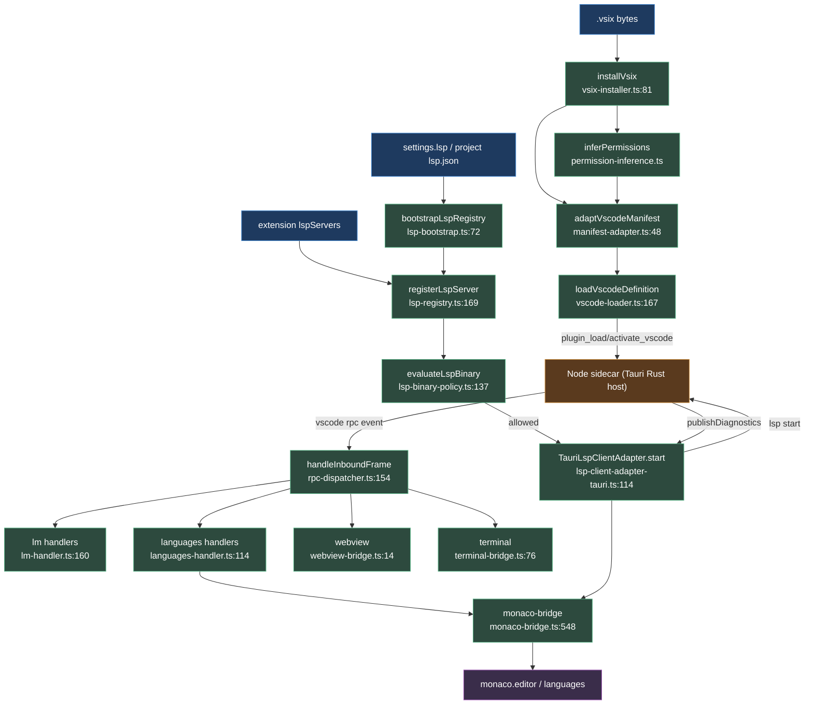

# VS Code 扩展与 LSP

<Status variant="experimental" />

<TLDR>
Cognia 通过 shim 运行**真实**的 VS Code 扩展。扩展代码在由 Tauri Rust 管理的 Node sidecar 中执行；渲染端只是一个轻量 IPC 客户端。`.vsix` 被解压（`vsix-installer.ts:81`），其 VS Code 清单被映射为 Cognia 的 `PluginManifest`（`manifest-adapter.ts:48`），权限由静态推断得出（`permission-inference.ts`），随后 `vscode-loader.ts:167` 把 `activate`/`deactivate` 委托给 Tauri 命令。每个由 sidecar 发起的 `vscode.*` 调用都以 Tauri 事件抵达，并由 `rpc-dispatcher.ts:154` 路由到按方法名分发的处理器 —— `vscode.lm` → Cognia AI，`vscode.languages.*` → Monaco，外加 webview/terminal/chat/document 桥。LSP 服务器经注册表解析、由 `lsp-binary-policy.ts:137` 把关、在 sidecar 中启动，并把诊断回送进 Monaco。浏览器模式返回告警桩（`vscode-loader.ts:182`）。
</TLDR>

<StatGrid>
  <Stat label="清单 API" value="vscode.*" hint="lm、languages、commands、tasks、chat、webview、terminal、workspace" />
  <Stat label="Monaco provider" value="24" hint="completion…linkedEditingRange, monaco-bridge.ts:646-1126" />
  <Stat label="vsix 上限" value="200 MB" hint="MAX_FULL_VSIX_BYTES, vsix-installer.ts:33" />
  <Stat label="LSP 通道" value="1" hint="cognia.lsp-service 按 ownerId 多路复用" />
  <Stat label="文档池" value="50 models" hint="file-doc-pool.ts MAX_MODELS=50" />
  <Stat label="包 schema" value="v2" hint="CHARACTER_PACK_FILE_SCHEMA_VERSION, schema.ts:28" />
</StatGrid>

## 1. 目的

Cognia 通过 shim 运行真实的 VS Code 扩展。扩展代码在由 Tauri Rust（`src-tauri/src/plugin_api/vscode/`）管理的 Node sidecar（`sidecar/vscode-ext-host/`）中执行；渲染端只是一个轻量 IPC 客户端。

`.vsix` 由 `vsix-installer.ts` 解压 → 其 VS Code 清单经 `manifest-adapter.ts` 映射为 Cognia 的 `PluginManifest`（由 `permission-inference.ts` 静态推导出 Cognia 权限）→ `vscode-loader.ts` 把 `activate`/`deactivate` 委托给 Tauri 命令 → 每个由 sidecar 发起的 `vscode.*` 调用都以 Tauri 事件抵达，并由 `rpc-dispatcher.ts` 路由到按方法名分发的处理器：

- `lm-handler.ts` —— `vscode.lm` 语言模型 API → Cognia AI
- `languages-handler.ts` + `monaco-bridge.ts` —— `vscode.languages.*` provider + 诊断/装饰 → Monaco
- `webview-bridge.ts` —— `createWebviewPanel`
- `terminal-bridge.ts` —— `createTerminal`
- `chat-participant-registry.ts` —— `vscode.chat` → 虚拟角色
- `file-doc-pool.ts` —— `openTextDocument`

LSP 服务器经 `lsp-registry` / `lsp-bootstrap` / `lsp-user-servers` 解析，由 `lsp-binary-policy` 把关，通过 `lsp-client-adapter-tauri` 在 sidecar 中启动，并把诊断回送进 Monaco。浏览器模式返回告警桩（`vscode-loader.ts:182`）。

## 2. vscode-shim 深入

### vscode-loader.ts

`vscode-loader.ts`（`lib/plugin/core/vscode-loader.ts`）—— `loadVscodeDefinition(manifest, pluginPath)`（`:167`）构建一个 `PluginDefinition`；它要求存在 `vscodeMain` 或仅主题的 contributions（`:171`），以及一个非空的 `vscodeExtension.identifier`（`:176`）。非 Tauri → 告警桩（`:182`）；仅主题 → 不启动 sidecar（`:198`）。

真实路径：`plugin_load_vscode`（`:220`），订阅事件（`:229`），`activate` → `plugin_activate_vscode` 返回带 `registeredCommands`、`registeredWebviewViews`、`registeredLanguageProviders` 与 `sidecarPid` 的 `VscodeActivateResult`（`:129`、`:242`），`deactivate` → `plugin_deactivate_vscode`（`:263`）。

`ensureDispatcherConfigured()`（`:40`）是一次性 bootstrap，接通 dispatcher 传输层（`:47`）、`lm-handler` 默认模型解析器（`:58`）、`installVscodeRpcHandlers()`（`:68`），懒加载 `monaco-editor` + `configureMonacoBridge`（`:73`–`:93`，约 3 MB，失败则休眠 `:94`），随后执行 LSP 迁移 + `bootstrapLspRegistry()`（`:105`–`:118`）。`invokeVscodeRpc`（`:288`）通过 `plugin_invoke_vscode_rpc` 在渲染端↔sidecar 间代理；`unloadVscodeExtension`（`:312`）负责拆除。

### manifest-adapter.ts

`manifest-adapter.ts` —— 纯函数、无 I/O（`:8`）。`adaptVscodeManifest(input)`（`:48`）→ `VsCodeExtensionAdapterResult`。id 由 `canonicalId` 取自 `publisher.name`（`:159`）；`mapActivationEvent`（`:193`）把 `*`→`startup` 重写（`:197`），`onLanguage:*`→`startup`+告警（`:203`），把 `onDebug*` 收敛为 `onDebugResolve:*`（`:219`），并把原始事件保留在 `vscodeExtension.activationEvents`（`:103`）；`inferCapabilities`（`:255`）把 contributes 映射为 `PluginCapability[]`（`:262`–`:271`）。当存在 `main` 时 `runtimeCompatibility.browser` 被阻断（`:136`）。

```ts
// manifest-adapter.ts:114
const manifest: PluginManifest = {
  id,
  name: displayName,
  type: "vscode-extension",
  capabilities,
  permissions,
  activationEvents: cogniaActivation,
  vscodeMain: pkgJson.main,
  vscodeExtension: vscodeExtensionBlock,
}
```

### rpc-dispatcher.ts

`rpc-dispatcher.ts` —— 渲染端 JSON-RPC，采用按方法名分发的**全局**注册表（非 `pluginId` 维度，`:16`）。`configureRpcDispatcher({ sendResponse, listen })`（`:61`），`registerMethod(method, handler)`（`:90`），`subscribeToVscodeEvents(pluginId)` 监听 `vscode://rpc/${pluginId}`（`:118`、`:128`）。`handleInboundFrame`（`:154`）解析帧、查找处理器，并通过 `plugin_vscode_send_response` 回复；未知方法 → JSON-RPC `-32601`（`:177`），处理器抛错 → `-32000`（`:200`）。

### lm-handler.ts

`lm-handler.ts` —— 支撑 `vscode.lm`。三个规范的 Claude 模型位于 `BASE_MODELS`（`:59`；opus-4-7 / sonnet-4-6 / haiku-4-5）。`handleSelectChatModels`（`:160`）按 `vendor` / `family` / `version` / `id` 选择器过滤（`:169`）；`handleSendChatRequest`（`:178`）经 `getProviderModel({ provider: "anthropic" })` 发起非流式 `generateText`（`:190`–`:203`，流式延后 `:13`）。`handleRegisterChatModelProvider` / `…McpServerDefinitionProvider` / `…Tool`（`:243`、`:268`、`:296`）把 token 记入 `providerRegistry` Map；`unregisterAllLmFor`（`:324`）清理它们。默认模型经 `configureLmHandler` 设置（`:132`），回退为 `claude-sonnet-4-6`（`:157`）。

### monaco-bridge.ts

`monaco-bridge.ts` —— 把 `vscode.languages.*` / 编辑器 API 桥接到 Monaco（1300 行）。`configureMonacoBridge({ monacoApi, dispatchRpc })`（`:548`）。编辑器跟踪为 `notifyEditorMounted` / `Unmounted` / `ActiveEditorChanged` / `SelectionChanged` / `ContentChanged`（`:561`–`:603`），配合 `getActiveEditorSnapshot`（`:616`）。

24 个 provider 注册器各自铸造一个 `nanoid` token，并通过 `dispatchRpc` 把调用路由回 sidecar：completion（`:646`）、hover（`:666`）、definition（`:682`）、references（`:700`）、formatting / range-formatting（`:716`、`:732`）、codeLens（`:751`）、codeActions（`:767`）、rename（`:786`）、documentSymbol（`:807`）、inlineCompletion（`:829`）、signatureHelp（`:849`）、workspaceSymbol（`:875`）、color（`:908`）、foldingRange（`:937`）、selectionRange（`:953`）、documentLink（`:973`）、onTypeFormatting（`:989`）、semanticTokens + range（`:1006`、`:1026`）、inlayHints（`:1046`）、call/type-hierarchy（`:1062`、`:1094`）、linkedEditingRange（`:1126`）。

`setDiagnostics`（`:1155`）映射到 `monaco.editor.setModelMarkers`；`registerDecorationType` / `setDecorations`（`:1172`、`:1190`）；`unregisterByToken` / `unregisterByExtension`（`:1200`、`:1216`）。坐标转换经 `lsp-protocol-adapter`（`:31`–`:62`）。

```ts
// monaco-bridge.ts:652
const disposable = monacoApi!.languages.registerCompletionItemProvider(req.selector, {
  provideCompletionItems: async (model, position) => {
    const result = await dispatchRpc!(req.extensionId, "provideCompletionItems", {
      token,
      uri: model.uri,
      position: monacoPositionToVscode(position),
    })
    return vscodeCompletionResultToMonaco(result)
  },
})
```

### 其它处理器

- `webview-bridge.ts`（`:2`）—— `createWebviewPanel` / `registerWebviewViewProvider` 状态机；复用 artifact iframe 沙箱（`HostFrame` / `attachHostFrame`），并 polyfill `acquireVsCodeApi()`（`:14`–`:23`）。
- `terminal-bridge.ts`（`:2`）—— `createTerminal` → `ctx.shell.spawn` 子进程 + 一个 `vscode.terminal.output` sink；**没有** xterm/TTY，只有 RPC stdin/stdout（`:15`）。
- `pty-bridge-adapter.ts`（`:4`）—— 生产环境注入，把 `terminal-bridge` 接到真实 PTY（`lib/terminal/session.ts`）。
- `languages-handler.ts`（`:2`）—— `languages:*` / `window:*` RPC → `monaco-bridge`；`PROVIDER_REGISTRY` 是全部 24 个的 kind→注册器表（`:53`–`:78`）。
- `chat-participant-registry.ts`（`:2`）—— `chat.createChatParticipant` → 一个 id 为 `vscode-chat:${pluginId}:${id}` 的虚拟角色，写入 Dexie `characters` 表（`:7`、`:128`）；调用延后（`:11`）。
- `file-doc-pool.ts`（`:2`）—— 一个上限为 `MAX_MODELS=50` 的 LRU `file://`→Monaco `ITextModel` 池（`:11`）。
- `permission-inference.ts`（`:1`）—— 纯 `@babel/parser` AST 遍历；`MODULE_PERMISSION_MAP`（`:40`）把模块映射为权限：`fs`→`filesystem:read/write`（`:45`），`child_process`→`process:spawn`+`shell:execute`（`:49`），`http`/`https`→`network:fetch`（`:57`），`ws`/`net`→`network:websocket`（`:61`）；压缩代码的回退字符串扫描会降低置信度；sidecar 运行时的 `require()` 拦截器才是权威（`:8`–`:11`）。
- `vsix-installer.ts`（`:1`）—— `installVsix(ArrayBuffer)`（`:81`）→ 带 `pkgJson`、`files` Map、`sha256`、`themes`、`lspBinaryCandidates` 与 `bundleFormat` 的 `VsixInstallResult`（`:52`）；JSZip 解压 `extension/`（`:39`）；应用 200 MB 上限 `MAX_FULL_VSIX_BYTES`（`:33`），仅主题为 10 MB；复用 `importVscodeThemeJson`（`:28`）；在空 / 超限 / 非 ZIP / 缺清单 / 缺 publisher 或 name 时抛错（`:71`–`:79`）。

### vscode-shim 逐文件表

| 文件 | 支撑 | 关键导出 `:line` |
| --- | --- | --- |
| `vscode-loader.ts` | 扩展生命周期 | `loadVscodeDefinition:167`、`invokeVscodeRpc:288`、`unloadVscodeExtension:312`、`isVscodeHostAvailable:155` |
| `manifest-adapter.ts` | VSCode 清单→Cognia | `adaptVscodeManifest:48`、`mapActivationEvent:193` |
| `rpc-dispatcher.ts` | 扩展宿主 JSON-RPC | `configureRpcDispatcher:61`、`registerMethod:90`、`subscribeToVscodeEvents:118`、`handleInboundFrame:154` |
| `lm-handler.ts` | `vscode.lm` | `handleSelectChatModels:160`、`handleSendChatRequest:178`、`configureLmHandler:132` |
| `monaco-bridge.ts` | `vscode.languages.*`+编辑器 | `configureMonacoBridge:548`、24 个 `register*Provider:646-1155`、`setDiagnostics:1155`、`getActiveEditorSnapshot:616` |
| `languages-handler.ts` | `languages:*`/`window:*` RPC | `PROVIDER_REGISTRY:53`、`handleLanguagesRegister:114` |
| `webview-bridge.ts` | `createWebviewPanel` | `attachHostFrame:14` |
| `terminal-bridge.ts` | `createTerminal` | `configureTerminalBridge`、`TerminalRecord:76` |
| `pty-bridge-adapter.ts` | 真实 PTY 注入 | 生产 `ShellSpawnFn` adapter`:4` |
| `chat-participant-registry.ts` | `vscode.chat` | `handleCreateChatParticipant:115` |
| `file-doc-pool.ts` | `openTextDocument` | LRU 池 `MAX_MODELS=50` |
| `permission-inference.ts` | 清单→权限 | `inferPermissions`、`MODULE_PERMISSION_MAP:40` |
| `vsix-installer.ts` | `.vsix` 解压 | `installVsix:81`、`MAX_FULL_VSIX_BYTES=200MB:33` |
| `setup-handlers.ts` | 方法表 | `installVscodeRpcHandlers:44` |
| `lsp-protocol-adapter.ts` | Monaco↔VSCode↔LSP 坐标 | 纯转换器 |
| `lsp-workspace-manager.ts` | `workspaceFolders` | `ensureWorkspace`/`flushDocument`/`resolveWorkspaceFolder:27` |

## 3. LSP

| 文件 | 用途 | 关键导出 `:line` |
| --- | --- | --- |
| `lsp-bootstrap.ts` | 应用初始化接线（幂等） | `bootstrapLspRegistry:72`；`defaultResolveEditorServers:160`（分层 builtin←settings.lsp←project `.cognia/lsp.json`）；订阅 settings/project 变更 `:173` |
| `lsp-registry.ts` | 渲染端编排器；跟踪 `${ownerId}:${serverId}` | `configureLspRegistry:127`、`registerLspServer:169`（把关策略 `:197`，启动 `:232`）、`unregisterByOwner:280`、`getLspServerForLanguage:296`、`registerPluginLspServers:310`、`lspServerKey:357` |
| `lsp-user-servers.ts` | 编辑器侧从 resolver 同步 | `editorEligibleServers:36`（丢弃纯内置）、`syncUserLspServers:50`（`confirmedConsent:true` `:80`）、`USER_LSP_PLUGIN_PATH:28` |
| `lsp-client-adapter-tauri.ts` | 生产 `LspClientAdapter`→sidecar | `TauriLspClientAdapter:64`、`start:114`/`stop:146`/`request:192`，经 `LSP_TAURI_CHANNEL_ID="cognia.lsp-service":37`；`install()` 注册 `lsp:publishDiagnostics:84` |
| `lsp-binary-policy.ts` | 启动放行/拒绝门（纯函数，Dexie 审计） | `evaluateLspBinary:137` → 带 `allowed`、`requiresPrompt`、`reason` 的 `LspBinaryEvaluation` `:45`；`configureLspBinaryPolicy:101` |

### 流程

`bootstrapLspRegistry`（loader `:111`）→ `defaultResolveEditorServers` 分层 builtin←user(`settings.lsp`)←project → `editorEligibleServers` 丢弃纯内置（编辑器急切启动；纯内置仅供 agent，以避免噪声式 "crashed" 状态，`lsp-user-servers.ts:8`–`:18`）→ `syncUserLspServers` → `registerLspServer`。

注册表运行 `evaluateLspBinary`（`:197`）：可信发布者且二进制位于插件目录内 → 放行；否则 `requiresPrompt`（同意），除非开发模式 `unsignedLspAllowed`。放行后 → `TauriLspClientAdapter.start` 经 `invokeVscodeRpc` 在 `cognia.lsp-service` 上发送 `lsp:start` → sidecar 启动真实 LSP 进程。服务器的 `publishDiagnostics` → adapter 按 `lspServerKey` 路由（`:95`）→ `lspPublishDiagnosticsToBridgePayload` → `monaco-bridge.setDiagnostics` → `monaco.editor.setModelMarkers`。补全/悬停流为 Monaco → `dispatchRpc` / `adapter.request` → sidecar → LSP。

## 4. character-pack（ADR-0030）

| 文件 | 角色 | `:line` |
| --- | --- | --- |
| `schema.ts` | `.cognia-pack.json` 文件格式 | `CHARACTER_PACK_FILE_SCHEMA_VERSION = 2` `:28`；v1 仍可读 `:31` |
| `local-pack-store.ts` | 开机扫描本地 `.cognia-pack.json`（非插件） | `LOCAL_PACK_PLUGIN_ID="local:imported":51`；web 模式空操作 `:22` |
| `diff-pack-update.ts` | Selective Apply Update 部分 Dexie 补丁（纯函数） | 保留字段策略 + `nextSnapshot:21` |
| `editor-projection.ts` | 纯 表单→包形 投影 | `classifyCharacterSource:20`、`filterCharacters:30`、`buildPersona:61`、`buildVoiceProfile:85` |
| `character-voice.ts` | `voiceProfile`→部分 TTS 设置（绝不改 `AppSettings`） | `resolveCharacterVoice`；`<provider>Voice` switch `:9` |
| `platform-availability.ts` | `availableOnPlatforms` 门 | `currentRuntimeProfile:14`、`isAvailableOnProfile:22` |
| `validate-requires.ts` | 注册时 `requires` 依赖检查（仅告警） | `PackRequiresValidationResult:37` |

## 5. scheduler + commands + operator

- `scheduler/scheduled-task-registry.ts` —— 内存中的插件定时任务定义：`registerScheduledTaskDefsForPlugin:40`、`unregisterScheduledTaskDefsByPlugin:59`、`subscribeScheduledTaskDefs:77`。
- `scheduler/scheduler-plugin-executor.ts` —— 按 `${pluginId}:${handlerName}:21` 键控的处理器存储：`registerPluginTaskHandler:28`、`getPluginTaskHandler:44`。
- `commands/registry.ts` —— 支撑 `vscode.commands.register`/`execute`/`getCommands:5` 的统一命令总线；`CommandHandler:22`、`CommandRegistration:24`。
- `commands/tasks-registry.ts` —— `vscode.tasks.*` 后备存储（npm/gulp/cargo provider）`:4`；执行委托给 `ctx.shell.spawn:12`。
- `operator/action-types.ts` —— 统一 Computer Use 动作词表 `OperatorActionType`（16 个成员）`:16`；`Coordinate:34`、`ClickAction`/`ScrollAction`/`DragAction:39-66`。
- `operator/coordinates.ts` —— Anthropic CU 坐标缩放（长边 ≤1568px）`:4`；`getScaleFactor:25`、`computeScaledDisplay:51`、`unscaleCoordinate:67`；`ModelClass = "legacy"|"opus-4-7":23`。

## 6. 端到端流程



## 7. 注意事项

- **支持的 `vscode.*` API**：`lm`（仅非流式 —— 流式延后 `lm-handler.ts:13`）；`languages.*`（经 `monaco-bridge` 的 24 个 provider）；`commands`、`tasks`、`chat`（仅注册 —— participant 调用未接线 `chat-participant-registry.ts:11`）；`webview`、`terminal`（RPC stdin/stdout，**无** xterm TTY `terminal-bridge.ts:15`）；`workspace.openTextDocument` / `workspaceFolders`。**桩化/不支持**：`onDebug*` → 被映射但运行时抛 `NotSupportedError`（`manifest-adapter.ts:222`）；`onLanguage:*` 已弃用 → 重写为 `startup`（`:203`）。**浏览器模式** = 对所有带 `main` 包的扩展返回告警桩（`vscode-loader.ts:182`，清单 `browser:blocked` `:136`）。
- **lsp-binary-policy**：仅当发布者 Ed25519 指纹在 `trustedPublishers` 账本中**且**二进制位于插件安装目录内时才无需提示放行（`:146`）；可信但在目录外、未知指纹或无指纹 → `requiresPrompt` 同意（`:152`–`:169`）。开发模式 `settings.developer.unsignedLspAllowed` / `lsp.unsignedAllowed` 把拒绝翻转为放行+提示（`:178`–`:192`）；若设置不可读则绝不放宽。每个决策都尽力审计到 `automationAuditLog`（`:194`）。用户添加的服务器获得 `USER_LSP_PLUGIN_PATH = <app_data>/cognia/user-lsp`（`lsp-user-servers.ts:28`）—— 真实二进制位于其外 → 按设计强制提示，但 `syncUserLspServers` 传入 `confirmedConsent:true`（`:80`）。
- **Sidecar 依赖**：所有扩展代码 + LSP 进程都在 Node sidecar 中运行；渲染端仅 IPC。`monaco-editor` 懒加载（约 3 MB），若加载失败则 LSP provider 保持休眠（`vscode-loader.ts:94`）。单一 `cognia.lsp-service` 通道多路复用全部 LSP 流量（无按扩展的独立通道），由 `ownerId` 区分。编辑器资格：纯内置 LSP 仅供 agent；编辑器只启动 用户/项目/被覆盖 的服务器，以避免噪声式 "crashed" 状态（`lsp-user-servers.ts:8`–`:18`）。

<Cards>
  <Card title="插件桥" href="./bridges" description="A2UI ⇄ IM 以及插件投射其界面所经的宿主侧桥。" />
  <Card title="核心运行时" href="./core-runtime" description="驱动 vscode-loader 的插件管理器、加载器与生命周期。" />
  <Card title="Context API" href="./context-api" description="扩展与插件调用的受门控 ctx.* 命名空间。" />
</Cards>
