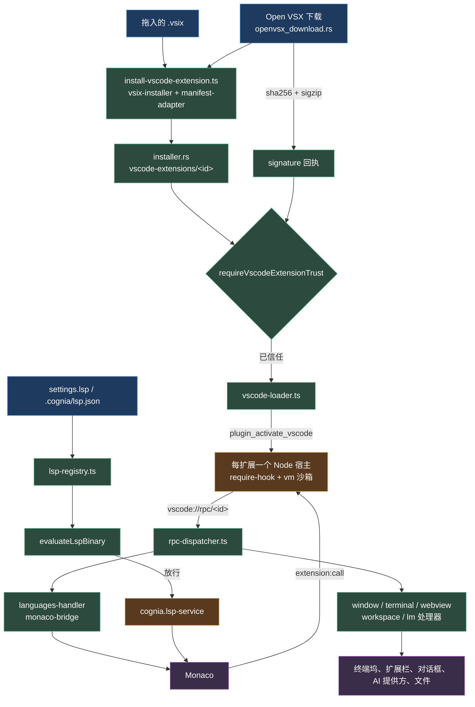

# VS Code 扩展与 LSP

<Status variant="experimental" />

<TLDR>
Cognia 在桌面端把**真实**的 VS Code 扩展作为插件运行。来自 Open VSX 的 `.vsix`（签名按内置公钥校验）或拖入的文件（由用户逐个信任）由 Rust 运行时解压到 `<data>/cognia/vscode-extensions/<id>`，其清单被适配为 Cognia 的 `PluginManifest`。每个运行中的扩展有自己的 Node 宿主（`sidecar/vscode-ext-host`），挂载 VS Code 1.91 API。宿主的调用以 JSON-RPC 到达渲染端，落到 Cognia 自己的服务上：语言功能走 Monaco，终端和任务走终端坞，webview 走扩展栏，`vscode.lm` 走用户配置的 AI 提供方。Cognia 不提供的部分（debug、SCM、notebook、测试、评论、菜单、快捷键、树视图、ESM 包）都有声明，显示在插件页上，调用时带原因拒绝。浏览器和移动端无法运行扩展。
</TLDR>

<StatGrid>
  <Stat label="API 版本" value="1.91.0" hint="SHIM_VSCODE_API_VERSION，即 vscode-languageclient 的要求" />
  <Stat label="API 成员" value="316 / 66" hint="已实现 / 标注为不支持，缺失 0（vscode-api-coverage.generated.json）" />
  <Stat label="Provider 种类" value="28" hint="languages-handler.ts 中的 PROVIDER_REGISTRY" />
  <Stat label="宿主" value="每扩展 1 个" hint="崩溃只影响一个扩展" />
  <Stat label="重启" value="5 次" hint="1 s·2ⁿ 退避，上限 30 s，host-supervisor.ts" />
  <Stat label="vsix 上限" value="200 MB" hint="MAX_FULL_VSIX_BYTES，vsix-installer.ts" />
</StatGrid>

## 1. 代码位置

| 层 | 路径 | 负责 |
| --- | --- | --- |
| Rust 运行时 | `crates/cognia-plugin-runtime/src/vscode/` | 安装（`installer.rs`）、Open VSX 下载与签名校验（`openvsx_download.rs`）、宿主进程（`host.rs`）、Memento（`memento.rs`）、Tauri 命令（`commands.rs`，位于 `tauri-host` 特性之后） |
| 扩展宿主 | `sidecar/vscode-ext-host/src/` | `host.ts`（stdio 上的 JSON-RPC）、`extension-runner.ts`（沙箱与生命周期）、`require-hook.ts`（模块门控）、`vscode-shim/`（API，每个命名空间一个文件） |
| 渲染端 | `lib/plugin/vscode-shim/` | 安装、清单适配、RPC 分发器以及宿主调用的所有处理器 |
| 加载器 | `lib/plugin/core/vscode-loader.ts` | 把已安装的扩展变成 `PluginDefinition`，并一次性配置分发器和 Monaco |
| 类型 | `types/plugin/plugin-vscode.ts` | `VsCodeExtensionBlock`（清单中的 `vscodeExtension` 块）、不支持的贡献点、贡献的命令 |
| UI | `components/plugins/detail/plugin-vscode-compat-section.tsx`、`components/plugins/vscode/`、`components/extensions/` | 兼容性区块、窗口呈现器（消息、快速输入、进度）、webview 框架 |

## 2. 安装

所有安装都经过 `install-vscode-extension.ts`，因此清单适配无法被绕过。

- **Open VSX**（`openvsx-install-flow.ts`）。Rust 命令 `plugin_vscode_download_vsix` 下载 `.vsix` 及其 SHA-256，并检查 `.sigzip`：它是对整个文件的原始 Ed25519 签名，按 Open VSX 的公钥校验。该公钥内置于 Cognia（`OPENVSX_SIGNING_KEY`），从不从注册表读取。签名不匹配，或注册表声明了签名却无法读取，都会中止安装。校验通过的下载记录在 Rust 状态中，安装它时写入 `signature` 校验回执。市场卡片显示 **由 Open VSX 签名**。
- **拖入的 `.vsix`**（仅桌面端）。安装时没有回执，对话框会说明启动前需要信任。桌面应用之外，拖入会被拒绝并给出提示。
- **开发文件夹**。视为用户自己的代码，直接信任。

渲染端（`vsix-installer.ts`）解压 `extension/`，`manifest-adapter.ts` 把 `package.json` 映射为 `PluginManifest`：

- id 为 `publisher.name`，`type: "vscode-extension"`，`vscodeMain`，以及 `vscodeExtension` 块（`VsCodeExtensionBlock`），其中有原始激活事件、包格式、贡献的命令、配置 schema、`unsupportedContributions` 和 `unsupportedApis`；
- 权限由 `permission-inference.ts` 推断（Babel AST 遍历，压缩代码有字符串扫描兜底）：`fs` → `filesystem:read/write`，`child_process` → `process:spawn` + `shell:execute`，`http`/`https` → `network:fetch`，`net`/`ws` → `network:websocket`，`vscode.tasks.executeTask` → `terminal:spawn`。

Rust 安装器把解压后的文件写入 `<data>/cognia/vscode-extensions/<id>`，并丢弃压缩包里自带的任何校验回执。每个扩展的存储、Memento 和日志与安装目录分开，位于 `<data>/cognia/vscode-extension-state/<id>/{global,workspace/<hash>,log}`，因此更新和重装后仍然保留。卸载会删除安装目录，备份同时包含两者。

### 启动前的信任

`PluginManager` 不让 VS Code 扩展走 Cognia 插件签名检查（VS Code 扩展不会带 Cognia 签名）。改由 `requireVscodeExtensionTrust` 判断，满足以下任一条件即可启动：

- 安装目录有来自已校验 Open VSX 下载的 `signature` 回执；
- 来自开发文件夹；
- 用户信任了它（其权限页上的 **信任此扩展** 开关）。

否则启用会失败并抛出 `PluginFrontendTrustError`（`reason: "unsigned-vscode-extension"`），插件列表显示为"请先信任此扩展"。在回执出现之前安装的扩展需要信任一次。

## 3. 运行扩展

`vscode-loader.ts` 构建插件定义。只含主题、语法、图标主题、代码片段或语言的扩展在渲染端运行，不启动宿主。带 `main` 的扩展通过 `plugin_activate_vscode` 启动：

1. Rust 为这一个扩展启动 `host.js`（`COGNIA_VSCODE_EXTENSION_ID`），环境中带上用户的代理（代理变更在宿主重启后生效）。
2. `extension:load` 发送安装路径、`main`、包格式和 `grantedModules`：扩展当前权限允许的敏感 Node 模块（`commands.rs:granted_node_modules`）。
3. `require-hook.ts` 用该扩展自己的 API 对象响应 `require("vscode")`，并以 `EPERM` 拒绝未授权的敏感模块（`fs`、`child_process`、`worker_threads`、`http`/`https`、`net`/`tls`、`ws`）。`require` 按发起文件所在位置归属，所以扩展自己的 `node_modules`（包括打包进来的 `vscode-languageclient`）按该扩展门控。
4. `extension-runner.ts` 在 `vm` 上下文中运行 CommonJS 包，提供 `queueMicrotask`、`structuredClone`、`AbortController`、`performance`、`atob`/`btoa`、`crypto`，以及无法让宿主退出的 `process`。`fetch` 和 `WebSocket` 仅在持有 `network:fetch` / `network:websocket` 时可用，每次调用都检查。ESM 包会被拒绝并给出原因。
5. 在 `activate` 之前，渲染端发送工作区文件夹、配置、已安装扩展和窗口状态，宿主会等它们到齐。

**激活**（`activation-triggers.ts`）。已启用的扩展只有在 `*`、`onStartupFinished` 或贡献了视图时才在启动时运行。否则它保持休眠，同时列出其贡献的命令和语言，并在以下情况启动：`onCommand:<id>`（随后执行该命令）、`onLanguage:<id>`（编辑器打开了该语言的文档）、`workspaceContains:<glob>`（进入休眠时以及文件夹变化时检查）。其他激活事件记为不支持。

**崩溃**（`host-supervisor.ts`）。Rust 报告 `host:exited` 并附上收集到的 stderr（stderr 同时写入插件日志）。监督器在 1 s·2ⁿ（上限 30 s）后重新加载扩展，`MAX_RESTARTS`（5）次后放弃，宿主持续运行五分钟后清零之前的崩溃计数。放弃后插件保持错误状态，直到用户再次启用。

**输出通道**和宿主自身的告警写入插件的运行时日志，插件面板有链接指向它。

## 4. API 及其后端

宿主挂载 VS Code 1.91 API（`sidecar/vscode-ext-host/src/vscode-shim/index.ts`）。`scripts/gates/vscode-api-coverage.mjs` 把 `@types/vscode` 与之比对，生成 `vscode-api-coverage.generated.json`（`pnpm audit:vscode-api-coverage`）：每个成员要么已实现，要么带原因列为不支持，没有缺失。`engine-compat.ts` 读取同一份报告，对使用了不支持命名空间的扩展给出提示。该提示仅供参考，从不阻止安装。

宿主发起的调用以 `vscode://rpc/<pluginId>` 事件到达。`rpc-dispatcher.ts` 按方法名路由到 `setup-handlers.ts` 安装的处理器，并通过 `plugin_vscode_send_response` 回复。每个处理器都会检查请求属于发起调用的扩展本身。

| API | 渲染端 | 后端 |
| --- | --- | --- |
| `languages.*` provider、诊断、语言配置 | `languages-handler.ts`、`monaco-bridge.ts`、`monaco-results.ts` | Monaco（见第 5 节） |
| 文档与编辑器 | `document-sync.ts`、`editor-handlers.ts`、`workspace-document-handlers.ts`、`file-doc-pool.ts` | Monaco 模型、受限的文件读取和 `applyEdit` 写入 |
| 消息、快速选择、输入框、进度、状态栏、对话框 | `window-handlers.ts`、`window-ui-store.ts`、`native-dialogs.ts` | `components/plugins/vscode/` 呈现器、toast、`statusbar.*` 插槽、Tauri 对话框 |
| `window.state`、`activeColorTheme` | `window-environment.ts` | 窗口焦点与活动状态（空闲 10 s 后视为不活跃）、应用主题 |
| 终端、`Pseudoterminal` | `terminal-handlers.ts`、`extension-pty-session.ts` | 终端坞中的标签页 |
| 任务 | 宿主 `tasks.ts`、`lib/plugin/commands/tasks-registry.ts` | shell 与进程任务在终端坞的终端中运行，自定义执行在扩展终端中运行 |
| webview 面板与视图 | `webview-handlers.ts`、`webview-bridge.ts`、`webview-document.ts` | 扩展栏，带 `acquireVsCodeApi()` 的沙箱框架 |
| `workspace.fs`、`findFiles`、文件监视、文件夹 | `workspace-file-handlers.ts`、`root-watchers.ts` | 限定在项目文件夹内的文件访问，`filesystem:read/write` |
| 配置 | `configuration-handlers.ts`、`vscode-configuration-schema.ts` | 每个插件的配置存储，`contributes.configuration` 默认值 |
| `extensions.all/getExtension`、`activate()` | `extensions-handlers.ts` | 插件管理器 |
| 命令 | `runtime-handlers.ts` | `lib/plugin/commands/registry.ts`（贡献的标题、分类、`when`） |
| `env`（剪贴板、`openExternal`、`asExternalUri`、URI 处理器） | `env-handlers.ts` | Tauri 剪贴板与 opener、Cognia 深链接 |
| `vscode.lm` | `lm-handler.ts` | 用户配置的提供方和模型，vendor 为 `cognia`，流式输出。需要 `ai:chat`、插件速率限制和 PII 门控。扩展从不自带密钥 |
| `vscode.chat` 参与者 | `chat-participant-registry.ts` | 注册为虚拟角色（`vscode-chat:<pluginId>:<id>`）。尚不会被调用 |
| secrets、Memento | `runtime-handlers.ts`、`memento.rs` | 密钥存储，扩展状态目录中的文件 |

`unavailable-methods.ts` 列出渲染端无法服务的宿主方法。在所有方法都有后端时它为空。

## 5. 语言功能

**Provider。** `vscode.languages.register*Provider` 发送 `languages:register`，附带宿主生成的 token。`languages-handler.ts` 在 `PROVIDER_REGISTRY` 中查找种类（28 种，其测试保证与宿主列表一致）并注册到 Monaco。Monaco 请求时，`monaco-bridge.ts` 把 `extension:call {extensionId, token, method, callId, payload}` 发回该宿主。释放注册即注销。

**文档。** `document-sync.ts` 让每个宿主的文档与 Monaco 保持一致（`workspace:documentOpened/Changed/Closed`、`window:editorsChanged`）。宿主把它们保存为真正的 `TextDocument`，针对更新版本发起的 provider 调用会等待该次编辑到达。Monaco 的取消会传到 provider 的 `CancellationToken`。

**诊断。** `DiagnosticCollection` 发送 `languages:setDiagnostics` / `clearDiagnostics`，变成 Monaco 标记。

**扩展中的语言服务器。** 大多数语言扩展使用 `vscode-languageclient`，它无需修改即可运行：它的 `child_process` 即扩展的 `process:spawn`，服务器进程属于扩展自己，客户端的 provider 和诊断走上面的路径。`tests/host-languageclient.test.mjs` 在构建后的宿主上，用真实的 `vscode-languageclient` 连接 `tests/fixtures/echo-lsp.mjs`，并按未打包扩展的方式把客户端依赖复制进夹具，检查注册、服务器诊断、补全和悬停。

**语法、主题、代码片段、语言。** 贡献的语言注册到 Monaco（`contributed-languages-monaco.ts`）。主题和图标主题走主题桥。语法用于聊天和预览中的代码着色（`grammars-bridge.ts`，Shiki），不用于 Monaco 编辑器。休眠扩展的语法、主题和代码片段在它运行后才出现。

## 6. 不支持（已标注）

每一项都有类型声明，显示在插件详情的 **VS Code 兼容性** 区块（`plugin-vscode-compat-section.tsx`），并由测试固定。

**贡献点**（`VsCodeUnsupportedContribution`，来自 `manifest-adapter.ts:vscodeUnsupportedContributions`）：

| 值 | 含义 |
| --- | --- |
| `debuggers` | `contributes.debuggers` / `breakpoints`。Cognia 没有调试器 |
| `notebooks` | `contributes.notebooks` / `notebookRenderer` |
| `menus` | `commandPalette` 以外的菜单项。命令本身仍可从命令列表运行 |
| `keybindings` | 不绑定任何快捷键 |
| `views` | 树视图、视图容器、欢迎内容。只有 webview 视图会显示在扩展栏中 |
| `editor-grammars` | 语法为聊天和预览着色，不为代码编辑器着色 |
| `extension-pack` | 所列扩展不会随之安装 |
| `esm-bundle` | ES 模块包无法启动。宿主与 VS Code 1.91 一样加载 CommonJS |

**API 命名空间**（`unsupportedApis`，从扩展代码中找出）：`debug`、`scm`、`tests`、`comments`、`notebooks`。它们的注册返回无效果的 disposable，事件从不触发，会产生动作的调用抛出带原因的 `NotSupportedError`。宿主对每个扩展的每个不支持成员只报告一次（`vscode:unsupportedApi`），插件日志会写明。

**其他缺口：** 聊天参与者只注册不调用，任务的问题匹配器被忽略，`createTelemetryLogger` 不发送任何内容。对于在本机运行的终端，`Terminal.processId` 是 shell 的进程 id，扩展的 `Pseudoterminal` 则为 `undefined`。

**浏览器与移动端。** 没有扩展宿主。Open VSX 来源被隐藏，拖入的 `.vsix` 被拒绝，已安装的带 `main` 的扩展以桩形式加载，并在插件列表中标明。

## 7. Cognia 自己的语言服务器

与扩展分开，编辑器还会运行用户或项目配置的语言服务器（`lib/plugin/lsp/`）：

| 文件 | 作用 |
| --- | --- |
| `lsp-bootstrap.ts` | `bootstrapLspRegistry` 按 内置 ← `settings.lsp` ← 项目 `.cognia/lsp.json` 分层，并跟随设置和项目变化 |
| `lsp-user-servers.ts` | `editorEligibleServers` 去掉纯内置服务器（仅供 agent，避免噪声式 "crashed" 状态），`syncUserLspServers` 注册其余服务器 |
| `lsp-registry.ts` | `registerLspServer` / `registerPluginLspServers`（插件清单声明的服务器），以 `${ownerId}:${serverId}` 为键 |
| `lsp-client-adapter-tauri.ts` | `TauriLspClientAdapter`，经唯一的 `cognia.lsp-service` 通道，按 owner 多路复用。把 `lsp:publishDiagnostics` 转为 Monaco 标记 |
| `lsp-monaco-runtime.ts` | `registerLspMonacoProviders` 只注册已初始化服务器声明的 provider |
| `vscode-shim/lsp-binary-policy.ts` | `evaluateLspBinary` 把关插件声明的服务器二进制 |

**二进制策略。** 位于插件安装目录之外的二进制总是需要确认。目录内的二进制在用户批准该 `(pluginId, path)` 之前需要确认，SHA-256 变化后需要再次确认。插件对自身发布者的声明从不作为依据。`settings.lsp.unsignedAllowed`（开发用）把"需要确认"变为"放行并提示"。每个决定都写入 `automationAuditLog`。用户添加的服务器以 `confirmedConsent: true` 注册，因为是用户自己配置的。

该策略只覆盖 Cognia 启动的服务器。扩展自己启动的服务器（如 `vscode-languageclient` 的做法）属于扩展的 `child_process`，由其 `process:spawn` 权限门控。

## 8. 端到端流程

```mermaid
graph TD
  OVSX["Open VSX 下载<br/>openvsx_download.rs"] --"sha256 + sigzip"--> RECEIPT["signature 回执"]
  DROP["拖入的 .vsix"] --> INSTALL
  OVSX --> INSTALL["install-vscode-extension.ts<br/>vsix-installer + manifest-adapter"]
  INSTALL --> RUST["installer.rs<br/>vscode-extensions/&lt;id&gt;"]
  RUST --> TRUST{"requireVscodeExtensionTrust"}
  RECEIPT --> TRUST
  TRUST --"已信任"--> LOAD["vscode-loader.ts"]
  LOAD --"plugin_activate_vscode"--> HOST["每扩展一个 Node 宿主<br/>require-hook + vm 沙箱"]
  HOST --"vscode://rpc/&lt;id&gt;"--> DISP["rpc-dispatcher.ts"]
  DISP --> LANG["languages-handler<br/>monaco-bridge"]
  DISP --> WIN["window / terminal / webview<br/>workspace / lm 处理器"]
  LANG --> MONACO["Monaco"]
  MONACO --"extension:call"--> HOST
  WIN --> APP["终端坞、扩展栏、对话框、<br/>AI 提供方、文件"]
  SETTINGS["settings.lsp / .cognia/lsp.json"] --> REG["lsp-registry.ts"]
  REG --> POL["evaluateLspBinary"]
  POL --"放行"--> LSP["cognia.lsp-service"]
  LSP --> MONACO

  classDef entry fill:#1e3a5f,stroke:#4a90d9,color:#fff
  classDef bridge fill:#2d4a3e,stroke:#5cb88a,color:#fff
  classDef sidecar fill:#5a3a1e,stroke:#d99a4a,color:#fff
  classDef sink fill:#3a2d4a,stroke:#a45cb8,color:#fff
  class OVSX,DROP,SETTINGS entry
  class INSTALL,RUST,TRUST,LOAD,DISP,LANG,WIN,REG,POL,RECEIPT bridge
  class HOST,LSP sidecar
  class MONACO,APP sink
```

## 9. 测试

- **宿主**（`pnpm sidecar:vscode:test`，会先构建 `dist/`）：`tests/host-*.test.mjs` 通过 stdio 驱动构建后的 `host.js`，使用 `tests/fixtures/` 下的夹具扩展（provider、文档、窗口、终端、任务、webview、工作区、`vscode.lm`、沙箱，以及配合 `echo-lsp.mjs` 的 `vscode-languageclient`）。其余套件各测一个模块。
- **Rust**：`cargo test -p cognia-plugin-runtime --features tauri-host --lib -- vscode::` 覆盖安装、卸载、状态目录、签名与回执，以及宿主的 stderr 与退出。
- **渲染端**：`lib/plugin/vscode-shim/` 下与插件详情组件旁的 Jest 套件。覆盖门禁为 `pnpm audit:vscode-api-coverage`。

## 10. character-pack（ADR-0030）

| 文件 | 角色 | `:line` |
| --- | --- | --- |
| `schema.ts` | `.cognia-pack.json` 文件格式 | `CHARACTER_PACK_FILE_SCHEMA_VERSION = 2` `:28`；v1 仍可读 `:31` |
| `local-pack-store.ts` | 开机扫描本地 `.cognia-pack.json`（非插件） | `LOCAL_PACK_PLUGIN_ID="local:imported":51`；web 模式空操作 `:22` |
| `diff-pack-update.ts` | Selective Apply Update 部分 Dexie 补丁（纯函数） | 保留字段策略 + `nextSnapshot:21` |
| `editor-projection.ts` | 纯 表单→包形 投影 | `classifyCharacterSource:20`、`filterCharacters:30`、`buildPersona:61`、`buildVoiceProfile:85` |
| `character-voice.ts` | `voiceProfile`→部分 TTS 设置（绝不改 `AppSettings`） | `resolveCharacterVoice`；`<provider>Voice` switch `:9` |
| `platform-availability.ts` | `availableOnPlatforms` 门 | `currentRuntimeProfile:14`、`isAvailableOnProfile:22` |
| `validate-requires.ts` | 注册时 `requires` 依赖检查（仅告警） | `PackRequiresValidationResult:37` |

## 11. scheduler + commands + operator

- `scheduler/scheduled-task-registry.ts` —— 内存中的插件定时任务定义：`registerScheduledTaskDefsForPlugin:40`、`unregisterScheduledTaskDefsByPlugin:59`、`subscribeScheduledTaskDefs:77`。
- `scheduler/scheduler-plugin-executor.ts` —— 按 `${pluginId}:${handlerName}:21` 键控的处理器存储：`registerPluginTaskHandler:28`、`getPluginTaskHandler:44`。
- `commands/registry.ts` —— 支撑 `vscode.commands.register`/`execute`/`getCommands:5` 的统一命令总线；`CommandHandler:22`、`CommandRegistration:24`。
- `commands/tasks-registry.ts` —— VS Code 扩展注册的任务 provider，以及跨 provider 的 `fetchTasks`。任务在扩展的宿主中运行（见第 4 节）。
- `operator/action-types.ts` —— 统一 Computer Use 动作词表 `OperatorActionType`（16 个成员）`:16`；`Coordinate:34`、`ClickAction`/`ScrollAction`/`DragAction:39-66`。
- `operator/coordinates.ts` —— Anthropic CU 坐标缩放（长边 ≤1568px）`:4`；`getScaleFactor:25`、`computeScaledDisplay:51`、`unscaleCoordinate:67`；`ModelClass = "legacy"|"opus-4-7":23`。

## 12. 注意事项

- **信任按扩展，回执按安装。** 从 Open VSX 重装会写入新的回执。在已签名的安装上安装拖入的 `.vsix` 会替换整个目录（包括回执），这份副本需要用户信任。
- **模块授权在加载时确定。** `grantedModules` 在宿主启动时计算，因为 `require()` 是同步的。之后授予的权限在扩展重启后生效。
- **代理**设置在宿主启动时读取。
- **每扩展一个宿主。** `vscode.extensions.getExtension(other).exports` 不跨宿主共享。对另一个扩展调用 `activate()` 会在它自己的宿主中启动它。
- **仅桌面端。** 所有带 `main` 的扩展都需要 Tauri 运行时。UI 使用 `isVscodeHostAvailable()` 判断。

<Cards>
  <Card title="插件桥" href="./bridges" description="A2UI ⇄ IM 以及插件投射其界面所经的宿主侧桥。" />
  <Card title="核心运行时" href="./core-runtime" description="驱动 vscode-loader 的插件管理器、加载器与生命周期。" />
  <Card title="Context API" href="./context-api" description="扩展与插件调用的受门控 ctx.* 命名空间。" />
</Cards>
