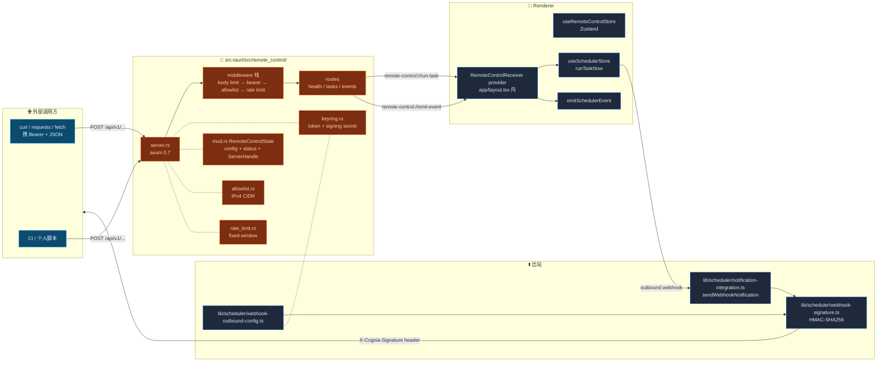
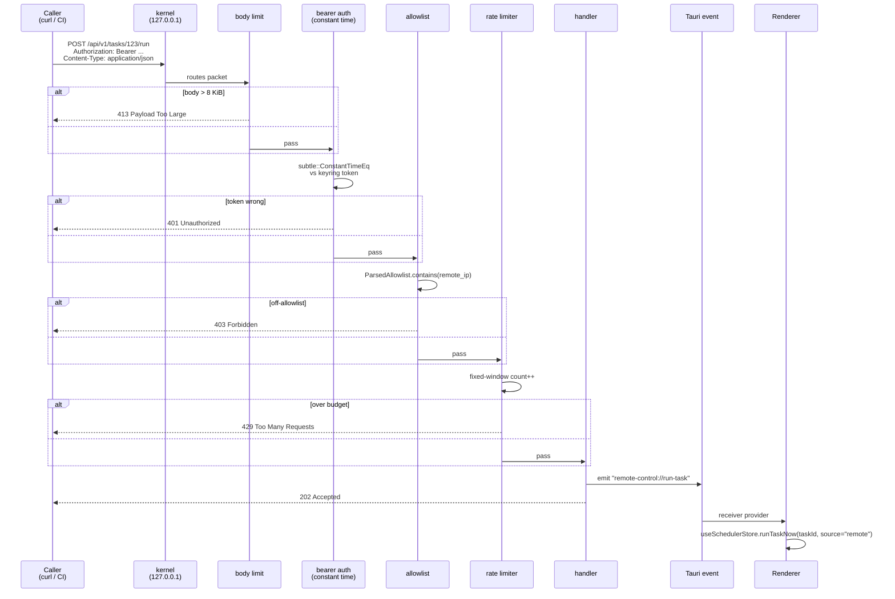
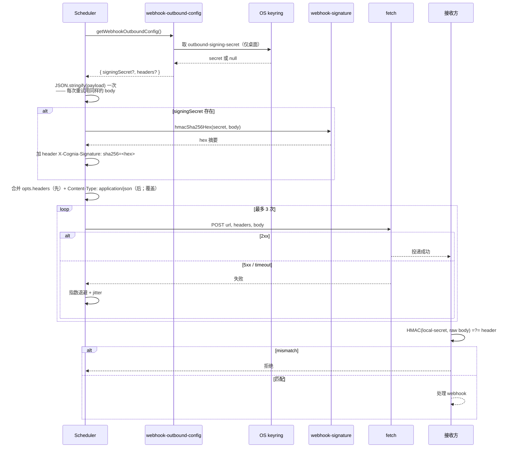

# 远程控制

## 适用场景

| 场景               | 触发方                                                                               |
| ------------------ | ------------------------------------------------------------------------------------ |
| CI job 拉起聊天    | `POST /api/v1/tasks/&lt;taskId&gt;/run`，cognia 调度器执行任务                       |
| 外部同步完成通知   | `POST /api/v1/events` 体携 `{ eventType: "backup:needed", eventSource: "external" }` |
| Webhook 接收方鉴权 | 出站 webhook 携带 `X-Cognia-Signature: sha256=<hex>` —— 接收方 HMAC 校验             |
| 个人脚本驱动       | curl + bearer token 简单脚本                                                         |
| Cloudflare 隧道    | （未来）axum app 不变，只加 sidecar 进程                                             |

**不适用**：LAN 直连（127.0.0.1 only by design）、公网暴露（不在本期范围）、需要双向流的场景（仅 request/response）。

## 架构图



## 关键模块与文件路径

### Rust 层

| 文件                                         | 用途                                                                              |
| -------------------------------------------- | --------------------------------------------------------------------------------- |
| `src-tauri/src/remote_control/mod.rs`        | `RemoteControlState` —— Tauri-managed；持 `ServerHandle`                          |
| `src-tauri/src/remote_control/server.rs`     | axum app + 中间件栈 + 3 个端点；graceful shutdown via `watch`                     |
| `src-tauri/src/remote_control/allowlist.rs`  | IPv4 CIDR 匹配器（bare IP / `127.0.0.1/32` / `10.0.0.0/8`）                       |
| `src-tauri/src/remote_control/rate_limit.rs` | `FixedWindowRateLimiter` —— per-token 60/min 默认                                 |
| `src-tauri/src/remote_control/keyring.rs`    | `read_token` / `write_token` / `read_signing_secret` / `write_signing_secret`     |
| `src-tauri/src/remote_control/commands.rs`   | 12 个 Tauri 命令（status / start / stop / set/clear token / update config / ...） |
| `src-tauri/src/remote_control/types.rs`      | `RemoteControlConfig` / `RemoteControlStatus` / `RemoteControlError`              |

### Renderer 层

| 文件                                                            | 用途                                                                      |
| --------------------------------------------------------------- | ------------------------------------------------------------------------- |
| `types/remote-control/index.ts`                                 | 镜像 Rust 类型 + `validateCidrOrIp`                                       |
| `lib/scheduler/webhook-outbound-config.ts`                      | `getWebhookOutboundConfig()` —— 读 keyring（仅桌面）+ Zustand             |
| `lib/scheduler/webhook-signature.ts`                            | Web Crypto HMAC-SHA256（~30 行）；生产 / 测试共用                         |
| `lib/scheduler/notification-integration.ts`                     | 既有 `sendWebhookNotification`；新增 `opts: { signingSecret?, headers? }` |
| `components/settings/remote-control/remote-control-section.tsx` | tabbed shell；4 tab（Overview / Inbound / Outbound / Events）             |
| `components/providers/remote-control-receiver.tsx`              | top-level provider；监听 `remote-control://*` Tauri 事件                  |

## 控制流：HMAC 验证（入站）



## 控制流：HMAC 签名（出站）



## 中间件栈细节

按从外到内顺序：

1. **Body size limit** —— `tower_http::limit::RequestBodyLimitLayer::new(8 * 1024)`；超过返回 413。
2. **Bearer auth** —— 取 `Authorization: Bearer <token>` 头；`subtle::ConstantTimeEq` 与 keyring 中 token 等长比较；不等返回 401。
3. **IPv4 CIDR allowlist** —— `ParsedAllowlist.contains(remote_ip)`；不命中返回 403。默认 `127.0.0.1/32`。
4. **Fixed-window rate limit** —— per-token 60 req/min（可改）；超过返回 429。

只要任一中间件拒了，请求就到不了 handler；handler 收到的都是已认证 + 在 allowlist + 在限流配额内的请求。

## 端点合约

| 方法   | 路径                    | 行为                                                                                                         |
| ------ | ----------------------- | ------------------------------------------------------------------------------------------------------------ |
| `GET`  | `/api/v1/health`        | 返回 `{ ok: true, version }`。**需鉴权**，避免向未认证扫描者泄漏版本号。                                     |
| `POST` | `/api/v1/tasks/:id/run` | 发 `remote-control://run-task` Tauri 事件；renderer 调 `runTaskNow(taskId, source="remote")`；返回 202。     |
| `POST` | `/api/v1/events`        | 发 `remote-control://emit-event`；renderer 调 `emitSchedulerEvent(eventType, data, eventSource)`；返回 202。 |

`/events` 请求体形如：

```json
{
  "eventType": "backup:needed",
  "eventSource": "external",
  "data": { "any": "json" }
}
```

`/tasks/:id/run` 请求体可选；若有则 `payload` 会作为 `runTaskNow` 的入参传递。

## 数据库表

远程控制本身**不引入新 Dexie 表**：

- 入站 token / 出站 secret —— OS keyring（service `com.cognia.remote-control`，accounts `inbound-token` / `outbound-signing-secret`）。
- 配置 —— Zustand `useRemoteControlStore` + `tauri-plugin-store`（端口 / allowlist / 限流 / 自定义 headers）。
- 调用日志 —— Rust 侧 `RemoteControlStatus.lastCallAt` + 内存 ring buffer，通过 `remote-control://inbound-call` 推给 Overview tab。
- 触发的任务执行 —— 走既有 `taskExecutions` 表（tag `triggerSource = "remote"`）。

## 配置项与扩展点

### Settings → Remote control 四个 tab

| Tab        | 内容                                                                                             |
| ---------- | ------------------------------------------------------------------------------------------------ |
| `Overview` | 启停 / 已绑端口 / 调用计数 / 最近调用列表（ring buffer）                                         |
| `Inbound`  | 启用开关（`isTauri()` 守门）、`Generate token`、端口、CIDR allowlist 输入、限流上限              |
| `Outbound` | "设置 / 清除签名密钥"按钮、自定义 headers 列表（merge 顺序：opts.headers 先，`Content-Type` 后） |
| `Events`   | 事件文档 + 一个测试发送器                                                                        |

### 入站启动门

- `inbound.enabled` 默认 `false`。
- `Generate token` 之前 Switch 是禁用的。
- `lib.rs:setup` 自动启动路径仅当 `inbound.enabled === true` **且** keyring 里还有 token 时才运行。
- 缺 token 干脆返回 `TokenMissing` → renderer 弹"请重新生成 token"。

### `TaskExecutionTriggerSource = "remote"`

`runTaskNow` 接受可选 `source`；远程触发的运行 history 显示 "remote" 徽章（区别于 cron / manual / event）。

## 关联子系统

<Cards>
  <Card title="调度器" href="./scheduler" description="实际跑任务 / 接事件的引擎" />
  <Card
    title="Tauri 中的 MCP 服务器"
    href="./mcp-server-tauri"
    description="同一个 axum 模式 —— 本地 127.0.0.1 + Bearer + 路径化"
  />
  <Card
    title="Companion API"
    href="./companion-api"
    description="同一个 HTTP server 家族；面向 phone client"
  />
  <Card
    title="备份与数据"
    href="../data/backup-and-data"
    description="远程触发的 backup:needed 事件去触发自动备份"
  />
</Cards>

## 关联 ADR

- [ADR 0005 — Remote Control Subsystem](../adr/0005-remote-control)
- [ADR 0008 — External Bridge](../adr/0008-external-bridge)（共享 axum 实例的思路）
- [ADR 0009 — Platform Connectors](../adr/0009-platform-connectors)（出站 webhook 签名借鉴）

## 已知限制

- **单 token**：每实例一个 bearer token；per-token 限流就位但所有 token 同权。多 token + 作用域是未来工作。
- **公网暴露不支持**：127.0.0.1 binding 写死。未来 ADR 计划加 Cloudflare Tunnel sidecar，但不改 axum app 本身。
- **per-task 签名密钥**：当前是单一全局密钥签所有 webhook。后续可加 per-task override。
- **仅 request/response**：不支持 WebSocket / SSE push。
- **接收方 TLS 校验靠用户**：cognia 端做 HMAC，但接收方仍需自己 pin TLS。
- **威胁模型**：可抵御同主机但读不到 keyring 的进程、loopback 外攻击、body 重放 webhook 接收方；**不可抵御**能读 OS keyring 的同主机攻击者（任何 cognia API key 都同等暴露）、cognia webview 内的恶意浏览器扩展、出站方向 MITM（要求接收方 pin TLS）。
