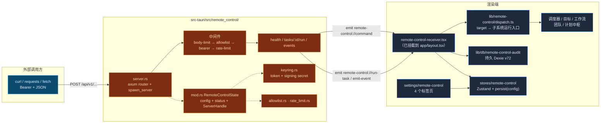

# Remote Control

<Status variant="stable">已全面激活 —— 入站分发已上线 · 出站签名已接通 · 持久审计</Status>

<TLDR>
  Tauri Rust 后端启动一个绑定到 `127.0.0.1:<port>`（默认 **47821**）的
  [axum](https://docs.rs/axum) HTTP 服务器，对外暴露 `/api/v1` 端点 —— 健康检查、运行调度器任务、发送调度器事件，以及一个**通用的 `POST /commands/:target`**，可分发到任意执行子系统（调度器、目标、工作流、Agent 团队、计划中枢）。Rust 保持极薄入口：只做鉴权并发出 `remote-control://command` 事件；渲染端的
  `lib/remote-control/dispatch.ts` 路由表按 target 分发到各子系统已有的无头运行入口。每个请求都要穿过一道加固后的中间件闸门：**Host 头白名单 + 拒绝 Origin**（DNS rebinding 缓解）→ 8&nbsp;KiB 请求体上限 → IPv4 CIDR 允许列表 → 常量时间 Bearer 鉴权 → **读/写能力闸门** → 固定窗口限流，并带有 **Idempotency-Key** 重放缓存以及每个响应上的 `Content-Security-Policy: default-src 'none'`。出站这一半现已接通：调度器 Webhook 与任意已配置的**出站端点**都用
  [Standard Webhooks](https://www.standardwebhooks.com/) 方案签名。每次入站分发与出站投递都会记录到持久化的 Dexie 审计表（`remoteControlAudit`，schema v72）。密钥保存在操作系统密钥环中；监听器**默认关闭**。
</TLDR>

<StatGrid>
  <Stat label="入站端点" value="3" hint="/health · /tasks/:id/run · /events" />
  <Stat label="默认端口" value="47821" hint="仅 127.0.0.1 —— types.rs:43" />
  <Stat label="请求体上限" value="8 KiB" hint="RequestBodyLimitLayer —— server.rs:46" />
  <Stat label="默认限流" value="60 / 分钟" hint="固定窗口 —— types.rs:45" />
  <Stat label="Tauri 命令" value="8" hint="commands.rs —— 在 lib.rs:597 注册" />
  <Stat label="Bearer 令牌" value="256 位" hint="2× UUIDv4 十六进制 —— keyring.rs:70" />
</StatGrid>

## 它是什么

Remote Control 是 Cognia 三个 [外部 API](../companion-api) 接入面中最小的一个。由于
`next.config.ts` 强制 `output: "export"`，`app/api/` 在运行时并不存在 —— 每个服务端
端点都是 Rust，而非 Next.js 路由。这个监听器让 **本地脚本和 CI 作业** 能够通过普通 HTTP
驱动一个正在运行的 Cognia 安装实例，而无需编写插件或学习 MCP
工具链：

- 从 CI 作业启动一个已排期的对话 → `POST /api/v1/tasks/<taskId>/run`。
- 在外部同步完成时发送一个 `backup:needed` 事件 → `POST /api/v1/events`。
- 为出站 Webhook 加上鉴权，让接收方可以验证它确实来自本安装实例
  （出站 HMAC 这一半 —— 已构建，待接通）。

它被刻意设计为 **仅回环可达**。监听器绑定 `Ipv4Addr::LOCALHOST`（`server.rs:83`），并且
默认允许列表为 `127.0.0.1/32`；局域网与公网暴露明确不在范围之内（未来可由一个 Cloudflare Tunnel sidecar 在前面代理它，而无需改动 axum 应用）。如果你需要用手机
驱动桌面端，请改用 [Companion API](../companion-api) —— 那是另一个服务器，使用设备 JWT 且绑定到非回环地址。

## 两个方向

| 方向 | 所在位置 | 传输 | 鉴权 | 状态 |
| --- | --- | --- | --- | --- |
| **入站** | `src-tauri/src/remote_control/` + `lib/remote-control/dispatch.ts` | 绑定 `127.0.0.1:47821` 的 axum HTTP | Host/Origin + Bearer + IPv4 CIDR + 读/写能力 | 已上线 —— 分发到调度器 / 目标 / 工作流 / 团队 / 计划 |
| **出站** | `lib/remote-control/outbound/` + 密钥环 | 调度器 Webhook 通道 + 出站端点 | Standard Webhooks HMAC-SHA256 | 已接入 `sendWebhookNotification` + `publishOutboundEvent` |

<Callout type="info">
  激活更新（2026-06-03）。较早草稿里的三条死链路现已全部接通：

  1. **`RemoteControlReceiver` 已挂载**到 `app/layout.tsx`（位于桌面 provider 内，非 Tauri 下自动 no-op），入站请求会真正分发 —— 包括经 `lib/remote-control/dispatch.ts` 路由的新 `remote-control://command` 事件。
  2. **出站签名已接通。** `sendWebhookNotification` 现在经 `lib/remote-control/outbound/delivery.ts` 投递，用 Standard Webhooks 三件套请求头（`webhook-id` / `webhook-timestamp` / `webhook-signature`）+ 用户自定义头签名，并把事件扇出到所有已配置的出站端点。旧的 `X-Cognia-Signature` 十六进制辅助函数已退役。
  3. **新增 `"remote"` `TaskExecutionTriggerSource`**，远程派发的调度器运行在执行历史里可区分。
</Callout>

## 架构速览



## 模块地图

| 模块页面 | 源文件 | 涵盖内容 |
| --- | --- | --- |
| [Rust 监听器](./rust-listener) | `server.rs` | `spawn_server`、axum 路由、四级中间件（正确顺序）、端点处理函数、优雅关闭、`RequestObserver` 钩子 |
| [安全模型](./security) | `allowlist.rs`、`rate_limit.rs`、`keyring.rs` | IPv4 CIDR 匹配、固定窗口限流、密钥环存储、令牌生成、威胁模型 |
| [状态与命令](./state-and-commands) | `mod.rs`、`types.rs`、`commands.rs`、`lib.rs` | `RemoteControlState`、线缆类型、8 个 Tauri 命令、托管状态接线、setup 自动启动闸门 |
| [渲染端与设置](./renderer-and-settings) | `types/`、`lib/tauri/`、`stores/`、`components/` | 镜像类型、invoke 包装器、Zustand store、receiver provider、4 标签页设置区块 |
| [出站 Webhook](./outbound-webhooks) | `lib/scheduler/webhook-*.ts`、`notification-integration.ts`、`event-integration.ts` | HMAC 签名辅助函数、出站配置、真实的重试循环、事件发送、尚未接通的状态 |

## 端点契约

| 方法 | 路径 | 行为 | 代码 |
| --- | --- | --- | --- |
| `GET` | `/api/v1/health` | `{ ok: true, version }`。**需要鉴权** —— 中间件闸门会在每条路由上运行，因此版本信息绝不会泄露给未鉴权的探测者。 | `server.rs:138` |
| `POST` | `/api/v1/tasks/:id/run` | 发送 `remote-control://run-task`，携带 `{ taskId, payload? }`；返回 `202 Accepted`。请求体可选。 | `server.rs:145` |
| `POST` | `/api/v1/events` | 发送 `remote-control://emit-event`，携带 `{ eventType, eventSource?, data? }`；若 `eventType` 缺失或为空则返回 `400`，否则返回 `202`。 | `server.rs:162` |
| `POST` | `/api/v1/commands/:target` | 校验 `target` 是否在已知集合内，生成 `runId`，遵循 `Idempotency-Key`，发送 `remote-control://command`（携带 `{ target, args, runId }`）；返回 `202` 并带 `runId`。目标：`scheduler.task.run`、`scheduler.event`、`workflow.run`、`goal.create`、`goal.continue`、`team.dispatch`、`plan.run`。 | `server.rs` |

所有路由还要求 `Host` 头为回环地址，并拒绝任何带 `Origin`/`Referer` 的请求（DNS rebinding 缓解）；触发类路由需要 `write` 能力令牌。另一个独立的本地 axum 入口 —— 可视化工作流的 webhook 路由器（`workflow_register_trigger`）—— 与本监听器无关，两者相互独立。

```bash
# 从脚本触发一个调度器任务（桌面端必须正在运行 + 监听器已启用）
curl -X POST http://127.0.0.1:47821/api/v1/tasks/my-task-id/run \
  -H "Authorization: Bearer $COGNIA_REMOTE_TOKEN" \
  -H "Content-Type: application/json" \
  -d '{ "payload": { "reason": "ci-nightly" } }'

# 发送一个调度器事件
curl -X POST http://127.0.0.1:47821/api/v1/events \
  -H "Authorization: Bearer $COGNIA_REMOTE_TOKEN" \
  -H "Content-Type: application/json" \
  -d '{ "eventType": "backup:needed", "eventSource": "external" }'
```

## 相关子系统

<Cards>
  <Card title="调度器" href="./scheduler" description="真正运行任务并消费事件的引擎" />
  <Card title="外部 API（Companion）" href="./companion-api" description="同源的 axum 接入面 —— 设备 JWT、非回环、面向移动端" />
  <Card title="External Bridge / MCP" href="./external-bridge" description="第三个 axum 监听器 —— 面向编码智能体、通向 Node sidecar 的 JSON-RPC" />
</Cards>

## 相关 ADR

- [ADR-0005 —— Remote Control 子系统](../../adr/0005-remote-control) —— 最初的设计
- [ADR-0008 —— External Bridge](../../adr/0008-external-bridge) —— 共享的 axum-on-loopback 模式
- [ADR-0009 —— Platform Connectors](../../adr/0009-platform-connectors) —— 出站 Webhook 签名参考
