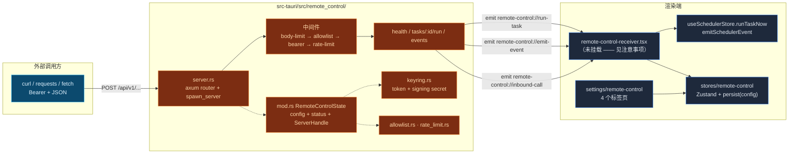

# Remote Control

<Status variant="beta">入站监听器已接通 · 出站签名已构建但尚未接通</Status>

<TLDR>
  Tauri Rust 后端启动一个绑定到
  `127.0.0.1:<port>`（默认 **47821**）的 [axum](https://docs.rs/axum) HTTP 服务器，对外暴露 **3** 个 `/api/v1` 端点 —— 健康检查、运行某个调度器任务、发送某个调度器事件。每个请求都要穿过一道四级中间件闸门
  （`server.rs:192`）：8&nbsp;KiB 请求体上限 → IPv4 CIDR 允许列表 → 常量时间 Bearer 鉴权 →
  固定窗口限流。密钥保存在操作系统密钥环（`com.cognia.remote-control`）中。该监听器
  **默认关闭**，并且在生成令牌之前启用开关一直处于禁用状态。另一半，即出站方向 —— 由密钥环存储的 HMAC 密钥 + 用于调度器 Webhook 通道的自定义请求头 —— 已经完整构建并通过单元测试，但 **尚未接入实际的发送路径**；参见
  [出站 Webhook](./outbound-webhooks)。
</TLDR>

<StatGrid>
  <Stat label="入站端点" value="3" hint="/health · /tasks/:id/run · /events" />
  <Stat label="默认端口" value="47821" hint="仅 127.0.0.1 —— types.rs:43" />
  <Stat label="请求体上限" value="8 KiB" hint="RequestBodyLimitLayer —— server.rs:46" />
  <Stat label="默认限流" value="60 / 分钟" hint="固定窗口 —— types.rs:45" />
  <Stat label="Tauri 命令" value="8" hint="commands.rs —— 在 lib.rs:597 注册" />
  <Stat label="Bearer 令牌" value="256 位" hint="2× UUIDv4 十六进制 —— keyring.rs:70" />
</StatGrid>

## 它是什么

Remote Control 是 Cognia 三个 [外部 API](../companion-api) 接入面中最小的一个。由于
`next.config.ts` 强制 `output: "export"`，`app/api/` 在运行时并不存在 —— 每个服务端
端点都是 Rust，而非 Next.js 路由。这个监听器让 **本地脚本和 CI 作业** 能够通过普通 HTTP
驱动一个正在运行的 Cognia 安装实例，而无需编写插件或学习 MCP
工具链：

- 从 CI 作业启动一个已排期的对话 → `POST /api/v1/tasks/<taskId>/run`。
- 在外部同步完成时发送一个 `backup:needed` 事件 → `POST /api/v1/events`。
- 为出站 Webhook 加上鉴权，让接收方可以验证它确实来自本安装实例
  （出站 HMAC 这一半 —— 已构建，待接通）。

它被刻意设计为 **仅回环可达**。监听器绑定 `Ipv4Addr::LOCALHOST`（`server.rs:83`），并且
默认允许列表为 `127.0.0.1/32`；局域网与公网暴露明确不在范围之内（未来可由一个 Cloudflare Tunnel sidecar 在前面代理它，而无需改动 axum 应用）。如果你需要用手机
驱动桌面端，请改用 [Companion API](../companion-api) —— 那是另一个服务器，使用设备 JWT 且绑定到非回环地址。

## 两个方向

| 方向 | 所在位置 | 传输 | 鉴权 | 状态 |
| --- | --- | --- | --- | --- |
| **入站** | `src-tauri/src/remote_control/` | 绑定 `127.0.0.1:47821` 的 axum HTTP | Bearer + IPv4 CIDR 允许列表 | 已接通（见注意事项） |
| **出站** | `lib/scheduler/webhook-*.ts` + 密钥环 | 调度器 Webhook 通道 | HMAC-SHA256 签名 | 已构建 + 已测试，**尚未接入** `sendWebhookNotification` |

<Callout type="warn">
  与本文较早草稿相比，有两处诚实的偏差，均已对照源码核实：

  1. **`RemoteControlReceiver` provider 没有被挂载。** `components/providers/remote-control-receiver.tsx`
     仅被它自己的测试引用 —— `app/layout.tsx` 并未导入它。Rust 服务器仍然
     接受请求并累加其计数器，但渲染端向 `runTaskNow` /
     `emitSchedulerEvent` 的分发，以及实时的最近调用环形缓冲区，都要等到该 provider 被
     挂载后才会触发。总量仍然通过 `remote_control_get_status` 暴露出来。
  2. **出站签名没有被接通。** `signWebhookBody` / `getWebhookOutboundConfig` 已存在并
     通过单元测试，但 `sendWebhookNotification(url, payload)`（`notification-integration.ts:185`）
     不接收任何 `opts`，不添加 `X-Cognia-Signature` 请求头，也不合并任何自定义请求头。设置
     界面允许你存储该密钥；但发送路径尚未消费它。
</Callout>

## 架构速览



## 模块地图

| 模块页面 | 源文件 | 涵盖内容 |
| --- | --- | --- |
| [Rust 监听器](./rust-listener) | `server.rs` | `spawn_server`、axum 路由、四级中间件（正确顺序）、端点处理函数、优雅关闭、`RequestObserver` 钩子 |
| [安全模型](./security) | `allowlist.rs`、`rate_limit.rs`、`keyring.rs` | IPv4 CIDR 匹配、固定窗口限流、密钥环存储、令牌生成、威胁模型 |
| [状态与命令](./state-and-commands) | `mod.rs`、`types.rs`、`commands.rs`、`lib.rs` | `RemoteControlState`、线缆类型、8 个 Tauri 命令、托管状态接线、setup 自动启动闸门 |
| [渲染端与设置](./renderer-and-settings) | `types/`、`lib/tauri/`、`stores/`、`components/` | 镜像类型、invoke 包装器、Zustand store、receiver provider、4 标签页设置区块 |
| [出站 Webhook](./outbound-webhooks) | `lib/scheduler/webhook-*.ts`、`notification-integration.ts`、`event-integration.ts` | HMAC 签名辅助函数、出站配置、真实的重试循环、事件发送、尚未接通的状态 |

## 端点契约

| 方法 | 路径 | 行为 | 代码 |
| --- | --- | --- | --- |
| `GET` | `/api/v1/health` | `{ ok: true, version }`。**需要鉴权** —— 中间件闸门会在每条路由上运行，因此版本信息绝不会泄露给未鉴权的探测者。 | `server.rs:138` |
| `POST` | `/api/v1/tasks/:id/run` | 发送 `remote-control://run-task`，携带 `{ taskId, payload? }`；返回 `202 Accepted`。请求体可选。 | `server.rs:145` |
| `POST` | `/api/v1/events` | 发送 `remote-control://emit-event`，携带 `{ eventType, eventSource?, data? }`；若 `eventType` 缺失或为空则返回 `400`，否则返回 `202`。 | `server.rs:162` |

```bash
# 从脚本触发一个调度器任务（桌面端必须正在运行 + 监听器已启用）
curl -X POST http://127.0.0.1:47821/api/v1/tasks/my-task-id/run \
  -H "Authorization: Bearer $COGNIA_REMOTE_TOKEN" \
  -H "Content-Type: application/json" \
  -d '{ "payload": { "reason": "ci-nightly" } }'

# 发送一个调度器事件
curl -X POST http://127.0.0.1:47821/api/v1/events \
  -H "Authorization: Bearer $COGNIA_REMOTE_TOKEN" \
  -H "Content-Type: application/json" \
  -d '{ "eventType": "backup:needed", "eventSource": "external" }'
```

## 相关子系统

<Cards>
  <Card title="调度器" href="./scheduler" description="真正运行任务并消费事件的引擎" />
  <Card title="外部 API（Companion）" href="./companion-api" description="同源的 axum 接入面 —— 设备 JWT、非回环、面向移动端" />
  <Card title="External Bridge / MCP" href="./external-bridge" description="第三个 axum 监听器 —— 面向编码智能体、通向 Node sidecar 的 JSON-RPC" />
</Cards>

## 相关 ADR

- [ADR-0005 —— Remote Control 子系统](../../adr/0005-remote-control) —— 最初的设计
- [ADR-0008 —— External Bridge](../../adr/0008-external-bridge) —— 共享的 axum-on-loopback 模式
- [ADR-0009 —— Platform Connectors](../../adr/0009-platform-connectors) —— 出站 Webhook 签名参考
