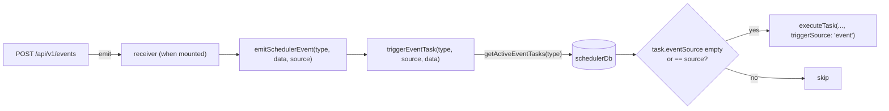

# 出站 Webhook

<Status variant="beta">signing + config built and tested · not yet wired into the send path</Status>

<TLDR>
  Remote Control 的出站一半本应对调度器 webhook 投递做 HMAC 签名并附加自定义
  header，以便接收方能验证这次调用确实来自本次安装。两个构件——
  `webhook-signature.ts`（Web Crypto HMAC-SHA256 → `sha256=<hex>`）与 `webhook-outbound-config.ts`
  （keyring 密钥 + store header）——都已完整实现并有单元测试。**但实时发送方
  `sendWebhookNotification(url, payload)` 并未消费它们**：它不接受任何 `opts`、不添加
  签名 header、不合并自定义 header，并且在每次重试时都重新序列化 body。本页
  如实记录已接线的发送路径与尚未连接的签名层两者。
</TLDR>

<Callout type="warn">
  **已构建 vs 已接线。** 请把 `signWebhookBody`、`buildWebhookSignatureHeader` 与
  `getWebhookOutboundConfig` 视为一项完整、经过测试、但**未**被投递代码调用的能力。
  它们唯一的非测试消费者本应是 `sendWebhookNotification`，而它并不调用它们。
  设置 UI 如今可以存储签名密钥与 header；但只有当发送方被更新为拉取
  `getWebhookOutboundConfig()` 并应用该 header 之后，它们才会生效。
</Callout>

## 签名 Helper — `lib/scheduler/webhook-signature.ts`

一个约 50 行的 Web Crypto 模块。`signWebhookBody` 用密钥对 body 做 HMAC-SHA256 并返回
小写十六进制；`buildWebhookSignatureHeader` 将其包裹成 GitHub /
Stripe / Slack 风格接收方所用的 `sha256=<hex>` 形状。它能在浏览器、Tauri WebView，以及 Node 18+
下工作（jest 会 polyfill `crypto.subtle`）。

```ts
// lib/scheduler/webhook-signature.ts:26
export async function signWebhookBody(body: string, secret: string): Promise<string> {
  if (!secret) throw new Error("signWebhookBody: secret is required")
  const key = await crypto.subtle.importKey("raw", encoder.encode(secret), HMAC_ALGORITHM, false, ["sign"])
  const signature = await crypto.subtle.sign(HMAC_ALGORITHM.name, key, encoder.encode(body))
  return bytesToHex(new Uint8Array(signature))
}

// :39
export async function buildWebhookSignatureHeader(body: string, secret: string): Promise<string> {
  return `sha256=${await signWebhookBody(body, secret)}`
}
```

它在空密钥时故意抛错——调用方应当*跳过*签名，而不是用 `""` 去签名。该模块如今唯一的
导入方是它自己的 `.test.ts`，后者会将输出与一个由 Python 计算出的参考向量进行比对。

## 出站配置 — `lib/scheduler/webhook-outbound-config.ts`

`getWebhookOutboundConfig()` 组装出 `{ signingSecret?, headers? }`。header 来自 Zustand
存储，是同步的；密钥仅在桌面端来自 OS keyring。

```ts
// lib/scheduler/webhook-outbound-config.ts:31
export async function getWebhookOutboundConfig(): Promise<WebhookOutboundConfig> {
  const headers = headersFromStore() // config.outbound.defaultHeaders → record, empty names dropped
  const signingSecret = await readSigningSecret()
  return {
    headers: Object.keys(headers).length > 0 ? headers : undefined,
    signingSecret: signingSecret ?? undefined,
  }
}

// :57  — the isTauri guard + keyring read
async function readSigningSecret(): Promise<string | null> {
  if (!isTauri()) return null
  try {
    const secret = await remoteControlGetSigningSecret()
    return secret && secret.length > 0 ? secret : null
  } catch {
    return null
  }
}
```

在 web 端，`signingSecret` 始终为 `undefined`（header 仍可能从存储中填充）。
`useWebhookSigningState()` hook（`:77`）在挂载时解析这一次，以便 Outbound 标签页能显示
签名是否已启用。

## 真实发送路径 — `lib/scheduler/notification-integration.ts`

`notifyTaskEvent`（`:44`）是调度器的通知扇出。桌面与 toast 通道走
Unified Notification Center；webhook 分支（`:81`）仅在任务的
channel 包含 `"webhook"` 且 `task.notification.webhookUrl` 已设置时触发，调用
`sendWebhookNotification(url, payload)`——**不带第三个参数**。

```ts
// lib/scheduler/notification-integration.ts:185
async function sendWebhookNotification(url: string, payload: Record<string, unknown>): Promise<void> {
  const MAX_RETRIES = 3
  const BASE_DELAY = 1000
  const TIMEOUT_MS = 10000
  for (let attempt = 0; attempt <= MAX_RETRIES; attempt++) {   // up to 4 total attempts
    const controller = new AbortController()
    const timer = setTimeout(() => controller.abort(), TIMEOUT_MS)
    try {
      const response = await fetch(url, {
        method: "POST",
        headers: { "Content-Type": "application/json" }, // ← fixed; no merge, no signature
        body: JSON.stringify(payload),                   // ← re-stringified each attempt
        signal: controller.signal,
      })
      clearTimeout(timer)
      if (!response.ok) throw SchedulerError.webhookFailed(url, response.status)
      return
    } catch {
      clearTimeout(timer)
      if (attempt === MAX_RETRIES) throw SchedulerError.webhookFailed(url, /* … */)
      const delay = BASE_DELAY * Math.pow(2, attempt) + Math.random() * 500 // 1s,2s,4s + jitter
      await new Promise((resolve) => setTimeout(resolve, delay))
    }
  }
}
```

需要精确记录的事实：

- **3 次重试 = 总共 4 次尝试**（`attempt <= MAX_RETRIES`）。
- **指数退避 + 抖动**：`1000 * 2^attempt + random()*500` → 约 1 秒、2 秒、4 秒。
- **每个非 2xx 都会重试**，不只是 `5xx`——没有 4xx/5xx 的区分；超时与网络
  错误也会重试。
- **body 在每次尝试时都被重新序列化**（循环内的 `JSON.stringify`），所以“序列化一次并复用”的
  保证如今**并不**成立。
- **header 是固定的 `{ "Content-Type": "application/json" }`**——没有 `X-Cognia-Signature`，没有
  自定义 header 合并。

这些相同的上限通过 `WEBHOOK_DELIVERY_LIMITS`（`:22`）只读地浮现到 Outbound 设置标签页：

```ts
// notification-integration.ts:22
export const WEBHOOK_DELIVERY_LIMITS = { retries: 3, baseDelayMs: 1000, timeoutMs: 10_000 } as const
```

`testNotificationChannel("webhook", url)`（`:240`）用一个 `{ test: true }`
payload 复用了完全相同的路径——同样未签名。

## 调度器事件 — `lib/scheduler/event-integration.ts`

入站的 `/api/v1/events` 端点最终驱动 `emitSchedulerEvent`，后者委托给
调度器的定向任务触发：

```ts
// lib/scheduler/event-integration.ts:56
export async function emitSchedulerEvent(
  eventType: SchedulerEventType,
  data?: Record<string, unknown>,
  eventSource?: string
): Promise<void> {
  const scheduler = getTaskScheduler()
  await scheduler.triggerEventTask(eventType, eventSource, data)
}
```

`triggerEventTask`（`task-scheduler.ts:1267`）在 DB 层按 `eventType` 查询活跃任务，
然后按 `eventSource` 过滤——若某任务没有 `eventSource`（通配）或其 source
等于发射出的那个，则匹配：

```ts
// lib/scheduler/task-scheduler.ts:1273
const eventTasks = await schedulerDb.getActiveEventTasks(eventType)
for (const task of eventTasks) {
  if (!task.trigger.eventSource || task.trigger.eventSource === eventSource) {
    // merge { event: { type, source, data } } into payload, then:
    await this.executeTask(taskWithPayload, 0, { triggerSource: "event" })
  }
}
```

<Callout type="info">
  **不存在 `"remote"` 触发来源。** `TaskExecutionTriggerSource`
  （`types/scheduler/index.ts:56`）恰好有六个变体——`schedule`、`run-now`、`retry`、`event`、
  `dependency`、`catch-up`。一个远端触发的事件以 `"event"` 运行，仅通过其
  `eventSource` 字符串（例如 `"external"`）区分，而不是通过一个专门的触发来源。早先承诺
  提供 `"remote"` 徽章的草稿描述的是并不存在的行为。
</Callout>



## 接线清单（让出站签名生效）

1. 修改 `sendWebhookNotification`，使其接受 `opts?: { signingSecret?; headers? }`。
2. 将 body 序列化一次；先合并 `opts.headers`，再强制设置 `Content-Type: application/json`。
3. 当 `opts.signingSecret` 已设置时，在每次重试上添加 `X-Cognia-Signature: ${await buildWebhookSignatureHeader(body, secret)}`。
4. 让 `notifyTaskEvent` 通过 `getWebhookOutboundConfig()` 计算 `opts` 一次，并向下传递。

在此之前，本页反映的是已发布的行为：调度器 webhook 通道投递的是一个
未签名、固定 header 的 JSON POST，带重试 + 退避。

## 下一步

<Cards>
  <Card title="渲染端与设置" href="./renderer-and-settings" description="存储密钥与 header 的 Outbound 标签页" />
  <Card title="调度器" href="../scheduler" description="triggerEventTask 与 notifyTaskEvent 背后的引擎" />
</Cards>
