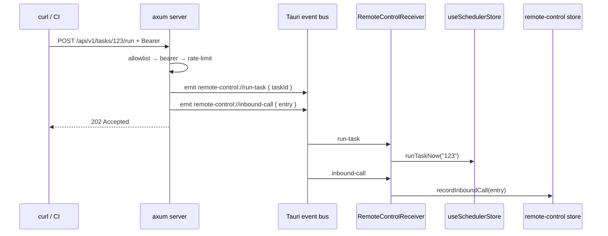

# 渲染端与设置

<Status variant="beta">types · lib/tauri · stores · components — receiver not mounted</Status>

<TLDR>
  `types/remote-control/index.ts` 镜像 Rust 端的 camelCase 结构体，并新增 `validateCidrOrIp`
  （返回一个 i18n key）。`lib/tauri/remote-control.ts` 是八个轻量的 `transport.call` 封装。
  `stores/remote-control/store.ts` 是一个 Zustand 存储，**只持久化 `config`**，将
  mutation 镜像回 Rust，并持有一个 20 条的入站调用环形缓冲区。`remote-control-receiver.tsx`
  本应将三个 Tauri 事件路由进调度器与该存储——但它**并未在
  `app/layout.tsx` 中挂载**。设置区块是一个由 `?remoteControlTab=` URL
  参数驱动的四标签页外壳，在系统导航分组中标记为 `desktopOnly`。
</TLDR>

## 镜像类型 — `types/remote-control/index.ts`

每个 interface 都与 Rust 的 wire 形状一一对应（`RemoteControlConfig`、`…InboundConfig`、
`…OutboundConfig`、`…OutboundHeader`、`RemoteControlStatus`、`RemoteControlInboundCallLog`、
`TriggerTaskRequest`、`EmitEventRequest`）。常量钉住了默认值与环形缓冲区上限：

```ts
// types/remote-control/index.ts:104
export const DEFAULT_REMOTE_CONTROL_PORT = 47821
export const DEFAULT_REMOTE_CONTROL_ALLOWLIST = ["127.0.0.1/32"]
export const DEFAULT_REMOTE_CONTROL_RATE_LIMIT_PER_MIN = 60
export const REMOTE_CONTROL_RECENT_CALLS_LIMIT = 20 // ring-buffer cap
```

`validateCidrOrIp`（`:135`）接受一个裸 IPv4 或一个 IPv4 CIDR，并在失败时返回一个
**i18n key 字符串**（成功时返回 `null`），因此它可以直接接入 `domain-list-input` 的 `validate` prop：

```ts
// types/remote-control/index.ts:135
export function validateCidrOrIp(raw: string): string | null {
  const trimmed = raw.trim()
  if (!trimmed) return "settings.remoteControl.inbound.allowlistEmpty"
  const cidrMatch = trimmed.match(/^(\d{1,3})\.(\d{1,3})\.(\d{1,3})\.(\d{1,3})(?:\/(\d{1,2}))?$/)
  if (!cidrMatch) return "settings.remoteControl.inbound.allowlistInvalid"
  // octets 0–255, prefix 0–32 → else allowlistInvalid
  return null
}
```

`isLoopbackAllowlistEntry`（`:153`）仅在条目恰为 `127.0.0.1` 或 `127.0.0.1/32` 时返回 true；
Inbound 标签页用它来浮现一条“非环回条目”警告。

## Invoke 封装 — `lib/tauri/remote-control.ts`

八个函数，每个都是单次 `transport.call<T>(name, args?)`。这里没有 `isTauri()` 守卫——
守卫是存储（store）的职责，而 `transport.call` 本身会在桌面端路由 Tauri IPC、在移动端路由 companion
HTTP transport。

```ts
// lib/tauri/remote-control.ts:49
export async function remoteControlUpdateConfig(config: RemoteControlConfig): Promise<void> {
  await transport.call<void>("remote_control_update_config", { config })
}
```

| 函数 | 命令字符串 |
| --- | --- |
| `remoteControlGetStatus` | `remote_control_get_status` |
| `remoteControlStart` / `remoteControlStop` | `remote_control_start` / `remote_control_stop` |
| `remoteControlGetToken` / `remoteControlRotateToken` | `remote_control_get_token` / `…_rotate_token` |
| `remoteControlUpdateConfig` | `remote_control_update_config` |
| `remoteControlSetSigningSecret` / `remoteControlGetSigningSecret` | `…_set_signing_secret` / `…_get_signing_secret` |

`remoteControlGetSigningSecret` 正是 outbound 配置 helper 在一次 webhook 投递之前所调用的那个，
因此签名密钥从不驻留在 TS 存储中——参见[出站 Webhook](./outbound-webhooks)。

## Zustand 存储 — `stores/remote-control/store.ts`

Rust 是持久的事实来源；存储提供敏捷的首屏绘制，并将 mutation 镜像回下层。状态为
`{ config, status, recentCalls, isHydrating, lastError }`。每个 mutating action 都先乐观地设置，
然后——仅在桌面端——调用对应的 Tauri 命令。

```ts
// stores/remote-control/store.ts:237  — recordInboundCall ring buffer
const next = [entry, ...s.recentCalls].slice(0, REMOTE_CONTROL_RECENT_CALLS_LIMIT)
```

persist 配置**只保留 `config`**——status、错误、hydration 标志以及环形缓冲区
全部是派生/实时的，从不写入磁盘；签名密钥根本不在持久化的形状里
（只有 `config.outbound` 内部的 `hasSigningSecret` 布尔镜像）：

```ts
// stores/remote-control/store.ts:260
{
  name: "cognia-remote-control",
  partialize: (state) => ({ config: state.config }), // status / recentCalls / errors NOT persisted
}
```

`hydrate()`（`:119`）在非 Tauri 环境下是 no-op；在桌面端它会拉取 `remoteControlGetStatus()`，
并在调用返回 undefined 时保留先前的 status。选择器（`:272`）暴露 `selectInboundConfig`、
`selectOutboundConfig`、`selectStatus`、`selectRecentCalls`。

## 接收器 Provider — `components/providers/remote-control-receiver.tsx`

这个客户端 provider 本应在应用生命周期内持有三个 Tauri 事件监听器，并将每个路由到
正确的去处：

```ts
// remote-control-receiver.tsx:44
const off1 = await listen<TriggerTaskRequest>("remote-control://run-task", (event) => {
  const taskId = event.payload?.taskId
  if (!taskId) return
  void useSchedulerStore.getState().runTaskNow(taskId) // tagged source = remote
})
// "remote-control://emit-event"   → emitSchedulerEvent(eventType, data, eventSource)
// "remote-control://inbound-call" → useRemoteControlStore.getState().recordInboundCall(payload)
```

<Callout type="error">
  **该 provider 目前是孤立的。** `RemoteControlReceiver` 仅被它自己的测试导入——
  `app/layout.tsx` 挂载了约 20 个其他 provider，却没有挂载它。按当前提交，Rust 服务器仍会
  接受请求并递增 `inbound_calls_total` / `last_call_at`（通过
  `remote_control_get_status` 浮现），但**没有任何渲染端监听器触发**：远端的 `run-task` 不会调用
  `runTaskNow`，远端的 `emit-event` 不会到达 `emitSchedulerEvent`，实时的 recent-calls
  环形缓冲区也保持为空。在 `app/layout.tsx` 中挂载 `&lt;RemoteControlReceiver&gt;` 即可激活
  入站分发路径。
</Callout>

## 设置区块 — `components/settings/remote-control/`

外壳（`remote-control-section.tsx`）镜像了 `data/data-section.tsx`：它通过 `useRouter` +
`useSearchParams` 读写一个 `?remoteControlTab=` URL 参数，并渲染四个
`Tabs` 面板。它本身不携带 `isTauri()` 守卫——桌面端的限制是逐标签页进行的（Overview 显示一条
仅限桌面的提示；Inbound 返回一个 notice 块），同时也在导航层级进行。

```ts
// remote-control-section.tsx:14
const REMOTE_CONTROL_TAB_PARAM = "remoteControlTab"
type RemoteControlTabId = "overview" | "inbound" | "outbound" | "events"
```

| 标签页 | 文件 | 要点 |
| --- | --- | --- |
| **Overview** | `tabs/overview-tab.tsx` | 运行状态 + `http://127.0.0.1:<boundPort>` 端点、总调用次数、上次调用时间、recent-calls 列表，以及一个“发送测试事件”按钮 |
| **Inbound** | `tabs/inbound-tab.tsx` | token 的显示/复制/轮换、启用 Switch（在存在 token 之前禁用）、端口输入（1024–65535，回退为 47821）、通过 `DomainListInput` 的 CIDR 允许列表、限流输入（1–6000），以及一次真实的 `fetch(.../health)` 自检 |
| **Outbound** | `tabs/outbound-tab.tsx` | 签名密钥的设置/清除、自定义 header 编辑器，以及一张来自 `WEBHOOK_DELIVERY_LIMITS` 的只读重试配置卡片 |
| **Events** | `tabs/events-tab.tsx` | 13 种调度器事件类型的目录，每种都带一个“Emit Test”按钮 |

Inbound 标签页将 `validateCidrOrIp` 接入允许列表输入框，并在 `errorRender` 中先剥离
`settings.remoteControl.inbound.` 前缀，再把 key 喂给 `t(...)`：

```tsx
// inbound-tab.tsx:227 (DomainListInput)
validate={validateCidrOrIp}
errorRender={(key) => t(key.replace("settings.remoteControl.inbound.", ""))}
```

### 导航位置

区块 id `"remote-control"` 位于 **system** 分组中，排在 Observability 之后、
External Bridge 之前，标记为 `desktopOnly`（`settings-nav-config.ts:432`）：

```ts
// settings-nav-config.ts:432
{ id: "remote-control", labelKey: "remoteControl", descriptionKey: "remoteControl",
  group: "system", icon: RadioTowerIcon, desktopOnly: true }
```

## 端到端入站流程（当接收器已挂载时）



## 下一步

<Cards>
  <Card title="出站 Webhook" href="./outbound-webhooks" description="签名 helper、出站配置，以及真实的（未签名）发送路径" />
  <Card title="状态与命令" href="./state-and-commands" description="这些封装与存储所对话的 Rust 一侧" />
</Cards>
