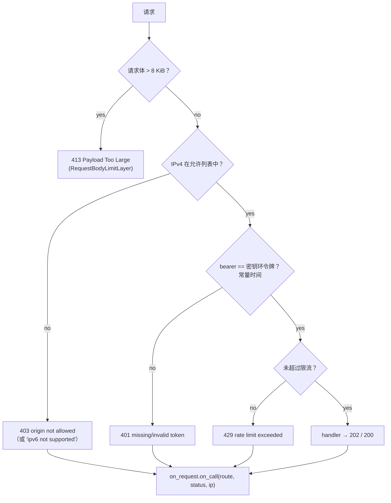

# Rust 监听器

<Status variant="stable">server.rs · 278 行</Status>

<TLDR>
  `spawn_server`（`server.rs:72`）绑定 `127.0.0.1:<port>`，构建一个三路由的 axum `Router`，将
  其包裹在一个 `from_fn_with_state` 中间件外加一个外层 `RequestBodyLimitLayer` 中，并以由
  `tokio::sync::watch` 通道驱动的优雅关闭来 spawn serve 任务。这个单一的中间件
  函数按照 **allowlist → bearer → rate-limit** 的顺序运行闸门（请求体上限是一个最先应用的外层
  tower layer）。每个完成的请求都会回调进一个 `RequestObserver`，以便
  持有方状态可以累加计数器并向渲染端推送一条调用日志条目。
</TLDR>

## Spawn 与 Router

`spawn_server` 解析允许列表、绑定 TCP 监听器、组装 `AppState`，并返回一个
`ServerHandle { bound_port, shutdown }`。传入 `port: 0` 会得到一个由操作系统分配的临时端口，
通过 `listener.local_addr()` 读回，因此调用方记录的是真实端口。

```rust
// src-tauri/src/remote_control/server.rs:100
let app = Router::new()
    .route("/api/v1/health", get(health))
    .route("/api/v1/tasks/:id/run", post(run_task))
    .route("/api/v1/events", post(emit_event))
    .layer(from_fn_with_state(state.clone(), middleware))
    .layer(RequestBodyLimitLayer::new(BODY_LIMIT_BYTES)); // 8 * 1024, server.rs:46
```

`AppState`（`server.rs:54`）是 `Clone` 的，携带 `AppHandle`、一个 `Arc<String>` 令牌、
解析后的允许列表、限流器，以及 `Arc<dyn RequestObserver>`：

```rust
// server.rs:54
#[derive(Clone)]
struct AppState {
    app_handle: AppHandle,
    token: Arc<String>,
    allowlist: Arc<ParsedAllowlist>,
    rate_limiter: Arc<FixedWindowRateLimiter>,
    on_request: Arc<dyn RequestObserver>,
}
```

## 中间件闸门 —— 真实顺序

中间件函数有且仅有 **一个**（`server.rs:192`）。由于 tower `.layer()` 调用是
最外层最后包裹，`RequestBodyLimitLayer`（在 `from_fn` layer 之后添加）是 **最外层**
的阶段 —— 它会在函数运行之前就以 `413` 拒绝超大请求体。在函数内部，
各项检查按以下顺序运行：



<Callout type="info">
  **允许列表在 Bearer 鉴权之前运行。** 较早的正文（甚至 `server.rs:9-13` 处过时的模块头部
  注释）把 Bearer 列在了允许列表之前。`server.rs:202-250` 处的可执行顺序
  是允许列表 (1) → Bearer (2) → 限流 (3)。请以正在运行的代码为准。
</Callout>

### 阶段 1 —— IPv4 允许列表与 IPv6 规范化

允许列表仅支持 IPv4。一个 IPv6 调用方（可能包括来自某个针对 `127.0.0.1` 打开了
`AF_INET6` 套接字的客户端的 `::1`）会先被映射为 IPv4；无法映射的 IPv6 地址会被
直接拒绝。

```rust
// server.rs:205
let canonical = match remote_ip {
    IpAddr::V4(v4) => v4,
    IpAddr::V6(v6) => match v6.to_ipv4_mapped() {
        Some(v4) => v4,
        None => {
            state.on_request.on_call(&route, StatusCode::FORBIDDEN, remote_ip);
            return error_body(StatusCode::FORBIDDEN, "ipv6 not supported");
        }
    },
};
if !state.allowlist.contains(canonical) {
    state.on_request.on_call(&route, StatusCode::FORBIDDEN, remote_ip);
    return error_body(StatusCode::FORBIDDEN, "origin not allowed");
}
```

### 阶段 2 —— 常量时间 Bearer 鉴权

`Authorization: Bearer <token>` 请求头会与密钥环令牌进行比较，先做长度
预检查，再用 `subtle::ConstantTimeEq`，因此无法通过计时来分辨出错误的令牌。

```rust
// server.rs:235
let expected = state.token.as_bytes();
let supplied = supplied_token.as_bytes();
if expected.len() != supplied.len() || expected.ct_eq(supplied).unwrap_u8() == 0 {
    state.on_request.on_call(&route, StatusCode::UNAUTHORIZED, remote_ip);
    return error_body(StatusCode::UNAUTHORIZED, "invalid token");
}
```

### 阶段 3 —— 限流

针对固定窗口限流器的单次 `try_acquire()`；超出预算返回 `429`。窗口语义参见
[安全模型](./security)。

## 端点处理函数

| 处理函数 | 行 | 返回 |
| --- | --- | --- |
| `health` | `server.rs:138` | `200` `{ ok: true, version: env!("CARGO_PKG_VERSION") }` |
| `run_task` | `server.rs:145` | 发送 `RUN_TASK_EVENT`，携带 `{ task_id, payload? }` → `202`；发送失败 → `500` |
| `emit_event` | `server.rs:162` | 若请求体缺失或 `event_type` 为空则返回 `400`；否则发送 `EMIT_EVENT_EVENT` → `202` |

这两个写入处理函数 **不会** 直接触碰调度器 —— 它们发送一个 Tauri 事件后立即
返回，因此外部调用方绝不会阻塞在任务执行上。这些事件名是常量，并由一个单元测试
对照前端监听器字符串进行断言（`server.rs:274`）：

```rust
// server.rs:43
pub const RUN_TASK_EVENT: &str = "remote-control://run-task";
pub const EMIT_EVENT_EVENT: &str = "remote-control://emit-event";
```

`run_task` 通过 `Option<Json<…>>` 和 `unwrap_or_default()` 容忍缺失的请求体，因此一个不带
JSON 的裸 `POST` 仍然会触发任务：

```rust
// server.rs:145
async fn run_task(
    State(state): State<AppState>,
    Path(task_id): Path<String>,
    payload: Option<Json<TriggerTaskRequestBody>>,
) -> impl IntoResponse {
    let body = payload.map(|Json(b)| b).unwrap_or_default();
    let event = RunTaskEvent { task_id, payload: body.payload };
    if let Err(error) = state.app_handle.emit(RUN_TASK_EVENT, event) {
        log::warn!("remote-control failed to emit run-task event: {error}");
        return error_body(StatusCode::INTERNAL_SERVER_ERROR, "emit failed");
    }
    accepted()
}
```

## 优雅关闭

serve 任务以 `with_graceful_shutdown` spawn，监听一个 `watch` 接收端。持有方状态上的
`stop()`（`mod.rs:158`）会丢弃/触发发送端，future 随之 resolve，axum 在退出前会
排空进行中的请求。

```rust
// server.rs:108
let (tx, mut rx) = watch::channel(());
tokio::spawn(async move {
    let server = axum::serve(
        listener,
        app.into_make_service_with_connect_info::<SocketAddr>(),
    );
    let result = server
        .with_graceful_shutdown(async move {
            let _ = rx.changed().await; // resolves when the sender fires or is dropped
        })
        .await;
    if let Err(error) = result {
        log::warn!("remote-control server exited with error: {error}");
    }
});
```

`into_make_service_with_connect_info::<SocketAddr>()` 正是让调用方 IP 可以在中间件内部通过
`ConnectInfo<SocketAddr>` 获取的关键 —— 没有它，允许列表就看不到远端
地址。

## RequestObserver 钩子

中间件中的每一条代码路径 —— 无论接受还是拒绝 —— 都以 `on_request.on_call(route, status,
ip)` 结尾。这正是持有方 `RemoteControlState` 保持其计数器最新、并向渲染端推送
一条调用日志条目的接缝（参见 [状态与命令](./state-and-commands)）。

```rust
// server.rs:63
pub trait RequestObserver: Send + Sync + 'static {
    fn on_call(&self, route: &str, status: StatusCode, remote_ip: IpAddr);
}
```

## 下一步

<Cards>
  <Card title="安全模型" href="./security" description="允许列表匹配器、限流器，以及由密钥环托管的密钥" />
  <Card title="状态与命令" href="./state-and-commands" description="谁拥有 spawn_server，以及驱动它的 Tauri 命令接入面" />
</Cards>
