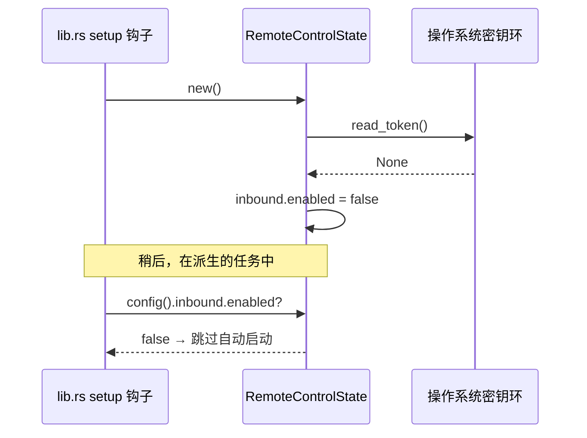

# State &amp; Commands

<Status variant="stable">mod.rs · types.rs · commands.rs · lib.rs</Status>

<TLDR>
  `RemoteControlState`（`mod.rs:46`）是由 Tauri 受管的单例，持有配置、实时
  状态以及 `Option<ServerHandle>`。它暴露 `start` / `stop`、记录存在性的辅助函数，
  以及一个为请求观察者供数的 `observe` 回调。`types.rs` 定义了 camelCase 的线缆
  形状（serde `rename_all = "camelCase"`），与渲染端类型逐字匹配。`commands.rs`
  暴露 **8** 个 Tauri 命令；`lib.rs` 受管该状态、注册全部八个命令，并运行一个 setup
  钩子，仅当持久化配置为启用时（这本身就隐含着令牌已存在）才自动启动监听器。
</TLDR>

## RemoteControlState

该状态是一个 `Mutex<RemoteControlInner>`，包裹 `{ config, status, server: Option<ServerHandle> }`。
`new()`（`mod.rs:56`）在启动时将持久化配置与密钥环进行对账：若不存在令牌则
强制 `inbound.enabled = false`，并反映是否存在签名密钥。

```rust
// mod.rs:56
pub fn new() -> Self {
    let mut config = RemoteControlConfig::default();
    let has_token = matches!(keyring::read_token(), Ok(Some(_)));
    if !has_token {
        config.inbound.enabled = false; // can't auto-start without a token
    }
    let has_signing_secret = matches!(keyring::read_signing_secret(), Ok(Some(_)));
    config.outbound.has_signing_secret = has_signing_secret;
    // ...
}
```

### 生命周期：start / stop

`start`（`mod.rs:116`）从密钥环读取令牌（若缺失则返回 `TokenMissing` 错误），拒绝
重复启动，构建 `RequestObserver`，并调用 `server::spawn_server`。成功时记录
绑定的端口，并将 `inbound_running` / `enabled` 翻转为 true。

```rust
// mod.rs:116
pub async fn start(&self, app_handle: AppHandle) -> Result<(), RemoteControlError> {
    let token = keyring::read_token()
        .map_err(RemoteControlError::Keyring)?
        .ok_or(RemoteControlError::TokenMissing)?;
    // refuse if already running → AlreadyRunning(port)
    // spawn_server(...) → ServerHandle
    // status.inbound_running = true; status.bound_port = Some(...); config.inbound.enabled = true
}
```

`stop`（`mod.rs:158`）取出 `ServerHandle` 并触发其 watch 发送端，解析优雅
关闭的 future；若没有句柄则返回 `NotRunning`。

### 计数器与观察者桥接

`observe`（`mod.rs:173`）构建一个 `InboundCallEntry`（uuid + RFC-3339 时间戳 + 路由 + 状态 +
远程 IP），在锁内递增 `inbound_calls_total` 和 `last_call_at`，并向渲染端环形缓冲区发出
`remote-control://inbound-call`。

```rust
// mod.rs:194
let _ = app_handle.emit("remote-control://inbound-call", entry);
```

观察者的管道用了一个小小的 `unsafe` 垫片：`StateObserver` 携带一个指向
`RemoteControlState` 的 `SelfPtr` 裸指针。这是健全的，因为该状态在整个进程生命周期内
由 Tauri 的 `manage()` 持有，所以指针永不悬空（`mod.rs:204-238`）。两个存在性辅助函数——
`record_token_presence` 和 `record_signing_secret_presence`——使状态标志保持诚实，而
`update_config` 刻意**保留**实时的 `has_signing_secret` 标志，这样渲染端的变更
就无法谎报是否设置了密钥：

```rust
// mod.rs:88
pub fn update_config(&self, next: RemoteControlConfig) {
    let mut inner = self.inner.lock();
    let preserved_has_secret = inner.config.outbound.has_signing_secret;
    inner.config = next;
    inner.config.outbound.has_signing_secret = preserved_has_secret; // keyring is the only authority
}
```

## 线缆类型 — `types.rs`

每个结构体都使用 `#[serde(rename_all = "camelCase")]`，因此 JSON 形状与
`types/remote-control/index.ts` 匹配，无需翻译步骤。默认值编码了默认关闭、
仅回环的姿态：

```rust
// types.rs:38
impl Default for RemoteControlConfig {
    fn default() -> Self {
        Self {
            inbound: RemoteControlInboundConfig {
                enabled: false,
                port: 47821,
                allowlist: vec!["127.0.0.1/32".to_string()],
                rate_limit_per_min: 60,
            },
            outbound: RemoteControlOutboundConfig {
                has_signing_secret: false,
                default_headers: Vec::new(),
            },
        }
    }
}
```

`RemoteControlError`（`types.rs:113`）是一个 `thiserror` 枚举——`AlreadyRunning`、`NotRunning`、
`TokenMissing`、`Keyring`、`Bind`、`Persist`、`InvalidConfig`——带有一个自定义 `Serialize`，发出
错误*消息字符串*，与 `tts::keyring` 和 `scheduler::commands` 向 Tauri 暴露错误的方式一致。

## 八个 Tauri 命令 — `commands.rs`

所有命令都是异步的，返回 `Result<_, RemoteControlError>`；每个都委托给一个状态方法
或一个密钥环辅助函数。

| 命令 | 行号 | 作用 | 返回 |
| --- | --- | --- | --- |
| `remote_control_get_status` | `commands.rs:10` | `RemoteControlStatus` 的快照 | `RemoteControlStatus` |
| `remote_control_start` | `commands.rs:17` | 启动监听器 | `()` |
| `remote_control_stop` | `commands.rs:25` | 停止监听器 | `()` |
| `remote_control_get_token` | `commands.rs:32` | 读取令牌 + 记录存在性 | `Option<String>` |
| `remote_control_rotate_token` | `commands.rs:41` | 生成 + 持久化一个新令牌 | `String` |
| `remote_control_update_config` | `commands.rs:51` | 替换配置（保留密钥标志） | `()` |
| `remote_control_set_signing_secret` | `commands.rs:60` | 非空则写入密钥，否则清除 | `()` |
| `remote_control_get_signing_secret` | `commands.rs:78` | 读取密钥（无状态） | `Option<String>` |

```rust
// commands.rs:41
pub async fn remote_control_rotate_token(
    state: State<'_, RemoteControlState>,
) -> Result<String, RemoteControlError> {
    let token = rc_keyring::generate_token();
    rc_keyring::write_token(&token).map_err(RemoteControlError::Keyring)?;
    state.record_token_presence(true);
    Ok(token)
}
```

<Callout type="warn">
  命令共有 **8** 个，而非 12 个。某些旧笔记里的计数已过时——`commands.rs` 定义了
  八个 `#[tauri::command]` 函数，`lib.rs` 也恰好注册了这八个。
</Callout>

## 接线 — `lib.rs`

模块被声明（`lib.rs:28`），状态在整个进程生命周期内受管（`lib.rs:213`），
全部八个命令在 `generate_handler!` 块中注册（`lib.rs:597-604`）：

```rust
// lib.rs:213
.manage(remote_control::RemoteControlState::new())

// lib.rs:597
remote_control::commands::remote_control_get_status,
remote_control::commands::remote_control_start,
remote_control::commands::remote_control_stop,
remote_control::commands::remote_control_get_token,
remote_control::commands::remote_control_rotate_token,
remote_control::commands::remote_control_update_config,
remote_control::commands::remote_control_set_signing_secret,
remote_control::commands::remote_control_get_signing_secret,
```

### 默认关闭的自动启动门控

setup 钩子（`lib.rs:1033`）派生一个任务，仅当持久化配置
表明已启用时才启动监听器。"令牌必须存在"这一半是*传递性*强制的：`RemoteControlState::new()`
在密钥环没有令牌时已经清除了 `enabled`，因此只检查 `enabled` 即等价。

```rust
// lib.rs:1041
let rc_state = app.state::<remote_control::RemoteControlState>();
if rc_state.config().inbound.enabled {
    match rc_state.start(app.clone()).await {
        Ok(()) => log::info!("remote-control inbound listener started"),
        Err(e) => log::warn!("remote-control auto-start skipped: {e}"),
    }
}
```



## 下一步

<Cards>
  <Card title="渲染端与设置" href="./renderer-and-settings" description="TS 侧：镜像类型、invoke 包装、store 以及设置 UI" />
  <Card title="安全模型" href="./security" description="此状态所组合的密钥环、允许列表与限流器原语" />
</Cards>
