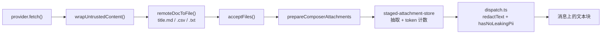

# 输入框接线

## 触发器识别

`components/chat/composer-trigger.ts` 本就有一套命名空间机制，服务于 `@skill:` 与 `@preset:`。文档
provider 加入其中，但有一处不同：其他命名空间类型都与 `TriggerKind` 一一对应，而所有 provider 共享单一
类型 `"doc"`，靠用户敲下的前缀区分。

```ts
export interface ComposerTrigger {
  kind: TriggerKind
  namespace?: string
  tokenStart: number
  tokenEnd: number
  query: string
  // …
}
```

前缀表在每次调用时从注册表读取，而不是模块加载时快照，这样重置了注册表的测试不会留下过期数据：

```ts
function chatNamespacePrefixes(): ReadonlyArray<{ prefix: string; kind: TriggerKind }> {
  return [
    ...STATIC_CHAT_NAMESPACE_PREFIXES,
    ...docsProviderPrefixes().map(({ prefix }) => ({ prefix, kind: DOC_TRIGGER })),
  ]
}
```

命名空间前缀是按模式区分的。团队工作区（`mentionMode="agents"`）把 `@` 保留给成员，因而没有任何类型化
前缀；工作流编辑器拿到的是 `@node:` / `@edge:`。

## 面板状态

`hooks/chat/use-remote-doc-search.ts` 拥有 popover 其他分支没有的三样东西：账号列表、纯粹的链接识别快
路径，以及一个可能根本不实现搜索的 provider。

抵达文档有两条路，按优先级：

1. **输入的内容本身就是链接或 token。** `matchRef` 同步解析 —— 不触网，也不需要账号就能**看到**这一行。
2. **否则做关键词搜索**，经已连接账号，防抖 250 毫秒，上限 20 条，并有序号守卫，使慢响应无法覆盖更新的
   结果。

<Callout type="warn" title="返回对象是 memo 过的">
  `composer-popover.tsx` 把这个 hook 的结果列进了 `useMemo` 依赖数组。每次渲染都换新的对象标识，会让整个
  候选列表每帧失效，并在用户还在打字时重置键盘高亮。
</Callout>

账号列表在面板为不同 provider 打开时重新加载，且刻意不跨次缓存：用户在输入框挂载期间于设置里连接了账号，
必须在下一次敲 `@` 时就可见，而不需要重载。

## 面板分支

`components/chat/composer-popover.tsx` 新增一个 `PopoverItem` 成员：

```ts
| {
    kind: "doc"
    providerId: string
    accountId: string
    doc: RemoteDocRef
  }
```

每一行展示类型图标、标题，以及右对齐的类型标注。底栏展示当前账号 —— 单账号时是纯文本，绑定了多个时是一个
`Select`（并阻止 `mousedown` 冒泡，避免选择账号时让 textarea 失焦而关闭面板）。

空态从来不是简单的「没找到」。按优先级依次是：

| 条件 | 文案键 |
| --- | --- |
| 当前宿主跑不了这个 provider | `picker.hostUnsupported` |
| 未连接任何账号 | `picker.noAccount` |
| 上一次尝试失败 | `errors.<code>` |
| 查询为空，provider 无搜索能力 | `picker.linkOnlyHint` |
| 查询为空，provider 有搜索能力 | `picker.pasteHint` |
| 查询非空，无命中 | `picker.noMatches` |

## 选中处理

新增一种可提及物是一次 `registerMentionPickHandler` 调用，而不是改输入框
（`lib/chat/mentions/pick-registry.ts`）：

```ts
registerMentionPickHandler({
  kind: "doc",
  onPick: async (item, ctx) => {
    ctx.removeTriggerToken()
    await ctx.stageRemoteDoc(item)
  },
  toContextRef: () => null,
})
```

token 在抓取**之前**就被移除。如果抓取随后失败，用户得到的是一个 toast，而不是一段需要手动删掉的
`@lark:https://…`。

`toContextRef` 返回 `null`，因为这是芯片式选中：正文以附件抵达，其 manifest 已经记录了来源，因此消息行上
没有内联提及需要持久化。

`MentionPickContext` 新增了 `stageRemoteDoc`。输入框通过一个「最新值 ref」绑定它，因为
`useRemoteDocStaging` 需要 `acceptFiles`，而后者在这个三千行组件里声明得远在 `onPickPopoverItem` 之下；
该 ref 从 effect 中写入，从不在渲染期间写。

## 暂存与送达

`hooks/chat/use-remote-doc-staging.ts` 不新造送达通路。正文一旦是文本，它就变成一个普通 `File`，汇入每个
拖入或粘贴的文档已经走过的那条管线。



这份继承换来的、无需第二套实现的东西：PII 脱敏门、芯片上的 token 计数、`INLINE_TOKEN_CEILING`（12k）
超长确认、附件预览的「模型视图」（模型收到的原样内容），以及草稿恢复。

文件名保留文档标题，只去掉文件系统会拒绝的字符。CJK 得以保留；结果为空时回落到文档 id 而非通用占位：

```
UNSAFE_FILENAME_CHARS 匹配空格、路径分隔符，以及 Windows 保留的 : * ? " < > |
```

三个 toast，对应三种结局：抓取中的 loading toast，被成功或本地化的错误码替换，外加当
`RemoteDocContent.truncated` 为真时的一条独立警告，使被截断的表格不会看起来完整。

## PII 门

没有新增任何出站 LLM 或 embedding 调用。脱敏发生在它原本就发生的地方 ——
`lib/chat/attachments/dispatch.ts`，它在抽取出的文本成为内容块之前跑 `redactText` 与 `hasNoLeakingPii`。
发出 `text` 块而非 base64 `document` 块，正是让正文对该扫描器可见的原因。

## Deep link 路由

`components/connectors/connector-deep-link-router.tsx` 本就拥有 `cognia://connector/oauth/<adapterType>`
在桌面、Capacitor 与冷启动三条路径上的全部管线。文档 provider 复用同一份订阅，只是 scheme 路径不同，并经
单一入口分发，使每条宿主路径的行为完全一致。

两个 scheme 的 state 校验方式不同，且不能共用：连接器路由检查 `sessionStorage`，而每个文档 provider 检查
自己的持久化 pending 记录。解析与兑换放在 React 之外的 `lib/docs-providers/oauth-deep-link.ts`，因此整个
兑换过程可单测，且 `completeDocsOAuthDeepLink` 从不抛错 —— 失败的 OAuth 是一个可上报的结局，而不是崩溃。

provider 在模块加载时注册自己的兑换函数，因此路由永远不需要知道存在哪些 provider。

## 测试

| 面 | 文件 |
| --- | --- |
| 触发器与命名空间 | `components/chat/composer-trigger.test.ts` |
| 面板分支、空态、账号底栏 | `components/chat/composer-popover.test.tsx` |
| 面板状态、防抖、链接快路径 | `hooks/chat/use-remote-doc-search.test.tsx` |
| 文件名、不可信包裹、toast | `hooks/chat/use-remote-doc-staging.test.tsx` |
| 选中注册表覆盖 | `lib/chat/mentions/pick-registry.test.ts` |
| deep link 解析与兑换 | `lib/docs-providers/oauth-deep-link.test.ts` |
| Rust 路由、slug 拒绝、弹跳页 | `crates/cognia-connectors/src/axum_app.rs` |
