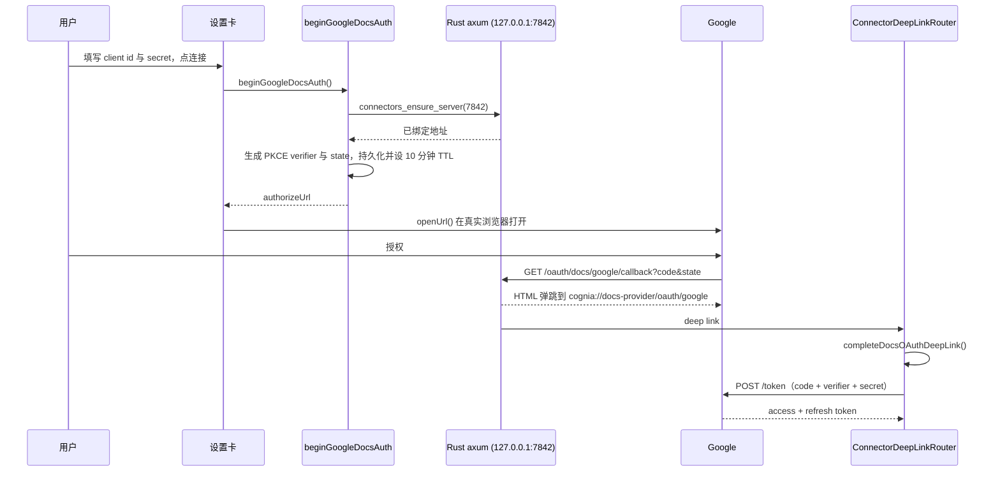

# Google provider

`lib/docs-providers/providers/google/` · 前缀 `@gdoc:` · 类型 `doc`、`sheet`

## 为什么不能复用设备码流

仓库里本已有一份 Google OAuth 实现：Drive **备份**目的地（`lib/data/destinations/google-oauth.ts`），它
使用设备码流，因为那不需要重定向监听器，因此同一份 TypeScript 在 headless brain 上也能原样运行。

那条流服务不了本特性。Google 把「OAuth 2.0 for TV and Limited-Input Devices」限定在固定作用域清单上：
`email`、`openid`、`profile`、`drive.appdata`、`drive.file` 以及 YouTube 系。本特性需要的读取作用域一个
都不在其中，所以设备码连接物理上读不到用户已有的文档 —— `drive.file` 只能看到本应用自己创建的文件。

<Callout type="warn" title="两个 Google 连接是刻意分开的">
  共用 keyring 键会把两者耦合：重连其一会破坏另一方的身份；而放宽备份连接的 `drive.file` 作用域，等于给
  一个「只能写自己文件夹」的集成发放整盘 Drive 读权限。两者位于不同的 keyring 命名空间，也可以是不同的
  Google 账号。
</Callout>

## 作用域与存储

```ts
export const GOOGLE_DOCS_SCOPES = [
  "https://www.googleapis.com/auth/drive.readonly",
  "https://www.googleapis.com/auth/documents.readonly",
  "https://www.googleapis.com/auth/spreadsheets.readonly",
] as const
```

三个都需要：`drive.readonly` 负责列出、搜索文件并导出 Doc，但读不了多工作表的电子表格；
`spreadsheets.readonly` 提供逐工作表取值；`documents.readonly` 支撑 Docs 的结构化读取。

| 位置 | 内容 |
| --- | --- |
| keyring `docs-providers` / `google-client-secret` | OAuth client secret |
| keyring `docs-providers` / `google-tokens` | JSON 形式的 access + refresh token |
| keyring `docs-providers` / `google-oauth-pending` | 进行中的 state、verifier 与 redirect URI（10 分钟 TTL） |
| `AppSettings.docsProviders.google` | client id、账号邮箱、已连接标记、已授予作用域 |

用户提供自己的 Google Cloud「桌面应用」类型凭据：client id 填在设置里，secret 存进 keyring。

## 回环流程



三点是承重的：

- **授权页在系统浏览器打开**，绝不用内嵌 webview —— Google 会拦截来自内嵌 webview 的登录。
- **`connectors_ensure_server` 是新命令**，不是对 `connectors_start_server` 的放宽。后者在服务已运行时
  报错，是因为它是启动路径，二次启动属于生命周期缺陷；OAuth 流要的是地址，不是状态迁移。它总是只绑定
  回环 —— 一个 OAuth 重定向目标没有任何理由对外可达。
- **state 校验针对持久化的 pending 记录**，而非 `sessionStorage`。这才是能在授权途中重启应用后依然成立的
  检查。无论兑换成功与否记录都会被清除，因此一个 code 无法被重放。

Rust 路由在 `provider` 路径段抵达渲染页之前，先用严格的 slug 字符集校验它（小写字母数字与短横，最多 32
字符），因为弹跳页会把 deep link 同时嵌入 HTML 属性与 JS 字符串字面量。

`access_type=offline` 与 `prompt=consent` 都会发送：除非应用明确要求再次提示，否则 Google 只在首次授权时
签发 refresh token。

## 读取

| 操作 | 调用 |
| --- | --- |
| 搜索 | `GET /drive/v3/files?q=…`，带 `supportsAllDrives` 与 `includeItemsFromAllDrives` |
| 文件名 | `GET /drive/v3/files/{id}?fields=name` |
| 文档正文 | `GET /drive/v3/files/{id}/export?mimeType=text/markdown` |
| 电子表格 | `GET /v4/spreadsheets/{id}` 然后 `values:batchGet` |

**markdown 优先，纯文本是有据可依的降级。** 不提供 markdown 导出的部署会回 HTTP 400，这是唯一被当作
「改试 `text/plain`」的状态码；其他状态都是真失败。

**表格走 `values:batchGet` 而非 Drive 的 CSV 导出。** Drive 的 CSV 导出会静默地只返回第一个工作表 ——
正是本子系统拒绝交付的那种无声截断。隐藏工作表会被跳过，与飞书读取器一致。工作表标题被引号包进 A1 区间，
内嵌引号做双写处理。

搜索在用户文本进入 Drive `q` 之前先转义：

```ts
export function escapeDriveQueryLiteral(value: string): string {
  return value.replaceAll("\\", "\\\\").replaceAll("'", "\\'")
}
```

Drive 使用单引号字面量加反斜杠转义，未转义的引号会让查询文本改变筛选条件的结构。

## URL 识别

`parseGoogleDocUrl` 只匹配两种可读类型，并容忍可选的账号段：

```
https://docs.google.com/document/d/<id>/edit
https://docs.google.com/document/u/0/d/<id>
https://docs.google.com/spreadsheets/d/<id>/edit#gid=0
```

`drive.google.com/file/d/<id>` 形式的链接**刻意不匹配**：不做一次元数据往返就无法知道它的类型，而
`matchRef` 必须保持同步，因此提供它等于给用户一个只能在抓取时失败的候选项。演示文稿、表单与裸 id 出于
同样理由被拒绝 —— 一个裸的 Google file id 与任意文本无法区分。

## 错误映射

`mapGoogleStatus` 把 HTTP 状态翻译为 provider 分类法。HTTP 403 在 Google 侧是歧义的 —— 它同时覆盖
「无权访问该文件」与配额耗尽 —— 因此用机器可读的 `error.status === "RESOURCE_EXHAUSTED"` 把它区分为
`rateLimited` 而非 `noPermission`。

刷新失败一律呈现为 `notAuthorized`（「请重新连接」），绝不当作网络抖动：`invalid_grant` 意味着用户撤销了
授权或令牌过期，让用户重试是错的。
