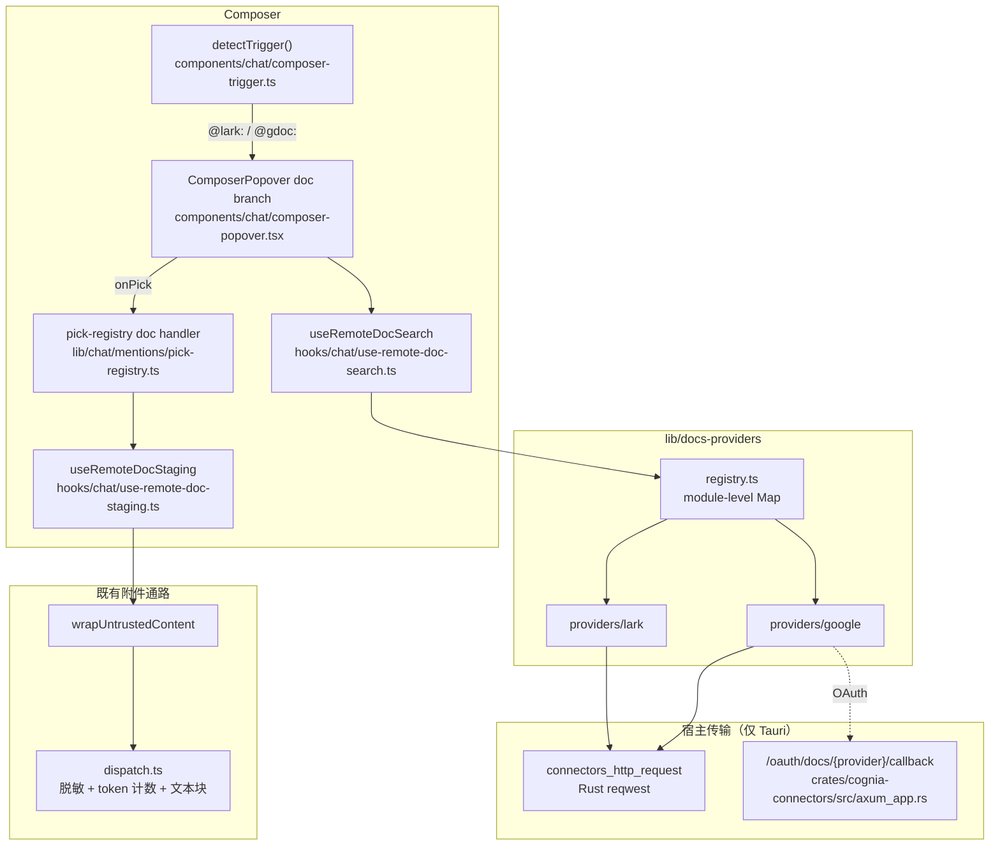

# 云端文档

<Status variant="beta">Beta · 仅桌面端 · 无 Dexie schema</Status>

<TLDR>
  输入框的 `@` 此前只能引用有本地路径的文件。云端文档新增一个平级注册表 —— `lib/docs-providers/` ——
  其 provider 回答关于第三方云端文档的三个问题：这串粘贴的文本是不是我的（`matchRef`）、这些关键词
  匹配到什么（`search`）、把正文给我（`fetch`）。在 `@lark:` / `@gdoc:` 面板里选中一项会立即抓取，
  并合成为 `File` 暂存，汇入既有的附件通路。首批两个 provider：飞书（文档、知识库节点、电子表格、
  多维表格），复用已绑定的 Lark 连接器凭证；Google Workspace（Docs、Sheets），使用自己的只读 OAuth
  连接。两者都因具体的传输限制而仅限桌面端。
</TLDR>

决策记录：[ADR-0134](/docs/adr/0134-remote-document-providers)。

## 为什么不放进 Platform Connectors

ADR-0009 明确把 `PlatformAdapter` 限定在 IM 会话语义上 —— `send`、`edit`、表情回应、群管理、A2UI 能力
矩阵。给它加 `searchDocuments()` 会迫使 Google 被建模成一个没有消息能力的连接器，其 `send`、`health`、
`a2uiCapability` 全是空实现。

因此 `lib/docs-providers/` 是平级注册表，而非扩展。飞书 provider 仍然**复用**连接器实例的凭证，因为
用户的飞书账号本来就在那里 —— 借用胜过再造一个需要单独授权、单独吊销的连接。

## 完整链路



## 两个 provider 的覆盖范围

| Provider | 前缀 | 类型 | 凭证 | 搜索 |
| --- | --- | --- | --- | --- |
| 飞书 / Lark | `@lark:` | doc、wiki、sheet、bitable | 已绑定的 Lark 连接器实例 | 支持（要求用户身份） |
| Google Workspace | `@gdoc:` | doc、sheet | 自有的只读 OAuth 连接 | 支持（Drive `files.list`） |

两侧都排除了幻灯片与思维笔记：两个平台都没有可用的公开文本读取接口，面板不应提供一个必然在抓取时
失败的选项。

## 送达方式：选中即抓取，按附件发送

选中的文档立即抓取，合成为 `File` 暂存，汇入每一个拖入或粘贴的文档已经走过的通路：

```
prepareComposerAttachments → staged-attachment-store → lib/chat/attachments/dispatch.ts
```

这是让整个特性保持小体量的关键决策。继承而非重建的部分：PII 脱敏门、芯片上的 token 计数、
`INLINE_TOKEN_CEILING`（12k）超长确认、附件预览的「模型视图」、以及草稿恢复。

正文先经 `wrapUntrustedContent`（`lib/web/web-tools-core.ts`）包裹 —— 第三方文档是外部数据，不是指令。

<Callout type="info" title="为什么不留引用、由 Agent 事后取">
  本地 `@file` 提及留下路径，由 Agent 的 Read 工具按需读取。云端文档没有路径，那种模型需要为每个
  provider 造工具。飞书唯一的工具路径（`lark.doc.fetch`，ADR-0026）要 shell 到用户自行安装的
  `lark-cli` 二进制，而 Google 完全没有对应物。
</Callout>

## 截断永不静默

一个多维表格可以装几十万条记录。`lib/docs-providers/limits.ts` 里每一条上限都同时置
`RemoteDocContent.truncated` **并**在正文里追加可见标记，模型因此能看出自己读到的是残缺文档。

| 常量 | 值 | 约束对象 |
| --- | --- | --- |
| `MAX_DOC_CHARS` | 200000 | 任意正文保留的字符数 |
| `MAX_SHEET_TABS` | 10 | 每个电子表格读取的工作表数 |
| `MAX_SHEET_ROWS` | 500 | 每个工作表读取的行数 |
| `MAX_SHEET_COLS` | 50 | 每个工作表读取的列数 |
| `MAX_BITABLE_TABLES` | 5 | 每个多维表格应用读取的表数 |
| `MAX_BITABLE_ROWS` | 200 | 每张表读取的记录数 |

输入框自身的 `INLINE_TOKEN_CEILING` 仍会叠加生效并要求用户确认；上述上限只约束「一开始传输多少」。

## 仅限桌面端，两个不同的具体原因

两个 provider 的 `DocsProvider.hosts` 都是 `["tauri"]`，原因是物理限制而非政策：

- **飞书** —— `open.feishu.cn` 不返回 CORS 头，只有 Rust 的 `connectors_http_request` 桥能触达。
- **Google** —— 其 API 对 CORS 友好，但 installed-app OAuth 流只允许回环重定向，而回环监听器是 Rust
  连接器服务。

有意休眠在三条轴上都做了标注（CLAUDE.md 规则 7）：类型上记录（`DocsProvider.hosts`）、UI 上说明
（面板渲染 `picker.hostUnsupported`，设置卡渲染 `settings.desktopOnly`）、测试上钉死（
`lib/docs-providers/registry.test.ts` 断言注册表在 web、移动与 headless 上返回空）。

## 文件

| 关注点 | 路径 |
| --- | --- |
| 契约 | `lib/docs-providers/types.ts` |
| 注册表 | `lib/docs-providers/registry.ts`、`lib/docs-providers/index.ts` |
| 上限与截断标记 | `lib/docs-providers/limits.ts` |
| 网格转 CSV | `lib/docs-providers/csv.ts` |
| OAuth deep link | `lib/docs-providers/oauth-deep-link.ts` |
| 飞书 provider | `lib/docs-providers/providers/lark/` |
| Google provider | `lib/docs-providers/providers/google/` |
| 共享飞书鉴权 harness | `lib/connectors/adapters/lark/authed-api.ts` |
| 面板状态 | `hooks/chat/use-remote-doc-search.ts` |
| 附件暂存 | `hooks/chat/use-remote-doc-staging.ts` |
| 设置卡 | `components/settings/connections/docs-providers/` |
| Rust 回环回调 | `crates/cognia-connectors/src/axum_app.rs` |

## 没有 Dexie 版本

凭证存在 OS keyring，抓取到的正文是临时附件，因此本子系统不新增 IndexedDB schema。Google 的非敏感设置
（client id、账号邮箱、已授予作用域）存在 `AppSettings.docsProviders.google`。
