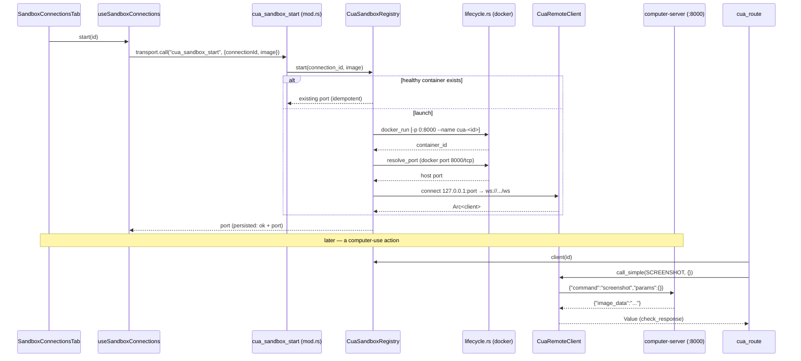

# CUA 远程沙盒

<Status variant="beta" />

<TLDR>
  CUA 沙盒是一个**远程 computer-use 目标**：一个 `ghcr.io/trycua/cua-xfce` Docker 容器
  在 8000 端口运行 `computer-server`；cognia 通过 shell 调用 `docker` 来启动并探测它，借助
  位于 `/ws` 的 WebSocket 驱动它，并将其作为一个 `Remote` `CallTarget` 接入既有的自动化门控之后。
  它已**完全接通**——容器会真正启动，computer-use 动作会路由到它。Tauri 命令
  `cua_sandbox_start` / `stop` / `health` 已注册（`lib.rs:693-695`）；
  注册表在应用 state 中管理，并在退出时拆除。连接是一等 Dexie 实体（schema **v57**）。
</TLDR>

## 容器生命周期 — `lifecycle.rs`

容器启动时将一个临时主机端口映射到容器的 8000，随后通过 `docker port` 解析出该主机端口。

```rust title="src-tauri/src/cua_sandbox/lifecycle.rs:27-38 (docker run args)"
pub fn run_args(spec: &SpawnSpec) -> Vec<String> {
    vec![
        "run".into(), "-d".into(), "--rm".into(),
        "-p".into(), "0:8000".into(),
        "--name".into(), spec.name.clone(),
        spec.image.clone(),
    ]
}
```

```rust title="src-tauri/src/cua_sandbox/lifecycle.rs:58-67 (resolve mapped port)"
pub async fn resolve_port(container_id: &str) -> Result<u16> {
    let out = Command::new("docker")
        .args(["port", container_id, "8000/tcp"])
        .output().await
        .map_err(|e| backend_err(format!("docker port failed: {e}")))?;
    let text = String::from_utf8_lossy(&out.stdout);
    parse_port(&text).ok_or_else(|| backend_err(format!("no mapped port: {text:?}")))
}
```

健康检查是一次廉价的 `docker exec <id> true`（`lifecycle.rs:92-99`）；`docker_stop` 会移除该
容器。

## 注册表 — `registry.rs`

`CuaSandboxRegistry` 是一个进程作用域的 map，以连接 id 为键，保存每个容器的 id、
主机端口和活跃的 WS 客户端。`start()` 是**幂等的**——已存在且健康的容器会被复用。

```rust title="src-tauri/src/cua_sandbox/registry.rs:33-47"
pub async fn start(&self, connection_id: &str, image: &str) -> Result<u16> {
    let mut map = self.inner.lock().await;
    if let Some(entry) = map.get(connection_id) {
        if docker_health(&entry.container_id).await {
            return Ok(entry.port);          // reuse healthy container
        }
        map.remove(connection_id);
    }
    let spec = SpawnSpec { image: image.to_string(), name: format!("cua-{connection_id}") };
    let container_id = docker_run(&spec).await?;
    let port = resolve_port(&container_id).await?;
    let client = CuaRemoteClient::connect("127.0.0.1", port).await?;
    map.insert(connection_id.to_string(), Entry { container_id, port, client });
    Ok(port)
}
```

注册表在应用启动时创建并管理（`lib.rs:820-821`），`shutdown_all()` 在退出时运行
（`lib.rs:1085-1088`），因此容器不会跨会话泄漏。

## WebSocket 协议 — `protocol.rs` + `remote_client.rs`

`computer-server` 通过 WS 讲 JSON：每条消息都是 `{ "command": <string>, "params": <object> }`。
`protocol.rs` 从类型化的自动化动作构建这些消息；一个为真的 `error` 字段表示失败。

```rust title="src-tauri/src/cua_sandbox/protocol.rs:44-51 (click mapping)"
pub fn click_request(point: Point, button: MouseButton, count: u32) -> WsRequest {
    let command = match (button, count) {
        (MouseButton::Left, c) if c >= 2 => "double_click",
        (MouseButton::Right, _) => "right_click",
        _ => "left_click",
    };
    WsRequest::new(command, json!({ "x": point.x, "y": point.y }))
}
```

`CuaRemoteClient` 通过一个 mpsc 队列串行化调用——服务器一次处理一个命令并按序回复，
因此一个被 spawn 的 pump 任务会发送每个请求，然后读取下一个文本帧作为该请求的响应，
带有 30 秒的调用超时：

```rust title="src-tauri/src/cua_sandbox/remote_client.rs:33-39 (connect + pump)"
pub async fn connect(host: &str, port: u16) -> Result<Arc<Self>> {
    let url = format!("ws://{host}:{port}/ws");
    let (stream, _) = tokio_tungstenite::connect_async(&url).await
        .map_err(|e| backend_err(format!("cua connect {url}: {e}")))?;
    let (mut sink, mut source) = stream.split();
    let (tx, mut rx) = mpsc::channel::<Job>(32);
    // spawned task: serialize → sink.send(Text) → read next Text frame as the reply
```

## 目标解析 — `sandbox-target.ts`

一个 computer-use 目标要么是本地主机，要么是由 `connectionId` 引用的远程沙盒
（绝不是一个裸的 "remote" 标志——id 才是收敛锚点）。解析器按 session → character → local
逐级查找：

```ts title="lib/automation/sandbox-target.ts:12-29 (excerpt)"
export type ComputerUseTargetSetting = "local" | { connectionId: string } | undefined
export type ComputerUseTarget = { kind: "local" } | { kind: "remote"; connectionId: string }

export function resolveComputerUseTarget(session, character): ComputerUseTarget {
  return normalize(session) ?? normalize(character) ?? { kind: "local" }
}
```

聊天路径会把解析出的 id 盖印到调用上下文中：在
`plugins/computer-use/src/index.ts:73-76` 中，当目标为远程时它会设置
`ctx.sandboxConnectionId = target.connectionId`，该值会反序列化为 Rust 端的
`CallContext.sandbox_connection_id`。

## 本地与远程路由 — `cua_route`

`automation/dispatcher.rs:execute_action` 将**每一个**驱动/读取动作都经由
`cua_route::*` 路由。`cua_route` 解析活跃客户端并翻译为一个 `computer-server` WS 命令；
对于没有远程等价物的动作（例如以元素为目标的点击），它会返回 `UnsupportedPlatform`，
而不是悄悄地穿透到主机。



## 连接注册表 — Dexie v57

连接是一个一等实体，在 **Dexie v57** 中加入（`lib/db/schema.ts:1805`，
`// v57 — Computer-Use sandbox connections`）。

```ts title="lib/db/schema.ts:1626 (stores)"
sandboxConnections: "&id, name, createdAt, updatedAt",
```

`SandboxConnectionRow`（`lib/db/sandbox-connections.ts:19-38`）携带 `id`、`name`、
`provider: "docker"`、`image`、`host`、`port`（启动前为 0）、`containerId?`，以及健康字段
（`lastHealthStatus`、`lastHealthError?`、`lastHealthCheckAt?`）外加时间戳。CRUD 辅助函数
（`listSandboxConnections` 最新优先、`getSandboxConnection`、`putSandboxConnection`、
`deleteSandboxConnection`）位于同一文件中。

`hooks/automation/use-sandbox-connections.ts` 是 Dexie 优先的响应式 hook（`useLiveQuery`）外加
生命周期包装器——`start(id)` 设置 `starting`，调用 `sandboxClient.start(id, row.image)`，然后
写入解析出的 `port` + `ok`（或 `error` + 消息）；`remove(id)` 在删除行之前尽力停止
容器。默认镜像是 `ghcr.io/trycua/cua-xfce:latest`。

<Callout type="info">
  `SandboxProvider` 目前仅为 `"docker"`；`cloud` / `lume` 为后续 provider 预留
  （`sandbox-connections.ts:14-15`）。以元素为目标的动作和工作流 pattern 节点按设计仅限
  本地——UIA 没有远程元素引用。
</Callout>

## UI + 测试

注册表 UI 位于 **Settings → Automation → Sandboxes**
（`components/settings/automation/sandbox-connections-tab.tsx`，挂载于 `automation-section.tsx`）：
每行带有实时健康徽章和 Start / Stop / Check / Delete 按钮（在 web 模式下通过
`isTauri()` 禁用），外加一个内联添加表单。参见 [可观测性与 UI](./observability-and-ui)。

测试：`lifecycle.rs:101-121` + `protocol.rs:110-167`（Rust），以及 TS 套件
`sandbox-target.test.ts`、`sandbox-target.e2e.test.ts`、`sandbox-client.test.ts`、
`sandbox-connections.test.ts`、`use-sandbox-connections.test.ts`、
`sandbox-connections-tab.test.tsx`。

## 下一步

<Cards>
  <Card title="可观测性与 UI" href="./observability-and-ui" description="Sandboxes 标签页 + 健康徽章" />
  <Card title="执行总览" href="./execution-overview" description="另一个沙盒：工具调用隔离" />
  <Card title="远程控制" href="../remote-control" description="更广义的 computer-use 子系统" />
</Cards>
