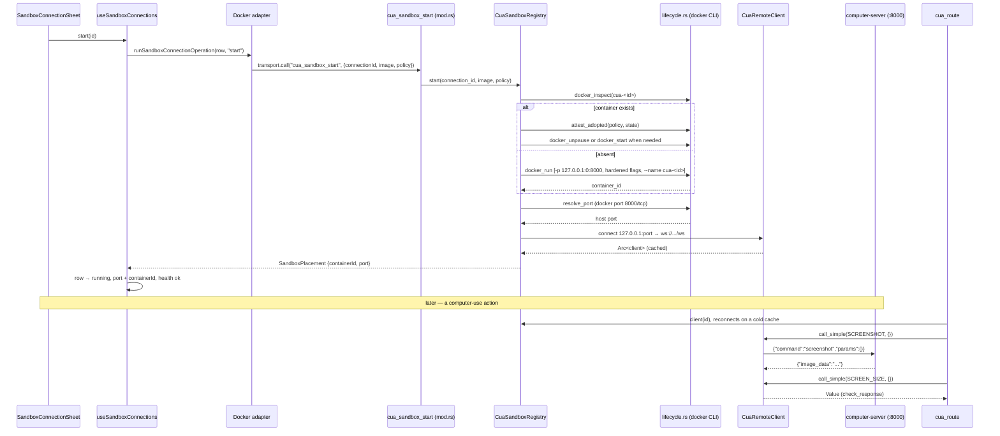

# CUA 远程沙盒

<Status variant="beta" />

<TLDR>
  CUA 沙盒是一个**远程 computer-use 目标**：一个 `ghcr.io/trycua/cua-xfce` Docker 容器在 8000 端口运行
  `computer-server`；cognia 通过 shell 调用 `docker` CLI 来创建、启动、暂停、停止、删除和探测它，借助位于
  `/ws` 的 WebSocket 驱动它，并将其接入既有的自动化门控之后：`CallContext` 携带沙盒连接 id 的调用会在容器中
  运行，而不是在主机上。它已**完全接通**。十个 `cua_sandbox_*` Tauri 命令已注册
  （`src-tauri/src/lib.rs:1609-1618`），注册表在应用 state 中管理；退出时只丢弃缓存的 WebSocket 客户端：
  容器继续运行，并在下次启动时被接管。连接是 Dexie `sandboxConnections` 表中的行。
</TLDR>

<Callout type="warn">
  runtime capability 来自实际 adapter（`lib/sandbox/connection-capabilities.ts:74-121`）。只有使用
  `computer-server` driver 的 Docker 行拥有 adapter（`lib/sandbox/adapter-registry.ts:45-47`），它声明支持
  create、start、suspend、resume、stop、delete、health、GUI 以及 workspace read/exec。导入的 cua-cloud 和
  Lume 行为兼容性继续可读，并分别渲染自己的 instance/endpoint 或 VM/image 字段，但它们的每一项操作都为
  false，UI 会将其禁用。无论 provider 为何，`cua-driver` driver 都会移除所有操作。因此只有 Docker 连接能够
  支撑 `cua-desktop` shell/files tier，该 tier 在 `lib/sandbox/session-runtime.ts:522-573` 中通过
  `workspaceExec`（`docker exec`）运行命令。
</Callout>

自 ADR-0067 将其从 `src-tauri` 中抽出后，这个 Rust 模块位于 `crates/cognia-automation/src/cua_sandbox/`。
`src-tauri/src/lib.rs:55` 把它重新导出为 `cua_sandbox`，因此 `generate_handler!` 中的条目无需改动即可解析。

## 容器生命周期 — `lifecycle.rs`

容器启动时将一个**仅限回环地址**的临时主机端口映射到容器的 8000，随后通过 `docker port` 解析出该主机端口。
容器刻意**不**使用 `--rm` 创建（`lifecycle.rs:8-12`）：若使用 `--rm`，停止操作也会销毁容器及其中写入的每个
文件，把 stop 和 delete 合并成同一个操作。

```rust title="crates/cognia-automation/src/cua_sandbox/lifecycle.rs:217-283 (docker run args, abridged)"
pub fn run_args(spec: &SpawnSpec) -> Vec<String> {
    let policy = &spec.policy;
    let mut args: Vec<String> = vec![
        "run".into(),
        "-d".into(),
        "-p".into(),
        format!("{}:0:8000", policy.publish_addr),
    ];
    // … --network / --cpus / --memory / --pids-limit when set, then per entry
    // --cap-drop, --cap-add, --tmpfs and -v, plus --security-opt no-new-privileges,
    // --read-only, the exec-user label, --user and the workspace bind mount
    args.push("--name".into());
    args.push(spec.name.clone());
    args.push(spec.image.clone());
    args
}
```

`create_args`（`lifecycle.rs:291-296`）是同一个参数向量，只是用 `create` 替换 `run` 并去掉 `-d`，因此可以只
预置机器而不启动它。

每个标志都来自一个 `ContainerPolicy`，其 `Default` 就是加固配置（`lifecycle.rs:98-131`）：

| 字段                | 默认值                                                | 对 `docker run` 的效果                                        |
| ------------------- | ----------------------------------------------------- | ------------------------------------------------------------- |
| `publish_addr`      | `127.0.0.1`                                           | `-p 127.0.0.1:0:8000`，控制 socket 永远不会暴露到局域网       |
| `network_mode`      | 未设置                                                | Docker 默认 bridge 网络，已发布的 WebSocket 端口需要它        |
| `cpus`、`memory_mb` | 未设置                                                | 不设上限                                                      |
| `pids_limit`        | `512`                                                 | `--pids-limit 512`                                            |
| `cap_drop`          | `ALL`                                                 | `--cap-drop ALL`                                              |
| `cap_add`           | `SETUID`、`SETGID`、`CHOWN`、`DAC_OVERRIDE`、`FOWNER` | 每项一个 `--cap-add`，供以 root 运行的 supervisord 使用       |
| `no_new_privileges` | `true`                                                | `--security-opt no-new-privileges`                            |
| `read_only_rootfs`  | `true`                                                | `--read-only`                                                 |
| `tmpfs_mounts`      | `/tmp`、`/run`、`/run/lock`、`/var/log`               | 每项一个 `--tmpfs`                                            |
| `writable_dirs`     | `/home/cua`                                           | `-v /home/cua`，一个以镜像内容为初始内容的匿名卷              |
| `exec_user`         | `cua`                                                 | 记录为 `cognia.cua.exec-user` 标签，并以 `docker exec -u` 施加 |
| `entrypoint_user`   | 未设置                                                | 不传 `--user`：cua-xfce 的 supervisord 必须以 root 启动       |
| `workspace_mount`   | 未设置                                                | 两半都给出时为 `-v host:container`                            |

渲染端只会发送 `networkMode`、`cpus`、`memoryMb` 和工作区挂载（`lib/sandbox/docker-adapter.ts:83-93`）。
`SandboxPolicyArgs` 的其他字段都以缺省形式到达，而 `From<Option<SandboxPolicyArgs>>` 会为缺省字段保留加固
默认值（`cua_sandbox/mod.rs:71-130`）。

```rust title="crates/cognia-automation/src/cua_sandbox/lifecycle.rs:373-377 (resolve mapped port)"
pub async fn resolve_port(container_id: &str) -> Result<u16> {
    let text = docker(&["port", container_id, "8000/tcp"], "docker port").await?;
    parse_port(&text)
        .ok_or_else(|| backend_err(format!("no mapped port in `docker port` output: {text:?}")))
}
```

每个子命令都经过同一个 `docker()` 辅助函数（`lifecycle.rs:299-318`），它在非零退出时携带 Docker 的 stderr
报错。生命周期的其余部分：

- **健康检查**是一次廉价的 `docker exec <id> true`（`lifecycle.rs:564-571`）。
- **停止**是 `docker stop`（`lifecycle.rs:342-346`）：容器及其文件系统都会保留。
- **挂起**是 `docker pause`（`lifecycle.rs:351-355`），它让内存保持驻留，因此恢复时桌面会话仍然在。
  `docker stop` 从不被当作挂起使用。
- **删除**是 `docker rm -f -v`（`lifecycle.rs:366-370`）；`-v` 还会回收 `writable_dirs` 创建的匿名卷。
- **检查**通过一次 `docker inspect --format` 往返同时读取状态和已施加的策略（`lifecycle.rs:397-419`）。
  "no such object/container" 的 stderr 返回 `Ok(None)`；其他任何失败（daemon 未运行、权限被拒）仍然是错误，
  因此绝不会被误当成"不存在"。
- **证明（attestation）。** `attest_adopted`（`lifecycle.rs:483-561`）拒绝接管比所请求策略约束更弱的容器
  （exec 用户、进程数上限、只读 rootfs、`cap-drop ALL`、no-new-privileges、网络、cpu、内存），并提示用户
  删除后重新启动。
- **执行与文件读取。** `docker_exec`（`lifecycle.rs:613-677`）把 `argv` 作为独立参数传递，从不拼成 shell
  字符串，并把每个输出流上限设为 1 MiB。超时会杀掉 `docker exec` 客户端，而不是容器内的进程，`timed_out`
  会如实说明这一点。`docker_read_file`（`lifecycle.rs:682-714`）是走同一通道、以同一 exec 用户执行的 `cat`。

## 注册表 — `registry.rs`

`CuaSandboxRegistry` **只持有活跃的 WebSocket 客户端**，存放在一个以连接 id 为键、由 Arc 支撑的 map 中
（`registry.rs:42-46`）。容器状态归 Docker 所有。旧设计在自己的 map 中跟踪容器并总是新建容器，因此一个比应用
活得更久的容器会一直占着自己的名字，此后 `docker run --name` 永远失败（`registry.rs:9-13`）。现在每个入口
都先询问 Docker，并**接管**它找到的容器：

```rust title="crates/cognia-automation/src/cua_sandbox/registry.rs:95-128"
pub async fn start(
    &self,
    connection_id: &str,
    image: &str,
    policy: ContainerPolicy,
) -> Result<SandboxPlacement> {
    let name = container_name_for_connection(connection_id);
    let container_id = match docker_inspect(&name).await? {
        Some(state) => {
            attest_adopted(&policy, &state)?;
            if state.paused {
                docker_unpause(&name).await?;
            } else if !state.running {
                docker_start(&name).await?;
            }
            state.id
        }
        None => {
            docker_run(&SpawnSpec {
                image: image.to_string(),
                name: name.clone(),
                policy,
            })
            .await?
        }
    };
    let port = resolve_port(&name).await?;
    let client = CuaRemoteClient::connect("127.0.0.1", port).await?;
    self.clients
        .lock()
        .await
        .insert(connection_id.to_string(), client);
    Ok(SandboxPlacement { container_id, port })
}
```

接管依赖于**确定性的容器名**。`container_name_for_connection`（`registry.rs:297-325`）把 id 中的 ASCII
字母数字转为小写，把其他连续字符折叠成一个 `-`，结果为空时回退为 `cua-sandbox`，并通过截断再追加一个 8 位
十六进制的 FNV-1a 哈希，使名字保持在 Docker 的 63 个字符以内。

其他入口遵循同样的规则：

- `create`（`registry.rs:57-88`）接管已有容器（未运行时端口为 `0`），否则执行 `docker create`。
- `suspend` / `resume`（`registry.rs:133-159`）在暂停前丢弃客户端，并在解除暂停或启动后重新连接。
- `stop` 和 `delete`（`registry.rs:163-182`）丢弃客户端；容器已不存在时作为空操作成功返回。
- `exec` / `read_file`（`registry.rs:200-232`）要求容器正在运行且未暂停，并以其标签上记录的 exec 用户运行。
- `client`（`registry.rs:239-251`）在**缓存为冷时重新连接**。应用重启后缓存总是冷的，而容器可能仍在运行，
  因此缓存未命中不会被视为"已死"。

注册表在应用启动时创建，并用同一个由 Arc 支撑的克隆管理两次：作为 `cua_sandbox_*` 命令读取的 Tauri state，
以及作为 `cua_route` 层读取的 `AutomationState` 的一部分（`lib.rs:1946-1955`）。退出时，`disconnect_all()`
只清空缓存的客户端（`lib.rs:2428-2438`、`registry.rs:258-260`）。容器被刻意保留为运行状态，因为 `start`
会在下次启动时接管它们。

### 命令 — `mod.rs`

`cua_sandbox/mod.rs` 定义了十个命令：`cua_sandbox_create`、`start`、`suspend`、`resume`、`stop`、
`delete`、`inspect`、`health`、`exec`（默认超时 120 秒）和 `read_file`（默认上限 2 MiB）。placement 和状态
以具名字段的 DTO 返回，而不是元组。每个命令在 `protocol/companion-commands.json` 中都是 `target: "client"`
且 `transports: ["internal"]`：Docker 编排属于运行渲染端的那台机器，绝不跟随当前活跃的远程主机。

## WebSocket 协议 — `protocol.rs` + `remote_client.rs`

`computer-server` 通过 WS 讲 JSON：每条消息都是 `{ "command": <string>, "params": <object> }`。
`protocol.rs` 从类型化的自动化动作构建这些消息：`left_click` / `right_click` / `double_click`、
`type_text`、`press_key` / `hotkey`、`key_down` / `key_up`、`move_cursor`、`scroll` 和 `drag`，以及无参数
的读取命令 `screenshot`、`get_cursor_position`、`get_accessibility_tree` 和 `get_screen_size`。

```rust title="crates/cognia-automation/src/cua_sandbox/protocol.rs:47-54 (click mapping)"
pub fn click_request(point: Point, button: MouseButton, count: u32) -> WsRequest {
    let command = match (button, count) {
        (MouseButton::Left, c) if c >= 2 => "double_click",
        (MouseButton::Right, _) => "right_click",
        _ => "left_click",
    };
    WsRequest::new(command, json!({ "x": point.x, "y": point.y }))
}
```

`check_response`（`protocol.rs:107-116`）把**非空字符串**类型的 `error` 字段转成 `BackendError`。模块文档
称其为"为真"的字段，但非字符串的 `error` 值会被当作成功放行。

`CuaRemoteClient` 通过一个 mpsc 队列（容量 32）串行化调用。服务器一次处理一个命令并按序回复，因此一个被
spawn 的 pump 任务会发送每个请求，然后读取下一个文本帧作为该请求的响应，并跳过 ping/pong/binary 帧。每次调用
都有 30 秒超时（`remote_client.rs:80-90`）。

```rust title="crates/cognia-automation/src/cua_sandbox/remote_client.rs:35-77 (connect + pump, abridged)"
pub async fn connect(host: &str, port: u16) -> Result<Arc<Self>> {
    let url = format!("ws://{host}:{port}/ws");
    let (stream, _) = tokio_tungstenite::connect_async(&url)
        .await
        .map_err(|e| backend_err(format!("cua connect {url}: {e}")))?;
    let (mut sink, mut source) = stream.split();
    let (tx, mut rx) = mpsc::channel::<Job>(32);
    // spawned task (lines 43-74): serialize → sink.send(Text) → read next Text frame as the reply
    Ok(Arc::new(Self { tx }))
}
```

## 目标解析 — `sandbox-target.ts`

一个 computer-use 目标要么是本地主机，要么是由 `connectionId` 引用的远程沙盒（绝不是一个裸的 "remote"
标志；id 才是收敛锚点）。解析器按 session → character → local 逐级查找：

```ts title="lib/automation/sandbox-target.ts:12-29 (abridged)"
export type ComputerUseTargetSetting = "local" | { connectionId: string } | undefined
export type ComputerUseTarget = { kind: "local" } | { kind: "remote"; connectionId: string }

export function resolveComputerUseTarget(session, character): ComputerUseTarget {
  return normalize(session) ?? normalize(character) ?? { kind: "local" }
}
```

它的调用方是 `resolveSandboxSessionBinding`（`lib/sandbox/binding.ts:57-85`），由 `lib/claude/build-options.ts`
在每次发送时运行。远程目标会变成该连接上的 `computerTarget: "bound"`；即使 GUI 轴保留为本地，`cua-desktop`
shell tier 也会强制设为 `"bound"`。

调用上下文依据该绑定盖印，而不是由插件盖印。computer-use 插件工具只把 `sandboxRuntimeRef` 作为来源转发
（`plugins/computer-use/src/index.ts:298-306`）。`buildComputerUseCallContext`
（`lib/plugin/api/automation-api.ts:230-273`）选取本次发送的 runtime ref，依次回退到会话当前活跃的 ref 和主机
回退 ref，然后调用 `SandboxSessionRuntime.decorateComputerUseContext`（`lib/sandbox/session-runtime.ts:395-422`）。
当该绑定未启用 Computer Use，或绑定的桌面无法放置时，它会拒绝；随后它断言连接具备 `gui` capability，并返回
`sandboxConnectionId: row.id`。该值会反序列化为 Rust 端的 `CallContext.sandbox_connection_id`
（`automation/commands.rs:245`），而 `remote_connection_id()` 把空字符串视为本地（`commands.rs:271-275`）。

## 本地与远程路由 — `cua_route`

`automation/dispatcher.rs:execute_action`（`dispatcher.rs:473-561`）将**每一个** GUI 驱动/读取动作都经由
`cua_route::*` 路由，`automation/commands.rs` 中细粒度的 `desktop_*` 命令也是如此。两者都在受门控的调用内部
运行，因此权限、同意和审计以完全相同的方式包裹本地与远程路径（`cua_route.rs:1-14`）。`cua_route` 解析活跃
客户端并翻译为一个 `computer-server` WS 命令。没有远程等价物的动作（以元素为目标的点击、`get_focus`、`find`、
`invoke_pattern`、`window_op`、`pick_at_point`）会返回 `UnsupportedPlatform`，而不是悄悄地穿透到主机
（`cua_route.rs:98`、`cua_route.rs:304-363`）。


```mermaid
sequenceDiagram
  participant UI as SandboxConnectionSheet
  participant Hook as useSandboxConnections
  participant Adp as Docker adapter
  participant Cmd as cua_sandbox_start (mod.rs)
  participant Reg as CuaSandboxRegistry
  participant Life as lifecycle.rs (docker CLI)
  participant WS as CuaRemoteClient
  participant Srv as computer-server (:8000)

  UI->>Hook: start(id)
  Hook->>Adp: runSandboxConnectionOperation(row, "start")
  Adp->>Cmd: transport.call("cua_sandbox_start", {connectionId, image, policy})
  Cmd->>Reg: start(connection_id, image, policy)
  Reg->>Life: docker_inspect(cua-<id>)
  alt container exists
    Reg->>Life: attest_adopted(policy, state)
    Reg->>Life: docker_unpause or docker_start when needed
  else absent
    Reg->>Life: docker_run [-p 127.0.0.1:0:8000, hardened flags, --name cua-<id>]
    Life-->>Reg: container_id
  end
  Reg->>Life: resolve_port (docker port 8000/tcp)
  Life-->>Reg: host port
  Reg->>WS: connect 127.0.0.1:port → ws://.../ws
  WS-->>Reg: Arc<client> (cached)
  Reg-->>Hook: SandboxPlacement {containerId, port}
  Hook->>Hook: row → running, port + containerId, health ok

  Note over UI,Srv: later — a computer-use action
  participant Route as cua_route
  Route->>Reg: client(id), reconnects on a cold cache
  Route->>WS: call_simple(SCREENSHOT, {})
  WS->>Srv: {"command":"screenshot","params":{}}
  Srv-->>WS: {"image_data":"..."}
  Route->>WS: call_simple(SCREEN_SIZE, {})
  WS-->>Route: Value (check_response)
```

## 连接注册表 — Dexie `sandboxConnections`

连接是一个一等实体。该表声明在 `CURRENT_SCHEMA` 中（`lib/db/schema.ts:542`），这是单一的 schema 版本
（当前为 **v229**，`schema.ts:420`），而不是逐版本的升级链。

```ts title="lib/db/schema.ts:542 (stores)"
sandboxConnections: "&id, name, provider, state, createdAt, updatedAt",
```

`SandboxConnectionRow`（`types/sandbox/index.ts:215-249`）把**谁拥有这台机器**与 **cognia 如何与它通信**
分开：

- `provider`：`"docker"`、`"cua-cloud"` 或 `"lume"`（`types/sandbox/index.ts:59`）。
- `driver`：`"computer-server"` 或 `"cua-driver"`（`types/sandbox/index.ts:68`）。
- `config`：按 provider 区分的配置，以 `provider` 为判别字段（`types/sandbox/index.ts:142-145`）。Docker
  配置携带 `image`、`host`、`port`（启动前为 0）、`containerId?`，以及在创建时固定下来的策略（`networkMode`、
  `cpus`、`memoryMb`、`workspaceMount`）。
- `state`：十一种规范化生命周期状态之一，从 `uninitialized` 到 `error`（`types/sandbox/index.ts:153-164`）。
- `capabilities` 和 `capabilitiesRevision`：操作矩阵。落后于当前 revision 的行会在读取时依据默认值重新计算。
- `credentialRef?`：一个 keyring 指针，只有需要认证的 provider 才有。任何密钥都不会进入 Dexie。
- 健康字段（`lastHealthStatus`、`lastHealthError?`、`lastHealthCheckAt?`）以及时间戳。
- 四个已弃用的顶层镜像字段（`image`、`host`、`port`、`containerId`），在 v143 拆分 provider/driver 之后的
  降级窗口内双写。

`lib/db/sandbox-connections.ts` 存放 CRUD 辅助函数。`listSandboxConnections` 按最新优先返回行，并在读取时
逐行迁移。该文件还包含 `listSandboxConnectionsByProvider`、`getSandboxConnection`、`putSandboxConnection`
（会刷新旧的镜像字段）、`deleteSandboxConnection`、`createSandboxConnectionRow`（状态为 `uninitialized`，
使用默认 capability），以及 `updateSandboxConnectionState`，后者会先重新读取行，行已不存在时为空操作。

`hooks/automation/use-sandbox-connections.ts` 是 Dexie 优先的响应式 hook（`useLiveQuery`），外加生命周期动作
`provision`、`start`、`suspend`、`resume`、`stop`、`refreshHealth` 和 `remove`。`create` 会写入一个 Docker /
`computer-server` 行，默认镜像为 `ghcr.io/trycua/cua-xfce:latest`，主机为 `127.0.0.1`。每个生命周期动作都按
连接串行化，先写入其过渡状态（`creating`、`starting`、`suspending`、`resuming`、`stopping`），然后调用
`runSandboxConnectionOperation`（`lib/sandbox/connection-lifecycle.ts`）。它会先检查 capability 矩阵和禁止的
状态（`lib/sandbox/lifecycle-contract.ts:166-188`），再到达 Docker adapter 和 `sandboxClient`。抛出的错误会
把行结算为 `error` 并附上消息。`start` 写入映射的 `port` 和 `containerId`，健康状态为 `ok`。`stop` 把 `port`
重置为 0，但保留 `containerId`，因为容器仍然存在。`remove` 写入 `deleting`，尽力执行 `delete` 操作，并总是
删除该行。

<Callout type="info">
  `lib/db/sandbox-connections.ts` 中的 `SandboxProvider` 现在是 `SandboxConnectionProvider` 的已弃用别名。
  `cua-cloud` 和 `lume` 已声明，但 ADR-0020 将两者记为推迟实现，且都没有 adapter。以元素为目标的动作，以及
  随之而来的工作流 pattern 节点，按设计仅限本地：UIA 没有远程元素引用，因此 `cua_route` 会对远程目标拒绝它们。
</Callout>

## UI + 测试

注册表 UI 位于 **Settings → Automation → Sandboxes**（`components/settings/automation/sandbox-connections-tab.tsx`，
挂载于 `automation-section.tsx`，也挂载在设备控制台的 runtime 区块中）。每一行显示名称、生命周期状态徽章、
实时健康徽章、没有 adapter 的行会显示 "no adapter" 徽章，以及一个 **Manage** 按钮。Manage 会打开
`SandboxConnectionSheet`，其中有七个动作（Provision、Start、Suspend、Resume、Stop、Check health、Delete），
每个都由该行的实时 capability 投影控制。在桌面 shell 之外（`isTauri()` 为 false），每个动作都会被禁用并注明
仅限桌面。一个内联添加表单接收名称、镜像、主机和固定策略（网络模式、CPU、内存、工作区挂载）。参见
[可观测性与 UI](./observability-and-ui)。

Rust 测试：`lifecycle.rs:744-1347`（17 个单元测试，外加 5 个标记为 `#[ignore]` 的实时 Docker 测试）、
`protocol.rs:118-186`（8 个）、`registry.rs:336-378`（4 个，容器命名）和 `mod.rs:353-453`（5 个，策略参数
映射）。TS 套件：`sandbox-target.test.ts`、`sandbox-target.e2e.test.ts`、`sandbox-client.test.ts`、
`sandbox-connections.test.ts`、`use-sandbox-connections.test.ts`、`sandbox-connections-tab.test.tsx`、
`sandbox-connection-sheet.test.tsx`，以及 `lib/sandbox/` 下的 `docker-adapter.test.ts`、
`connection-capabilities.test.ts` 和 `connection-lifecycle.test.ts`。

## 下一步

<Cards>
  <Card title="可观测性与 UI" href="./observability-and-ui" description="Sandboxes 标签页 + 健康徽章" />
  <Card title="执行总览" href="./execution-overview" description="另一个沙盒：工具调用隔离" />
  <Card title="Computer Use" href="../computer-use" description="更广义的 computer-use 子系统" />
</Cards>
