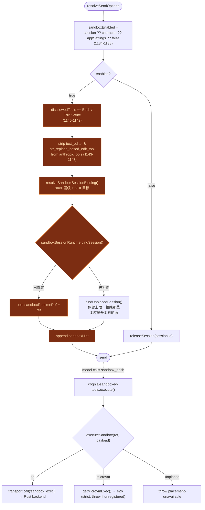

# 执行沙盒总览

<Status variant="beta" />

<TLDR>
  当某个 `ChatSession` 启用了沙盒时，`lib/claude/build-options.ts:resolveSendOptions`
  会**移除 SDK 的 `Bash` / `Edit` / `Write` 内置工具**以及原生 `text_editor`，追加一条
  系统提示说明，并将当前层级写入 `microvm-bridge`。随后模型会被引导至
  四个 `sandbox_*` 工具（来自 `cognia-sandboxed-tools` 插件），这些工具会路由到 OS
  后端（T1）或 e2b microVM（T4）。T2/T3 层负责插件代码；T5 是针对 `computer_use` 的
  按动作策略门。这里**没有任何旁路**——当某个后端不可用时，调用将被拒绝。
</TLDR>

## 五个层级

T1–T5 覆盖正交的威胁面。并非每个会话都会触及每个层级。

| 层级   | 保护对象                                   | 机制                                                              | 所在位置                                                       |
| ------ | ------------------------------------------ | ----------------------------------------------------------------- | ------------------------------------------------------------- |
| **T1** | `Bash` / `Edit` / `Write` / `text_editor`  | OS 原生：`bwrap`（Linux）、`sandbox-exec`（macOS）、runner（Win） | [OS 后端](./os-backends)                                      |
| **T2** | 插件 JS 执行器                             | 依据清单权限以 Node 24 `--permission` 重执行                       | [插件隔离](./plugin-isolation)                               |
| **T3** | 插件 WASM 模块                            | Wasmtime + WASI，预打开项来自授权账本                              | [插件隔离](./plugin-isolation)                               |
| **T4** | 为 T1 工具按需提供更强隔离                 | e2b Firecracker microVM（按角色 / 按应用层级）                     | [microVM 与 Web](./microvm-and-web)                         |
| **T5** | `computer_use`（无法进行进程级沙盒化）      | 按动作策略门（app / window / url / 屏幕区域）                      | [可观测性与 UI](./observability-and-ui)                     |

## 是什么启用了它——优先级链

整个特性由 `lib/claude/build-options.ts` 中解析出的一个布尔值控制。该链按
session → character → app-settings 依次走，默认为**关闭**：

```ts title="lib/claude/build-options.ts:1134-1138"
const sandboxEnabled =
  session?.sandboxEnabled ??
  character?.sandboxEnabled ??
  appSettings?.sandboxDefaultEnabled ??
  false
```

shell 层级与 Computer Use 目标会被一起解析成同一个 `SandboxSessionBinding`
（`lib/sandbox/binding.ts`），每条轴各自沿 session → character → app-settings 下行。
两者必须一起解析：选择 `cua-desktop` 层级意味着"shell、文件和 GUI 都在那台桌面里跑"，
因此它会把 GUI 轴强制指向同一个连接。

该 binding 连同已解析的资源策略与限制，会**每次发送绑定一次**，写入一份不可变的放置记录。
`resolveSendOptions` 把得到的引用挂在发送信封上；它仅限宿主使用，绝不会到达任何模型提供方：

```ts title="lib/claude/build-options.ts"
opts.sandboxRuntimeRef = await sandboxSessionRuntime.bindSession({
  sessionId: session.id,
  binding: sandboxBinding,
  policy: sandboxEnabled ? resolvedSandboxPolicy : null,
  confine: /* writable / readable / network 上限 */,
  sandboxEnabled,
  computerUseEnabled: computerUseAllowedForChat,
  workspaceRoot: opts.cwd,
})
```

被它取代的按会话注册表 `setActiveSandboxTier` / `setActiveSandboxPolicy` /
`setActiveSandboxConfine` 已经**移除**。它们原本是三张以 session id 为键的 Map，各个面各自回读，
这让层级、上限与 GUI 目标可能在同一次发送中彼此漂移。现在一个引用同时承载三者——见
[microVM 与 Web](./microvm-and-web)。

### 配置字段映射

这三个配置字段都位于 `lib/claude/types.ts`（而非 `lib/db/schema.ts`）中的接口上：

| 字段                    | 接口          | 位置                   | 类型                          |
| ----------------------- | ------------- | ---------------------- | ----------------------------- |
| `sandboxEnabled`        | `ChatSession` | `lib/claude/types.ts:689`  | `boolean \| undefined`        |
| `sandboxEnabled`        | `Character`   | `lib/claude/types.ts:2054` | `boolean \| undefined`        |
| `sandboxDefaultEnabled` | `AppSettings` | `lib/claude/types.ts:1545` | `boolean \| undefined`        |
| `sandboxTier`           | `Character`   | `lib/claude/types.ts:2062` | `"os" \| "microvm" \| undefined` |
| `sandboxTier`           | `AppSettings` | `lib/claude/types.ts:1555` | `"os" \| "microvm" \| undefined` |

## 工具替换

当 `sandboxEnabled` 为 true 时，SDK 内置工具会被拒绝，原生编辑器工具会从
Anthropic 工具投影中剥离——这样模型就**无法**触及任何未沙盒化的路径：

```ts title="lib/claude/build-options.ts:1139-1147"
if (sandboxEnabled) {
  const disallowed = new Set(opts.disallowedTools ?? [])
  for (const t of ["Bash", "Edit", "Write"]) disallowed.add(t)
  opts.disallowedTools = [...disallowed]
  if (Array.isArray(opts.anthropicTools)) {
    opts.anthropicTools = opts.anthropicTools.filter(
      (t) => t.name !== "text_editor" && t.name !== "str_replace_based_edit_tool"
    )
  }
```

这四个 `sandbox_*` 替代工具**并非**在此处添加——它们已经在 `opts.pluginTools`
中（由 `buildPluginToolsManifest()` 从 `cognia-sandboxed-tools` 插件在上游构建）。此代码块
仅移除未沙盒化路径，然后用一条系统提示说明引导模型：

```ts title="lib/claude/build-options.ts:1154-1161"
const sandboxHint =
  "Filesystem-mutating and shell tools are sandboxed in this session. Use " +
  "`sandbox_bash` / `sandbox_edit` / `sandbox_write` / `sandbox_text_editor` " +
  "(from cognia-sandboxed-tools) instead of the SDK builtins; they accept the " +
  "same shape plus an explicit writable/readable scope. The unsandboxed Bash / " +
  "Edit / Write are not available in this session."
const existing = opts.appendSystemPrompt?.trim() ?? ""
opts.appendSystemPrompt = existing ? `${existing}\n\n${sandboxHint}` : sandboxHint
```

当会话既未启用沙盒也未启用 Computer Use 时，绑定会被**释放**而不是重置，
这样上一次发送留下的放置不会残留：

```ts title="lib/claude/build-options.ts"
} else if (session?.id) {
  // 释放失败只记录、不抛出：某个拒绝关闭的 provider 不能让会话连消息都发不出去。
  try {
    await sandboxSessionRuntime.releaseSession(session.id)
  } catch (err) {
    loggers.app.warn("sandbox runtime release failed", { sessionId: session.id, error: String(err) })
  }
  delete opts.sandboxRuntimeRef
}
```

### 当绑定无法建立时

绑定可能被用户在别处改动的状态拒绝——被删除的沙盒连接、仍钉在已撤回的 `cua-desktop` 层级上的
character、找不到远端工作区可认领的 microVM 预检。这既不能让整次发送失败，也**绝不能**把
"我无法隔离它"静默地回答成"那就在这里无限制地跑"：

```ts title="lib/claude/build-options.ts"
} catch (err) {
  loggers.app.warn("unusable sandbox binding", { sessionId: session.id, error: String(err) })
  opts.sandboxRuntimeRef = sandboxSessionRuntime.bindUnplacedSession(bindInput, err)
}
```

`bindUnplacedSession` 记录会话*请求*的那份放置。已解析的上限仍会约束每一个合法在本机运行的面，
而那些本应离开本机的面则在调用时以 `placement-unavailable` 拒绝：

| 请求的放置                              | 绑定失败后的行为                                     |
| --------------------------------------- | ---------------------------------------------------- |
| `shellTier: "os"`                       | 仍然运行，仍受已解析策略约束                         |
| `shellTier: "microvm" \| "cua-desktop"` | `executeSandbox` 抛错——不回退到宿主                  |
| `computerTarget: "local"`               | 仍然驱动本地桌面                                     |
| `computerTarget: "bound"`               | `decorateComputerUseContext` 抛错——绝不改指本地      |

## 端到端流程



## 严格模式——没有旁路

ADR-0028 写得很明确：当某个 T1 后端不可用时（Windows setup 未运行、`bwrap` 缺失、
runner 以非零退出），工具调用会**严格拒绝**。在策略层既没有用于关闭沙盒的设置开关，
也没有 `COGNIA_SANDBOX_BYPASS` 环境变量后门。渲染端会改为显示一个
「Setup required」徽章和一个「Retry setup」按钮。microVM 层同理：如果某个
会话解析到 `microvm` 但没有注册任何 e2b exec，`cognia-sandboxed-tools` 插件会
抛出异常，而不是悄悄回退到 OS 层（见 [沙盒化工具](./sandboxed-tools)）。

## 审计面

每一次 OS 沙盒调用都会被记录到专门的审计面。Rust 的 `Surface` 枚举带有一个
`Sandbox` 变体（`src-tauri/src/automation/permission.rs:53`）；调度器会为每次
`sandbox_exec` 调用记录一条 allow/deny/error 的 `AuditEntry` 并发出一个 `automation:event`
（`src-tauri/src/sandbox/mod.rs:99-158`）。由于沙盒拥有自己的严格模式策略，
共享权限门会对其短路——`Surface::Sandbox => Decision::Allow`
（`permission.rs:325`）——同时全局 kill-switch 仍会出于纵深防御而拦截。
诊断标签页通过 `SandboxAuditCard` 渲染这些记录；见 [可观测性与 UI](./observability-and-ui)。

## 下一步

<Cards>
  <Card title="OS 后端（T1）" href="./os-backends" description="sandbox_exec 背后的 Rust crate" />
  <Card title="沙盒化工具" href="./sandboxed-tools" description="四个 sandbox_* 工具" />
  <Card title="microVM 与 Web" href="./microvm-and-web" description="T4 e2b 层级 + 层级路由" />
</Cards>
