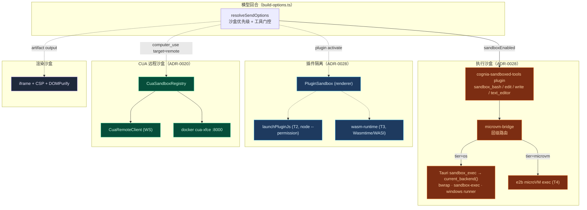

# 沙盒系统

<Status variant="beta" />

<TLDR>
  cognia-next 中的「沙盒」是**四个相互独立的体系**，而非单一运行时。其中最核心的是
  ADR-0028 的**执行沙盒**：一套五层混合方案（OS 原生 `bwrap` / `sandbox-exec` /
  Windows runner、Node 24 `--permission`、Wasmtime、e2b microVM，以及按动作粒度的策略门），
  用于约束 `Bash` / `Edit` / `Write` / `text_editor` 工具调用。与之并列的还有
  **CUA 远程沙盒**（通过 WebSocket 驱动的容器化桌面——ADR-0020）、
  **插件隔离**栈（渲染端 `PluginSandbox`、T2 Node 权限重执行、T3 WASM
  运行时），以及**制品渲染沙盒**（iframe + CSP + DOMPurify——详见
  [制品 / 沙盒](../artifacts-sandbox)）。本章节将每个模块映射到其源码，
  附带精确到行号的引用以及**真实的**实现状态（在若干处与 ADR 提案有所不同）。
</TLDR>

<StatGrid>
  <Stat label="沙盒体系" value="4" hint="执行 · CUA 远程 · 插件 · 渲染" />
  <Stat label="执行层级" value="5" hint="T1 OS · T2 node · T3 wasm · T4 microVM · T5 策略" />
  <Stat label="OS 后端" value="3+2" hint="linux/macos/windows + uninstalled/mock" />
  <Stat label="CUA Dexie Schema" value="v57" hint="sandboxConnections 表" />
</StatGrid>

## 四大体系

它们共用「沙盒」一词，但其实是相互独立的子系统，具有不同的威胁模型和
不同的隔离机制。请先阅读此表。

| 体系                    | 隔离对象                                                 | 机制                                                                       | ADR  | 状态                                    |
| ----------------------- | -------------------------------------------------------- | ------------------------------------------------------------------------- | ---- | --------------------------------------- |
| **执行沙盒**            | 模型工具调用（`Bash` / `Edit` / `Write` / editor）       | OS 原生（`bwrap`/`sandbox-exec`/runner）· microVM · 按动作策略             | 0028 | Linux/macOS 已落地 · Windows 部分       |
| **CUA 远程沙盒**        | 远程桌面上的 computer-use（GUI 操控）                     | 通过 WebSocket 驱动的 Docker `cua-xfce` 容器                               | 0020 | 已完全接通                              |
| **插件隔离**            | 第三方插件代码（JS / Node / WASM）                       | `PluginSandbox` globals · Node 24 `--permission` · Wasmtime/WASI          | 0028 | 渲染端已发布 · T2/T3 表层已锁定         |
| **渲染沙盒**            | 一次性模型制品（HTML / SVG / React）                     | iframe + CSP + DOMPurify（见 [制品 / 沙盒](../artifacts-sandbox)）         | —    | 稳定                                    |

第五个，即 **web 代码执行沙盒**（`lib/sandbox/web`），目前是一个有意保留的桩——
详见 [microVM 与 Web](./microvm-and-web)。

## 它们如何协作

## 代码位置

<Files>
  <Folder name="src-tauri/src/sandbox/ (T1 — OS 执行)" defaultOpen>
    <File name="mod.rs — 调度器 + sandbox_exec / sandbox_health_probe Tauri 命令" />
    <File name="traits.rs — SandboxedExec trait" />
    <File name="types.rs — SandboxCommand / Policy / Result / Error / Health / NetworkPolicy" />
    <File name="policy.rs — policy_for(tool, request) 纯解析器" />
    <File name="linux.rs · macos.rs · windows.rs — 各平台后端" />
    <File name="uninstalled.rs · mock.rs — 回退 + 测试替身" />
  </Folder>
  <Folder name="src-tauri/src/bin/">
    <File name="cognia-sandbox-setup.rs — Windows UAC 安装器（合成用户 + 防火墙）" />
    <File name="cognia-sandbox-runner.rs — Windows 非提权 runner（runas）" />
  </Folder>
  <Folder name="src-tauri/src/cua_sandbox/ (CUA 远程)">
    <File name="mod.rs — cua_sandbox_start / stop / health" />
    <File name="lifecycle.rs · protocol.rs · registry.rs · remote_client.rs" />
  </Folder>
  <Folder name="lib/sandbox/">
    <File name="microvm-bridge.ts — 层级路由 + microvm exec 注册表" />
    <File name="web/index.ts — web 代码执行桩" />
  </Folder>
  <Folder name="lib/claude/">
    <File name="build-options.ts — 沙盒优先级 + 工具门控（≈1121–1166）" />
    <File name="types.ts — sandboxEnabled / sandboxTier / accountId 字段" />
  </Folder>
  <Folder name="plugins/">
    <File name="cognia-sandboxed-tools/src/index.ts — 4 个 sandbox_* MCP 工具" />
    <File name="e2b-sandbox/src/microvm-exec.ts · workspace-backend.ts — T4" />
  </Folder>
  <Folder name="lib/plugin/ (插件隔离)">
    <File name="core/sandbox.ts — PluginSandbox（渲染端 globals）" />
    <File name="launcher/launchPluginJs.ts — T2 node --permission 标志" />
    <File name="core/wasm-runtime.ts — T3 Wasmtime/WASI" />
  </Folder>
  <Folder name="UI + 数据">
    <File name="components/chat/composer/sandbox-shield.tsx — 输入框指示器" />
    <File name="components/settings/sandbox/* — 设置区块（已构建但未接入）" />
    <File name="components/settings/automation/sandbox-connections-tab.tsx — CUA 注册表 UI" />
    <File name="lib/db/sandbox-connections.ts — Dexie v57 sandboxConnections" />
  </Folder>
</Files>

## 本章节页面

<Cards>
  <Card
    title="执行沙盒总览"
    href="./execution-overview"
    description="ADR-0028 五个层级、build-options 优先级链、工具替换、严格模式、审计"
  />
  <Card
    title="OS 后端（T1）"
    href="./os-backends"
    description="Rust crate：traits、策略解析器、bwrap / sandbox-exec / Windows runner，以及各平台的真实状态"
  />
  <Card
    title="沙盒化工具插件"
    href="./sandboxed-tools"
    description="cognia-sandboxed-tools：用于替换 SDK 内置工具的四个 sandbox_* MCP 工具"
  />
  <Card
    title="microVM 与 Web"
    href="./microvm-and-web"
    description="T4 e2b Firecracker 层级、层级路由、web 代码执行桩，以及消耗元数据类型"
  />
  <Card
    title="插件隔离"
    href="./plugin-isolation"
    description="PluginSandbox 渲染端 globals、T2 Node --permission 重执行、T3 Wasmtime/WASI 运行时"
  />
  <Card
    title="CUA 远程沙盒"
    href="./cua-remote-sandbox"
    description="ADR-0020 通过 WebSocket 驱动的容器化 computer-use 桌面"
  />
  <Card
    title="可观测性与 UI"
    href="./observability-and-ui"
    description="输入框 shield、诊断审计卡片、未接入的设置区块、引导流程"
  />
  <Card
    title="制品 / 沙盒（渲染）"
    href="../artifacts-sandbox"
    description="第四个体系：针对一次性 HTML / SVG / React 的 iframe + CSP + DOMPurify 隔离"
  />
</Cards>
