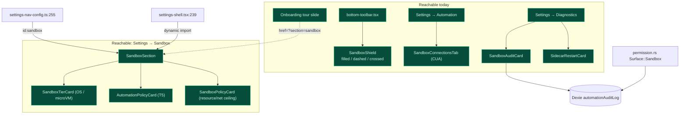

# 可观测性与 UI

<Status variant="beta" />

<TLDR>
  五个沙盒界面**均已发布且可达**：编辑器的**护盾**指示器（3 种状态）、
  **Diagnostics** 审计日志 + sidecar 重启卡片、**Automation → Sandboxes** 标签页（CUA）、
  **onboarding** 导览幻灯片，以及专门的 **Settings → Sandbox** 区块（健康/重试 + 启用开关 +
  tier 选择器 + 资源/网络上限编辑器 + T5 策略编辑器），它已在导航（`settings-nav-config.ts`）
  中注册并由 `settings-shell.tsx` 渲染。本页映射每个界面到其源码。
</TLDR>

## 界面地图



## 编辑器护盾 — 已发布并接通

`components/chat/composer/sandbox-shield.tsx` 渲染一个 3 状态指示器，并将**形状与颜色配对**
以保证色盲可读性，挂载于 `bottom-toolbar.tsx:101`。状态来自一个纯优先级解析器
（session → character → app settings）：

```ts title="components/chat/composer/sandbox-shield.tsx:34-46"
export function resolveShieldState(args: {
  session: ChatSession | null | undefined
  characterSandboxEnabled?: boolean
  characterSandboxTier?: "os" | "microvm"
  defaultEnabled?: boolean
  defaultTier?: "os" | "microvm"
}): ShieldState {
  const enabled =
    args.session?.sandboxEnabled ?? args.characterSandboxEnabled ?? args.defaultEnabled ?? false
  if (!enabled) return "off"
  const tier = args.characterSandboxTier ?? args.defaultTier ?? "os"
  return tier
}
```

- 实心翡翠色 `Shield` —— 沙盒开启，OS tier
- 虚线天蓝色 `Shield`（`[stroke-dasharray:3_2]`）—— 沙盒开启，microVM tier
- 划掉的灰色 `ShieldOff` —— 沙盒关闭（今天的默认）

护盾、Devices、Settings tier picker 与连接操作消费同一个 `runtime-availability` 投影。
OS 可用性来自主动 confinement check，而不是只检查二进制是否存在的廉价 probe；microVM
可用性来自当前正在接受新绑定的已注册 adapter，UI 同时说明最终资格还需要 E2B-backed workspace。
已持久化但当前不可用的选择仍保持可见和选中，只会禁用并显示可操作原因。

## Diagnostics — 已发布并接通

`components/settings/sections/diagnostics-section.tsx` 挂载了两个 ADR-0028 卡片：

- **`SandboxAuditCard`** —— 直接调用 `listAuditRows({ surface: "sandbox", limit: 50 })`，
  并展示最新的 50 条沙盒行，带
  allow/deny/error 着色 + 时长。
- **`SidecarRestartCard`** —— 每 5 秒轮询 `sidecar_restart_count` IPC，展示计数和
  上次重启的时间戳。

审计数据源自 Rust：`Surface` 枚举携带一个 `Sandbox` 变体
（`src-tauri/src/automation/permission.rs:53`），`sandbox_exec` 为每次调用记录一条
`AuditEntry`（参见 [执行总览](./execution-overview)）。

## Automation → Sandboxes 标签页（CUA）—— 已发布并接通

`components/settings/automation/sandbox-connections-tab.tsx` 是 CUA Docker
沙盒的注册表 UI（目前用户唯一能通过专门标签页到达的沙盒 UI）。它挂载于
`automation-section.tsx`——`TabId` 联合类型包含 `"sandboxes"`（第 77 行），带有
`<TabsContent value="sandboxes"><SandboxConnectionsTab /></TabsContent>`（第 131-133 行）。生命周期
按钮在 web 模式下禁用（`isTauri()`）。参见 [CUA 远程沙盒](./cua-remote-sandbox)。

能力来自实际注册的 lifecycle adapter，而不是 provider 默认值。Docker / computer-server
只暴露 start、stop、health、delete 与 GUI。既有 cua-cloud 和 Lume 行会保留并按 provider-specific
配置读取，但不暴露任何 lifecycle 或 GUI 操作。`cua-desktop` 仍不能执行 shell/files，因为没有
经过验证的 workspace adapter。

## Onboarding 导览幻灯片 —— 已发布

`components/shell/onboarding-dialog.tsx` 将沙盒放在导览幻灯片的首位
（`TOUR_SLIDES[0]`，第 61-64 行）。该幻灯片的 CTA 链接到 `/settings?section=sandbox`：

```ts title="components/shell/onboarding-dialog.tsx:61-64"
{ id: "sandbox", icon: ShieldCheckIcon, href: "/settings?section=sandbox" }
```

<Callout type="info">
  该 href 指向 `?section=sandbox`，现在可以解析——该区块已在 `settings-nav-config.ts` 注册，
  并由 `settings-shell.tsx` 渲染（见下文）。深链接可用。
</Callout>

## Settings → Sandbox 区块 —— 已接入

`components/settings/sandbox/` 下提供了一个完整、已测试的区块，可在 **Settings → Sandbox**
（`?section=sandbox`）访问：

- **`sandbox-section.tsx`** —— `SandboxSection`：一个由 `useSandboxHealth()` 驱动的
  三态徽章健康卡片和一个 "Run health probe" 按钮（`data-testid="sandbox-retry-button"`），组合
  下面的卡片。
- **`sandbox-enable-card.tsx`** —— 默认 / 逐会话沙盒启用开关。
- **`sandbox-tier-card.tsx`** —— 默认 tier 选择器（OS / microVM 单选组），写入
  `AppSettings.sandboxTier`；它保留不可用的已持久化选择，并显示当前无法执行的原因。
- **`sandbox-policy-card.tsx`** —— 资源/网络**上限**编辑器（可写根、CPU / 内存上限、网络策略），
  模型只能收窄，永远无法放宽。
- **`automation-policy-card.tsx`** —— **T5** 逐动作策略编辑器：`allowedProcessNames`、
  `allowedWindowTitlePatterns`（正则）、`allowedUrlPatterns`（正则）、`forbiddenScreenRegions`
  （x/y/w/h），通过 `saveAutomationPolicy` 去抖保存。

它如何接入：

- `settings-shell.tsx:239` 用 `dynamic()` 导入 `SandboxSection`；`case "sandbox"` 渲染分支在
  `settings-shell.tsx:516`。
- `settings-nav-config.ts:255` 注册了 `id: "sandbox"` 的 NavItem（分组 `ai`、`desktopOnly`）。
- 因此 onboarding 深链接（`/settings?section=sandbox`）可以解析。

## i18n 命名空间

沙盒字符串（`i18n/messages/en.json` 中约 45 个键，并在 `zh-CN.json` 中镜像）跨越：
`chat.composer.sandboxShield.*`（护盾标签/提示）、`settings.sandbox.*`（该区块，
含 `.tier.*` + `.automationPolicy.*` + `.policy.*`）、`settings.diagnostics.sandboxAudit.*` +
`settings.diagnostics.sidecarRestart.*`、`characters.…sandbox.*`（逐角色启用 + tier）、
`onboarding.tour.sandbox.*`，以及 `automation.sandboxConnections.*` + `automation.tabs.sandboxes`。

## 状态汇总

| 界面                                                | ADR        | 状态                                              |
| -------------------------------------------------- | ---------- | ------------------------------------------------- |
| 编辑器护盾（3 状态）                                | 0028       | 已发布并接通                                      |
| Automation → Sandboxes 标签页（CUA）               | 0020       | 已发布并接通                                      |
| Diagnostics：沙盒审计 + sidecar 重启               | 0028 P14   | 已发布并接通；Rust `Surface::Sandbox` 存在        |
| Onboarding 沙盒导览幻灯片                          | 0028       | 已发布并接通；深链接可解析                        |
| Settings → Sandbox（健康/重试、tier、上限、T5）    | 0028 P7/P9 | 已发布并接通（`settings-nav-config.ts:255`）      |

## 下一步

<Cards>
  <Card title="执行总览" href="./execution-overview" description="这些界面背后的审计 + 严格模式策略" />
  <Card title="CUA 远程沙盒" href="./cua-remote-sandbox" description="Sandboxes 标签页所管理的对象" />
  <Card title="OS 后端（T1）" href="./os-backends" description="徽章读取的健康字符串" />
</Cards>
