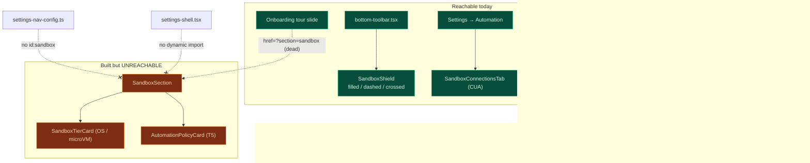

# 可观测性与 UI

<Status variant="beta" />

<TLDR>
  有四个沙盒界面**已发布且可达**：编辑器的**护盾**指示器（3 种状态）、
  **Diagnostics** 审计日志 + sidecar 重启卡片、**Automation → Sandboxes** 标签页（CUA），以及
  **onboarding** 导览幻灯片。有一个**已构建并通过测试但不可达**：专门的
  **Settings → Sandbox** 区块（健康/重试 + tier 选择器 + T5 策略编辑器）已存在，但未
  在导航或 shell 中注册，而 onboarding 幻灯片深链接到它（一个死链接）。本页
  映射每个界面，并说明如何点亮那个孤儿界面。
</TLDR>

## 界面地图



## 编辑器护盾 — 已发布并接通

`components/chat/composer/sandbox-shield.tsx` 渲染一个 3 状态指示器，并将**形状与颜色配对**
以保证色盲可读性，挂载于 `bottom-toolbar.tsx:101`。状态来自一个纯优先级解析器
（session → character → app settings）：

```ts title="components/chat/composer/sandbox-shield.tsx:34-46"
export function resolveShieldState(args: {
  session: ChatSession | null | undefined
  characterSandboxEnabled?: boolean
  characterSandboxTier?: "os" | "microvm"
  defaultEnabled?: boolean
  defaultTier?: "os" | "microvm"
}): ShieldState {
  const enabled =
    args.session?.sandboxEnabled ?? args.characterSandboxEnabled ?? args.defaultEnabled ?? false
  if (!enabled) return "off"
  const tier = args.characterSandboxTier ?? args.defaultTier ?? "os"
  return tier
}
```

- 实心翡翠色 `Shield` —— 沙盒开启，OS tier
- 虚线天蓝色 `Shield`（`[stroke-dasharray:3_2]`）—— 沙盒开启，microVM tier
- 划掉的灰色 `ShieldOff` —— 沙盒关闭（今天的默认）

此徽章的健康状态来自 `hooks/sandbox/use-sandbox-health.ts:useSandboxHealth`，它每 5 秒
轮询一次 `sandbox_health_probe` Tauri 命令，并同时容忍来自 serde 的 `last_error`（蛇形）和
`lastError`（驼峰）两种形状。

## Diagnostics — 已发布并接通

`components/settings/sections/diagnostics-section.tsx` 挂载了两个 ADR-0028 卡片：

- **`SandboxAuditCard`** —— 读取 Dexie 的 `automationAuditLog`，过滤
  `row.surface === "sandbox"`（`sandbox-audit-card.tsx:39`），并展示最新的 50 行，带
  allow/deny/error 着色 + 时长。
- **`SidecarRestartCard`** —— 每 5 秒轮询 `sidecar_restart_count` IPC，展示计数和
  上次重启的时间戳。

审计数据源自 Rust：`Surface` 枚举携带一个 `Sandbox` 变体
（`src-tauri/src/automation/permission.rs:53`），`sandbox_exec` 为每次调用记录一条
`AuditEntry`（参见 [执行总览](./execution-overview)）。

## Automation → Sandboxes 标签页（CUA）—— 已发布并接通

`components/settings/automation/sandbox-connections-tab.tsx` 是 CUA Docker
沙盒的注册表 UI（目前用户唯一能通过专门标签页到达的沙盒 UI）。它挂载于
`automation-section.tsx`——`TabId` 联合类型包含 `"sandboxes"`（第 77 行），带有
`<TabsContent value="sandboxes"><SandboxConnectionsTab /></TabsContent>`（第 131-133 行）。生命周期
按钮在 web 模式下禁用（`isTauri()`）。参见 [CUA 远程沙盒](./cua-remote-sandbox)。

## Onboarding 导览幻灯片 —— 已发布（带一个死链接）

`components/shell/onboarding-dialog.tsx` 将沙盒放在导览幻灯片的首位
（`TOUR_SLIDES[0]`，第 61-64 行）。该幻灯片的 CTA 链接到 `/settings?section=sandbox`：

```ts title="components/shell/onboarding-dialog.tsx:61-64"
{ id: "sandbox", icon: ShieldCheckIcon, href: "/settings?section=sandbox" }
```

<Callout type="warn">
  该 href 指向 `?section=sandbox`，它渲染出**空内容**——因为没有注册任何 `sandbox` 区块
  （见下文）。在该区块接通之前，这是一个失效的深链接。
</Callout>

## Settings → Sandbox 区块 —— 已构建、已测试，但成为孤儿

在 `components/settings/sandbox/` 下存在一个完整、已测试的区块，但它**不可达**：

- **`sandbox-section.tsx`** —— `SandboxSection`：一个由 `useSandboxHealth()` 驱动的
  三态徽章健康卡片和一个 "Retry setup" 按钮（`data-testid="sandbox-retry-button"`），组合
  下面两个卡片。
- **`sandbox-tier-card.tsx`** —— 默认 tier 选择器（OS / microVM 单选组），写入
  `AppSettings.sandboxTier`。
- **`automation-policy-card.tsx`** —— **T5** 逐动作策略编辑器：`allowedProcessNames`、
  `allowedWindowTitlePatterns`（正则）、`allowedUrlPatterns`（正则）、`forbiddenScreenRegions`
  （x/y/w/h），通过 `saveAutomationPolicy` 去抖保存。

它为何不可达：

- `settings-shell.tsx` 为约 40 个区块提供了 `dynamic()` 导入，但**没有 `sandbox-section` 的**。
- `settings-nav-config.ts` 没有 `id: "sandbox"` 的 NavItem——唯一的 `"sandbox"` 命中项
  （`settings-nav-config.ts:798`）是 `canvas` 条目下的一个搜索关键词。

<Callout type="info">
  要点亮它：向 `settings-nav-config.ts` 添加一个 `id: "sandbox"` 的 NavItem，向
  `settings-shell.tsx` 添加一个 `dynamic()` 导入 + 渲染分支，onboarding 深链接便会开始工作。
  ADR-0028 提议的**逐工具网络策略编辑器**是仍然缺失的那一块——tier
  选择器和 T5 逐动作策略编辑器已经存在。
</Callout>

## i18n 命名空间

沙盒字符串（`i18n/messages/en.json` 中约 45 个键，并在 `zh-CN.json` 中镜像）跨越：
`chat.composer.sandboxShield.*`（护盾标签/提示）、`settings.sandbox.*`（孤儿区块，
含 `.tier.*` + `.automationPolicy.*`）、`settings.diagnostics.sandboxAudit.*` +
`settings.diagnostics.sidecarRestart.*`、`characters.…sandbox.*`（逐角色启用 + tier）、
`onboarding.tour.sandbox.*`，以及 `automation.sandboxConnections.*` + `automation.tabs.sandboxes`。

## 状态汇总

| 界面                                                | ADR        | 状态                                              |
| -------------------------------------------------- | ---------- | ------------------------------------------------- |
| 编辑器护盾（3 状态）                                | 0028       | 已发布并接通                                      |
| Automation → Sandboxes 标签页（CUA）               | 0020       | 已发布并接通                                      |
| Diagnostics：沙盒审计 + sidecar 重启               | 0028 P14   | 已发布并接通；Rust `Surface::Sandbox` 存在        |
| Onboarding 沙盒导览幻灯片                          | 0028       | 已发布；href 深链接到一个死区块                   |
| Settings → Sandbox（健康/重试、tier、T5 策略）     | 0028 P7/P9 | 已构建 + 已测试但**成为孤儿**（无 nav/shell）     |
| 逐工具**网络**策略编辑器                           | 0028       | 缺失（已提议，未构建）                            |

## 下一步

<Cards>
  <Card title="执行总览" href="./execution-overview" description="这些界面背后的审计 + 严格模式策略" />
  <Card title="CUA 远程沙盒" href="./cua-remote-sandbox" description="Sandboxes 标签页所管理的对象" />
  <Card title="OS 后端（T1）" href="./os-backends" description="徽章读取的健康字符串" />
</Cards>
