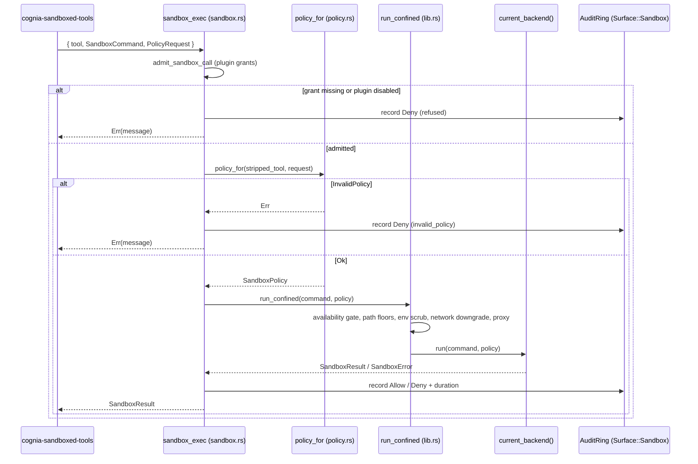

# OS 后端 (T1)

<Status variant="beta" />

<TLDR>
  `crates/cognia-exec-sandbox/` 是 Tier-1 的 OS 执行沙盒。它在 ADR-0196 中从
  `cognia-automation` 拆出，这样终端和 Python 插件宿主不必链接整套 UI 自动化栈就能用到它。
  `sandbox_exec` Tauri 命令（仍在 `crates/cognia-automation/src/sandbox.rs`）先检查插件的授权，
  再通过 `policy.rs:policy_for` 从工具名派生出 `SandboxPolicy`，然后交给 `run_confined`，由它通过
  `current_backend()` 选择各平台后端。**Linux (`bwrap`)、macOS (`sandbox-exec`) 与 Windows
  (`cognia-sandbox-runner.exe`) 都是真实后端**。Windows runner 是随包发布的 restricted-token +
  low-integrity + Job Object crate，并通过 JSON 合约捕获 stdout/stderr。三个 Tauri 命令均已注册
  （`src-tauri/src/lib.rs:762-764`）。Tauri 命令不是唯一的入口：`cognia-sandbox-exec` 为没有
  Tauri IPC 的宿主调用同一个 `run_confined`，CLI 和无头 brain 通过该入口使用这一层。
</TLDR>

## trait —— `traits.rs`

每个后端都实现同一个异步 trait。`health()` 如今已经在线运行（由 Settings 标签页轮询）；`probe_confinement()` 是 `sandbox_health_check` 背后按需触发的主动检查；`run()` /`first_time_setup()` 由 dispatcher 消费。

```rust title="crates/cognia-exec-sandbox/src/traits.rs:49-200 (abridged)"
#[async_trait]
pub trait SandboxedExec: Send + Sync {
    async fn run(
        &self,
        command: SandboxCommand,
        policy: SandboxPolicy,
    ) -> Result<SandboxResult, SandboxError>;
    /// Renderer polls this for the Settings → Sandbox status badge; the
    /// strict-mode policy then refuses tool calls when this is false.
    fn is_available(&self) -> bool;
    async fn first_time_setup(&self) -> Result<(), SandboxError>;
    fn health(&self) -> SandboxHealth;
    /// Runs real commands in the sandbox and checks confinement is enforced.
    async fn probe_confinement(&self) -> ProbeReport { /* default body */ }
}
```

## 数据模型 —— `types.rs`

`types.rs` 持有与平台无关的形状。`SandboxPolicy` 是按工具（`Bash` / `Edit` / `Write` / `TextEditor`）键控的带标签枚举；网络策略是它自己独立的带标签枚举。

| 类型             | 位置               | 说明                                                                 |
| ---------------- | ------------------ | --------------------------------------------------------------------- |
| `SandboxCommand` | `types.rs:29-58`   | `argv`、`cwd`、`env: BTreeMap`、`stdin`、`timeout`（序列化为秒） |
| `NetworkPolicy`  | `types.rs:67-79`   | `Off`（默认）· `Allowlist { hosts }` · `On`                        |
| `SandboxPolicy`  | `types.rs:86-139`  | `Bash { writable, readable, network, max_cpu_seconds, max_memory_mb, max_processes }` · `Edit`/`Write`/`TextEditor { target_files, readable }` |
| `SandboxResult`  | `types.rs:144-163` | `exit_code`、`stdout`、`stderr`、`duration`、`timed_out`、`stdout_truncated`、`stderr_truncated` |
| `SandboxError`   | `types.rs:170-197` | `Unavailable` · `SetupRequired` · `InvalidPolicy` · `BackendFailed` · `Timeout` |
| `SandboxHealth`  | `types.rs:203-218` | `available`、`backend`、`version`、`last_error`                       |
| `ProbeReport`    | `types.rs:227-236` | `backend`、`confined`、`detail` —— `probe_confinement` 的结果      |

```rust title="crates/cognia-exec-sandbox/src/types.rs:66-79"
#[serde(tag = "kind", rename_all = "snake_case")]
pub enum NetworkPolicy {
    Off,
    Allowlist {
        #[serde(default)]
        hosts: Vec<String>,
    },
    On,
}
```

## 策略解析器 —— `policy.rs`

`policy_for` 是一个纯函数、无 I/O，它把去前缀的工具名加上调用方提供的 `PolicyRequest` 转换为 `SandboxPolicy`。它会套用 bash 默认值、拒绝空的 writable 集合，并校验网络形状。

```rust title="crates/cognia-exec-sandbox/src/policy.rs:68-99 (bash branch)"
"bash" => {
    let network = parse_network(req.network.as_deref(), req.network_hosts)?;
    let (default_cpu, default_mem) = bash_defaults();
    let cpu = if req.max_cpu_seconds == 0 { default_cpu } else { req.max_cpu_seconds };
    let mem = if req.max_memory_mb == 0 { default_mem } else { req.max_memory_mb };
    let processes = if req.max_processes == 0 { BASH_DEFAULT_MAX_PROCESSES } else { req.max_processes };
    if req.writable.is_empty() {
        return Err(SandboxError::InvalidPolicy {
            reason: "bash policy needs at least one writable dir (cwd)".into(),
        });
    }
    Ok(SandboxPolicy::Bash { writable: req.writable, readable: req.readable, network,
        max_cpu_seconds: cpu, max_memory_mb: mem, max_processes: processes })
}
```

- `bash_defaults()`（`policy.rs:51-53`）→ `(300, 2048)` —— 5 分钟 CPU、2 GB 内存。
- `BASH_DEFAULT_MAX_PROCESSES`（`policy.rs:60`）→ `512`，与容器层使用的上限相同。
- `parse_network`（`policy.rs:128-144`）映射 `"off" | "on" | "allowlist"`；带空 host 列表的 `allowlist` 会被拒绝为 `InvalidPolicy`。
- Edit / Write / TextEditor 会拒绝空的 `target_files` 集合；未知工具为 `InvalidPolicy`。

## 分发 —— `sandbox.rs` 与 `run_confined`

`sandbox_exec`（`crates/cognia-automation/src/sandbox.rs:153-278`）是 `cognia-sandboxed-tools` 插件通过渲染端调用的 Tauri 入口点。它先用 `admit_sandbox_call`（`sandbox.rs:115`）检查插件的 `native:filesystem` 与 `native:process` 授权，再派生策略并调用 `run_confined`（`crates/cognia-exec-sandbox/src/lib.rs:374-420`），最后以 `Surface::Sandbox` 把结果记录到审计环。

`run_confined` 是所有 Rust 调用方都要经过的唯一受限执行路径。它依次执行：后端可用性闸（失败即关闭，返回 `SetupRequired`）；规范化每一条路径并套用禁写、禁读两道地板；清洗可注入代码的环境变量；把平台无法强制执行的网络降级；为可强制执行的 allowlist 启动过滤代理。这些都做完之后，才调用 `current_backend().run(...)`。

```rust title="crates/cognia-exec-sandbox/src/lib.rs:56-75 (backend selection)"
pub fn current_backend() -> Arc<dyn SandboxedExec> {
    #[cfg(target_os = "windows")]
    { Arc::new(windows::WindowsSandboxBackend::new()) }
    #[cfg(target_os = "macos")]
    { Arc::new(macos::MacOsSandboxBackend::new()) }
    #[cfg(target_os = "linux")]
    { Arc::new(linux::LinuxSandboxBackend::new(None)) }
    #[cfg(not(any(target_os = "windows", target_os = "macos", target_os = "linux")))]
    { Arc::new(UninstalledSandboxBackend::new()) }
}
```

```rust title="crates/cognia-automation/src/sandbox.rs:20-23 (read-only health probe)"
#[cfg_attr(feature = "tauri-host", tauri::command)]
pub async fn sandbox_health_probe() -> Result<SandboxHealth, String> {
    Ok(current_backend().health())
}
```


```mermaid
sequenceDiagram
  participant Plugin as cognia-sandboxed-tools
  participant Cmd as sandbox_exec (sandbox.rs)
  participant Pol as policy_for (policy.rs)
  participant Run as run_confined (lib.rs)
  participant Back as current_backend()
  participant Audit as AuditRing (Surface::Sandbox)

  Plugin->>Cmd: { tool, SandboxCommand, PolicyRequest }
  Cmd->>Cmd: admit_sandbox_call (plugin grants)
  alt grant missing or plugin disabled
    Cmd->>Audit: record Deny (refused)
    Cmd-->>Plugin: Err(message)
  else admitted
    Cmd->>Pol: policy_for(stripped_tool, request)
    alt InvalidPolicy
      Pol-->>Cmd: Err
      Cmd->>Audit: record Deny (invalid_policy)
      Cmd-->>Plugin: Err(message)
    else Ok
      Pol-->>Cmd: SandboxPolicy
      Cmd->>Run: run_confined(command, policy)
      Run->>Run: availability gate, path floors, env scrub, network downgrade, proxy
      Run->>Back: run(command, policy)
      Back-->>Cmd: SandboxResult / SandboxError
      Cmd->>Audit: record Allow / Deny + duration
      Cmd-->>Plugin: SandboxResult
    end
  end
```

## 各平台后端

### Linux —— `bwrap`（真实）

`LinuxSandboxBackend` 解析一个 `bwrap` 二进制，并真正以 namespace + bind 标志将其启动，管道传入 stdin 并强制执行超时。后端支持优先使用打包在 `<resource_dir>/bwrap/bwrap` 的版本，但 `current_backend()` 目前没有传入 resource dir，所以实际使用的是 `$PATH` 上的系统 `bwrap`。

```rust title="crates/cognia-exec-sandbox/src/linux.rs:554-592 (isolation baseline, abridged)"
args.push("--unshare-user".into());
args.push("--unshare-pid".into());
args.push("--unshare-ipc".into());
args.push("--unshare-uts".into());
args.push("--die-with-parent".into());
// Detach the controlling terminal so the child cannot TIOCSTI into it.
args.push("--new-session".into());
// bwrap installs the compiled syscall filter on the child right before exec.
if let Some(fd) = seccomp_fd { args.push("--seccomp".into()); args.push(fd.to_string()); }
let ro_system = ["/usr", "/bin", "/sbin", "/lib", "/lib64", "/opt", "/etc"];
// each existing path is added as --ro-bind <p> <p>
args.push("--proc".into());  args.push("/proc".into());
args.push("--dev".into());   args.push("/dev".into());
args.push("--tmpfs".into()); args.push("/tmp".into());
```

```rust title="crates/cognia-exec-sandbox/src/linux.rs:662-682 (network → namespace flag, abridged)"
NetworkPolicy::Off => args.push("--unshare-net".into()),
NetworkPolicy::On  => args.push("--share-net".into()),
NetworkPolicy::Allowlist { hosts: _ } => {
    // Proxy-routed: shares the host network so the command can reach the
    // loopback filtering proxy. Holds only for proxy-respecting clients.
    args.push("--share-net".into());
}
```

- `health().backend == "linux-bwrap"`；`version` 为 `"bundled"` / `"system"` / 空。
- **allowlist 从 `run_confined` 过来时永远到不了 `bwrap`。** 上面的 `Allowlist` 分支只能约束遵守 `HTTP(S)_PROXY` 的客户端，这不算强制执行。所以 `downgrade_unenforceable_network`（`lib.rs:138-173`）会先把 Linux 上的 allowlist 变成 `NetworkPolicy::Off`，并在 stderr 打印一条提示：这次运行拿到的是"没有网络"，而不是"没人执行的网络限制"。内核级强制执行（独立 netns 加一条通往代理的 unix-socket 桥）是已记录在案的后续工作。
- Edit/Write/TextEditor 会对**每个目标文件单独** `--bind`（而非父目录），并强制 `NetworkPolicy::Off`。
- `max_cpu_seconds` / `max_memory_mb` / `max_processes` 由 `limits.rs` 解析，并通过 `pre_exec` hook 应用到 `bwrap` 进程（`RLIMIT_CPU`、`RLIMIT_AS`，以及被 user namespace 限定在沙盒进程树内的 `RLIMIT_NPROC`）。这些限制会在 `bwrap` exec 到目标命令后继承；墙钟看门狗仍是默认超时路径。

### macOS —— `sandbox-exec`（真实）

`MacOsSandboxBackend` 按策略渲染一个 SBPL profile，并运行 `/usr/bin/sandbox-exec -p '<profile>' -- <argv>`。

```rust title="crates/cognia-exec-sandbox/src/macos.rs:545-570 (network in SBPL, abridged)"
NetworkPolicy::Off => out.push_str("(deny network*)\n"),
NetworkPolicy::On  => out.push_str("(allow network*)\n"),
NetworkPolicy::Allowlist { hosts: _ } => match proxy_port {
    // The only reachable endpoint is the loopback filtering proxy.
    Some(port) => push_loopback_proxy_network_rule(out, port),
    // No proxy was provisioned: fail closed instead of opening the network.
    None => out.push_str("(deny network*)\n"),
},
```

- `health().backend == "macos-sandbox-exec"`，`version == "system"`。
- Edit/Write/TextEditor 仅允许 `(literal "<file>")` 写入 —— 单个文件，永不针对整个子树。
- **读被全局放行，随后凭据库作为最后匹配的规则被重新拒绝。** 这不是谁选择的放宽，而是沙盒能不能用的前提。把 `file-read*` 限定到一串系统前缀的 profile，会让当前 macOS 上的每一个受限二进制在 exec 之前就 abort——`/bin/echo` 在完整前缀集下同样死于 `SIGABRT`——因为 dyld 会读取一些位置随版本迁移的运行时文件。一次性后端曾长期带着这份窄清单，于是 `sandbox_bash` 返回 exit `-1` 且没有任何输出，`sandbox_health_check` 报告 `confined: false`，而便宜探针还在显示"Active"。现在 `sbpl.rs` 同时为一次性 profile 和交互式 profile 拥有这组规则，两者不会再各走各的；`push_baseline_secret_read_denies` 把拒绝集锚在 `$HOME` 和应用数据目录上，而不是锚在调用方恰好声明的 readable 根上。
- **allowlist 由内核强制执行。** `run_confined` 启动过滤代理（`net_proxy.rs`），把 `HTTP(S)_PROXY` / `ALL_PROXY` 指向它，并通过 `COGNIA_SANDBOX_PROXY_PORT` 传递其端口。profile 随后只放行发往 `localhost:<port>` 的出站 TCP（`sbpl.rs:282-286`），由代理套用主机 allowlist 并自己完成 DNS 与出站，因此绕开代理直连的命令会被 `(deny default)` 拦下。代理绑定失败时，这次调用以 `BackendFailed` 失败。
- **注意事项：** 资源上限在 macOS 上只应用 `RLIMIT_CPU`（经由共享的 `pre_exec` hook），另有墙钟看门狗。`RLIMIT_AS` 在那里不可靠，`RLIMIT_NPROC` 会把登录用户名下的所有进程都算进去，所以两者都只在 Linux 上生效。

### Windows —— restricted-token runner（真实）

`WindowsSandboxBackend` 调用随包发布的 `crates/cognia-sandbox-runner/` 产物 `cognia-sandbox-runner.exe`。runner 使用当前应用 token 的受限子集启动目标、降低完整性级别、把子进程放入 Job Object，并以 JSON 结果返回捕获到的 stdout/stderr。文件系统 / 权限 / 进程树约束不再需要提权、独立 OS 账号或 setup 标记。

```rust title="crates/cognia-sandbox-runner/src/main.rs (restricted-token launch shape)"
// 1. Duplicate the caller token.
// 2. Create a restricted token and lower integrity.
// 3. Create a Job Object with kill-on-close and optional memory cap.
// 4. Spawn suspended under the restricted token, assign to the job, then resume.
```

`WindowsSandboxBackend::is_available()` 现在只检查 runner 二进制能否在应用旁解析到。旧的 `target_user` payload 字段仅用于兼容旧 JSON 形状；restricted-token runner 会忽略它。`cognia-sandbox-setup.exe` 只保留给未来可选的 per-SID Firewall 后续；它已不在关键路径上。

### 兜底 + 测试替身

- `UninstalledSandboxBackend`（`uninstalled.rs`）—— 诚实的“无后端”：`run` 始终返回 `Unavailable`，`first_time_setup` 返回 `SetupRequired`，`health().backend == "uninstalled-<os>"`。用于非 tier-1 的操作系统。
- `MockSandboxBackend`（`mock.rs`）—— 记录每一次 `(command, policy)` 以供断言，返回一个预设结果（通过 `set_next_result` 实现 LIFO 覆写）；`health().backend == "mock"`。

## 第二道门——`cognia-sandbox-exec`

`run_confined` 是一个不带任何 Tauri 参数的普通 `async fn`，但很长一段时间里它唯一的调用者是一个 `#[tauri::command]`。这让这一层"顺带"变成了桌面专属，而不是有人这样决定过：`transport.call("sandbox_exec")` 解析成 Tauri `invoke`，所以 CLI 的 stdio 传输回答 `unsupported command`，伴侣传输压根没有这个名字。而 CLI 会话依然绑定天花板、依然按它裁剪每次请求——这正是"有沙盒的形状、背后什么都没有"。

`crates/cognia-exec-sandbox/src/bin/cognia-sandbox-exec.rs` 就是去掉 Tauri 管道之后的同一段调度体。它从 stdin 读一份 JSON，向 stdout 写一份 JSON：

```text
  stdin  {"tool":"bash","command":{...SandboxCommand},"request":{...PolicyRequest}}
  stdout {"ok":true,"result":{...SandboxResult}}
       | {"ok":false,"error":{"kind":"invalid_policy","reason":"..."}}
  --health  {"ok":true,"health":{...SandboxHealth}}   （便宜，不 spawn）
  --probe   {"ok":true,"probe":{...ProbeReport}}      （真的跑受限命令）
```

请求走 stdin 而不是 argv，因为它携带调用方的环境变量——里面常有令牌——而 argv 通过 `ps` 对全机可读。只要产出了信封，退出码就是 0，包括一次拒绝，也包括子进程非零退出；非零退出意味着协议本身失败、stdout 可能为空，所以"没有信封"绝不能被读成"跑得挺好"。

因为它调用的是同一个 `run_confined`，CLI 会话拿到的约束与桌面逐字节一致，而不是第二份实现：可用性闸、路径规范化、禁写根地板、env 清洗、不可执行网络的降级、过滤代理、seccomp、rlimit 和输出截断，全都还在 Rust 侧发生。渲染端通过 `lib/sandbox/os-exec-bridge` 注册它，见[执行总览](./execution-overview)。

## 实现状态汇总

| 后端        | `health().backend`（实际） | 状态                   | 真实 OS 执行？                                                                 |
| ----------- | ------------------------- | ---------------------- | ---------------------------------------------------------------------------- |
| Linux       | `linux-bwrap`             | 真实                   | 是 —— 解析并在 namespace/超时 + opt-in rlimit 下执行 `bwrap`。allowlist → 无网络。 |
| macOS       | `macos-sandbox-exec`      | 真实                   | 是 —— 以渲染出的 SBPL 执行 `/usr/bin/sandbox-exec`。allowlist → 由内核锁定到过滤代理。 |
| Windows     | `windows-cognia-sandbox`  | 真实                   | 是 —— bundled restricted-token + low-integrity + Job Object runner，并捕获 stdout/stderr。 |
| Uninstalled | `uninstalled-<os>`        | 拒绝桩                 | 否 —— 始终 Unavailable / SetupRequired。                                     |
| Mock        | `mock`                    | 测试夹具               | 否 —— 记录调用，返回预设结果。                                          |

禁写地板拿**规范化后**的候选路径去比对它的拒绝根，所以这些根也要带上解析过符号链接的写法。在 macOS 上 `/etc` 是 `private/etc`、`/var` 是 `private/var`；如果缺了解析后的那一份，把 `/etc` 或 `/var/run` 声明为 writable 根的请求会通过地板，而 `/usr` 和 `/bin`（在那里是真实目录）却被正确拒绝。

## 测试

`crates/cognia-exec-sandbox/src/` 里文件内的 `#[cfg(test)]` 套件覆盖了纯逻辑 + 可观测面，无需在单元测试时使用真实沙盒（`cargo test -p cognia-exec-sandbox`）：`policy.rs:146-307`（12 个测试，涵盖默认值、空 writable 拒绝、网络解析）、`types.rs:261-320`（serde 往返 + 带标签判别符）、`linux.rs:684-1218`（argv 基线、按文件 bind、share-net、资源限制解析、后端字符串）、`macos.rs:577-1006`（SBPL 渲染、literal vs subpath、转义、代理端口锁定）、`windows.rs:358-557`（runner 可用性、兼容 payload 形状、stdout/stderr JSON 解析）、`uninstalled.rs:89-167`、`mock.rs:127-267`，以及用一个脚本化后端驱动 `probe_confinement` 的 `traits.rs`。真实沙盒集成测试在 Linux + macOS 上通过 `cargo test -p cognia-next --test sandbox_integration`（`src-tauri/tests/sandbox_integration.rs`）运行；Windows runner crate 由自己的单元测试覆盖。

## 下一步

<Cards>
  <Card title="沙盒工具" href="./sandboxed-tools" description="调用 sandbox_exec 的插件" />
  <Card title="执行总览" href="./execution-overview" description="沙盒如何被开启" />
  <Card title="可观测性与 UI" href="./observability-and-ui" description="健康徽标 + 审计日志" />
</Cards>
