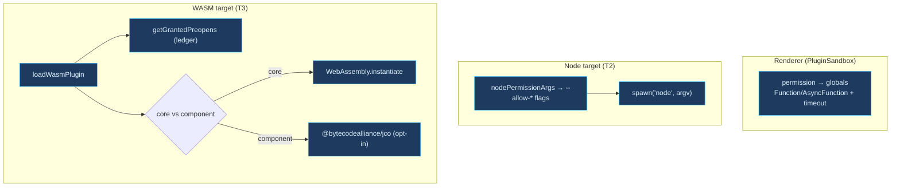

# 插件隔离

<Status variant="beta" />

<TLDR>
  三个层级共同约束插件代码。`lib/plugin/core/sandbox.ts:PluginSandbox` 是已发布的渲染端隔离：它把每个
  `PluginPermission` 映射到一个具体的被允许的全局对象，包装 `console` / `setTimeout` / `fetch` /
  `localStorage`，并通过带显式参数和超时的 `Function` / `AsyncFunction` 运行插件代码。**T2**
  （`launchPluginJs.ts`）把 manifest 的权限翻译为 Node 24 的 `--permission` 标志，用于重新执行
  Node 目标插件。**T3**（`wasm-runtime.ts`）在一个运行时下加载 WASM 插件，其 preopen 来自 Dexie
  授权账本。T2 已经通过 `PluginLoader` / `PluginManager` 触达 Node-target frontend 插件；T3 会在
  load 前对账 manifest preopens，并在每次 call 前重新验证。
</TLDR>

## 渲染端隔离 —— `PluginSandbox`

`PluginSandbox` 构造时需要插件 id、其 `PluginPermission[]`，以及可选的超时/内存上限。它在构造函数中一次性
推导出一个 allow-set 和一组沙箱化的全局对象。

### 权限 → API 映射

总是允许一组安全的基础全局对象；权限会扩大该集合：

```ts title="lib/plugin/core/sandbox.ts:75-103 (permission-gated APIs)"
for (const permission of permissions) {
  switch (permission) {
    case "network:fetch":
      allowed.add("fetch"); allowed.add("Headers"); allowed.add("Request"); allowed.add("Response")
      break
    case "network:websocket":
      allowed.add("WebSocket")
      break
    case "clipboard:read":
    case "clipboard:write":
      allowed.add("navigator.clipboard")
      break
    case "notification":
      allowed.add("Notification")
      break
    case "database:read":
    case "database:write":
      allowed.add("indexedDB")
      break
  }
}
```

这些沙箱化的全局对象是真实的包装器，而非原始的浏览器 API：

- **console** —— 以 `[Plugin:<id>]` 为前缀并路由到插件日志器（`sandbox.ts:137-149`）。
- **setTimeout** —— 钳制到配置的上限（默认 30 秒）（`sandbox.ts:151-158`）。
- **setInterval** —— 下限设为 100 ms 以防止 CPU 滥用（`sandbox.ts:160-167`）。
- **fetch** —— 在每个请求上盖上一个 `X-Plugin-Id` 头（`sandbox.ts:169-185`）。
- **localStorage** —— 以 `plugin:<id>:` 作命名空间，并按 key 做读/写权限检查
  （`sandbox.ts:187-214`）。

### 代码执行

插件代码通过一个以显式参数名构建的 `Function`（或 `AsyncFunction`）运行，使插件只能看到被授予的全局对象 ——
没有环境（ambient）作用域：

```ts title="lib/plugin/core/sandbox.ts:223-241 (sync execute)"
execute<T>(code: string, context: Record<string, unknown> = {}): T {
  const safeContext = { ...this.sandboxedGlobals, ...context }
  const argNames = Object.keys(safeContext)
  const argValues = Object.values(safeContext)
  try {
    const fn = new Function(...argNames, `"use strict"; return (${code})`)
    return fn(...argValues) as T
  } catch (error) {
    throw new Error(`Plugin sandbox execution error: ${error}`)
  }
}
```

`executeAsync`（`sandbox.ts:246-273`）增加了一个针对 "Execution timeout" reject 的 `Promise.race`。
`executeCode(language, code)`（`sandbox.ts:301-318`）要求 `sandbox:web-execute` 权限，并委托给 Web
沙箱服务 —— 而后者如今是一个 stub（参见 [microVM 与 Web](./microvm-and-web)）。

<Callout type="info">
  `PluginSandbox` 是一个 **软（soft）** 隔离层：基于 `Function` 的求值、权限门控的全局对象、命名空间化的
  存储。它是渲染端内的防线，并与 T1 组合 —— 即便某个插件 spawn 了一个 shell，SDK 内置的 `Bash` 在启用沙箱
  的会话中也会被拒绝，调用会经由 `sandbox_*` 工具路由。
</Callout>

## T2 —— Node `--permission` 重新执行（re-exec）

`lib/plugin/launcher/launchPluginJs.ts` 把一个权限范围（scope）翻译为 Node 24 的 `--allow-*` 标志，用于
重新执行插件的 JS 入口。空列表会 OMIT 该标志（fail-safe 拒绝），绝不使用 `*`。

```ts title="lib/plugin/launcher/launchPluginJs.ts:91-112"
export function nodePermissionArgs(scope: NodePermissionScope): string[] {
  const args: string[] = ["--permission"]
  // Network and subprocess scopes fail closed via host-broker errors; Node 24
  // has no scoped host flag and child-process permission is all-or-nothing.
  if (scope.readPaths.length > 0) args.push(`--allow-fs-read=${scope.readPaths.join(",")}`)
  if (scope.writePaths.length > 0) args.push(`--allow-fs-write=${scope.writePaths.join(",")}`)
  return args
}
```

`buildLaunchArgv(entryPath, scope, extraArgs)` 返回传给 `child_process.spawn("node", argv)` 的完整
argv。`deriveScopeFromManifest` 很保守：一个声明了但没有具体路径的权限类别会产生空列表，因此文件系统
flag 会被完全省略。`PluginLoader.loadFrontendModule()` 会识别 Node-target frontend 插件（`engines.node`
或 `runtimeCompatibility.tauri.entrypoint === "node"`），从 `permissions` + `fileScope` 推导 scope，
在 activate 时调用 `launchPluginJs()`，并在 deactivate/unload 时通过正常 `PluginManager` 生命周期杀掉子进程。

<Callout type="info">
  Node permission model 只约束入口进程。需要 host allowlist 强制的 shell 类工作与网络访问必须走 brokered
  host API；Node launcher 绝不发出 `*`，绝不发出 unsupported `--allow-net`，也不会把子进程访问放宽为
  `--allow-child-process`。
</Callout>

## T3 —— Wasmtime / WASI 运行时

`lib/plugin/core/wasm-runtime.ts:loadWasmPlugin` 会 **在** 构建运行时之前从 Dexie-backed 授权账本解析
preopen 集合，随后返回一个可控的 `WasmPluginHandle`。

```ts title="lib/plugin/core/wasm-runtime.ts:82-102 (load + call)"
export async function loadWasmPlugin(
  pluginId: string,
  source: WasmSource,
  options: WasmRuntimeOptions = {}
): Promise<WasmPluginHandle> {
  if (!pluginId.trim()) throw new Error("loadWasmPlugin: pluginId is required")
  const preopensResolver = options.preopensResolver ?? getGrantedPreopens
  const preopens = [...(await preopensResolver(pluginId))]
  const factory = options.runtimeFactory ?? defaultWasmRuntimeFactory
  const instance = await factory({ pluginId, source, preopens })
  return { async call(method, args) {
    await verifyPreopenAllowedForCall(pluginId, preopens)
    return instance.call(method, args)
  } }
```

`PluginManager.preloadWasmComponent()` 会在 `plugin_wasm_load` 之前把 `manifest.wasm.fs.preopens` 与
持久账本对账：过期账本 preopens 带 warning 拒绝，新声明的 manifest preopens 不会自动授权，只有交集会传给
host。旧 `localStorage` 账本只作为一次性迁移 fallback 写入 `wasmGrantLedger` Dexie 表。

由一个 magic-byte 启发式（`looksLikeComponent`，`wasm-runtime.ts:152-161`）决定两条交付路径：

- **核心模块（Core modules）** —— 经由 `WebAssembly.instantiate` 实例化。没有 FS/网络绑定；唯一的宿主
  导入是一个 `cognia` 命名空间，其 `read_file` 会拒绝任何不在授权集合内的路径：

```ts title="lib/plugin/core/wasm-runtime.ts:176-181 (grant-gated read)"
read_file: (path: string) => {
  if (!grantedSet.has(path)) {
    throw new Error(`wasm-runtime: preopen denied for ${path}`)
  }
  return memorySnapshot.get(path) ?? new Uint8Array()
},
```

- **WASI Preview-2 组件（components）** —— 动态导入 `@bytecodealliance/jco`。组件路径目前会浮现一个结构化的
  「not yet wired」错误，而不是固定到一个不断变动的 jco API（`wasm-runtime.ts:230-233`）；调用方可以注入一个
  `runtimeFactory`，或改为发布一个核心模块。

授权账本（`lib/plugin/security/wasm-grant.ts`）是权威来源 —— 宿主导入是纯的（没有真实的 FS），因此最坏情况下的
影响半径（blast radius）是「插件读取它自己的授权」。



## 测试

`lib/plugin/core/sandbox.test.ts`（权限映射、钳制、命名空间化存储、执行）、
`lib/plugin/launcher/launchPluginJs.test.ts`（标志构造、空列表省略）、以及
`lib/plugin/core/wasm-runtime.test.ts` + `wasm-loader.test.ts`（preopen 门控、核心模块实例化、
组件安装提示）。

## 下一步

<Cards>
  <Card title="microVM 与 Web" href="./microvm-and-web" description="PluginSandbox.executeCode 触达的 Web 代码执行 stub" />
  <Card title="执行总览" href="./execution-overview" description="T1–T5 如何组合" />
  <Card title="插件系统" href="../plugin-system" description="更广义的插件运行时 + 权限" />
</Cards>
