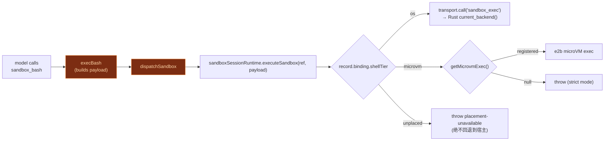

# 沙盒工具插件

<Status variant="beta" />

<TLDR>
  `plugins/cognia-sandboxed-tools/src/index.ts` 注册了四个 MCP 工具 —— `sandbox_bash`、
  `sandbox_edit`、`sandbox_write`、`sandbox_text_editor` —— 当会话启用沙盒时，模型会
  **改用**它们而非 SDK 内置工具。每次调用都根据不可变 `SandboxRuntimeRef` 路由到 OS 沙盒
  （`sandbox_exec` Tauri 命令，T1）或 e2b microVM（T4）。带 session 的插件调用若缺 ref，
  会在统一调用边界从活跃 session binding 恢复；无法恢复时严格失败。只有明确无 session 的调用
  使用 host sentinel。microVM 没有合格 E2B binding 时绝不回退到 OS。
</TLDR>

## 四个工具

该插件是一个前端插件，声明了 `tools` capability 以及 `native:filesystem` /
`native:process` 权限。在 activate 时它通过 `ctx.agent.registerTool` 注册这些工具：

```ts title="plugins/cognia-sandboxed-tools/src/index.ts:303-311"
export const SANDBOXED_TOOL_NAMES = [
  TOOL_SANDBOX_BASH,
  TOOL_SANDBOX_EDIT,
  TOOL_SANDBOX_WRITE,
  TOOL_SANDBOX_TEXT_EDITOR,
] as const

/** SDK builtin tool names that are replaced when the sandbox is enabled. */
export const SDK_TOOLS_REPLACED_BY_SANDBOX = ["Bash", "Edit", "Write"] as const
```

| 工具                  | 替代                           | 必需参数           | 作用域语义                                                  |
| --------------------- | ------------------------------ | ------------------ | ----------------------------------------------------------- |
| `sandbox_bash`        | SDK `Bash`                     | `command`、`cwd`   | `writable`（默认为 `[cwd]`）、`readable`、`network`     |
| `sandbox_edit`        | SDK `Edit`                     | `targetFiles`      | 写入限定在精确的 `targetFiles`；网络始终关闭     |
| `sandbox_write`       | SDK `Write`                    | `targetFiles`      | 与 `sandbox_edit` 形状相同                                 |
| `sandbox_text_editor` | 原生 `text_editor`           | `targetFiles`      | 当 Computer Use 被禁用时使用的 Anthropic 风格编辑器         |

每个工具定义都是 `requiresApproval: true` 且 `category: "automation"`。bash 的 schema
携带模型可设置的策略旋钮：

```ts title="plugins/cognia-sandboxed-tools/src/index.ts:81-93 (network knobs)"
network: {
  type: "string",
  enum: ["off", "on", "allowlist"],
  description: "Network policy. Default off.",
},
networkHosts: {
  type: "array",
  items: { type: "string" },
  description: "Required when network=allowlist.",
},
timeoutSeconds: { type: "integer", minimum: 0 },
maxCpuSeconds: { type: "integer", minimum: 0 },
maxMemoryMb: { type: "integer", minimum: 0 },
```

## 层级路由 —— `dispatchSandbox`

每次调用都汇聚到 `dispatchSandbox`，它把 payload 交给本次发送已解析出的**运行时引用**（见
[执行总览](./execution-overview)）。插件不再自行查任何按会话存储的层级或策略状态：该引用指向唯一一份
不可变的放置记录，由 `SandboxSessionRuntime` 决定走 Rust 的 `sandbox_exec` 命令还是已注册的 E2B 适配器。

```ts title="plugins/cognia-sandboxed-tools/src/index.ts"
async function dispatchSandbox(
  payload: MicrovmExecPayload,
  ctx: PluginToolContext
): Promise<SandboxResultShape> {
  return sandboxSessionRuntime.executeSandbox(requireRuntimeRef(ctx), payload)
}

/**
 * 聊天发送始终携带已解析的放置信息。没有发送信封的调用方 —— 工作流节点、计划步骤、
 * External Bridge 编排、插件间调用 —— 拿到宿主 OS 层的放置。
 */
function requireRuntimeRef(ctx: PluginToolContext): string {
  return ctx.sandboxRuntimeRef ?? HOST_FALLBACK_RUNTIME_REF
}
```

<Callout type="warn">
  宿主回退是一种**放置**，不是绕过。当某次发送的绑定无法建立时，`resolveSendOptions`
  不会丢弃引用，而是调用 `bindUnplacedSession`：它保留已解析的上限，并让那些本应离开本机的面
  （非 `os` 的 shell 层级、绑定到远端的 GUI 目标）以 `placement-unavailable` 拒绝执行。
  一个要求隔离的会话，绝不会被静默地放到宿主上运行。
</Callout>

`execBash` 构建 OS 后端的 payload，将 `writable` 默认为 `[cwd]`、超时默认为 300 秒：

```ts title="plugins/cognia-sandboxed-tools/src/index.ts:179-204 (excerpt)"
async function execBash(args: BashCallInputs, ctx: PluginToolContext): Promise<SandboxResultShape> {
  const cwd = args.cwd
  const writable = args.writable && args.writable.length > 0 ? args.writable : [cwd]
  return dispatchSandbox(
    {
      tool: TOOL_SANDBOX_BASH,
      command: { argv: ["bash", "-c", args.command], cwd, env: args.env ?? {},
                 stdin: null, timeout: args.timeoutSeconds ?? 300 },
      request: { writable, readable: args.readable ?? [], targetFiles: [],
                 maxCpuSeconds: args.maxCpuSeconds ?? 0, maxMemoryMb: args.maxMemoryMb ?? 0,
                 network: args.network ?? "off", networkHosts: args.networkHosts ?? [] },
    }, ctx)
}
```

<Callout type="info">
  edit / write / text_editor 工具在 V1 中只交付**策略门契约**：它们构建一个带
  `argv: ["true"]` 和 `targetFiles` 作用域的 payload，这样 Rust 策略门会在渲染端执行其自身的
  apply-edit 逻辑之前先校验作用域（`index.ts:206-239`）。实际的 diff
  应用仍留在渲染端。
</Callout>



## 与 build-options 的关系

该插件只**提供**工具；它并不决定何时应用这些工具。决策在
`lib/claude/build-options.ts` 中做出：当 `sandboxEnabled` 时，该文件会把 `Bash` / `Edit` / `Write` 加入
`disallowedTools`，从 Anthropic 投影中剥离原生编辑器工具，并依赖插件的工具
已经存在于 `opts.pluginTools` 中。具体行号见
[执行总览](./execution-overview)。

## i18n + slash 状态

manifest 以两种语言内联交付了一个 `/sandbox` slash 状态命令
（`index.ts:322-339`），说明当会话启用沙盒模式时，SDK 内置工具会被
禁用，模型转而使用 `sandbox_*` 等价物 —— 并将用户指向 Settings → Sandbox 查看
后端健康状态。

## 下一步

<Cards>
  <Card title="OS 后端 (T1)" href="./os-backends" description="sandbox_exec 在何处运行命令" />
  <Card title="microVM 与 Web" href="./microvm-and-web" description="该插件路由到的 T4 exec" />
  <Card title="执行总览" href="./execution-overview" description="这些工具何时替代内置工具" />
</Cards>
